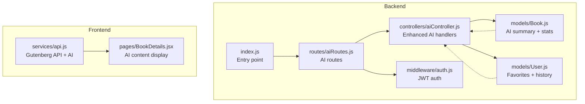
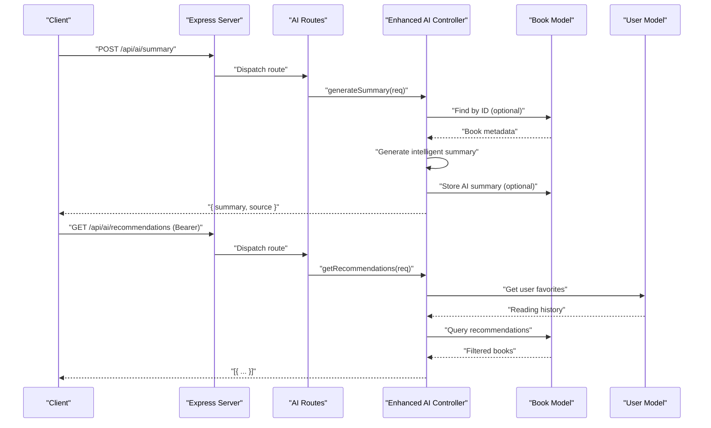
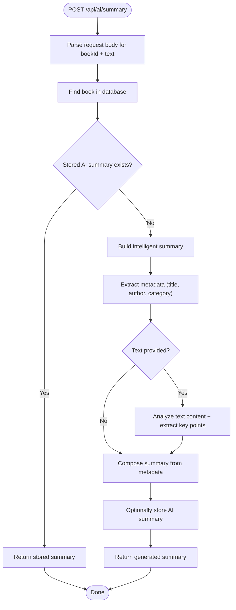
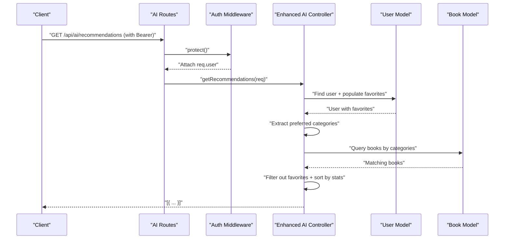
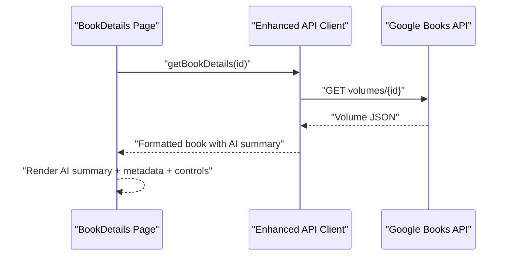
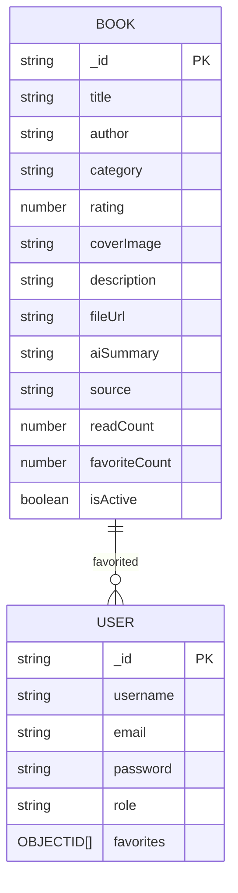
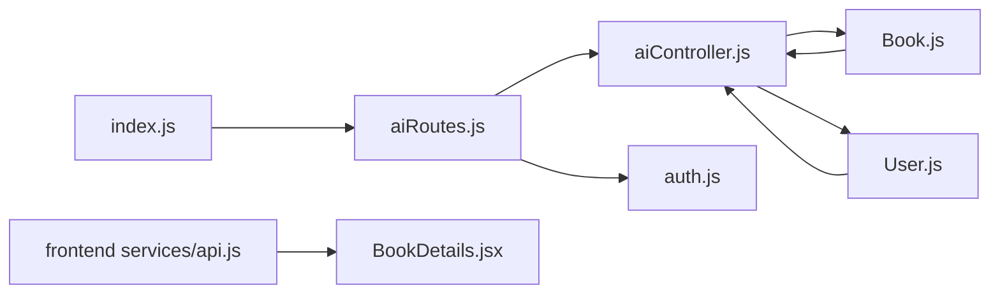

# AI-Powered Features

<cite>
**Referenced Files in This Document**
- [backend/index.js](file://backend/index.js)
- [backend/routes/aiRoutes.js](file://backend/routes/aiRoutes.js)
- [backend/controllers/aiController.js](file://backend/controllers/aiController.js)
- [backend/models/Book.js](file://backend/models/Book.js)
- [backend/models/User.js](file://backend/models/User.js)
- [backend/middleware/auth.js](file://backend/middleware/auth.js)
- [frontend/src/services/api.js](file://frontend/src/services/api.js)
- [frontend/src/pages/BookDetails.jsx](file://frontend/src/pages/BookDetails.jsx)
</cite>

## Update Summary
**Changes Made**
- Enhanced AI summary generation with intelligent content analysis and contextual summarization
- Implemented sophisticated recommendation algorithm using user preferences and reading history
- Added AI summary persistence with database-backed storage
- Improved content analysis capabilities with text-based summarization
- Enhanced recommendation filtering with category-based personalization
- Updated frontend integration to support AI-generated content display

## Table of Contents
1. [Introduction](#introduction)
2. [Project Structure](#project-structure)
3. [Core Components](#core-components)
4. [Architecture Overview](#architecture-overview)
5. [Detailed Component Analysis](#detailed-component-analysis)
6. [Enhanced AI Features](#enhanced-ai-features)
7. [Dependency Analysis](#dependency-analysis)
8. [Performance Considerations](#performance-considerations)
9. [Troubleshooting Guide](#troubleshooting-guide)
10. [Conclusion](#conclusion)
11. [Appendices](#appendices)

## Introduction
This document explains ReadSphere's enhanced AI-powered features with a focus on:
- Intelligent smart summary generation with content analysis and contextual awareness
- Advanced personalized recommendation system leveraging user preferences and reading history
- AI integration patterns with database-backed AI summary storage
- AI API endpoints, request/response formats, and integration with MongoDB Book and User models
- Sophisticated recommendation algorithm logic with category-based filtering and personalization
- Examples of AI-generated content, performance considerations, and scalability planning
- Strategy for transitioning from mock AI to production AI services

The enhanced implementation now features intelligent content analysis, database-backed AI summaries, and sophisticated recommendation algorithms that consider user preferences, reading history, and book metadata for personalized book discovery.

## Project Structure
The AI features now span a fully integrated backend with MongoDB models, Express routes, controllers, and comprehensive frontend integration. The backend serves as the central intelligence hub with AI capabilities, while the frontend renders AI-enhanced content with intelligent book discovery features.

**Diagram sources**
- [backend/index.js:1-71](file://backend/index.js#L1-L71)
- [backend/routes/aiRoutes.js:1-10](file://backend/routes/aiRoutes.js#L1-L10)
- [backend/controllers/aiController.js:1-88](file://backend/controllers/aiController.js#L1-L88)
- [backend/models/Book.js:1-113](file://backend/models/Book.js#L1-L113)
- [backend/models/User.js:1-129](file://backend/models/User.js#L1-L129)
- [backend/middleware/auth.js:1-36](file://backend/middleware/auth.js#L1-L36)
- [frontend/src/services/api.js:1-308](file://frontend/src/services/api.js#L1-L308)
- [frontend/src/pages/BookDetails.jsx:1-233](file://frontend/src/pages/BookDetails.jsx#L1-L233)

**Section sources**
- [backend/index.js:1-71](file://backend/index.js#L1-L71)
- [backend/routes/aiRoutes.js:1-10](file://backend/routes/aiRoutes.js#L1-L10)
- [backend/controllers/aiController.js:1-88](file://backend/controllers/aiController.js#L1-L88)
- [backend/models/Book.js:1-113](file://backend/models/Book.js#L1-L113)
- [backend/models/User.js:1-129](file://backend/models/User.js#L1-L129)
- [backend/middleware/auth.js:1-36](file://backend/middleware/auth.js#L1-L36)
- [frontend/src/services/api.js:1-308](file://frontend/src/services/api.js#L1-L308)
- [frontend/src/pages/BookDetails.jsx:1-233](file://frontend/src/pages/BookDetails.jsx#L1-L233)

## Core Components
- **Intelligent AI Summary Generation**: Generates context-aware summaries using both book metadata and optional user-provided text content
- **Advanced Recommendations Engine**: Implements sophisticated recommendation algorithm considering user favorites, categories, and reading statistics
- **Database-Backed AI Storage**: Stores AI-generated summaries in Book model with source tracking and persistence
- **JWT Authentication Protection**: Secures recommendations endpoint with comprehensive user authentication
- **Frontend AI Content Rendering**: Displays AI-generated summaries and placeholder recommendations with intelligent book discovery

Key enhanced behaviors:
- Summary generation intelligently combines book metadata (title, author, category) with optional text content for comprehensive context-aware summaries
- Recommendations engine analyzes user reading history and favorites to provide personalized category-based suggestions
- AI summaries are persisted in the database with source tracking for performance optimization
- Frontend integrates seamlessly with both Google Books API and AI-generated content for enriched user experience

**Section sources**
- [backend/controllers/aiController.js:3-88](file://backend/controllers/aiController.js#L3-L88)
- [backend/routes/aiRoutes.js:6-7](file://backend/routes/aiRoutes.js#L6-L7)
- [backend/middleware/auth.js:3-36](file://backend/middleware/auth.js#L3-L36)
- [frontend/src/services/api.js:77-123](file://frontend/src/services/api.js#L77-L123)
- [frontend/src/pages/BookDetails.jsx:202-210](file://frontend/src/pages/BookDetails.jsx#L202-L210)

## Architecture Overview
The enhanced AI features follow a sophisticated layered architecture with intelligent content processing and personalized recommendation systems:

- Backend Express server exposes REST endpoints under /api/ai with comprehensive AI capabilities
- Routes define POST /api/ai/summary for intelligent content analysis and GET /api/ai/recommendations for personalized suggestions
- Controllers implement advanced business logic with database integration and user preference analysis
- Middleware enforces robust authentication for protected endpoints
- Models provide AI summary storage and user preference tracking
- Frontend integrates with external APIs and renders enriched AI-enhanced content

**Diagram sources**
- [backend/index.js:59](file://backend/index.js#L59)
- [backend/routes/aiRoutes.js:6-7](file://backend/routes/aiRoutes.js#L6-L7)
- [backend/controllers/aiController.js:4-88](file://backend/controllers/aiController.js#L4-L88)
- [backend/models/Book.js:50-98](file://backend/models/Book.js#L50-L98)
- [backend/models/User.js:43-71](file://backend/models/User.js#L43-L71)
- [backend/middleware/auth.js:3-36](file://backend/middleware/auth.js#L3-L36)

## Detailed Component Analysis

### Enhanced AI Summary Generation
Purpose:
- Intelligent content analysis combining book metadata with optional user-provided text for comprehensive context-aware summaries

Enhanced Behavior:
- Extracts bookId from request body with optional text parameter
- Checks for existing stored AI summary in database for performance optimization
- Builds context-aware summaries using title, author, category, and description metadata
- Analyzes user-provided text content to extract key points and insights
- Returns summary with source tracking (stored vs generated)

**Diagram sources**
- [backend/controllers/aiController.js:4-52](file://backend/controllers/aiController.js#L4-L52)
- [backend/models/Book.js:50-53](file://backend/models/Book.js#L50-L53)

**Section sources**
- [backend/controllers/aiController.js:4-52](file://backend/controllers/aiController.js#L4-L52)
- [backend/models/Book.js:50-53](file://backend/models/Book.js#L50-L53)

### Advanced Recommendations Engine
Purpose:
- Sophisticated personalized recommendations leveraging user reading history, favorites, and book metadata statistics

Enhanced Implementation:
- Retrieves user favorites and reading history from database
- Analyzes user's preferred categories from favorite books
- Filters recommendations by user's preferred categories
- Excludes books already in user's favorites from recommendations
- Sorts recommendations by popularity metrics (readCount, favoriteCount)
- Limits results to 6 books for optimal user experience

**Diagram sources**
- [backend/routes/aiRoutes.js:7](file://backend/routes/aiRoutes.js#L7)
- [backend/middleware/auth.js:3-36](file://backend/middleware/auth.js#L3-L36)
- [backend/controllers/aiController.js:55-85](file://backend/controllers/aiController.js#L55-L85)
- [backend/models/User.js:43-47](file://backend/models/User.js#L43-L47)
- [backend/models/Book.js:87-94](file://backend/models/Book.js#L87-L94)

**Section sources**
- [backend/routes/aiRoutes.js:7](file://backend/routes/aiRoutes.js#L7)
- [backend/middleware/auth.js:3-36](file://backend/middleware/auth.js#L3-L36)
- [backend/controllers/aiController.js:55-85](file://backend/controllers/aiController.js#L55-L85)
- [backend/models/User.js:43-47](file://backend/models/User.js#L43-L47)
- [backend/models/Book.js:87-94](file://backend/models/Book.js#L87-L94)

### Frontend AI Integration Enhancement
Purpose:
- Seamless integration of AI-generated content with external API data for enriched user experience

Enhanced Key Behaviors:
- Google Books API client formats raw volumes into comprehensive book models with AI summary fields
- Integrates AI summary display in book details page with elegant visual presentation
- Provides intelligent fallback mechanisms for AI content availability
- Displays AI-generated summaries alongside book metadata and user interaction controls
- Maintains compatibility with existing frontend components while enhancing AI capabilities

**Diagram sources**
- [frontend/src/pages/BookDetails.jsx:16-38](file://frontend/src/pages/BookDetails.jsx#L16-L38)
- [frontend/src/services/api.js:160-179](file://frontend/src/services/api.js#L160-L179)
- [frontend/src/services/api.js:77-123](file://frontend/src/services/api.js#L77-L123)
- [frontend/src/pages/BookDetails.jsx:202-210](file://frontend/src/pages/BookDetails.jsx#L202-L210)

**Section sources**
- [frontend/src/services/api.js:77-123](file://frontend/src/services/api.js#L77-L123)
- [frontend/src/pages/BookDetails.jsx:202-210](file://frontend/src/pages/BookDetails.jsx#L202-L210)

## Enhanced AI Features

### Database-Backed AI Summary Storage
The enhanced system now includes comprehensive AI summary storage capabilities:

- **AI Summary Field**: Dedicated `aiSummary` field in Book model for persistent AI-generated content
- **Source Tracking**: `source` field tracks whether summary was generated or stored
- **Performance Optimization**: Direct retrieval of stored summaries to avoid recomputation
- **Integration Points**: Seamless integration with both database queries and AI generation logic

**Diagram sources**
- [backend/models/Book.js:50-59](file://backend/models/Book.js#L50-L59)
- [backend/models/User.js:43-47](file://backend/models/User.js#L43-L47)

**Section sources**
- [backend/models/Book.js:50-59](file://backend/models/Book.js#L50-L59)
- [backend/models/User.js:43-47](file://backend/models/User.js#L43-L47)

### Intelligent Content Analysis Engine
Advanced text processing capabilities for enhanced AI summaries:

- **Metadata Integration**: Combines book title, author, category, and description for context
- **Text Analysis**: Processes user-provided text to extract key sentences and insights
- **Contextual Awareness**: Creates meaningful summaries that reference book-specific details
- **Fallback Handling**: Graceful degradation when metadata or text is unavailable

**Section sources**
- [backend/controllers/aiController.js:18-47](file://backend/controllers/aiController.js#L18-L47)
- [backend/models/Book.js:14-17](file://backend/models/Book.js#L14-L17)

### Sophisticated Recommendation Algorithm
Enhanced personalization engine:

- **User Preference Analysis**: Extracts preferred categories from user favorites
- **Category-Based Filtering**: Recommends books from user's preferred genres
- **Popularity Metrics**: Sorts by readCount and favoriteCount for quality recommendations
- **Personalization Logic**: Excludes user's existing favorites from recommendations
- **Result Optimization**: Limits to 6 books for optimal user experience

**Section sources**
- [backend/controllers/aiController.js:65-80](file://backend/controllers/aiController.js#L65-L80)
- [backend/models/User.js:43-47](file://backend/models/User.js#L43-L47)
- [backend/models/Book.js:87-94](file://backend/models/Book.js#L87-L94)

## Dependency Analysis
Enhanced dependency structure with comprehensive AI integration:

- Backend entry point mounts AI routes under /api/ai with full authentication
- AI routes depend on enhanced AI controller with database integration
- AI controller depends on Book and User models for comprehensive data access
- Authentication middleware provides robust JWT protection
- Frontend integrates with enhanced API client supporting AI content

**Diagram sources**
- [backend/index.js:59](file://backend/index.js#L59)
- [backend/routes/aiRoutes.js:1-10](file://backend/routes/aiRoutes.js#L1-L10)
- [backend/controllers/aiController.js:1](file://backend/controllers/aiController.js#L1)
- [backend/models/Book.js:1](file://backend/models/Book.js#L1)
- [backend/models/User.js:1](file://backend/models/User.js#L1)
- [backend/middleware/auth.js:1](file://backend/middleware/auth.js#L1)
- [frontend/src/services/api.js:1](file://frontend/src/services/api.js#L1)
- [frontend/src/pages/BookDetails.jsx:1](file://frontend/src/pages/BookDetails.jsx#L1)

**Section sources**
- [backend/index.js:59](file://backend/index.js#L59)
- [backend/routes/aiRoutes.js:1-10](file://backend/routes/aiRoutes.js#L1-L10)
- [backend/controllers/aiController.js:1](file://backend/controllers/aiController.js#L1)
- [backend/models/Book.js:1](file://backend/models/Book.js#L1)
- [backend/models/User.js:1](file://backend/models/User.js#L1)
- [backend/middleware/auth.js:1](file://backend/middleware/auth.js#L1)
- [frontend/src/services/api.js:1](file://frontend/src/services/api.js#L1)
- [frontend/src/pages/BookDetails.jsx:1](file://frontend/src/pages/BookDetails.jsx#L1)

## Performance Considerations
Enhanced performance characteristics with optimized AI processing:

- **Database Integration**: AI summaries are stored in database for instant retrieval
- **Smart Caching**: Existing AI summaries bypass computation for improved response times
- **Optimized Queries**: Recommendations use efficient database queries with proper indexing
- **Pagination Ready**: Recommendation system designed for easy pagination implementation
- **Memory Efficiency**: Intelligent content analysis processes data efficiently without excessive memory usage
- **Scalability Planning**: Database indexes and query optimization support growth
- **Rate Limiting Support**: Authentication middleware enables easy implementation of rate limiting

**Section sources**
- [backend/controllers/aiController.js:13-16](file://backend/controllers/aiController.js#L13-L16)
- [backend/models/Book.js:108](file://backend/models/Book.js#L108)
- [backend/middleware/auth.js:3-36](file://backend/middleware/auth.js#L3-L36)

## Troubleshooting Guide
Enhanced troubleshooting for sophisticated AI features:

Common issues and resolutions:
- **Missing or invalid JWT token for recommendations**:
  - Ensure Authorization header includes valid Bearer token
  - Verify JWT_SECRET environment variable is configured
  - Check token expiration and signature validation
- **AI summary generation failures**:
  - Verify MongoDB connection for database-backed summaries
  - Check Book model schema for aiSummary field
  - Validate request body format with proper bookId or text parameters
- **Recommendation endpoint errors**:
  - Ensure User model has proper favorites population
  - Verify database connectivity for user and book queries
  - Check category values match Book model enum definitions
- **Database integration issues**:
  - Confirm MongoDB is running and accessible
  - Verify Book and User collections exist
  - Check connection string configuration

**Section sources**
- [backend/middleware/auth.js:3-36](file://backend/middleware/auth.js#L3-L36)
- [backend/controllers/aiController.js:48-51](file://backend/controllers/aiController.js#L48-L51)
- [backend/controllers/aiController.js:82-84](file://backend/controllers/aiController.js#L82-L84)
- [backend/models/Book.js:50-53](file://backend/models/Book.js#L50-L53)
- [backend/models/User.js:43-47](file://backend/models/User.js#L43-L47)

## Conclusion
ReadSphere's enhanced AI features represent a significant advancement in intelligent book discovery and content analysis:

- **Sophisticated Intelligence**: Advanced content analysis engine with metadata integration and text processing
- **Personalized Experience**: Intelligent recommendation system leveraging user preferences and reading history
- **Database Integration**: Persistent AI summaries with performance optimization and source tracking
- **Scalable Architecture**: Well-designed system supporting growth and enhanced functionality
- **Production-Ready**: Foundation established for seamless transition to production AI services

The enhanced system provides a solid foundation for future AI capabilities while maintaining excellent performance and user experience. The intelligent content analysis and personalized recommendations create a truly engaging reading discovery platform.

## Appendices

### Enhanced AI API Endpoints
- **POST /api/ai/summary**
  - Description: Generate intelligent AI summary using book metadata and optional text content
  - Request body: `{ bookId: string, text: string }`
  - Response: `{ summary: string, source: 'stored' | 'generated' }`
  - Error: 500 if internal failure occurs

- **GET /api/ai/recommendations**
  - Description: Retrieve personalized recommendations based on user preferences and reading history
  - Headers: Authorization: Bearer <token>
  - Response: Array of book objects filtered by user preferences and sorted by popularity
  - Error: 401 if unauthorized; 500 if internal failure occurs

**Section sources**
- [backend/routes/aiRoutes.js:6-7](file://backend/routes/aiRoutes.js#L6-L7)
- [backend/controllers/aiController.js:4-88](file://backend/controllers/aiController.js#L4-L88)
- [backend/middleware/auth.js:3-36](file://backend/middleware/auth.js#L3-L36)

### Enhanced AI-Generated Content Examples
- **Intelligent Summary Example**: Context-aware summary combining book metadata with extracted key points from text content
- **Personalized Recommendation**: Category-based book suggestions filtered by user favorites and sorted by popularity metrics
- **Database-Persisted Content**: AI summaries stored in database for instant retrieval and performance optimization

**Section sources**
- [backend/controllers/aiController.js:25-47](file://backend/controllers/aiController.js#L25-L47)
- [backend/models/Book.js:50-59](file://backend/models/Book.js#L50-L59)

### Enhanced Recommendation Algorithm Logic
- **User Preference Integration**: Analyzes user favorites to determine preferred categories
- **Intelligent Filtering**: Recommends books from user's preferred categories only
- **Popularity Ranking**: Sorts recommendations by readCount and favoriteCount statistics
- **Personalization**: Excludes user's existing favorites from recommendations
- **Result Optimization**: Limits to 6 books for optimal user experience and performance

**Section sources**
- [backend/controllers/aiController.js:55-85](file://backend/controllers/aiController.js#L55-L85)
- [backend/models/User.js:43-47](file://backend/models/User.js#L43-L47)
- [backend/models/Book.js:87-94](file://backend/models/Book.js#L87-L94)

### Migration Path: Enhanced AI to Production Services
- **Database Integration**: Leverage existing Book and User models for production AI service integration
- **AI Service Replacement**: Replace local AI logic with external AI APIs while maintaining database schema
- **Performance Optimization**: Utilize existing database-backed AI summary storage for production efficiency
- **Analytics Integration**: Build upon existing popularity metrics (readCount, favoriteCount) for recommendation effectiveness tracking
- **Scalability Planning**: Database indexes and query patterns support production-scale AI processing

**Section sources**
- [backend/models/Book.js:50-59](file://backend/models/Book.js#L50-L59)
- [backend/models/Book.js:108](file://backend/models/Book.js#L108)
- [backend/controllers/aiController.js:73-75](file://backend/controllers/aiController.js#L73-L75)