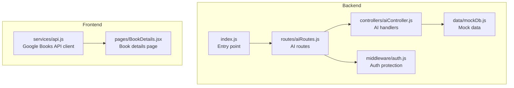
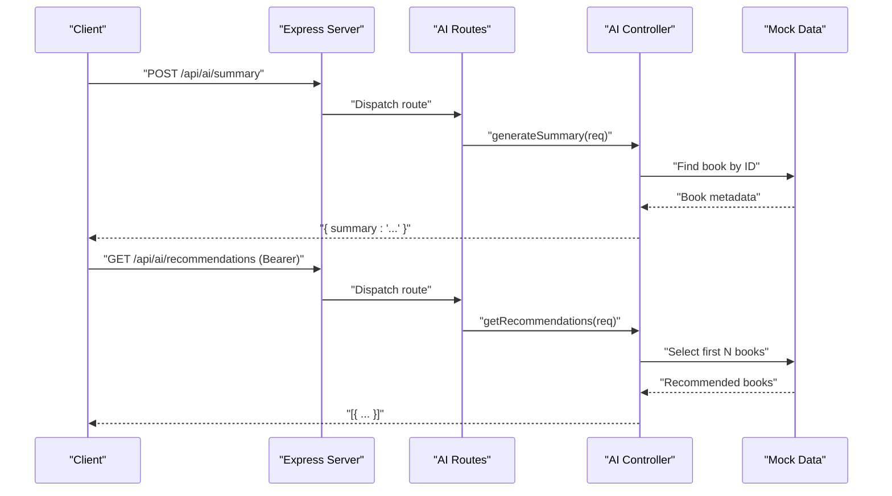
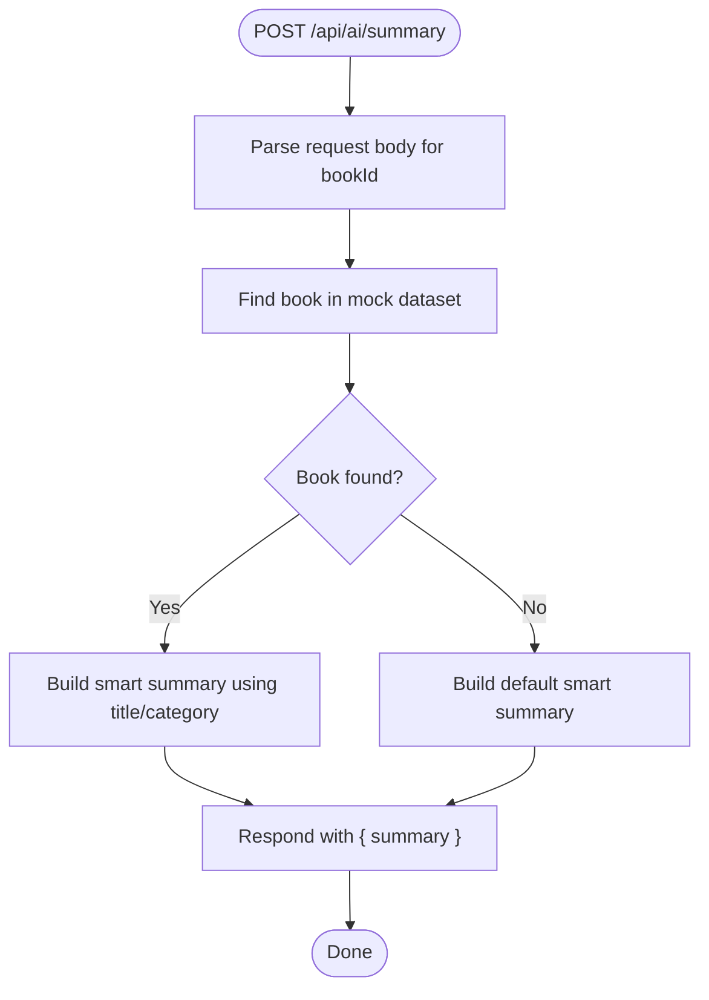
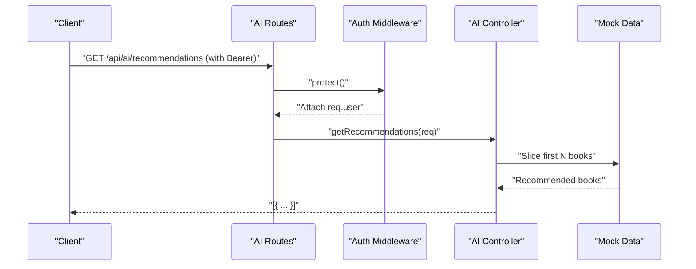
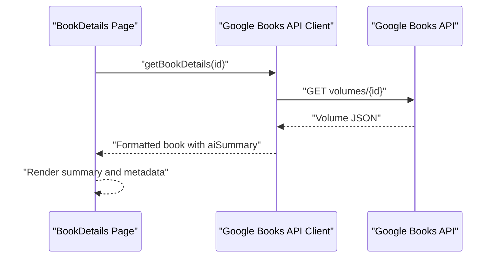
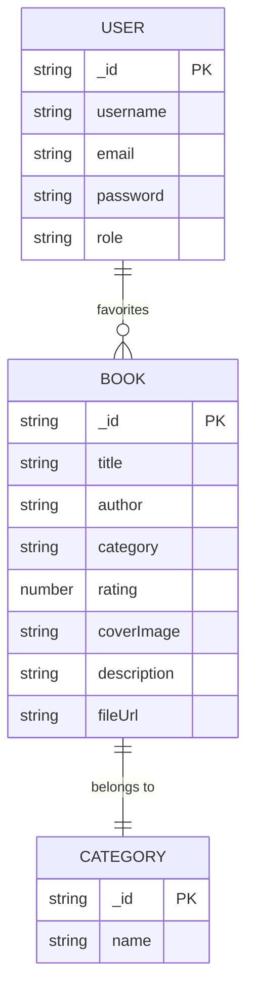
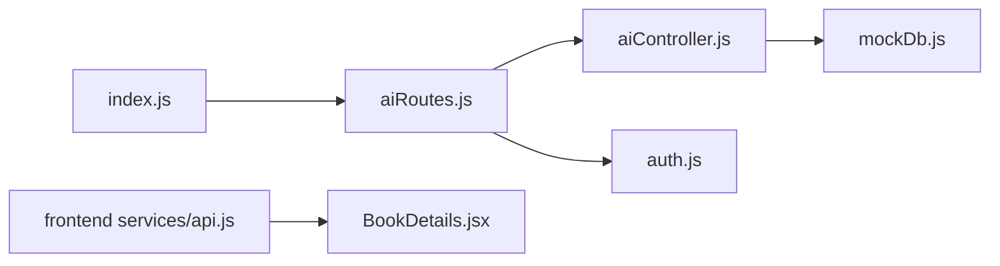

# AI-Powered Features

<cite>
**Referenced Files in This Document**
- [backend/index.js](file://backend/index.js)
- [backend/routes/aiRoutes.js](file://backend/routes/aiRoutes.js)
- [backend/controllers/aiController.js](file://backend/controllers/aiController.js)
- [backend/data/mockDb.js](file://backend/data/mockDb.js)
- [backend/middleware/auth.js](file://backend/middleware/auth.js)
- [frontend/src/services/api.js](file://frontend/src/services/api.js)
- [frontend/src/pages/BookDetails.jsx](file://frontend/src/pages/BookDetails.jsx)
</cite>

## Table of Contents
1. [Introduction](#introduction)
2. [Project Structure](#project-structure)
3. [Core Components](#core-components)
4. [Architecture Overview](#architecture-overview)
5. [Detailed Component Analysis](#detailed-component-analysis)
6. [Dependency Analysis](#dependency-analysis)
7. [Performance Considerations](#performance-considerations)
8. [Troubleshooting Guide](#troubleshooting-guide)
9. [Conclusion](#conclusion)
10. [Appendices](#appendices)

## Introduction
This document explains ReadSphere’s AI-powered features with a focus on:
- Smart summary generation for books
- Personalized recommendation system
- AI integration patterns and current mock implementation
- AI API endpoints, request/response formats, and integration with existing book data
- Recommendation algorithm logic, user preference integration, and future enhancement possibilities
- Examples of AI-generated content, performance considerations, and scalability planning
- Strategy for transitioning from mock AI to production AI services

The current implementation simulates AI capabilities using in-memory mock data and simple logic. The backend exposes two AI endpoints: one for generating a smart summary and another for retrieving recommendations. The frontend integrates AI summaries from the Google Books API and displays a placeholder for recommendations.

## Project Structure
The AI features span the backend (Express server, routes, controller, mock data) and the frontend (Google Books API integration and UI rendering). The backend serves as the central integration point for AI-related requests, while the frontend consumes external APIs and renders AI-enhanced content.

**Diagram sources**
- [backend/index.js:1-27](file://backend/index.js#L1-L27)
- [backend/routes/aiRoutes.js:1-10](file://backend/routes/aiRoutes.js#L1-L10)
- [backend/controllers/aiController.js:1-27](file://backend/controllers/aiController.js#L1-L27)
- [backend/data/mockDb.js:1-20](file://backend/data/mockDb.js#L1-L20)
- [backend/middleware/auth.js:1-34](file://backend/middleware/auth.js#L1-L34)
- [frontend/src/services/api.js:1-284](file://frontend/src/services/api.js#L1-L284)
- [frontend/src/pages/BookDetails.jsx:1-225](file://frontend/src/pages/BookDetails.jsx#L1-L225)

**Section sources**
- [backend/index.js:1-27](file://backend/index.js#L1-L27)
- [backend/routes/aiRoutes.js:1-10](file://backend/routes/aiRoutes.js#L1-L10)
- [backend/controllers/aiController.js:1-27](file://backend/controllers/aiController.js#L1-L27)
- [backend/data/mockDb.js:1-20](file://backend/data/mockDb.js#L1-L20)
- [backend/middleware/auth.js:1-34](file://backend/middleware/auth.js#L1-L34)
- [frontend/src/services/api.js:1-284](file://frontend/src/services/api.js#L1-L284)
- [frontend/src/pages/BookDetails.jsx:1-225](file://frontend/src/pages/BookDetails.jsx#L1-L225)

## Core Components
- AI Summary Endpoint: Generates a smart summary for a given book identifier using mock data.
- Recommendations Endpoint: Returns a list of recommended books (currently mock).
- Authentication Protection: Ensures recommendations endpoint requires a valid JWT bearer token.
- Frontend Integration: Uses Google Books API to populate book metadata and AI summaries; displays a placeholder for recommendations.

Key behaviors:
- Summary generation selects a book by ID from mock data and produces a generic but context-aware summary.
- Recommendations currently return a fixed subset of mock books.
- The frontend formats Google Books API responses and injects a simple AI summary derived from the description.

**Section sources**
- [backend/controllers/aiController.js:3-24](file://backend/controllers/aiController.js#L3-L24)
- [backend/routes/aiRoutes.js:6-7](file://backend/routes/aiRoutes.js#L6-L7)
- [backend/middleware/auth.js:3-23](file://backend/middleware/auth.js#L3-L23)
- [frontend/src/services/api.js:78-112](file://frontend/src/services/api.js#L78-L112)
- [frontend/src/pages/BookDetails.jsx:194-202](file://frontend/src/pages/BookDetails.jsx#L194-L202)

## Architecture Overview
The AI features follow a layered architecture:
- Backend Express server exposes REST endpoints under /api/ai.
- Routes define POST /api/ai/summary and GET /api/ai/recommendations.
- Controllers implement business logic using mock data.
- Middleware enforces authentication for protected endpoints.
- Frontend integrates with Google Books API and renders AI-enhanced content.

**Diagram sources**
- [backend/index.js:11-15](file://backend/index.js#L11-L15)
- [backend/routes/aiRoutes.js:6-7](file://backend/routes/aiRoutes.js#L6-L7)
- [backend/controllers/aiController.js:3-24](file://backend/controllers/aiController.js#L3-L24)
- [backend/data/mockDb.js:7-11](file://backend/data/mockDb.js#L7-L11)
- [backend/middleware/auth.js:3-23](file://backend/middleware/auth.js#L3-L23)

## Detailed Component Analysis

### AI Summary Generation
Purpose:
- Accept a book identifier and produce a smart summary using mock data.

Behavior:
- Extracts bookId from request body.
- Locates the book in mock dataset; defaults to a generic entry if not found.
- Constructs a context-aware summary string incorporating title and category.
- Returns JSON with a single summary field.

**Diagram sources**
- [backend/controllers/aiController.js:5-10](file://backend/controllers/aiController.js#L5-L10)
- [backend/data/mockDb.js:7-11](file://backend/data/mockDb.js#L7-L11)

**Section sources**
- [backend/controllers/aiController.js:3-14](file://backend/controllers/aiController.js#L3-L14)
- [backend/data/mockDb.js:7-11](file://backend/data/mockDb.js#L7-L11)

### Recommendations Endpoint
Purpose:
- Provide personalized recommendations for logged-in users.

Current Implementation:
- Returns a fixed slice of mock books.
- Requires a valid JWT bearer token via middleware.

**Diagram sources**
- [backend/routes/aiRoutes.js:7](file://backend/routes/aiRoutes.js#L7)
- [backend/middleware/auth.js:3-23](file://backend/middleware/auth.js#L3-L23)
- [backend/controllers/aiController.js:16-24](file://backend/controllers/aiController.js#L16-L24)
- [backend/data/mockDb.js:7-11](file://backend/data/mockDb.js#L7-L11)

**Section sources**
- [backend/routes/aiRoutes.js:7](file://backend/routes/aiRoutes.js#L7)
- [backend/middleware/auth.js:3-23](file://backend/middleware/auth.js#L3-L23)
- [backend/controllers/aiController.js:16-24](file://backend/controllers/aiController.js#L16-L24)
- [backend/data/mockDb.js:7-11](file://backend/data/mockDb.js#L7-L11)

### Frontend AI Integration
Purpose:
- Integrate AI-enhanced content from external sources and render summaries and recommendations placeholders.

Key Behaviors:
- Google Books API client formats raw volumes into a normalized book model.
- Injects an aiSummary field derived from the description for display.
- Renders AI summary in the book details page.
- Displays a placeholder for recommendations pending backend implementation.

**Diagram sources**
- [frontend/src/pages/BookDetails.jsx:16-38](file://frontend/src/pages/BookDetails.jsx#L16-L38)
- [frontend/src/services/api.js:151-168](file://frontend/src/services/api.js#L151-L168)
- [frontend/src/services/api.js:78-112](file://frontend/src/services/api.js#L78-L112)
- [frontend/src/pages/BookDetails.jsx:194-202](file://frontend/src/pages/BookDetails.jsx#L194-L202)

**Section sources**
- [frontend/src/services/api.js:78-112](file://frontend/src/services/api.js#L78-L112)
- [frontend/src/pages/BookDetails.jsx:194-202](file://frontend/src/pages/BookDetails.jsx#L194-L202)

### Mock Data Model
Purpose:
- Provide in-memory datasets for books, categories, and users during development and testing.

Structure:
- MOCK_BOOKS: array of book entries with identifiers, titles, authors, categories, ratings, and images.
- MOCK_CATEGORIES: mapping of category IDs to names.
- MOCK_USERS: user profiles including roles and preferences (favorites, bookmarks).

**Diagram sources**
- [backend/data/mockDb.js:7-17](file://backend/data/mockDb.js#L7-L17)

**Section sources**
- [backend/data/mockDb.js:1-20](file://backend/data/mockDb.js#L1-L20)

## Dependency Analysis
- Backend entry point mounts AI routes under /api/ai.
- AI routes depend on the AI controller and authentication middleware.
- AI controller depends on mock data for summaries and recommendations.
- Frontend depends on Google Books API for book metadata and AI summaries.

**Diagram sources**
- [backend/index.js:11-15](file://backend/index.js#L11-L15)
- [backend/routes/aiRoutes.js:1-9](file://backend/routes/aiRoutes.js#L1-L9)
- [backend/controllers/aiController.js:1](file://backend/controllers/aiController.js#L1)
- [backend/data/mockDb.js:1](file://backend/data/mockDb.js#L1)
- [backend/middleware/auth.js:1](file://backend/middleware/auth.js#L1)
- [frontend/src/services/api.js:1](file://frontend/src/services/api.js#L1)
- [frontend/src/pages/BookDetails.jsx:1](file://frontend/src/pages/BookDetails.jsx#L1)

**Section sources**
- [backend/index.js:11-15](file://backend/index.js#L11-L15)
- [backend/routes/aiRoutes.js:1-9](file://backend/routes/aiRoutes.js#L1-L9)
- [backend/controllers/aiController.js:1](file://backend/controllers/aiController.js#L1)
- [backend/data/mockDb.js:1](file://backend/data/mockDb.js#L1)
- [backend/middleware/auth.js:1](file://backend/middleware/auth.js#L1)
- [frontend/src/services/api.js:1](file://frontend/src/services/api.js#L1)
- [frontend/src/pages/BookDetails.jsx:1](file://frontend/src/pages/BookDetails.jsx#L1)

## Performance Considerations
- Current mock implementation is CPU-bound and memory-efficient for small datasets.
- Recommendations endpoint returns a fixed slice; complexity is O(k) where k is the number of returned items.
- Summary generation performs a linear scan over mock books; complexity is O(n) where n is the number of books.
- Frontend formatting and rendering are lightweight; network latency dominates for Google Books API calls.
- Recommendations endpoint should enforce pagination and caching to reduce payload sizes and improve responsiveness.
- Consider rate limiting and caching for AI endpoints to prevent abuse and reduce load.

[No sources needed since this section provides general guidance]

## Troubleshooting Guide
Common issues and resolutions:
- Missing or invalid JWT token for recommendations:
  - Ensure the Authorization header includes a Bearer token.
  - Verify token signature and expiration.
- Summary generation errors:
  - Confirm the bookId exists in the mock dataset.
  - Validate request body format.
- Google Books API failures:
  - The frontend falls back to mock data when API calls fail.
  - Check API key configuration and quotas.

**Section sources**
- [backend/middleware/auth.js:3-23](file://backend/middleware/auth.js#L3-L23)
- [backend/controllers/aiController.js:11-13](file://backend/controllers/aiController.js#L11-L13)
- [frontend/src/services/api.js:120-144](file://frontend/src/services/api.js#L120-L144)

## Conclusion
ReadSphere’s AI features are currently implemented with a clean separation of concerns:
- Backend AI endpoints expose standardized interfaces for summaries and recommendations.
- Frontend integrates external APIs and renders AI-enhanced content.
- Mock data enables rapid iteration and testing without requiring production AI services.

Future enhancements should focus on:
- Implementing a real recommendation algorithm using user preferences and reading history.
- Replacing mock summaries with a production AI service.
- Adding caching, pagination, and rate limiting for AI endpoints.
- Extending user preference integration to personalize recommendations.

[No sources needed since this section summarizes without analyzing specific files]

## Appendices

### AI API Endpoints
- POST /api/ai/summary
  - Description: Generate a smart summary for a given book.
  - Request body: { bookId: string }
  - Response: { summary: string }
  - Error: 500 if internal failure occurs.

- GET /api/ai/recommendations
  - Description: Retrieve personalized recommendations (mock).
  - Headers: Authorization: Bearer <token>
  - Response: Array of book objects (mock).
  - Error: 401 if unauthorized; 500 if internal failure occurs.

**Section sources**
- [backend/routes/aiRoutes.js:6-7](file://backend/routes/aiRoutes.js#L6-L7)
- [backend/controllers/aiController.js:3-24](file://backend/controllers/aiController.js#L3-L24)
- [backend/middleware/auth.js:3-23](file://backend/middleware/auth.js#L3-L23)

### AI-Generated Content Examples
- Summary example: A context-aware summary incorporating the book title and category.
- Frontend AI summary: A concise overview derived from the Google Books description.

**Section sources**
- [backend/controllers/aiController.js:8](file://backend/controllers/aiController.js#L8)
- [frontend/src/services/api.js:108-110](file://frontend/src/services/api.js#L108-L110)

### Recommendation Algorithm Logic and User Preferences
- Current logic: Returns a fixed subset of mock books.
- Future logic (conceptual): Incorporate user favorites, reading progress, categories, and recency to compute relevance scores and rank recommendations.

[No sources needed since this section provides conceptual guidance]

### Migration Path: Mock to Production AI
- Replace mock data with database-backed storage for books and user preferences.
- Integrate a production AI service for summaries and recommendations.
- Add caching and pagination for recommendations.
- Implement analytics to measure recommendation effectiveness and adjust ranking.

[No sources needed since this section provides conceptual guidance]