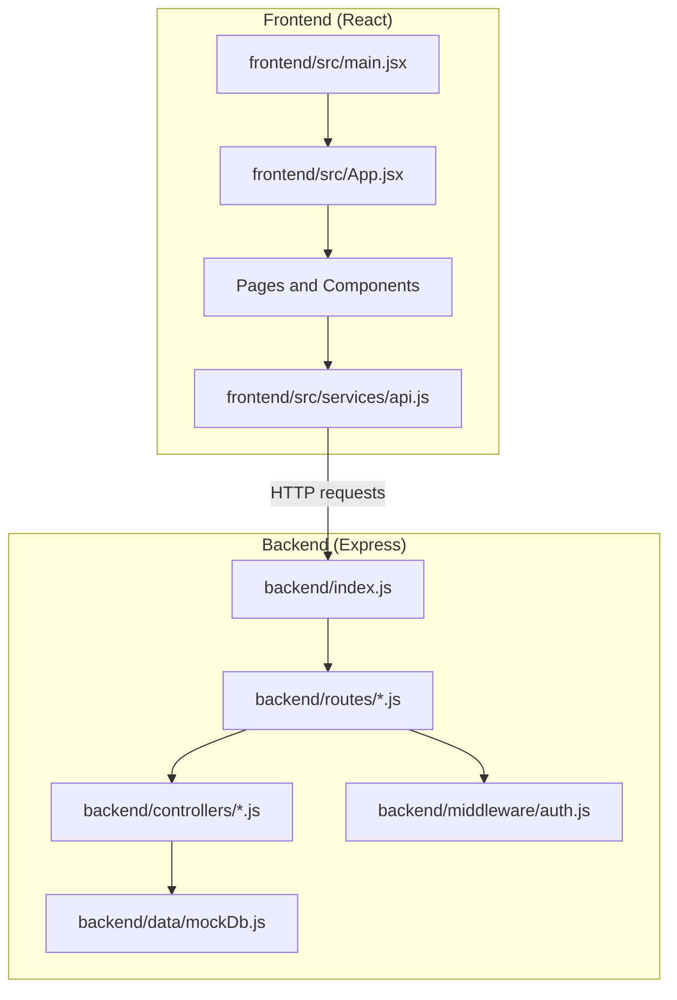
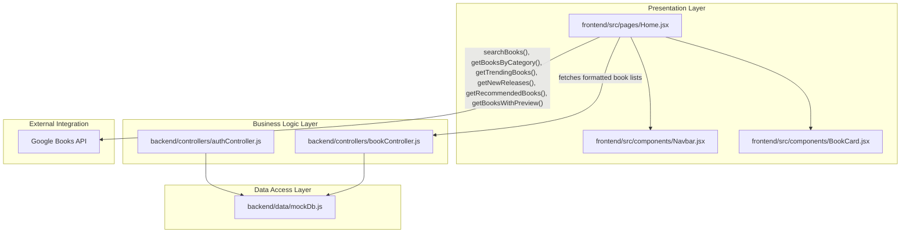
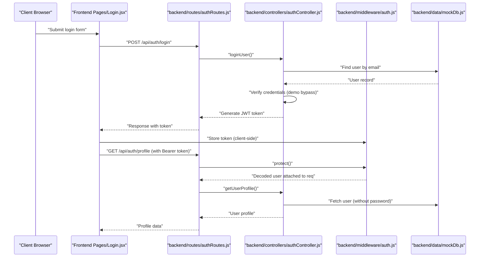
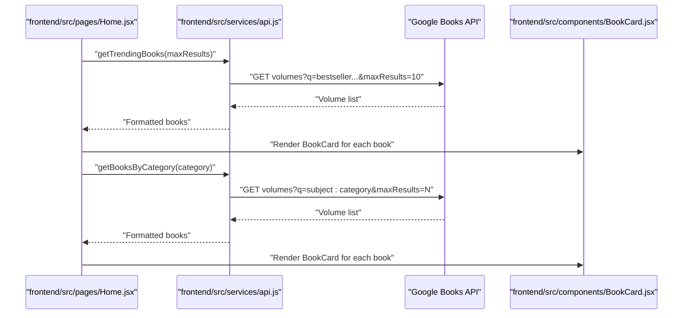
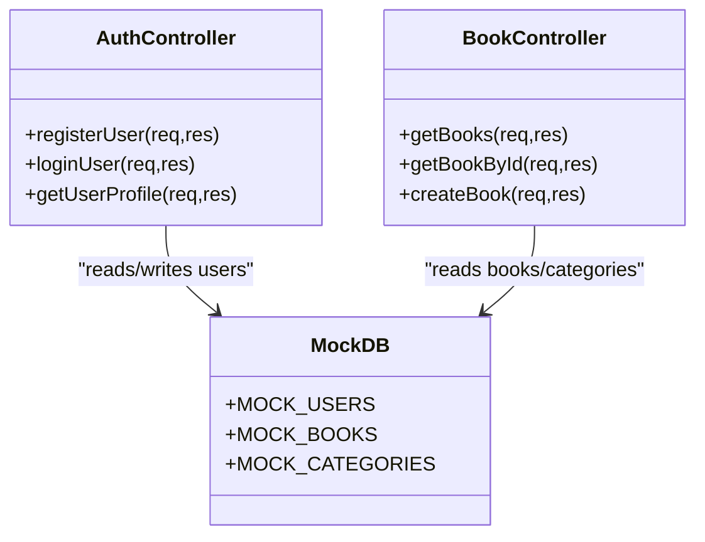
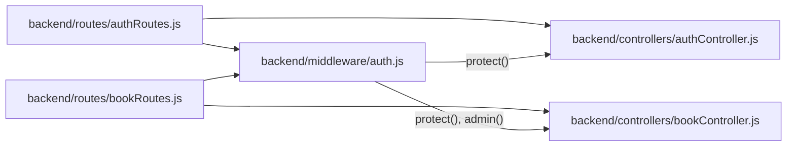
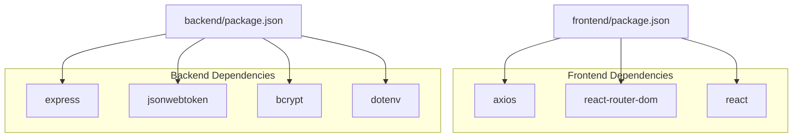

# Architecture Overview

<cite>
**Referenced Files in This Document**
- [backend/index.js](file://backend/index.js)
- [backend/package.json](file://backend/package.json)
- [backend/controllers/authController.js](file://backend/controllers/authController.js)
- [backend/controllers/bookController.js](file://backend/controllers/bookController.js)
- [backend/routes/authRoutes.js](file://backend/routes/authRoutes.js)
- [backend/routes/bookRoutes.js](file://backend/routes/bookRoutes.js)
- [backend/middleware/auth.js](file://backend/middleware/auth.js)
- [backend/data/mockDb.js](file://backend/data/mockDb.js)
- [frontend/src/main.jsx](file://frontend/src/main.jsx)
- [frontend/src/App.jsx](file://frontend/src/App.jsx)
- [frontend/src/services/api.js](file://frontend/src/services/api.js)
- [frontend/src/pages/Home.jsx](file://frontend/src/pages/Home.jsx)
- [frontend/src/components/Navbar.jsx](file://frontend/src/components/Navbar.jsx)
- [frontend/src/components/BookCard.jsx](file://frontend/src/components/BookCard.jsx)
- [frontend/package.json](file://frontend/package.json)
</cite>

## Table of Contents
1. [Introduction](#introduction)
2. [Project Structure](#project-structure)
3. [Core Components](#core-components)
4. [Architecture Overview](#architecture-overview)
5. [Detailed Component Analysis](#detailed-component-analysis)
6. [Dependency Analysis](#dependency-analysis)
7. [Performance Considerations](#performance-considerations)
8. [Troubleshooting Guide](#troubleshooting-guide)
9. [Conclusion](#conclusion)

## Introduction
This document presents the architectural design of ReadSphere, a full-stack reading platform. The system consists of:
- Frontend: A React application built with Vite, routing via React Router, and UI components styled with Tailwind CSS.
- Backend: A Node.js/Express server exposing RESTful APIs for authentication, books, users, and AI-related features.
- Data Access: In-memory mock databases simulating users, books, and categories.
- External Integration: Google Books API for discovery, trending, and preview capabilities with graceful fallbacks.
- Security: JWT-based authentication with protected routes and admin-only endpoints.
- Scalability: Stateless Express routes, modular controllers, and a clean separation of concerns enabling horizontal scaling.

## Project Structure
The repository follows a clear separation of concerns:
- backend: Express server, controllers, routes, middleware, and mock data.
- frontend: React SPA with pages, components, services, and build configuration.

**Diagram sources**
- [backend/index.js:1-27](file://backend/index.js#L1-L27)
- [frontend/src/main.jsx:1-11](file://frontend/src/main.jsx#L1-L11)
- [frontend/src/App.jsx:1-40](file://frontend/src/App.jsx#L1-L40)
- [frontend/src/services/api.js:1-284](file://frontend/src/services/api.js#L1-L284)
- [backend/routes/authRoutes.js:1-11](file://backend/routes/authRoutes.js#L1-L11)
- [backend/routes/bookRoutes.js:1-10](file://backend/routes/bookRoutes.js#L1-L10)
- [backend/controllers/authController.js:1-90](file://backend/controllers/authController.js#L1-L90)
- [backend/controllers/bookController.js:1-69](file://backend/controllers/bookController.js#L1-L69)
- [backend/middleware/auth.js:1-34](file://backend/middleware/auth.js#L1-L34)
- [backend/data/mockDb.js:1-20](file://backend/data/mockDb.js#L1-L20)

**Section sources**
- [backend/index.js:1-27](file://backend/index.js#L1-L27)
- [frontend/src/main.jsx:1-11](file://frontend/src/main.jsx#L1-L11)
- [frontend/src/App.jsx:1-40](file://frontend/src/App.jsx#L1-L40)
- [frontend/src/services/api.js:1-284](file://frontend/src/services/api.js#L1-L284)
- [backend/package.json:1-24](file://backend/package.json#L1-L24)
- [frontend/package.json:1-34](file://frontend/package.json#L1-L34)

## Core Components
- Frontend React Application
  - Entry point initializes the root and renders the App shell.
  - App configures routing and composes pages and shared components.
  - Services encapsulate external API integrations and data formatting.
- Backend Express Server
  - Central index registers middleware, mounts routes, and starts the HTTP server.
  - Controllers implement business logic for auth, books, and user management.
  - Routes define endpoint contracts and apply middleware for protection and roles.
  - Middleware enforces JWT-based authentication and admin authorization.
  - Mock data simulates persistent storage for users, books, and categories.

**Section sources**
- [frontend/src/main.jsx:1-11](file://frontend/src/main.jsx#L1-L11)
- [frontend/src/App.jsx:1-40](file://frontend/src/App.jsx#L1-L40)
- [backend/index.js:1-27](file://backend/index.js#L1-L27)
- [backend/controllers/authController.js:1-90](file://backend/controllers/authController.js#L1-L90)
- [backend/controllers/bookController.js:1-69](file://backend/controllers/bookController.js#L1-L69)
- [backend/routes/authRoutes.js:1-11](file://backend/routes/authRoutes.js#L1-L11)
- [backend/routes/bookRoutes.js:1-10](file://backend/routes/bookRoutes.js#L1-L10)
- [backend/middleware/auth.js:1-34](file://backend/middleware/auth.js#L1-L34)
- [backend/data/mockDb.js:1-20](file://backend/data/mockDb.js#L1-L20)

## Architecture Overview
ReadSphere employs a layered architecture:
- Presentation Layer (React): Pages and components render UI, manage state, and orchestrate service calls.
- Business Logic Layer (Controllers): Encapsulate request handling, validation, and orchestration of data retrieval and transformations.
- Data Access Layer (Mock Database): In-memory collections simulate persistence for users, books, and categories.
- External API Integration: Google Books API for discovery, trending, previews, and metadata enrichment with fallbacks.

**Diagram sources**
- [frontend/src/pages/Home.jsx:1-441](file://frontend/src/pages/Home.jsx#L1-L441)
- [frontend/src/components/BookCard.jsx:1-58](file://frontend/src/components/BookCard.jsx#L1-L58)
- [frontend/src/components/Navbar.jsx:1-56](file://frontend/src/components/Navbar.jsx#L1-L56)
- [frontend/src/services/api.js:1-284](file://frontend/src/services/api.js#L1-L284)
- [backend/controllers/authController.js:1-90](file://backend/controllers/authController.js#L1-L90)
- [backend/controllers/bookController.js:1-69](file://backend/controllers/bookController.js#L1-L69)
- [backend/data/mockDb.js:1-20](file://backend/data/mockDb.js#L1-L20)

## Detailed Component Analysis

### Authentication Flow (JWT)
The authentication flow demonstrates MVC and middleware usage:
- Routes define endpoints for sign-up, login, and profile retrieval.
- Middleware validates JWT tokens from Authorization headers and attaches user context.
- Controllers implement registration, login, and profile retrieval using mock users and JWT signing.

**Diagram sources**
- [backend/routes/authRoutes.js:1-11](file://backend/routes/authRoutes.js#L1-L11)
- [backend/controllers/authController.js:1-90](file://backend/controllers/authController.js#L1-L90)
- [backend/middleware/auth.js:1-34](file://backend/middleware/auth.js#L1-L34)
- [backend/data/mockDb.js:1-20](file://backend/data/mockDb.js#L1-L20)
- [frontend/src/pages/Login.jsx:1-84](file://frontend/src/pages/Login.jsx#L1-L84)

**Section sources**
- [backend/controllers/authController.js:1-90](file://backend/controllers/authController.js#L1-L90)
- [backend/routes/authRoutes.js:1-11](file://backend/routes/authRoutes.js#L1-L11)
- [backend/middleware/auth.js:1-34](file://backend/middleware/auth.js#L1-L34)
- [backend/data/mockDb.js:1-20](file://backend/data/mockDb.js#L1-L20)
- [frontend/src/pages/Login.jsx:1-84](file://frontend/src/pages/Login.jsx#L1-L84)

### Book Discovery and Rendering
The Home page orchestrates multiple data sources:
- Calls frontend services to search Google Books, fetch trending/new releases, and recommended picks.
- Renders BookCard components with lazy-loading images and hover actions.
- Uses category filtering and keyword search to refine results.

**Diagram sources**
- [frontend/src/pages/Home.jsx:1-441](file://frontend/src/pages/Home.jsx#L1-L441)
- [frontend/src/services/api.js:1-284](file://frontend/src/services/api.js#L1-L284)
- [frontend/src/components/BookCard.jsx:1-58](file://frontend/src/components/BookCard.jsx#L1-L58)

**Section sources**
- [frontend/src/pages/Home.jsx:1-441](file://frontend/src/pages/Home.jsx#L1-L441)
- [frontend/src/services/api.js:1-284](file://frontend/src/services/api.js#L1-L284)
- [frontend/src/components/BookCard.jsx:1-58](file://frontend/src/components/BookCard.jsx#L1-L58)

### Data Access and Mock Database
The mock database provides in-memory collections for users, books, and categories. Controllers read and write to these collections, simulating CRUD operations.

**Diagram sources**
- [backend/data/mockDb.js:1-20](file://backend/data/mockDb.js#L1-L20)
- [backend/controllers/authController.js:1-90](file://backend/controllers/authController.js#L1-L90)
- [backend/controllers/bookController.js:1-69](file://backend/controllers/bookController.js#L1-L69)

**Section sources**
- [backend/data/mockDb.js:1-20](file://backend/data/mockDb.js#L1-L20)
- [backend/controllers/bookController.js:1-69](file://backend/controllers/bookController.js#L1-L69)
- [backend/controllers/authController.js:1-90](file://backend/controllers/authController.js#L1-L90)

### Routing and Middleware
Express routes map HTTP verbs to controller actions and apply middleware for authentication and authorization.

**Diagram sources**
- [backend/routes/authRoutes.js:1-11](file://backend/routes/authRoutes.js#L1-L11)
- [backend/routes/bookRoutes.js:1-10](file://backend/routes/bookRoutes.js#L1-L10)
- [backend/controllers/authController.js:1-90](file://backend/controllers/authController.js#L1-L90)
- [backend/controllers/bookController.js:1-69](file://backend/controllers/bookController.js#L1-L69)
- [backend/middleware/auth.js:1-34](file://backend/middleware/auth.js#L1-L34)

**Section sources**
- [backend/routes/authRoutes.js:1-11](file://backend/routes/authRoutes.js#L1-L11)
- [backend/routes/bookRoutes.js:1-10](file://backend/routes/bookRoutes.js#L1-L10)
- [backend/middleware/auth.js:1-34](file://backend/middleware/auth.js#L1-L34)

## Dependency Analysis
- Frontend depends on:
  - React and React Router for UI and navigation.
  - Axios for HTTP requests (referenced in package.json).
  - Local services for Google Books API integration.
- Backend depends on:
  - Express for routing and middleware.
  - JSON Web Token for authentication.
  - Bcrypt for password hashing (referenced in package.json).
  - Dotenv for environment variables (referenced in package.json).

**Diagram sources**
- [frontend/package.json:1-34](file://frontend/package.json#L1-L34)
- [backend/package.json:1-24](file://backend/package.json#L1-L24)

**Section sources**
- [frontend/package.json:1-34](file://frontend/package.json#L1-L34)
- [backend/package.json:1-24](file://backend/package.json#L1-L24)

## Performance Considerations
- Frontend
  - Lazy loading and skeleton placeholders improve perceived performance during network-bound operations.
  - Client-side caching of formatted book lists can reduce repeated API calls.
- Backend
  - In-memory operations are fast but not persistent; consider introducing a database for production.
  - Rate limiting and pagination for Google Books API can prevent throttling.
  - Centralize error handling and logging for better observability.
- External API
  - Graceful fallbacks to mock data ensure resilience when Google Books API is unavailable.
  - Normalize and cache frequently accessed metadata to minimize round trips.

## Troubleshooting Guide
- Authentication
  - Ensure Authorization header includes a valid Bearer token for protected routes.
  - Verify JWT_SECRET environment variable is configured.
- Google Books API
  - Confirm VITE_GOOGLE_BOOKS_API_KEY is set if using a key.
  - Observe fallback behavior when API errors occur.
- CORS and Environment
  - Confirm backend CORS policy allows frontend origin.
  - Validate environment variables for ports and secrets.

**Section sources**
- [backend/middleware/auth.js:1-34](file://backend/middleware/auth.js#L1-L34)
- [frontend/src/services/api.js:1-284](file://frontend/src/services/api.js#L1-L284)
- [backend/index.js:1-27](file://backend/index.js#L1-L27)

## Conclusion
ReadSphere’s architecture cleanly separates frontend and backend concerns, implements an MVC pattern with clear controllers and routes, and integrates external services with robust fallbacks. JWT-based authentication and middleware enforce security, while mock data enables rapid iteration. The design supports scalability through modular controllers, middleware, and a service-layer abstraction for external APIs.