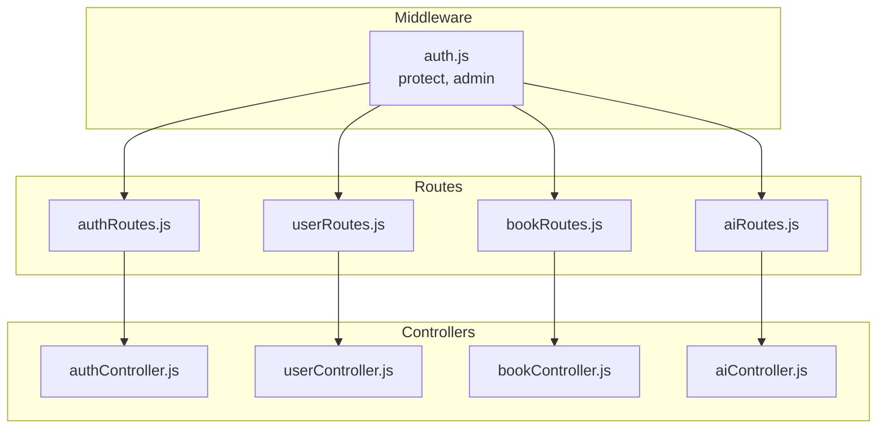
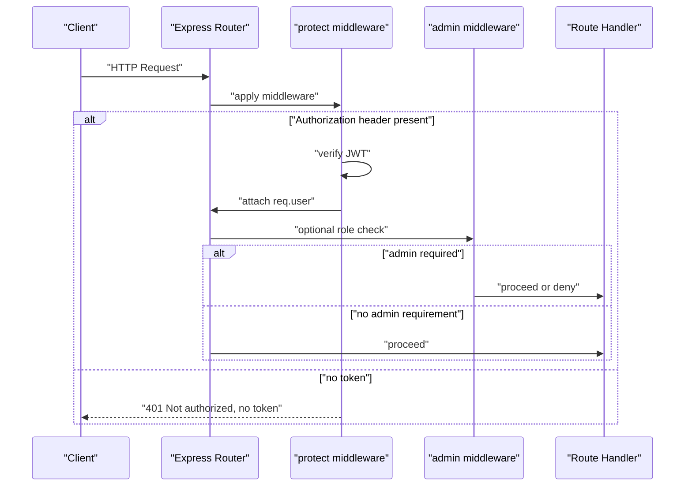
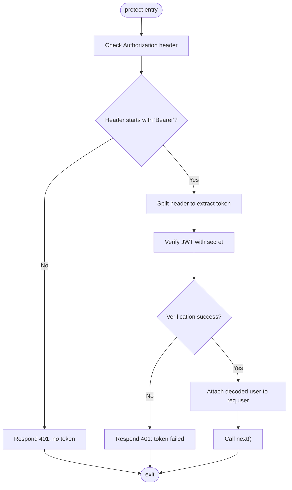
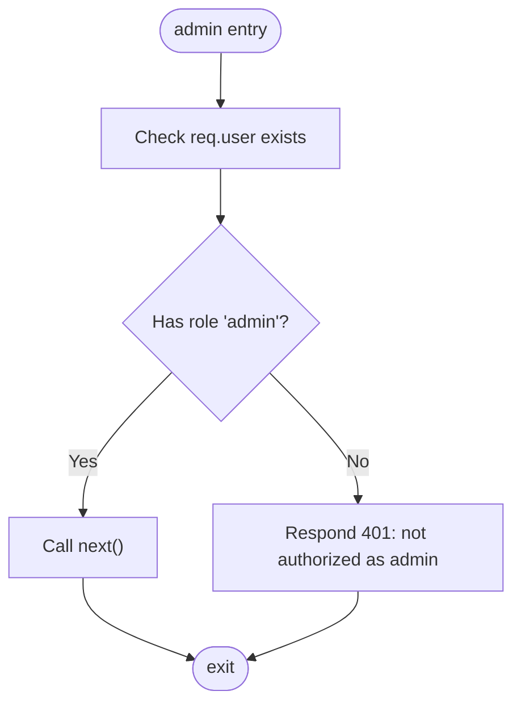
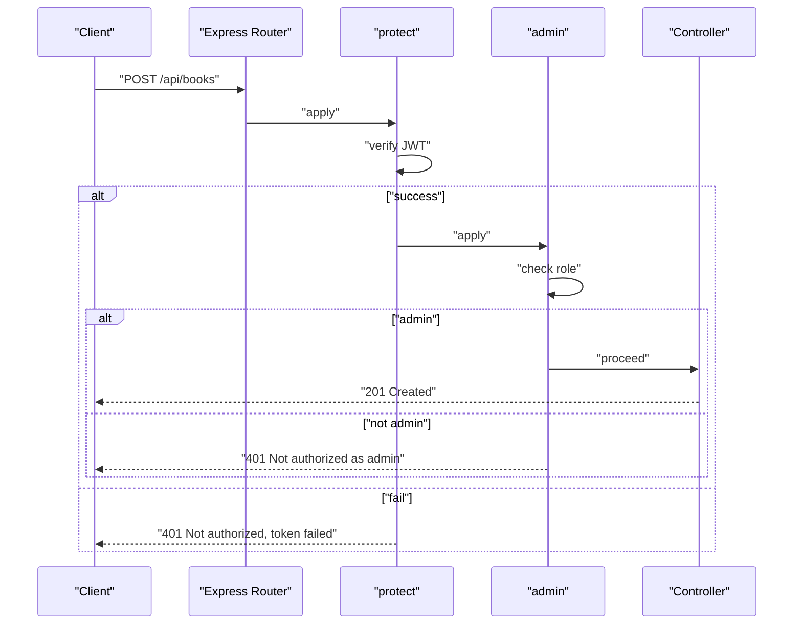
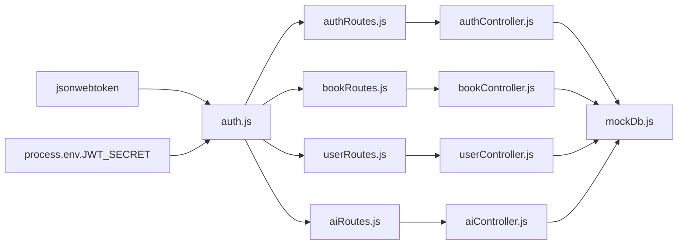

# Authentication Middleware Protection

<cite>
**Referenced Files in This Document**
- [auth.js](file://backend/middleware/auth.js)
- [authController.js](file://backend/controllers/authController.js)
- [authRoutes.js](file://backend/routes/authRoutes.js)
- [bookRoutes.js](file://backend/routes/bookRoutes.js)
- [userRoutes.js](file://backend/routes/userRoutes.js)
- [aiRoutes.js](file://backend/routes/aiRoutes.js)
- [userController.js](file://backend/controllers/userController.js)
- [bookController.js](file://backend/controllers/bookController.js)
- [aiController.js](file://backend/controllers/aiController.js)
- [mockDb.js](file://backend/data/mockDb.js)
- [index.js](file://backend/index.js)
- [package.json](file://backend/package.json)
</cite>

## Table of Contents
1. [Introduction](#introduction)
2. [Project Structure](#project-structure)
3. [Core Components](#core-components)
4. [Architecture Overview](#architecture-overview)
5. [Detailed Component Analysis](#detailed-component-analysis)
6. [Dependency Analysis](#dependency-analysis)
7. [Performance Considerations](#performance-considerations)
8. [Troubleshooting Guide](#troubleshooting-guide)
9. [Conclusion](#conclusion)

## Introduction
This document explains the authentication middleware protection system used to secure API endpoints. It focuses on the protect middleware that validates Bearer tokens and attaches user information to requests, and the admin middleware that enforces role-based access control. The guide covers middleware application patterns across route groups, error handling for authentication failures, middleware execution order, and best practices for protecting API endpoints.

## Project Structure
The authentication system spans middleware, routes, and controllers:
- Middleware: authentication guards that validate tokens and enforce roles
- Routes: define endpoint patterns and apply middleware to specific routes
- Controllers: handle business logic and access the authenticated user via req.user

**Diagram sources**
- [auth.js:1-34](file://backend/middleware/auth.js#L1-L34)
- [authRoutes.js:1-11](file://backend/routes/authRoutes.js#L1-L11)
- [bookRoutes.js:1-10](file://backend/routes/bookRoutes.js#L1-L10)
- [userRoutes.js:1-11](file://backend/routes/userRoutes.js#L1-L11)
- [aiRoutes.js:1-10](file://backend/routes/aiRoutes.js#L1-L10)
- [authController.js:1-90](file://backend/controllers/authController.js#L1-L90)
- [userController.js:1-42](file://backend/controllers/userController.js#L1-L42)
- [bookController.js:1-69](file://backend/controllers/bookController.js#L1-L69)
- [aiController.js:1-27](file://backend/controllers/aiController.js#L1-L27)

**Section sources**
- [index.js:1-27](file://backend/index.js#L1-L27)
- [package.json:13-18](file://backend/package.json#L13-L18)

## Core Components
- protect middleware: extracts and verifies JWT from Authorization header, attaches decoded user payload to req.user, and proceeds to the next handler or responds with 401
- admin middleware: checks that req.user exists and has role set to admin; otherwise responds with 401

Key behaviors:
- Token extraction: expects "Bearer <token>" in the Authorization header
- Verification: uses JWT secret from environment configuration
- User attachment: decoded payload (containing id and role) is attached to req.user for downstream handlers
- Role enforcement: admin middleware inspects req.user.role

**Section sources**
- [auth.js:3-31](file://backend/middleware/auth.js#L3-L31)

## Architecture Overview
The middleware sits between routes and controllers, validating requests before business logic executes. The protect middleware ensures req.user is available; the admin middleware adds an additional authorization gate for privileged actions.

**Diagram sources**
- [auth.js:3-31](file://backend/middleware/auth.js#L3-L31)
- [authRoutes.js:8](file://backend/routes/authRoutes.js#L8)
- [bookRoutes.js:6](file://backend/routes/bookRoutes.js#L6)
- [userRoutes.js:6-8](file://backend/routes/userRoutes.js#L6-L8)
- [aiRoutes.js:7](file://backend/routes/aiRoutes.js#L7)

## Detailed Component Analysis

### protect Middleware
Responsibilities:
- Extract token from Authorization header
- Verify JWT signature using environment secret
- Attach decoded user payload (id, role) to req.user
- Continue to next handler on success or respond with 401 on failure

Execution flow:
- Header parsing: Authorization header must start with "Bearer"
- Token split: extract token after "Bearer "
- Verification: jwt.verify against JWT_SECRET
- Attachment: decoded payload stored as req.user
- Failure: respond with 401 and message indicating token failure or missing token

**Diagram sources**
- [auth.js:3-23](file://backend/middleware/auth.js#L3-L23)

**Section sources**
- [auth.js:3-23](file://backend/middleware/auth.js#L3-L23)

### admin Middleware
Responsibilities:
- Enforce role-based access control
- Allow only requests where req.user.role equals "admin"
- Respond with 401 for non-admin access attempts

**Diagram sources**
- [auth.js:25-31](file://backend/middleware/auth.js#L25-L31)

**Section sources**
- [auth.js:25-31](file://backend/middleware/auth.js#L25-L31)

### Route Application Patterns
- Authentication-required endpoints: apply protect to routes that need a valid user session
- Admin-only endpoints: apply both protect and admin to routes requiring administrative privileges
- Mixed usage: some routes may require only authentication, others both authentication and admin role

Examples across route groups:
- Authentication routes: protect applied to profile retrieval
- Books routes: protect and admin applied to create operations
- Users routes: protect applied to user-centric actions
- AI routes: protect applied to recommendation retrieval

**Section sources**
- [authRoutes.js:8](file://backend/routes/authRoutes.js#L8)
- [bookRoutes.js:6](file://backend/routes/bookRoutes.js#L6)
- [userRoutes.js:6-8](file://backend/routes/userRoutes.js#L6-L8)
- [aiRoutes.js:7](file://backend/routes/aiRoutes.js#L7)

### Middleware Execution Order and Control Flow
- protect runs first to validate and attach user
- admin runs after protect to enforce role requirements
- If protect fails, admin is not reached; protect responds with 401
- If protect succeeds but user lacks admin role, admin responds with 401

**Diagram sources**
- [bookRoutes.js:6](file://backend/routes/bookRoutes.js#L6)
- [auth.js:3-31](file://backend/middleware/auth.js#L3-L31)

### Integration with Express Route Handlers
- Controllers access the authenticated user via req.user.id and req.user.role
- Example: user favorites and bookmarks rely on req.user.id
- Example: book creation relies on req.user being present and role checked by admin middleware

**Section sources**
- [userController.js:6](file://backend/controllers/userController.js#L6)
- [bookController.js:48](file://backend/controllers/bookController.js#L48)
- [mockDb.js:3-4](file://backend/data/mockDb.js#L3-L4)

### Error Responses for Unauthorized Access
- Missing token: 401 with message indicating no token
- Token verification failure: 401 with message indicating token failure
- Non-admin access to admin-protected endpoints: 401 with message indicating not authorized as admin

These responses are produced by the protect and admin middleware respectively.

**Section sources**
- [auth.js:16-22](file://backend/middleware/auth.js#L16-L22)
- [auth.js:29](file://backend/middleware/auth.js#L29)

## Dependency Analysis
- Middleware depends on jsonwebtoken for token verification and environment configuration for JWT_SECRET
- Routes depend on middleware exports and controller handlers
- Controllers depend on mock database for user and book data
- Application bootstrap wires routes under /api/* paths

**Diagram sources**
- [auth.js:1](file://backend/middleware/auth.js#L1)
- [auth.js:12](file://backend/middleware/auth.js#L12)
- [authRoutes.js:4](file://backend/routes/authRoutes.js#L4)
- [bookRoutes.js:4](file://backend/routes/bookRoutes.js#L4)
- [userRoutes.js:4](file://backend/routes/userRoutes.js#L4)
- [aiRoutes.js:4](file://backend/routes/aiRoutes.js#L4)
- [authController.js:3](file://backend/controllers/authController.js#L3)
- [bookController.js:1](file://backend/controllers/bookController.js#L1)
- [userController.js:1](file://backend/controllers/userController.js#L1)
- [aiController.js:1](file://backend/controllers/aiController.js#L1)
- [mockDb.js:1](file://backend/data/mockDb.js#L1)

**Section sources**
- [package.json:13-18](file://backend/package.json#L13-L18)
- [index.js:12-15](file://backend/index.js#L12-L15)

## Performance Considerations
- Token verification cost: minimal overhead; ensure JWT_SECRET is configured securely
- Middleware placement: place protect early to fail fast before expensive handlers
- Admin checks: keep admin middleware close to protected routes to minimize unnecessary processing
- Avoid redundant middleware: do not stack protect and admin unnecessarily; apply only where required

## Troubleshooting Guide
Common issues and resolutions:
- 401 Not authorized, no token
  - Cause: Missing Authorization header or missing "Bearer " prefix
  - Fix: Send Authorization header with "Bearer <token>"
- 401 Not authorized, token failed
  - Cause: Invalid or expired token, wrong JWT_SECRET, malformed token
  - Fix: Regenerate token with correct secret; verify token expiration
- 401 Not authorized as admin
  - Cause: User authenticated but role is not "admin"
  - Fix: Ensure user has role "admin" in mock database or use a different account
- req.user undefined in controller
  - Cause: protect middleware did not run or failed
  - Fix: Confirm route applies protect middleware; verify Authorization header and token validity
- Environment configuration
  - Ensure JWT_SECRET is set in environment; middleware uses process.env.JWT_SECRET for verification

**Section sources**
- [auth.js:16-22](file://backend/middleware/auth.js#L16-L22)
- [auth.js:29](file://backend/middleware/auth.js#L29)
- [mockDb.js:3-4](file://backend/data/mockDb.js#L3-L4)

## Conclusion
The authentication middleware protection system provides robust bearer token validation and role-based access control. By applying protect to authentication-required endpoints and combining it with admin for privileged actions, the system ensures secure API access. Proper middleware ordering, clear error responses, and correct environment configuration are essential for reliable operation. Following the documented patterns and troubleshooting steps will help maintain secure and predictable behavior across route groups.