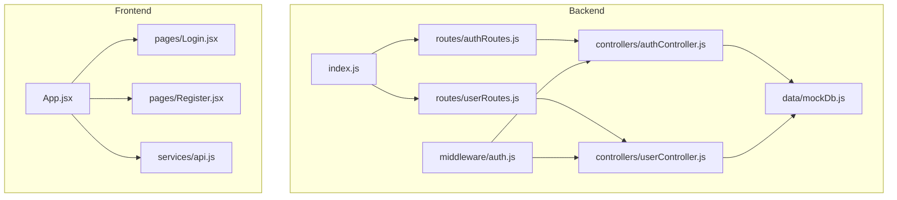
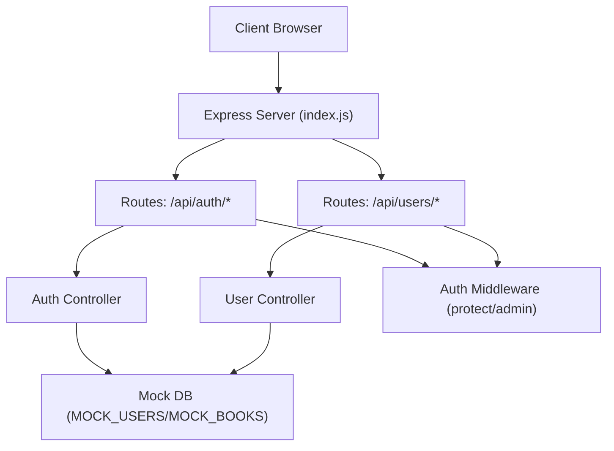
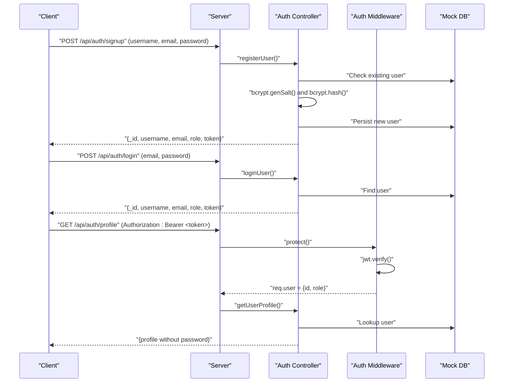
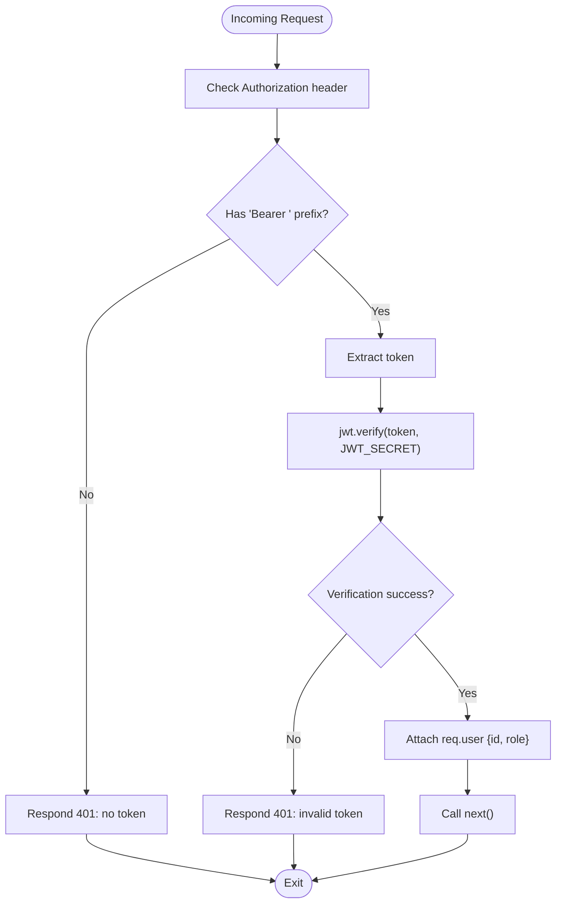
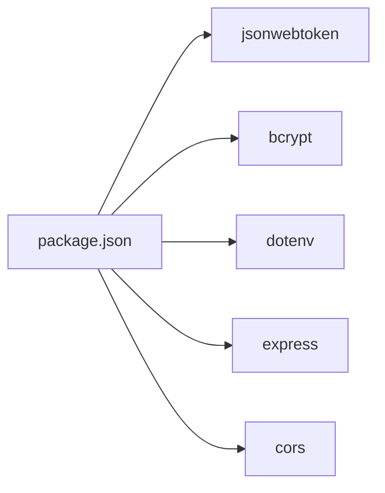

# Authentication and Authorization

<cite>
**Referenced Files in This Document**
- [backend/index.js](file://backend/index.js)
- [backend/package.json](file://backend/package.json)
- [backend/controllers/authController.js](file://backend/controllers/authController.js)
- [backend/controllers/userController.js](file://backend/controllers/userController.js)
- [backend/middleware/auth.js](file://backend/middleware/auth.js)
- [backend/routes/authRoutes.js](file://backend/routes/authRoutes.js)
- [backend/routes/userRoutes.js](file://backend/routes/userRoutes.js)
- [backend/data/mockDb.js](file://backend/data/mockDb.js)
- [frontend/src/App.jsx](file://frontend/src/App.jsx)
- [frontend/src/pages/Login.jsx](file://frontend/src/pages/Login.jsx)
- [frontend/src/pages/Register.jsx](file://frontend/src/pages/Register.jsx)
- [frontend/src/services/api.js](file://frontend/src/services/api.js)
</cite>

## Table of Contents
1. [Introduction](#introduction)
2. [Project Structure](#project-structure)
3. [Core Components](#core-components)
4. [Architecture Overview](#architecture-overview)
5. [Detailed Component Analysis](#detailed-component-analysis)
6. [Dependency Analysis](#dependency-analysis)
7. [Performance Considerations](#performance-considerations)
8. [Troubleshooting Guide](#troubleshooting-guide)
9. [Conclusion](#conclusion)
10. [Appendices](#appendices)

## Introduction
This document explains ReadSphere’s authentication and authorization system. It covers JWT-based authentication, middleware protection, user registration and login, password hashing, role-based access control, and security best practices. It also outlines how to integrate frontend components and describes logout and refresh strategies.

## Project Structure
The authentication system spans the backend (Express server, controllers, middleware, routes, and mock data) and the frontend (routing and UI scaffolding). The backend exposes authentication endpoints and protected routes, while the frontend provides login and registration pages and routes.

**Diagram sources**
- [backend/index.js:1-27](file://backend/index.js#L1-L27)
- [backend/routes/authRoutes.js:1-11](file://backend/routes/authRoutes.js#L1-L11)
- [backend/routes/userRoutes.js:1-11](file://backend/routes/userRoutes.js#L1-L11)
- [backend/controllers/authController.js:1-90](file://backend/controllers/authController.js#L1-L90)
- [backend/controllers/userController.js:1-42](file://backend/controllers/userController.js#L1-L42)
- [backend/middleware/auth.js:1-34](file://backend/middleware/auth.js#L1-L34)
- [backend/data/mockDb.js:1-20](file://backend/data/mockDb.js#L1-L20)
- [frontend/src/App.jsx:1-40](file://frontend/src/App.jsx#L1-L40)
- [frontend/src/pages/Login.jsx:1-84](file://frontend/src/pages/Login.jsx#L1-L84)
- [frontend/src/pages/Register.jsx:1-99](file://frontend/src/pages/Register.jsx#L1-L99)
- [frontend/src/services/api.js:1-284](file://frontend/src/services/api.js#L1-L284)

**Section sources**
- [backend/index.js:1-27](file://backend/index.js#L1-L27)
- [frontend/src/App.jsx:1-40](file://frontend/src/App.jsx#L1-L40)

## Core Components
- JWT-based authentication with signing and verification
- Password hashing using bcrypt
- Middleware to protect routes and enforce roles
- Registration and login endpoints
- Protected user actions (favorites, bookmarks)
- Mock in-memory database for users and books

Key implementation references:
- Token generation and signing: [generateToken:5-9](file://backend/controllers/authController.js#L5-L9)
- Password hashing: [bcrypt.hash:20-21](file://backend/controllers/authController.js#L20-L21)
- Login flow and token issuance: [loginUser:48-72](file://backend/controllers/authController.js#L48-L72)
- Registration flow and token issuance: [registerUser:11-46](file://backend/controllers/authController.js#L11-L46)
- Protected route middleware: [protect:3-23](file://backend/middleware/auth.js#L3-L23)
- Admin-only middleware: [admin:25-31](file://backend/middleware/auth.js#L25-L31)
- Protected user actions: [addFavorite/removeFavorite/addBookmark:3-39](file://backend/controllers/userController.js#L3-L39)

**Section sources**
- [backend/controllers/authController.js:1-90](file://backend/controllers/authController.js#L1-L90)
- [backend/middleware/auth.js:1-34](file://backend/middleware/auth.js#L1-L34)
- [backend/controllers/userController.js:1-42](file://backend/controllers/userController.js#L1-L42)

## Architecture Overview
The authentication architecture consists of:
- Express server initialization and CORS/JSON middleware
- Routes for authentication and user actions
- Controllers implementing business logic (registration, login, profile retrieval)
- Middleware enforcing session validity and roles
- Mock database for users and books

**Diagram sources**
- [backend/index.js:1-27](file://backend/index.js#L1-L27)
- [backend/routes/authRoutes.js:1-11](file://backend/routes/authRoutes.js#L1-L11)
- [backend/routes/userRoutes.js:1-11](file://backend/routes/userRoutes.js#L1-L11)
- [backend/controllers/authController.js:1-90](file://backend/controllers/authController.js#L1-L90)
- [backend/controllers/userController.js:1-42](file://backend/controllers/userController.js#L1-L42)
- [backend/middleware/auth.js:1-34](file://backend/middleware/auth.js#L1-L34)
- [backend/data/mockDb.js:1-20](file://backend/data/mockDb.js#L1-L20)

## Detailed Component Analysis

### JWT-Based Authentication Flow
The system uses JSON Web Tokens for sessionless authentication. Tokens are signed with a secret and carry user identity and role. Clients store tokens and send them in the Authorization header for protected requests.

**Diagram sources**
- [backend/controllers/authController.js:11-87](file://backend/controllers/authController.js#L11-L87)
- [backend/middleware/auth.js:3-23](file://backend/middleware/auth.js#L3-L23)
- [backend/routes/authRoutes.js:6-8](file://backend/routes/authRoutes.js#L6-L8)
- [backend/data/mockDb.js:2-5](file://backend/data/mockDb.js#L2-L5)

**Section sources**
- [backend/controllers/authController.js:5-9](file://backend/controllers/authController.js#L5-L9)
- [backend/controllers/authController.js:11-46](file://backend/controllers/authController.js#L11-L46)
- [backend/controllers/authController.js:48-72](file://backend/controllers/authController.js#L48-L72)
- [backend/middleware/auth.js:3-23](file://backend/middleware/auth.js#L3-L23)

### Middleware for Protecting Routes
The protect middleware extracts the Bearer token from the Authorization header, verifies it, and attaches decoded user info to the request. The admin middleware checks role-based access.

**Diagram sources**
- [backend/middleware/auth.js:3-23](file://backend/middleware/auth.js#L3-L23)

**Section sources**
- [backend/middleware/auth.js:3-31](file://backend/middleware/auth.js#L3-L31)

### User Roles and Permissions
- Role model: user and admin
- Admin-only endpoint enforcement via middleware
- Protected user actions (favorites, bookmarks) require a valid session

References:
- Roles in mock database: [MOCK_USERS:2-5](file://backend/data/mockDb.js#L2-L5)
- Admin middleware: [admin:25-31](file://backend/middleware/auth.js#L25-L31)
- Protected user actions: [user routes:6-8](file://backend/routes/userRoutes.js#L6-L8)

**Section sources**
- [backend/data/mockDb.js:2-5](file://backend/data/mockDb.js#L2-L5)
- [backend/middleware/auth.js:25-31](file://backend/middleware/auth.js#L25-L31)
- [backend/routes/userRoutes.js:1-11](file://backend/routes/userRoutes.js#L1-L11)

### Registration and Login Processes
- Registration hashes the password and issues a token
- Login finds the user and issues a token
- Both endpoints return user profile data and a JWT

References:
- Registration: [registerUser:11-46](file://backend/controllers/authController.js#L11-L46)
- Login: [loginUser:48-72](file://backend/controllers/authController.js#L48-L72)
- Token generation: [generateToken:5-9](file://backend/controllers/authController.js#L5-L9)

**Section sources**
- [backend/controllers/authController.js:11-72](file://backend/controllers/authController.js#L11-L72)

### Protected User Actions
- Add/remove favorite books
- Add bookmarks with bookId and page
- All endpoints protected by the auth middleware

References:
- Add favorite: [addFavorite:3-17](file://backend/controllers/userController.js#L3-L17)
- Remove favorite: [removeFavorite:19-27](file://backend/controllers/userController.js#L19-L27)
- Add bookmark: [addBookmark:29-39](file://backend/controllers/userController.js#L29-L39)
- Protected routes: [userRoutes:6-8](file://backend/routes/userRoutes.js#L6-L8)

**Section sources**
- [backend/controllers/userController.js:1-42](file://backend/controllers/userController.js#L1-L42)
- [backend/routes/userRoutes.js:1-11](file://backend/routes/userRoutes.js#L1-L11)

### Frontend Integration Patterns
- Routes for Login and Register are defined in the frontend app
- Placeholder handlers in Login and Register indicate where API calls will be wired
- The Google Books API service is separate from authentication but used by the app

References:
- App routes: [App.jsx:22-31](file://frontend/src/App.jsx#L22-L31)
- Login page: [Login.jsx:9-13](file://frontend/src/pages/Login.jsx#L9-L13)
- Register page: [Register.jsx:10-14](file://frontend/src/pages/Register.jsx#L10-L14)
- Google Books API service: [api.js:1-284](file://frontend/src/services/api.js#L1-L284)

**Section sources**
- [frontend/src/App.jsx:16-36](file://frontend/src/App.jsx#L16-L36)
- [frontend/src/pages/Login.jsx:1-84](file://frontend/src/pages/Login.jsx#L1-L84)
- [frontend/src/pages/Register.jsx:1-99](file://frontend/src/pages/Register.jsx#L1-L99)
- [frontend/src/services/api.js:1-284](file://frontend/src/services/api.js#L1-L284)

## Dependency Analysis
External libraries and their roles:
- jsonwebtoken: JWT signing and verification
- bcrypt: Password hashing
- dotenv: Environment variable loading
- express: Web server and routing
- cors: Cross-origin support

**Diagram sources**
- [backend/package.json:13-18](file://backend/package.json#L13-L18)

**Section sources**
- [backend/package.json:1-24](file://backend/package.json#L1-24)

## Performance Considerations
- Token expiration: The current token lifetime is set to 30 days. Consider shorter expirations for higher security and implement refresh tokens for long-lived sessions.
- Password hashing cost: bcrypt salt rounds are set to 10. Adjust based on hardware capabilities and security requirements.
- In-memory storage: The mock database is suitable for development. For production, use a persistent database and consider connection pooling and indexing.
- Middleware overhead: Keep token verification lightweight; avoid unnecessary computations in middleware.

[No sources needed since this section provides general guidance]

## Troubleshooting Guide
Common authentication errors and resolutions:
- Missing Authorization header: Ensure clients send Authorization: Bearer <token> for protected routes.
- Invalid or expired token: Re-authenticate the user to obtain a new token.
- User not found: Confirm the user exists in the mock database or connect to a real database.
- Role-based access denied: Verify the user role and ensure admin middleware is applied where required.

References:
- Middleware unauthorized responses: [auth.js:15-22](file://backend/middleware/auth.js#L15-L22)
- Login failure response: [authController.js](file://backend/controllers/authController.js#L67)
- Profile not found: [authController.js](file://backend/controllers/authController.js#L82)

**Section sources**
- [backend/middleware/auth.js:15-22](file://backend/middleware/auth.js#L15-L22)
- [backend/controllers/authController.js:67](file://backend/controllers/authController.js#L67)
- [backend/controllers/authController.js:82](file://backend/controllers/authController.js#L82)

## Conclusion
ReadSphere implements a straightforward JWT-based authentication system with middleware protection and role-based access control. The design leverages bcrypt for secure password hashing and provides endpoints for registration, login, and protected user actions. For production, implement token refresh, secure storage, and persistent user storage.

[No sources needed since this section summarizes without analyzing specific files]

## Appendices

### Security Best Practices
- Use HTTPS in production to prevent token interception.
- Store tokens securely (HttpOnly cookies or secure storage) and avoid placing tokens in local storage.
- Implement short-lived access tokens with a refresh token mechanism.
- Enforce CSRF protection for state-changing requests.
- Validate and sanitize all inputs and apply rate limiting to authentication endpoints.
- Rotate JWT secrets regularly and use strong random secrets.

[No sources needed since this section provides general guidance]

### Logout Procedures
- Client-side: Remove stored tokens and clear user state.
- Server-side: Maintain a revocation list (Redis/Set) for issued tokens if implementing short-lived tokens and refresh token rotation.

[No sources needed since this section provides general guidance]

### Refresh Token Mechanism (Implementation Guidance)
- Issue short-lived access tokens and long-lived refresh tokens on login.
- On access token expiry, validate the refresh token and issue a new access token.
- Invalidate refresh tokens upon logout or compromise.

[No sources needed since this section provides general guidance]