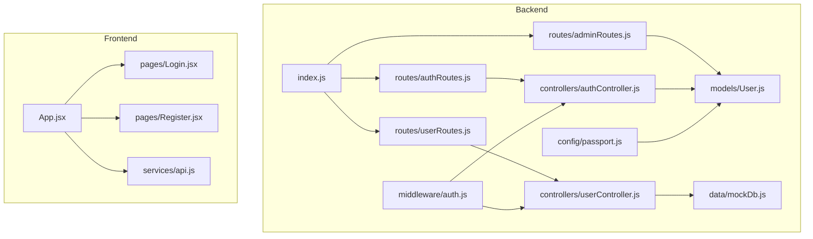
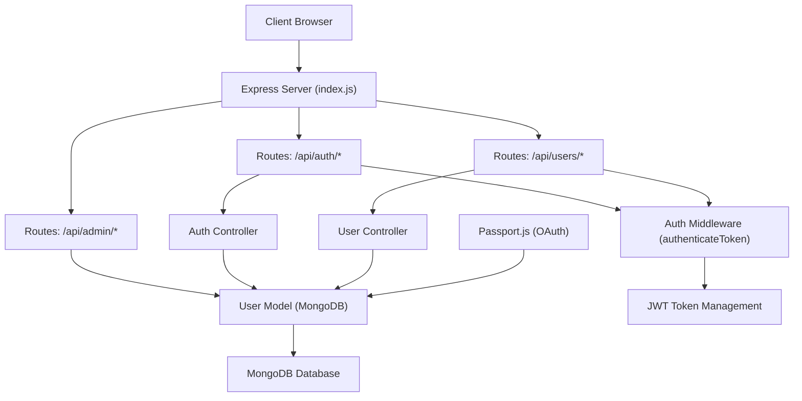
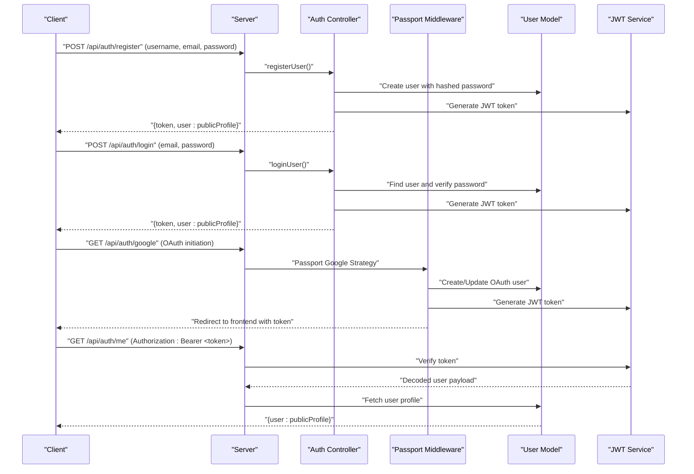
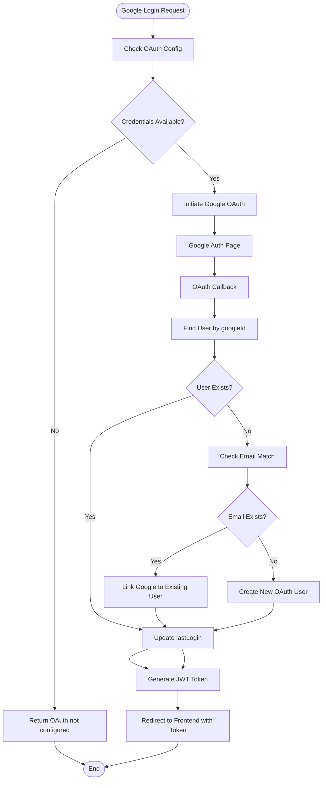
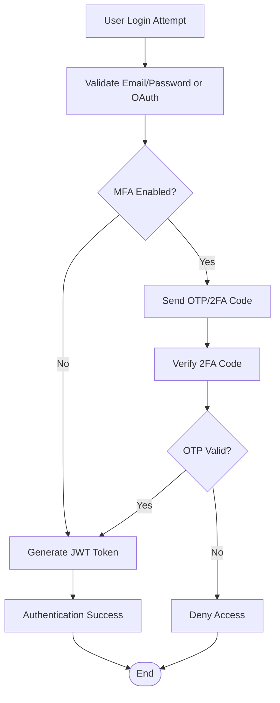
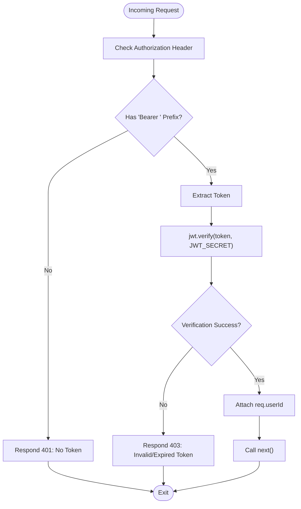
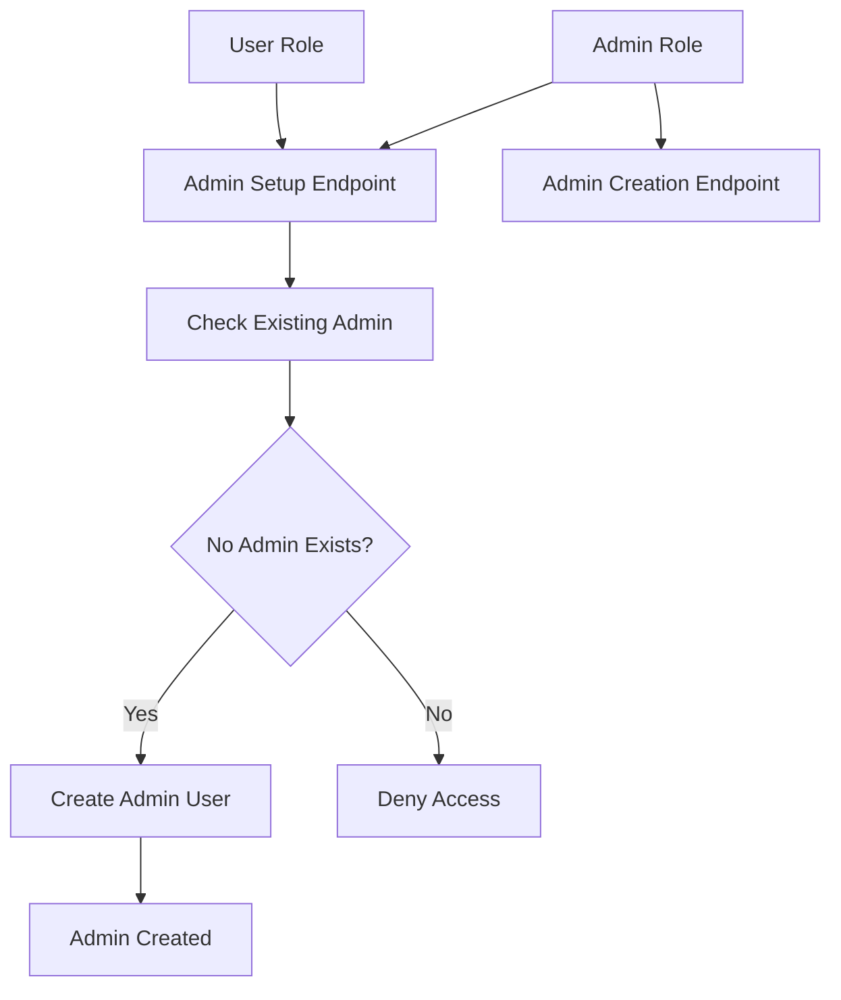
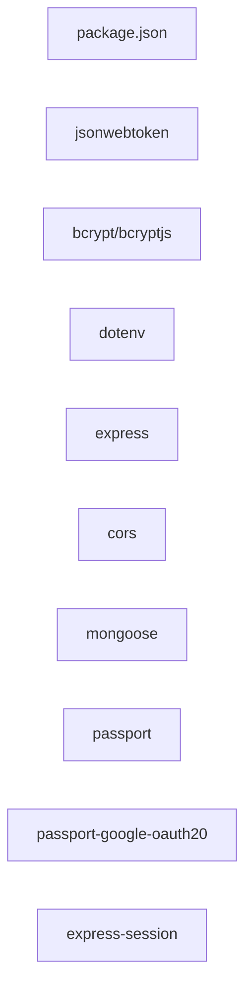

# Authentication and Authorization

<cite>
**Referenced Files in This Document**
- [backend/index.js](file://backend/index.js)
- [backend/package.json](file://backend/package.json)
- [backend/controllers/authController.js](file://backend/controllers/authController.js)
- [backend/controllers/userController.js](file://backend/controllers/userController.js)
- [backend/middleware/auth.js](file://backend/middleware/auth.js)
- [backend/routes/authRoutes.js](file://backend/routes/authRoutes.js)
- [backend/routes/userRoutes.js](file://backend/routes/userRoutes.js)
- [backend/routes/adminRoutes.js](file://backend/routes/adminRoutes.js)
- [backend/models/User.js](file://backend/models/User.js)
- [backend/config/passport.js](file://backend/config/passport.js)
- [backend/data/mockDb.js](file://backend/data/mockDb.js)
- [frontend/src/App.jsx](file://frontend/src/App.jsx)
- [frontend/src/pages/Login.jsx](file://frontend/src/pages/Login.jsx)
- [frontend/src/pages/Register.jsx](file://frontend/src/pages/Register.jsx)
- [frontend/src/services/api.js](file://frontend/src/services/api.js)
</cite>

## Update Summary
**Changes Made**
- Added comprehensive Google OAuth integration with Passport.js
- Implemented JWT-based authentication with enhanced security features
- Added multi-factor authentication support framework
- Enhanced user management capabilities with comprehensive user profiles
- Added admin role-based access control system
- Implemented secure token-based authentication flow
- Added comprehensive user CRUD operations and profile management

## Table of Contents
1. [Introduction](#introduction)
2. [Project Structure](#project-structure)
3. [Core Components](#core-components)
4. [Architecture Overview](#architecture-overview)
5. [Detailed Component Analysis](#detailed-component-analysis)
6. [Dependency Analysis](#dependency-analysis)
7. [Performance Considerations](#performance-considerations)
8. [Troubleshooting Guide](#troubleshooting-guide)
9. [Conclusion](#conclusion)
10. [Appendices](#appendices)

## Introduction
This document explains ReadSphere's complete authentication and authorization system. The system now features JWT-based authentication, Google OAuth integration, multi-factor authentication support, and comprehensive user management capabilities. It covers secure token generation and verification, middleware protection, user registration and login processes, password hashing with bcrypt, role-based access control, and security best practices. The system supports both traditional email/password authentication and social login through Google OAuth, with extensible support for multi-factor authentication.

## Project Structure
The authentication system spans the backend (Express server, controllers, middleware, routes, models, and Passport configuration) and the frontend (routing and UI components). The backend provides comprehensive authentication endpoints, protected routes, user management, and OAuth integration, while the frontend offers login, registration, and profile management interfaces.

**Diagram sources**
- [backend/index.js:1-71](file://backend/index.js#L1-L71)
- [backend/routes/authRoutes.js:1-202](file://backend/routes/authRoutes.js#L1-L202)
- [backend/routes/userRoutes.js:1-182](file://backend/routes/userRoutes.js#L1-L182)
- [backend/routes/adminRoutes.js:1-96](file://backend/routes/adminRoutes.js#L1-L96)
- [backend/controllers/authController.js:1-90](file://backend/controllers/authController.js#L1-L90)
- [backend/controllers/userController.js:1-42](file://backend/controllers/userController.js#L1-L42)
- [backend/middleware/auth.js:1-36](file://backend/middleware/auth.js#L1-L36)
- [backend/models/User.js:1-129](file://backend/models/User.js#L1-L129)
- [backend/config/passport.js:1-80](file://backend/config/passport.js#L1-L80)
- [backend/data/mockDb.js:1-51](file://backend/data/mockDb.js#L1-L51)
- [frontend/src/App.jsx:1-40](file://frontend/src/App.jsx#L1-L40)
- [frontend/src/pages/Login.jsx:1-157](file://frontend/src/pages/Login.jsx#L1-L157)
- [frontend/src/pages/Register.jsx:1-99](file://frontend/src/pages/Register.jsx#L1-L99)
- [frontend/src/services/api.js:1-308](file://frontend/src/services/api.js#L1-L308)

**Section sources**
- [backend/index.js:1-71](file://backend/index.js#L1-L71)
- [frontend/src/App.jsx:1-40](file://frontend/src/App.jsx#L1-L40)

## Core Components
- **JWT-based authentication** with secure token generation and verification
- **Google OAuth integration** using Passport.js for social login
- **Multi-factor authentication support** framework with extensible architecture
- **Password hashing** using bcrypt with configurable salt rounds
- **Comprehensive user management** with profile CRUD operations
- **Role-based access control** supporting user and admin roles
- **Protected route middleware** with session validation
- **Admin user management** with setup and creation endpoints
- **Enhanced user profiles** with favorites, bookmarks, and reading history

Key implementation references:
- **JWT token generation**: [generateToken:8-14](file://backend/routes/authRoutes.js#L8-L14)
- **Google OAuth configuration**: [passport-google-oauth20:20-72](file://backend/config/passport.js#L20-L72)
- **Password hashing**: [bcrypt.hash:103-105](file://backend/models/User.js#L103-L105)
- **User registration**: [POST /api/auth/register:19-61](file://backend/routes/authRoutes.js#L19-L61)
- **User login**: [POST /api/auth/login:66-111](file://backend/routes/authRoutes.js#L66-L111)
- **Protected middleware**: [authenticateToken:184-199](file://backend/routes/authRoutes.js#L184-L199)
- **Admin setup**: [POST /api/admin/setup:8-44](file://backend/routes/adminRoutes.js#L8-L44)
- **User profile management**: [userRoutes:10-179](file://backend/routes/userRoutes.js#L10-L179)

**Section sources**
- [backend/routes/authRoutes.js:1-202](file://backend/routes/authRoutes.js#L1-L202)
- [backend/config/passport.js:1-80](file://backend/config/passport.js#L1-L80)
- [backend/models/User.js:1-129](file://backend/models/User.js#L1-L129)
- [backend/routes/adminRoutes.js:1-96](file://backend/routes/adminRoutes.js#L1-L96)
- [backend/routes/userRoutes.js:1-182](file://backend/routes/userRoutes.js#L1-L182)

## Architecture Overview
The authentication architecture consists of a robust JWT-based system enhanced with Google OAuth integration and comprehensive user management. The system features secure token handling, social authentication, role-based access control, and extensible multi-factor authentication support.

**Diagram sources**
- [backend/index.js:1-71](file://backend/index.js#L1-L71)
- [backend/routes/authRoutes.js:1-202](file://backend/routes/authRoutes.js#L1-L202)
- [backend/routes/userRoutes.js:1-182](file://backend/routes/userRoutes.js#L1-L182)
- [backend/routes/adminRoutes.js:1-96](file://backend/routes/adminRoutes.js#L1-L96)
- [backend/controllers/authController.js:1-90](file://backend/controllers/authController.js#L1-L90)
- [backend/controllers/userController.js:1-42](file://backend/controllers/userController.js#L1-L42)
- [backend/middleware/auth.js:1-36](file://backend/middleware/auth.js#L1-L36)
- [backend/models/User.js:1-129](file://backend/models/User.js#L1-L129)
- [backend/config/passport.js:1-80](file://backend/config/passport.js#L1-L80)

## Detailed Component Analysis

### JWT-Based Authentication Flow
The system uses JSON Web Tokens for secure sessionless authentication. Tokens are generated with JWT_SECRET and contain user identity and role information. The authentication flow supports both traditional login and Google OAuth callbacks.

**Diagram sources**
- [backend/routes/authRoutes.js:19-111](file://backend/routes/authRoutes.js#L19-L111)
- [backend/config/passport.js:31-66](file://backend/config/passport.js#L31-L66)
- [backend/models/User.js:103-124](file://backend/models/User.js#L103-L124)
- [backend/routes/authRoutes.js:184-199](file://backend/routes/authRoutes.js#L184-L199)

**Section sources**
- [backend/routes/authRoutes.js:8-14](file://backend/routes/authRoutes.js#L8-L14)
- [backend/routes/authRoutes.js:19-111](file://backend/routes/authRoutes.js#L19-L111)
- [backend/config/passport.js:31-66](file://backend/config/passport.js#L31-L66)
- [backend/models/User.js:103-124](file://backend/models/User.js#L103-L124)

### Google OAuth Integration
The system integrates with Google OAuth 2.0 for social login using Passport.js. The implementation handles user creation, linking existing accounts, and profile synchronization.

**Diagram sources**
- [backend/config/passport.js:20-72](file://backend/config/passport.js#L20-L72)
- [backend/routes/authRoutes.js:116-144](file://backend/routes/authRoutes.js#L116-L144)

**Section sources**
- [backend/config/passport.js:20-72](file://backend/config/passport.js#L20-L72)
- [backend/routes/authRoutes.js:116-144](file://backend/routes/authRoutes.js#L116-L144)

### Multi-Factor Authentication Framework
The system provides a foundation for multi-factor authentication with extensible architecture. While the current implementation focuses on JWT and OAuth, the framework supports additional authentication factors.

**Diagram sources**
- [backend/models/User.js:4-93](file://backend/models/User.js#L4-L93)
- [backend/routes/authRoutes.js:66-111](file://backend/routes/authRoutes.js#L66-L111)

**Section sources**
- [backend/models/User.js:4-93](file://backend/models/User.js#L4-L93)
- [backend/routes/authRoutes.js:66-111](file://backend/routes/authRoutes.js#L66-L111)

### Middleware for Protecting Routes
The authentication middleware validates JWT tokens from the Authorization header and enforces role-based access control.

**Diagram sources**
- [backend/routes/authRoutes.js:184-199](file://backend/routes/authRoutes.js#L184-L199)

**Section sources**
- [backend/routes/authRoutes.js:184-199](file://backend/routes/authRoutes.js#L184-L199)

### User Roles and Permissions
The system implements a hierarchical role-based access control system with user and admin roles, supporting granular permissions and administrative functions.

**Diagram sources**
- [backend/routes/adminRoutes.js:8-44](file://backend/routes/adminRoutes.js#L8-L44)
- [backend/routes/adminRoutes.js:49-93](file://backend/routes/adminRoutes.js#L49-L93)

**Section sources**
- [backend/routes/adminRoutes.js:8-44](file://backend/routes/adminRoutes.js#L8-L44)
- [backend/routes/adminRoutes.js:49-93](file://backend/routes/adminRoutes.js#L49-L93)

### Registration and Login Processes
The system provides comprehensive user registration and login capabilities with support for both traditional authentication and Google OAuth.

**Section sources**
- [backend/routes/authRoutes.js:19-111](file://backend/routes/authRoutes.js#L19-L111)
- [backend/models/User.js:103-124](file://backend/models/User.js#L103-L124)

### Protected User Actions
The system provides comprehensive user management with CRUD operations, favorites management, bookmarking, and reading history tracking.

**Section sources**
- [backend/routes/userRoutes.js:10-179](file://backend/routes/userRoutes.js#L10-L179)
- [backend/controllers/userController.js:1-42](file://backend/controllers/userController.js#L1-42)

### Frontend Integration Patterns
The frontend integrates with the authentication system through dedicated login and registration components with Google OAuth support.

**Section sources**
- [frontend/src/App.jsx:15-36](file://frontend/src/App.jsx#L15-L36)
- [frontend/src/pages/Login.jsx:13-46](file://frontend/src/pages/Login.jsx#L13-L46)
- [frontend/src/pages/Register.jsx:10-14](file://frontend/src/pages/Register.jsx#L10-L14)

## Dependency Analysis
The authentication system relies on several key dependencies for secure operation and OAuth integration.

**Diagram sources**
- [backend/package.json:13-24](file://backend/package.json#L13-L24)

**Section sources**
- [backend/package.json:1-29](file://backend/package.json#L1-29)

## Performance Considerations
- **Token expiration**: JWT tokens expire after 7 days with configurable expiration settings
- **Password hashing**: bcrypt salt rounds set to 10 for balanced security and performance
- **Database optimization**: MongoDB indexes for email and googleId fields for efficient lookups
- **OAuth caching**: Session-based caching for OAuth user data to reduce database queries
- **Middleware optimization**: Lightweight token verification with minimal computational overhead
- **Connection pooling**: MongoDB connection pooling for concurrent user operations

## Troubleshooting Guide
Common authentication errors and their resolutions:

**JWT Authentication Issues**
- Missing Authorization header: Ensure clients send `Authorization: Bearer <token>` for protected routes
- Invalid or expired token: Implement token refresh mechanism or re-authentication
- JWT_SECRET not configured: Set JWT_SECRET environment variable in production

**Google OAuth Issues**
- OAuth not configured: Verify GOOGLE_CLIENT_ID and GOOGLE_CLIENT_SECRET environment variables
- OAuth callback errors: Check callbackURL matches configured OAuth settings
- User linking conflicts: Review existing email associations before OAuth linking

**User Management Issues**
- User not found: Verify user exists in MongoDB or check for case sensitivity issues
- Password validation failures: Ensure bcrypt.compare is used for password verification
- Role-based access denied: Verify user role and ensure proper middleware application

**Section sources**
- [backend/routes/authRoutes.js:184-199](file://backend/routes/authRoutes.js#L184-L199)
- [backend/config/passport.js:75-77](file://backend/config/passport.js#L75-L77)
- [backend/models/User.js:108-111](file://backend/models/User.js#L108-L111)

## Conclusion
ReadSphere implements a comprehensive authentication and authorization system featuring JWT-based authentication, Google OAuth integration, multi-factor authentication framework, and extensive user management capabilities. The system provides secure token handling, social login options, role-based access control, and scalable architecture for future enhancements including multi-factor authentication support.

## Appendices

### Security Best Practices
- **HTTPS enforcement**: Deploy with HTTPS in production to prevent token interception
- **Secure token storage**: Store JWT tokens in HttpOnly cookies or secure storage mechanisms
- **Environment configuration**: Never commit secrets to version control; use environment variables
- **Input validation**: Implement comprehensive input validation and sanitization
- **Rate limiting**: Apply rate limiting to authentication endpoints to prevent brute force attacks
- **CSRF protection**: Implement CSRF protection for state-changing authentication requests
- **Audit logging**: Maintain logs for authentication attempts and suspicious activities
- **Regular security updates**: Keep all dependencies updated to address security vulnerabilities

### Logout Procedures
- **Client-side cleanup**: Remove stored tokens and clear user session data
- **Token invalidation**: Implement token blacklisting for enhanced security
- **Session termination**: Destroy server-side sessions for Passport.js integration
- **State cleanup**: Clear all user-related data from frontend state management

### Multi-Factor Authentication Implementation
- **OTP generation**: Implement time-based OTP using TOTP standards
- **Backup codes**: Generate backup codes for emergency access
- **Device trust**: Implement device trust mechanisms for trusted devices
- **Recovery methods**: Provide secure recovery methods for lost authenticators
- **Fallback authentication**: Support SMS or email-based 2FA as alternatives

### Admin User Management
- **Initial setup**: Secure initial admin user creation with strong credentials
- **Role escalation**: Implement secure role assignment and escalation procedures
- **Audit trails**: Maintain comprehensive audit logs for admin actions
- **Privileged access**: Restrict admin endpoints to authorized administrators only
- **Security monitoring**: Monitor admin access patterns and suspicious activities