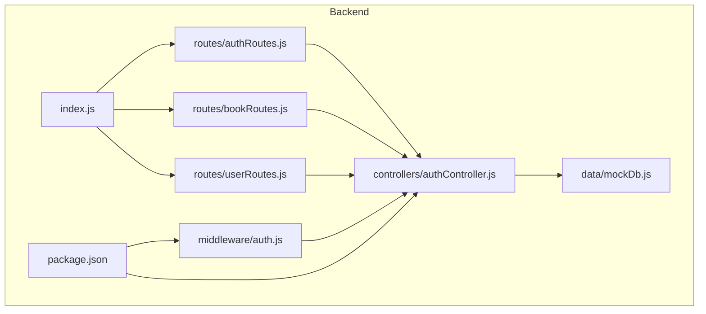
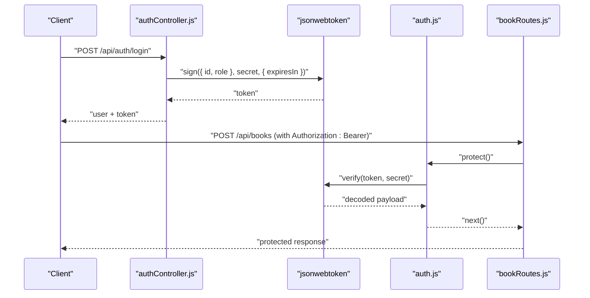
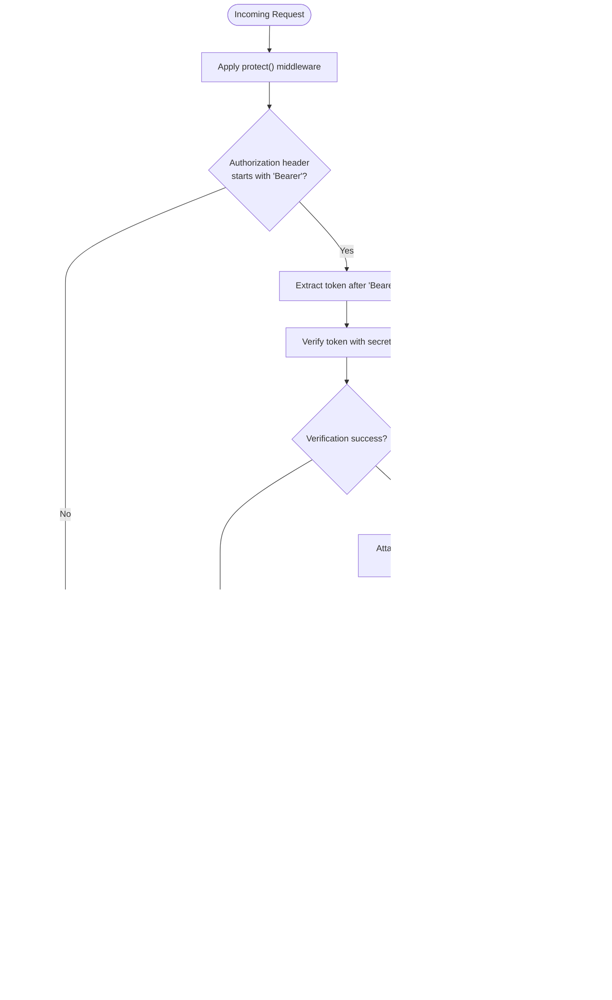
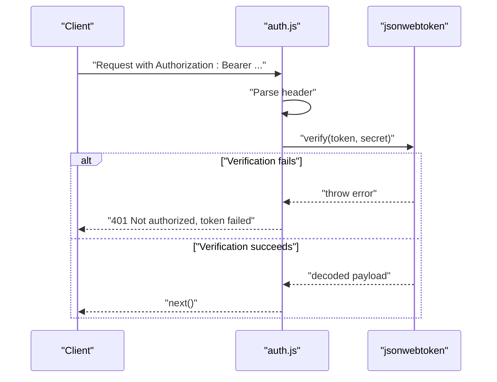
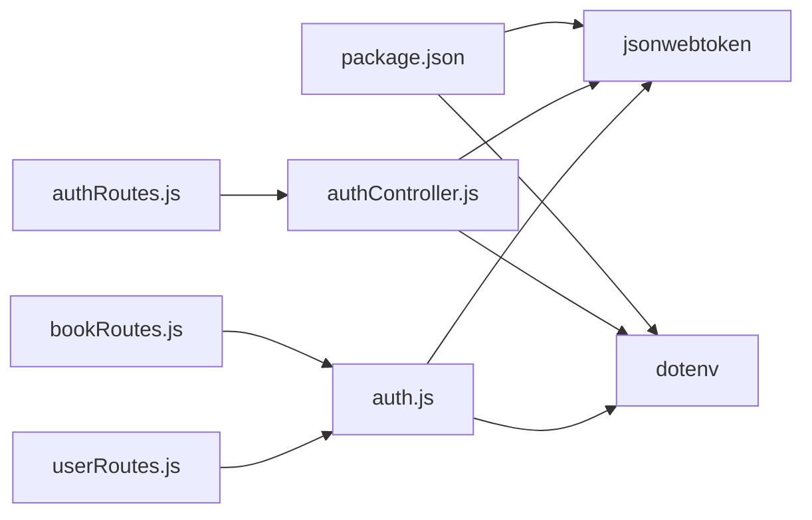

# JWT Authentication Implementation

<cite>
**Referenced Files in This Document**
- [backend/index.js](file://backend/index.js)
- [backend/package.json](file://backend/package.json)
- [backend/controllers/authController.js](file://backend/controllers/authController.js)
- [backend/middleware/auth.js](file://backend/middleware/auth.js)
- [backend/routes/authRoutes.js](file://backend/routes/authRoutes.js)
- [backend/routes/bookRoutes.js](file://backend/routes/bookRoutes.js)
- [backend/routes/userRoutes.js](file://backend/routes/userRoutes.js)
- [backend/data/mockDb.js](file://backend/data/mockDb.js)
</cite>

## Table of Contents
1. [Introduction](#introduction)
2. [Project Structure](#project-structure)
3. [Core Components](#core-components)
4. [Architecture Overview](#architecture-overview)
5. [Detailed Component Analysis](#detailed-component-analysis)
6. [Dependency Analysis](#dependency-analysis)
7. [Performance Considerations](#performance-considerations)
8. [Troubleshooting Guide](#troubleshooting-guide)
9. [Conclusion](#conclusion)

## Introduction
This document explains the JWT-based authentication implementation in ReadSphere. It covers token generation with the jsonwebtoken library, token verification and error handling, Bearer token parsing in middleware, and integration with protected routes. Practical examples show how tokens are created during login and registration, validated via middleware, and enforced on protected endpoints. Guidance is also provided for token expiration handling, refresh strategies, and security considerations.

## Project Structure
The authentication system spans three primary areas:
- Controllers: Token generation and user authentication logic
- Middleware: Request protection and admin enforcement
- Routes: Endpoint exposure with optional middleware guards

**Diagram sources**
- [backend/index.js:1-27](file://backend/index.js#L1-L27)
- [backend/package.json:1-24](file://backend/package.json#L1-L24)
- [backend/controllers/authController.js:1-90](file://backend/controllers/authController.js#L1-L90)
- [backend/middleware/auth.js:1-34](file://backend/middleware/auth.js#L1-L34)
- [backend/routes/authRoutes.js:1-11](file://backend/routes/authRoutes.js#L1-L11)
- [backend/routes/bookRoutes.js:1-10](file://backend/routes/bookRoutes.js#L1-L10)
- [backend/routes/userRoutes.js:1-11](file://backend/routes/userRoutes.js#L1-L11)
- [backend/data/mockDb.js:1-51](file://backend/data/mockDb.js#L1-L51)

**Section sources**
- [backend/index.js:1-27](file://backend/index.js#L1-L27)
- [backend/package.json:1-24](file://backend/package.json#L1-L24)

## Core Components
- Token generation controller: Creates signed JWTs with user id and role, configured for 30-day expiration
- Authentication middleware: Parses Authorization header, verifies JWT, attaches user payload to request
- Admin middleware: Enforces role-based access control for privileged endpoints
- Protected routes: Apply middleware to enforce authentication and/or admin privileges

Key behaviors:
- Payload structure: { id, role }
- Secret: Loaded from environment variable
- Expiration: 30 days
- Header parsing: Bearer token scheme
- Error handling: 401 responses for missing/no-token or invalid/expired tokens

**Section sources**
- [backend/controllers/authController.js:5-9](file://backend/controllers/authController.js#L5-L9)
- [backend/middleware/auth.js:3-23](file://backend/middleware/auth.js#L3-L23)
- [backend/middleware/auth.js:25-31](file://backend/middleware/auth.js#L25-L31)
- [backend/routes/authRoutes.js:6-8](file://backend/routes/authRoutes.js#L6-L8)
- [backend/routes/bookRoutes.js:6](file://backend/routes/bookRoutes.js#L6)
- [backend/routes/userRoutes.js:6-8](file://backend/routes/userRoutes.js#L6-L8)

## Architecture Overview
The authentication flow integrates controllers, middleware, and routes to secure endpoints.

**Diagram sources**
- [backend/controllers/authController.js:48-72](file://backend/controllers/authController.js#L48-L72)
- [backend/middleware/auth.js:3-23](file://backend/middleware/auth.js#L3-L23)
- [backend/routes/bookRoutes.js:6](file://backend/routes/bookRoutes.js#L6)

## Detailed Component Analysis

### Token Generation Controller
Responsibilities:
- Generate JWT with user id and role
- Configure token expiration to 30 days
- Return token alongside user data on successful registration/login

Implementation highlights:
- Uses jsonwebtoken.sign with a secret from environment
- Payload includes id and role
- Expiration set to 30 days

Practical usage:
- Registration endpoint returns token with user profile
- Login endpoint returns token with user profile

Security considerations:
- Ensure JWT_SECRET is strong and stored securely
- Consider rotating secrets periodically
- Avoid exposing tokens in logs or client-side storage insecurely

**Section sources**
- [backend/controllers/authController.js:5-9](file://backend/controllers/authController.js#L5-L9)
- [backend/controllers/authController.js:11-46](file://backend/controllers/authController.js#L11-L46)
- [backend/controllers/authController.js:48-72](file://backend/controllers/authController.js#L48-L72)

### Authentication Middleware
Responsibilities:
- Parse Authorization header for Bearer token
- Verify token against secret
- Attach decoded user payload (id, role) to request object
- Enforce admin-only access when required

Processing logic:
- Check Authorization header starts with "Bearer"
- Split header by space and extract token
- Verify token; on success attach decoded payload to req.user
- On failure, respond with 401

Admin enforcement:
- Validates that req.user exists and role equals "admin"

Error handling:
- 401 responses for missing token or verification failure
- Clear messages indicating lack of authorization

**Section sources**
- [backend/middleware/auth.js:3-23](file://backend/middleware/auth.js#L3-L23)
- [backend/middleware/auth.js:25-31](file://backend/middleware/auth.js#L25-L31)

### Protected Routes Integration
- Authentication guard: protect middleware applied to profile and user actions
- Admin guard: protect plus admin middleware applied to book creation

Examples:
- GET /api/auth/profile requires authentication
- POST /api/user/favorites requires authentication
- DELETE /api/user/favorites/:bookId requires authentication
- POST /api/user/bookmarks requires authentication
- POST /api/books requires authentication + admin role

**Diagram sources**
- [backend/middleware/auth.js:3-23](file://backend/middleware/auth.js#L3-L23)
- [backend/middleware/auth.js:25-31](file://backend/middleware/auth.js#L25-L31)
- [backend/routes/authRoutes.js:8](file://backend/routes/authRoutes.js#L8)
- [backend/routes/userRoutes.js:6-8](file://backend/routes/userRoutes.js#L6-L8)
- [backend/routes/bookRoutes.js:6](file://backend/routes/bookRoutes.js#L6)

**Section sources**
- [backend/routes/authRoutes.js:6-8](file://backend/routes/authRoutes.js#L6-L8)
- [backend/routes/userRoutes.js:6-8](file://backend/routes/userRoutes.js#L6-L8)
- [backend/routes/bookRoutes.js:6](file://backend/routes/bookRoutes.js#L6)

### Token Verification and Error Handling
Verification mechanism:
- Extract token from Authorization header
- Verify signature and claims using shared secret
- On success, attach decoded payload { id, role } to req.user

Error scenarios:
- Missing Authorization header: 401 with "no token"
- Malformed Authorization header: 401 with "token failed"
- Invalid/expired token: 401 with "token failed"
- Non-admin user on admin route: 401 with "not authorized as admin"

**Diagram sources**
- [backend/middleware/auth.js:3-23](file://backend/middleware/auth.js#L3-L23)

**Section sources**
- [backend/middleware/auth.js:3-23](file://backend/middleware/auth.js#L3-L23)

### Bearer Token Format and Header Parsing
- Expected header: Authorization: Bearer <token>
- Parsing steps:
  - Check presence and "Bearer" prefix
  - Split by space and take second element as token
  - Pass token to jwt.verify with secret

Common pitfalls:
- Missing "Bearer " prefix
- Extra spaces or malformed header
- Empty or missing Authorization header

**Section sources**
- [backend/middleware/auth.js:6-11](file://backend/middleware/auth.js#L6-L11)

### Token Expiration and Refresh Strategies
Current implementation:
- Tokens expire in 30 days

Recommended refresh strategies:
- Short-lived access tokens (e.g., 15–60 minutes) with long-lived refresh tokens
- On access token expiry, clients request a new access token using a valid refresh token
- Store refresh tokens securely (HttpOnly cookies) and rotate them regularly
- Implement refresh token revocation on logout and suspicious activity detection

[No sources needed since this section provides general guidance]

### Security Considerations
- Secret management: Use a strong, randomly generated JWT_SECRET; store in environment variables
- Transport security: Use HTTPS to prevent token interception
- Storage security: Avoid storing tokens in localStorage; prefer HttpOnly cookies for web apps
- Token scope: Keep payloads minimal; avoid sensitive data in JWTs
- Rotation and auditing: Rotate secrets periodically and monitor for misuse
- Validation: Validate all inputs and sanitize headers before processing

[No sources needed since this section provides general guidance]

## Dependency Analysis
External dependencies relevant to JWT:
- jsonwebtoken: Used for signing and verifying JWTs
- dotenv: Loads environment variables (including JWT_SECRET)

Internal dependencies:
- Controllers depend on jsonwebtoken and environment configuration
- Middleware depends on jsonwebtoken and environment configuration
- Routes depend on middleware for protection

**Diagram sources**
- [backend/package.json:13-18](file://backend/package.json#L13-L18)
- [backend/controllers/authController.js:1-3](file://backend/controllers/authController.js#L1-L3)
- [backend/middleware/auth.js:1](file://backend/middleware/auth.js#L1)
- [backend/routes/authRoutes.js:3-4](file://backend/routes/authRoutes.js#L3-L4)
- [backend/routes/bookRoutes.js:4](file://backend/routes/bookRoutes.js#L4)
- [backend/routes/userRoutes.js:3-4](file://backend/routes/userRoutes.js#L3-L4)

**Section sources**
- [backend/package.json:13-18](file://backend/package.json#L13-L18)
- [backend/controllers/authController.js:1-3](file://backend/controllers/authController.js#L1-L3)
- [backend/middleware/auth.js:1](file://backend/middleware/auth.js#L1)

## Performance Considerations
- Token verification cost: Minimal overhead; negligible compared to database queries
- Payload size: Keep payload small to reduce transmission and verification costs
- Caching: Consider caching verified user roles for repeated requests if needed
- Scaling: Stateless JWTs simplify horizontal scaling; ensure shared secret across instances

[No sources needed since this section provides general guidance]

## Troubleshooting Guide
Common issues and resolutions:
- 401 Not authorized, no token
  - Cause: Missing Authorization header or empty header
  - Fix: Include Authorization: Bearer <token> in all protected requests
- 401 Not authorized, token failed
  - Cause: Invalid/expired token or wrong secret
  - Fix: Regenerate token with correct secret; ensure token is not expired
- 401 Not authorized as an admin
  - Cause: Non-admin user attempting admin-only action
  - Fix: Authenticate as admin or use non-admin endpoints

Operational checks:
- Confirm JWT_SECRET is set and identical across instances
- Verify token expiration aligns with expectations
- Ensure routes apply protect and/or admin middleware as intended

**Section sources**
- [backend/middleware/auth.js:20-22](file://backend/middleware/auth.js#L20-L22)
- [backend/middleware/auth.js:15-17](file://backend/middleware/auth.js#L15-L17)
- [backend/middleware/auth.js:29](file://backend/middleware/auth.js#L29)

## Conclusion
ReadSphere’s JWT authentication provides a clean, stateless foundation for securing endpoints. The implementation signs tokens with user id and role, parses Bearer tokens in middleware, and enforces both authentication and admin privileges on protected routes. To harden the system, adopt short-lived access tokens with refresh tokens, secure storage, and robust secret management. These enhancements will improve resilience against token theft and support scalable, maintainable authentication at scale.