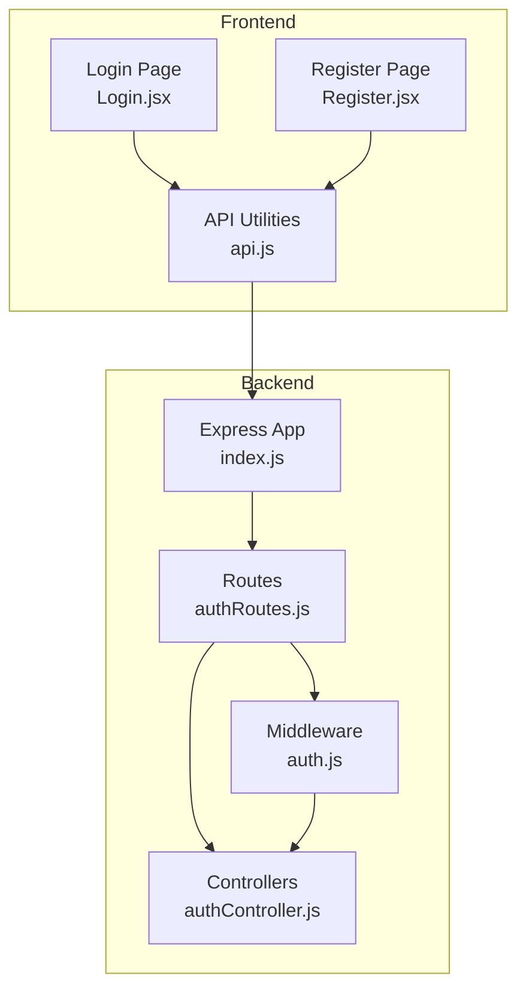
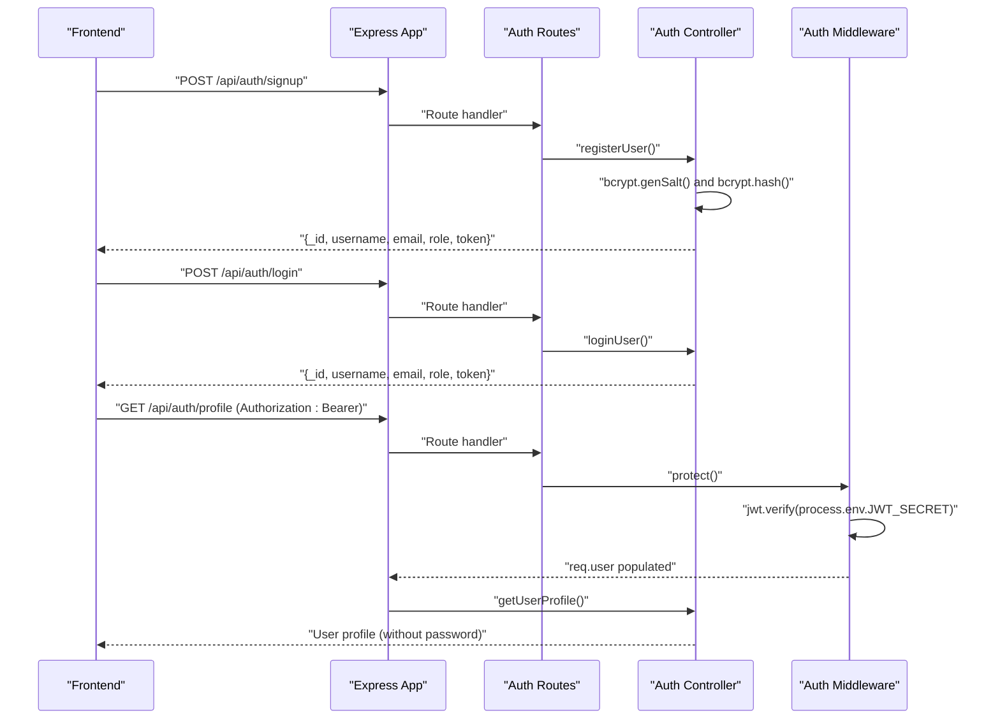
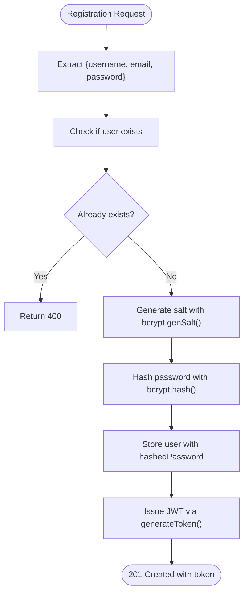
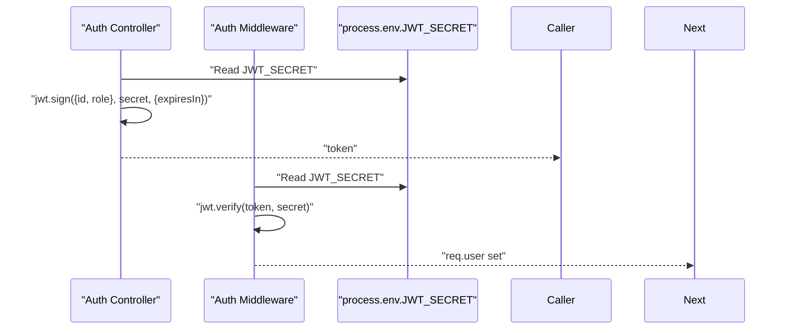
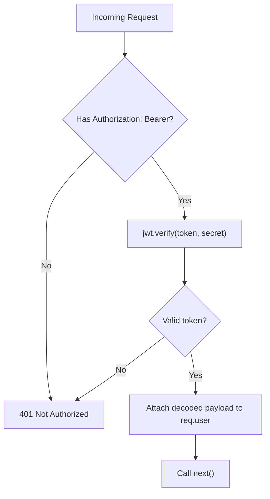
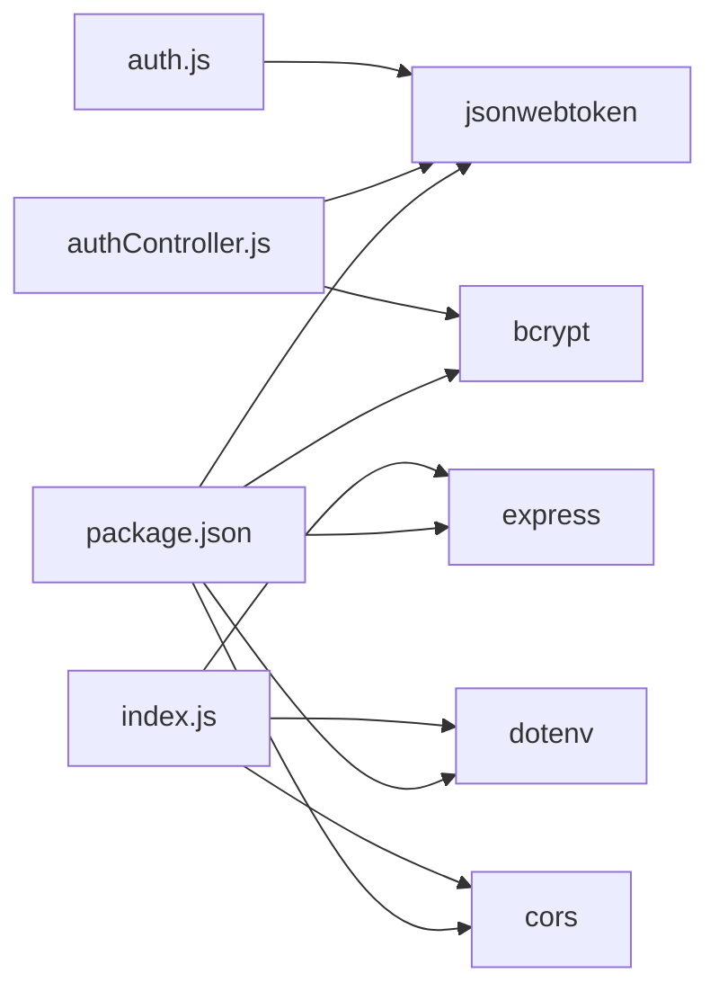

# Security Best Practices and Implementation

<cite>
**Referenced Files in This Document**
- [backend/controllers/authController.js](file://backend/controllers/authController.js)
- [backend/middleware/auth.js](file://backend/middleware/auth.js)
- [backend/routes/authRoutes.js](file://backend/routes/authRoutes.js)
- [backend/index.js](file://backend/index.js)
- [backend/package.json](file://backend/package.json)
- [frontend/src/pages/Login.jsx](file://frontend/src/pages/Login.jsx)
- [frontend/src/pages/Register.jsx](file://frontend/src/pages/Register.jsx)
- [frontend/src/services/api.js](file://frontend/src/services/api.js)
</cite>

## Table of Contents
1. [Introduction](#introduction)
2. [Project Structure](#project-structure)
3. [Core Components](#core-components)
4. [Architecture Overview](#architecture-overview)
5. [Detailed Component Analysis](#detailed-component-analysis)
6. [Dependency Analysis](#dependency-analysis)
7. [Performance Considerations](#performance-considerations)
8. [Troubleshooting Guide](#troubleshooting-guide)
9. [Conclusion](#conclusion)
10. [Appendices](#appendices)

## Introduction
This document provides comprehensive security guidance for the ReadSphere authentication system. It focuses on password hashing with bcrypt, secure token storage strategies, session management best practices, input validation, SQL injection prevention, XSS protection, logout and token invalidation, security headers, environment variable and JWT secret handling, production hardening, and mitigation strategies for CSRF and session hijacking. It also includes implementation checklists and security audit guidelines tailored to the current codebase.

## Project Structure
The authentication system spans a small Express backend and a React frontend. Authentication endpoints are exposed under /api/auth and protected via a middleware that validates JWTs. The frontend currently contains UI scaffolding for login and registration forms.

**Diagram sources**
- [backend/index.js:1-27](file://backend/index.js#L1-L27)
- [backend/routes/authRoutes.js:1-11](file://backend/routes/authRoutes.js#L1-L11)
- [backend/controllers/authController.js:1-90](file://backend/controllers/authController.js#L1-L90)
- [backend/middleware/auth.js:1-34](file://backend/middleware/auth.js#L1-L34)
- [frontend/src/pages/Login.jsx:1-84](file://frontend/src/pages/Login.jsx#L1-L84)
- [frontend/src/pages/Register.jsx:1-99](file://frontend/src/pages/Register.jsx#L1-L99)
- [frontend/src/services/api.js:1-308](file://frontend/src/services/api.js#L1-L308)

**Section sources**
- [backend/index.js:1-27](file://backend/index.js#L1-L27)
- [backend/routes/authRoutes.js:1-11](file://backend/routes/authRoutes.js#L1-L11)
- [backend/controllers/authController.js:1-90](file://backend/controllers/authController.js#L1-L90)
- [backend/middleware/auth.js:1-34](file://backend/middleware/auth.js#L1-L34)
- [frontend/src/pages/Login.jsx:1-84](file://frontend/src/pages/Login.jsx#L1-L84)
- [frontend/src/pages/Register.jsx:1-99](file://frontend/src/pages/Register.jsx#L1-L99)
- [frontend/src/services/api.js:1-308](file://frontend/src/services/api.js#L1-L308)

## Core Components
- Password hashing: bcrypt is used during registration to hash passwords before storing them in memory.
- Token generation and verification: JSON Web Tokens (JWT) are generated on successful login and validated by middleware using a shared secret.
- Protected routes: A middleware enforces bearer token validation for protected endpoints.
- Frontend form scaffolding: Login and Register pages capture credentials and usernames; actual submission logic is pending.

Security-relevant observations:
- Password hashing is implemented with bcrypt during registration.
- JWT secret is loaded from environment variables for signing and verification.
- No persistent session store or refresh token rotation is implemented in the current code.
- CORS is enabled broadly; production deployments should restrict origins.
- The frontend does not yet persist tokens securely or enforce logout.

**Section sources**
- [backend/controllers/authController.js:11-46](file://backend/controllers/authController.js#L11-L46)
- [backend/controllers/authController.js:48-72](file://backend/controllers/authController.js#L48-L72)
- [backend/controllers/authController.js:5-9](file://backend/controllers/authController.js#L5-L9)
- [backend/middleware/auth.js:3-23](file://backend/middleware/auth.js#L3-L23)
- [backend/middleware/auth.js:25-31](file://backend/middleware/auth.js#L25-L31)
- [backend/routes/authRoutes.js:6-8](file://backend/routes/authRoutes.js#L6-L8)
- [backend/index.js:8-9](file://backend/index.js#L8-L9)

## Architecture Overview
The authentication flow consists of signup, login, and profile retrieval. Requests are routed to controllers, which use bcrypt for hashing and JWT for tokens. Middleware verifies tokens for protected routes.

**Diagram sources**
- [backend/controllers/authController.js:11-46](file://backend/controllers/authController.js#L11-L46)
- [backend/controllers/authController.js:48-72](file://backend/controllers/authController.js#L48-L72)
- [backend/controllers/authController.js:74-87](file://backend/controllers/authController.js#L74-L87)
- [backend/middleware/auth.js:3-23](file://backend/middleware/auth.js#L3-L23)
- [backend/routes/authRoutes.js:6-8](file://backend/routes/authRoutes.js#L6-L8)
- [backend/index.js:12-15](file://backend/index.js#L12-L15)

## Detailed Component Analysis

### Password Hashing with bcrypt
- Registration hashes the plaintext password using bcrypt before storing the user record in memory.
- The hashing cost and salt are handled internally by bcrypt.

Security considerations:
- Ensure bcrypt is configured with a sufficiently high cost factor for production.
- Never log or expose hashed passwords.
- Validate password strength server-side before hashing.

**Diagram sources**
- [backend/controllers/authController.js:11-46](file://backend/controllers/authController.js#L11-L46)
- [backend/controllers/authController.js:5-9](file://backend/controllers/authController.js#L5-L9)

**Section sources**
- [backend/controllers/authController.js:11-46](file://backend/controllers/authController.js#L11-L46)
- [backend/package.json:14](file://backend/package.json#L14)

### JWT Token Generation and Validation
- Tokens are signed with a secret from environment variables and expire after a fixed period.
- The middleware extracts the Authorization header, splits the Bearer token, and verifies it against the same secret.

Security considerations:
- Use a strong, random JWT_SECRET in production.
- Enforce HTTPS in production to prevent token interception.
- Implement refresh token rotation and short-lived access tokens.
- Add token binding (e.g., IP or UA) and regular re-authentication for sensitive actions.

**Diagram sources**
- [backend/controllers/authController.js:5-9](file://backend/controllers/authController.js#L5-L9)
- [backend/middleware/auth.js:3-23](file://backend/middleware/auth.js#L3-L23)

**Section sources**
- [backend/controllers/authController.js:5-9](file://backend/controllers/authController.js#L5-L9)
- [backend/middleware/auth.js:3-23](file://backend/middleware/auth.js#L3-L23)

### Protected Routes and Admin Guard
- The protect middleware checks for a Bearer token and decodes it to attach user info to the request.
- An admin guard checks the user’s role for administrative endpoints.

Security considerations:
- Ensure all sensitive endpoints are protected.
- Implement least privilege and role-based access control.
- Consider adding rate limiting and IP allowlisting for admin endpoints.

**Diagram sources**
- [backend/middleware/auth.js:3-23](file://backend/middleware/auth.js#L3-L23)

**Section sources**
- [backend/middleware/auth.js:25-31](file://backend/middleware/auth.js#L25-L31)
- [backend/routes/authRoutes.js:8](file://backend/routes/authRoutes.js#L8)

### Frontend Authentication Pages
- Login and Register pages capture user input and log to console; actual submission is pending.
- No client-side token persistence or logout logic is present.

Security considerations:
- Do not log sensitive data in the browser console.
- Implement client-side input sanitization and validation.
- Persist tokens securely (HttpOnly cookies or secure storage) and enforce logout.

**Section sources**
- [frontend/src/pages/Login.jsx:9-13](file://frontend/src/pages/Login.jsx#L9-L13)
- [frontend/src/pages/Register.jsx:10-14](file://frontend/src/pages/Register.jsx#L10-L14)

### Input Validation, SQL Injection Prevention, and XSS Protection
Current state:
- The backend uses an in-memory mock database and does not interact with a SQL database.
- There is no explicit input validation or sanitization in the backend.
- The frontend does not sanitize or escape user-generated content.

Recommendations:
- Input validation: Validate and sanitize all request bodies and query parameters server-side.
- SQL injection: If a SQL database is introduced, use parameterized queries and ORM with strict typing.
- XSS: Escape HTML when rendering user-provided content; use Content-Security-Policy headers; avoid innerHTML.

**Section sources**
- [backend/controllers/authController.js:13-18](file://backend/controllers/authController.js#L13-L18)
- [backend/controllers/authController.js:50](file://backend/controllers/authController.js#L50)
- [frontend/src/pages/Login.jsx:30-71](file://frontend/src/pages/Login.jsx#L30-L71)
- [frontend/src/pages/Register.jsx:31-85](file://frontend/src/pages/Register.jsx#L31-L85)

### Logout Procedures and Token Invalidation
Current state:
- No logout endpoint or token invalidation mechanism exists.
- The frontend does not clear stored tokens.

Recommendations:
- Logout endpoint: Invalidate the current token by maintaining a server-side blacklist or short expiry with refresh rotation.
- Client-side: Clear tokens from storage on logout.
- Refresh tokens: Store refresh tokens securely and invalidate them server-side on logout.

**Section sources**
- [backend/routes/authRoutes.js:6-8](file://backend/routes/authRoutes.js#L6-L8)
- [frontend/src/pages/Login.jsx:9-13](file://frontend/src/pages/Login.jsx#L9-L13)
- [frontend/src/pages/Register.jsx:10-14](file://frontend/src/pages/Register.jsx#L10-L14)

### Security Headers Configuration
Current state:
- No explicit security headers are set in the backend.

Recommendations:
- Add security headers such as Strict-Transport-Security, X-Content-Type-Options, X-Frame-Options, Referrer-Policy, and Content-Security-Policy.
- Configure Helmet.js or similar middleware in Express.

**Section sources**
- [backend/index.js:8-9](file://backend/index.js#L8-L9)

### Environment Variable Management and JWT Secret Handling
Current state:
- JWT_SECRET is read from environment variables for signing and verification.
- dotenv is loaded at startup.

Recommendations:
- Store secrets in a secure secrets manager or environment provider.
- Rotate secrets periodically and revoke tokens after rotation.
- Restrict access to environment files and CI/CD secrets.

**Section sources**
- [backend/controllers/authController.js:6](file://backend/controllers/authController.js#L6)
- [backend/middleware/auth.js:12](file://backend/middleware/auth.js#L12)
- [backend/index.js:1](file://backend/index.js#L1)
- [backend/package.json:16](file://backend/package.json#L16)

### Production Security Hardening
- Transport security: Enforce HTTPS and HSTS.
- CORS policy: Limit origins and methods; avoid wildcard domains.
- Rate limiting: Apply per-IP and per-route limits.
- Audit logging: Log authentication events and failures.
- Dependency hygiene: Keep bcrypt, jsonwebtoken, and Express updated.

**Section sources**
- [backend/package.json:14-18](file://backend/package.json#L14-L18)
- [backend/index.js:8](file://backend/index.js#L8)

### CSRF and Session Hijacking Mitigation
- CSRF: Use SameSite cookies, Origin/Referer checks, and anti-CSRF tokens for state-changing requests.
- Session hijacking: Short token lifetimes, random secrets, secure flags, and logout invalidation.

**Section sources**
- [backend/controllers/authController.js:7](file://backend/controllers/authController.js#L7)
- [backend/middleware/auth.js:12](file://backend/middleware/auth.js#L12)

## Dependency Analysis
The authentication stack depends on Express, bcrypt, jsonwebtoken, dotenv, and cors. These libraries introduce security implications around hashing strength, token signing, environment loading, and cross-origin policies.

**Diagram sources**
- [backend/package.json:13-18](file://backend/package.json#L13-L18)
- [backend/controllers/authController.js:1-3](file://backend/controllers/authController.js#L1-L3)
- [backend/middleware/auth.js:1](file://backend/middleware/auth.js#L1)
- [backend/index.js:1-3](file://backend/index.js#L1-L3)

**Section sources**
- [backend/package.json:13-18](file://backend/package.json#L13-L18)
- [backend/controllers/authController.js:1-3](file://backend/controllers/authController.js#L1-L3)
- [backend/middleware/auth.js:1](file://backend/middleware/auth.js#L1)
- [backend/index.js:1-3](file://backend/index.js#L1-L3)

## Performance Considerations
- bcrypt cost: Increase cost carefully; measure impact on registration latency.
- Token lifetime: Shorter expirations reduce long-term risk but increase refresh frequency.
- Middleware overhead: Keep token verification lightweight; cache decoded claims if needed.

## Troubleshooting Guide
Common issues and remedies:
- 401 Not authorized, token failed: Verify JWT_SECRET correctness and token expiration.
- 401 No token: Ensure Authorization header is sent with Bearer token.
- 500 errors during registration/login: Check bcrypt availability and environment loading.

**Section sources**
- [backend/middleware/auth.js:15-17](file://backend/middleware/auth.js#L15-L17)
- [backend/middleware/auth.js:20-22](file://backend/middleware/auth.js#L20-L22)
- [backend/controllers/authController.js:43-45](file://backend/controllers/authController.js#L43-L45)
- [backend/controllers/authController.js:69-71](file://backend/controllers/authController.js#L69-L71)

## Conclusion
The current authentication implementation demonstrates bcrypt-based password hashing and JWT-based authorization. To achieve production-grade security, integrate secure token storage, implement logout and token invalidation, harden CORS and headers, enforce input validation, and adopt CSRF and session hijacking mitigations. Establish robust environment variable and secret management practices and maintain a continuous security audit process.

## Appendices

### Implementation Checklist
- [ ] Enforce HTTPS and HSTS
- [ ] Configure security headers (CSP, HSTS, X-Content-Type-Options, X-Frame-Options)
- [ ] Restrict CORS to trusted origins
- [ ] Implement rate limiting for auth endpoints
- [ ] Add input validation and sanitization
- [ ] Implement logout endpoint and token invalidation
- [ ] Use HttpOnly and Secure cookies for token storage (if applicable)
- [ ] Rotate JWT_SECRET and revoke tokens after rotation
- [ ] Add audit logs for authentication events
- [ ] Review bcrypt cost and update dependencies regularly

### Security Audit Guidelines
- Penetration testing: Test for CSRF, XSS, and brute-force resistance.
- Secret scanning: Scan repositories for exposed secrets.
- Dependency review: Audit bcrypt, jsonwebtoken, and Express for known vulnerabilities.
- Access control review: Confirm all endpoints are protected and roles are enforced.