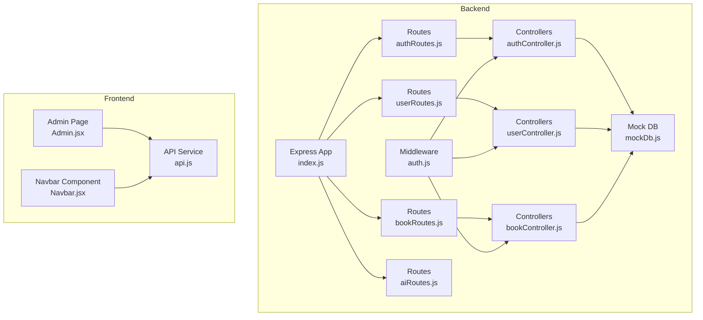
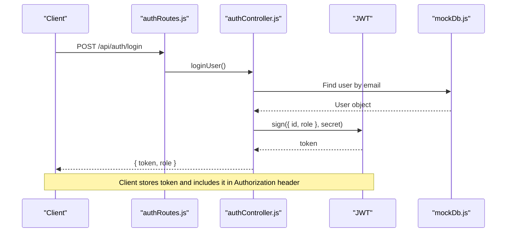
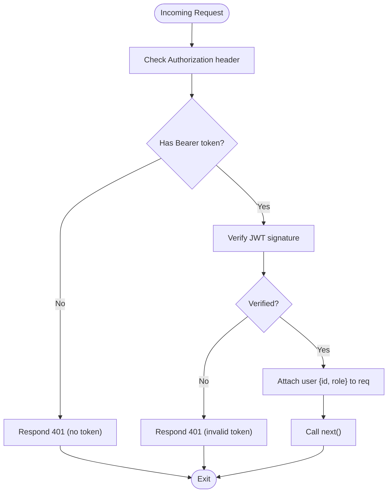
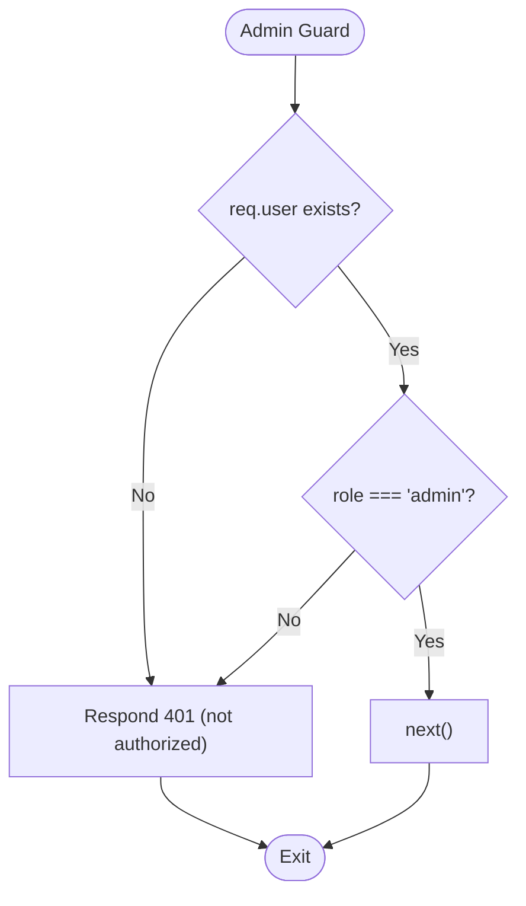
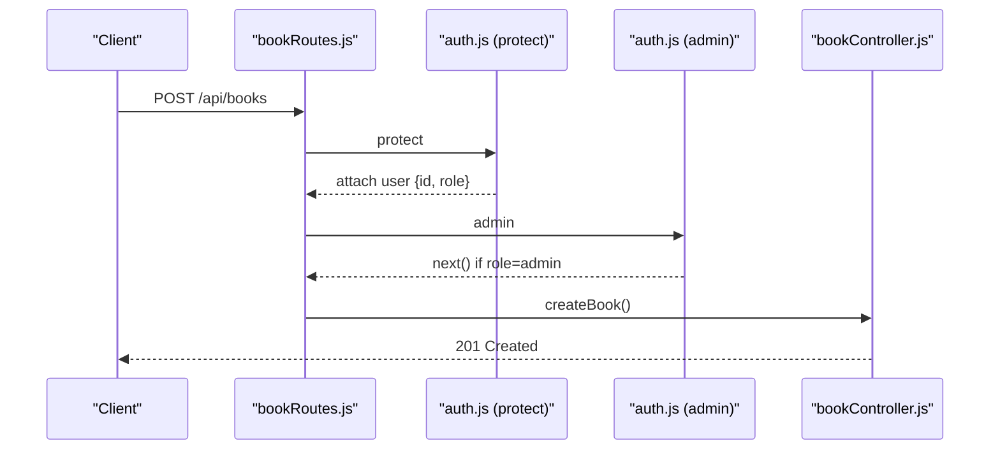
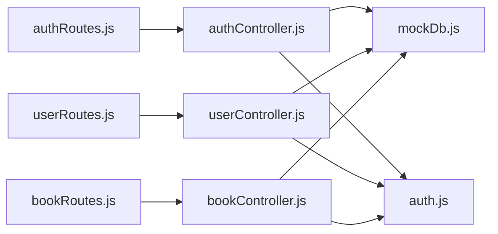

# User Roles and Permissions

<cite>
**Referenced Files in This Document**
- [auth.js](file://backend/middleware/auth.js)
- [mockDb.js](file://backend/data/mockDb.js)
- [authController.js](file://backend/controllers/authController.js)
- [userController.js](file://backend/controllers/userController.js)
- [bookController.js](file://backend/controllers/bookController.js)
- [authRoutes.js](file://backend/routes/authRoutes.js)
- [userRoutes.js](file://backend/routes/userRoutes.js)
- [bookRoutes.js](file://backend/routes/bookRoutes.js)
- [aiRoutes.js](file://backend/routes/aiRoutes.js)
- [index.js](file://backend/index.js)
- [Admin.jsx](file://frontend/src/pages/Admin.jsx)
- [Navbar.jsx](file://frontend/components/Navbar.jsx)
- [api.js](file://frontend/src/services/api.js)
</cite>

## Table of Contents
1. [Introduction](#introduction)
2. [Project Structure](#project-structure)
3. [Core Components](#core-components)
4. [Architecture Overview](#architecture-overview)
5. [Detailed Component Analysis](#detailed-component-analysis)
6. [Dependency Analysis](#dependency-analysis)
7. [Performance Considerations](#performance-considerations)
8. [Troubleshooting Guide](#troubleshooting-guide)
9. [Conclusion](#conclusion)
10. [Appendices](#appendices)

## Introduction
This document explains the user role-based access control (RBAC) system implemented in the backend and how it integrates with the frontend. The system defines two primary roles: user and admin. Roles are carried in JWT tokens, verified by middleware, and enforced at route level. Admin-only operations are protected by an additional admin guard. The mock database stores user records with a role field, and the frontend renders role-aware UI elements accordingly.

## Project Structure
The RBAC system spans backend middleware, controllers, routes, and a mock database, plus frontend pages and components that render role-aware views.

**Diagram sources**
- [index.js:11-15](file://backend/index.js#L11-L15)
- [authRoutes.js:1-11](file://backend/routes/authRoutes.js#L1-L11)
- [bookRoutes.js:1-10](file://backend/routes/bookRoutes.js#L1-L10)
- [userRoutes.js:1-11](file://backend/routes/userRoutes.js#L1-L11)
- [aiRoutes.js:1-10](file://backend/routes/aiRoutes.js#L1-L10)
- [authController.js:1-90](file://backend/controllers/authController.js#L1-L90)
- [userController.js:1-42](file://backend/controllers/userController.js#L1-L42)
- [bookController.js:1-69](file://backend/controllers/bookController.js#L1-L69)
- [auth.js:1-34](file://backend/middleware/auth.js#L1-L34)
- [mockDb.js:1-51](file://backend/data/mockDb.js#L1-L51)
- [Admin.jsx:1-174](file://frontend/src/pages/Admin.jsx#L1-L174)
- [Navbar.jsx:1-56](file://frontend/components/Navbar.jsx#L1-L56)
- [api.js:1-295](file://frontend/src/services/api.js#L1-L295)

**Section sources**
- [index.js:11-15](file://backend/index.js#L11-L15)
- [auth.js:1-34](file://backend/middleware/auth.js#L1-L34)
- [mockDb.js:1-51](file://backend/data/mockDb.js#L1-L51)

## Core Components
- Role model: Two roles exist—user and admin. Roles are stored per user record in the mock database.
- Authentication middleware: Decodes JWT and attaches user info (including role) to the request.
- Admin middleware: Enforces admin-only access by checking the role field.
- Protected routes: Certain endpoints require both authentication and admin privileges.
- Frontend role-aware UI: Admin page displays user roles and actions; navigation adapts to logged-in state.

Key implementation references:
- Role storage and initial users: [mockDb.js:2-5](file://backend/data/mockDb.js#L2-L5)
- JWT payload includes role: [authController.js:5-9](file://backend/controllers/authController.js#L5-L9)
- Token verification attaches user with role: [auth.js:12-13](file://backend/middleware/auth.js#L12-L13)
- Admin guard checks role: [auth.js:25-31](file://backend/middleware/auth.js#L25-L31)
- Admin-protected route: [bookRoutes.js:6](file://backend/routes/bookRoutes.js#L6)
- User-protected routes: [userRoutes.js:6-8](file://backend/routes/userRoutes.js#L6-L8)
- Frontend role display: [Admin.jsx:10-13](file://frontend/src/pages/Admin.jsx#L10-L13)

**Section sources**
- [mockDb.js:2-5](file://backend/data/mockDb.js#L2-L5)
- [authController.js:5-9](file://backend/controllers/authController.js#L5-L9)
- [auth.js:12-13](file://backend/middleware/auth.js#L12-L13)
- [auth.js:25-31](file://backend/middleware/auth.js#L25-L31)
- [bookRoutes.js:6](file://backend/routes/bookRoutes.js#L6)
- [userRoutes.js:6-8](file://backend/routes/userRoutes.js#L6-L8)
- [Admin.jsx:10-13](file://frontend/src/pages/Admin.jsx#L10-L13)

## Architecture Overview
The RBAC architecture enforces role-based access at the API boundary:
- Authentication middleware verifies JWT and injects user identity.
- Admin middleware restricts access to administrative operations.
- Controllers operate on the mock database and return data to clients.
- Frontend pages conditionally render UI elements based on available data and user context.

**Diagram sources**
- [authRoutes.js:6-8](file://backend/routes/authRoutes.js#L6-L8)
- [authController.js:48-72](file://backend/controllers/authController.js#L48-L72)
- [mockDb.js:2-5](file://backend/data/mockDb.js#L2-L5)

## Detailed Component Analysis

### Role Model and Storage
- Roles are represented as strings with two values: user and admin.
- Stored per user in the mock database alongside other fields.
- Initial dataset includes one admin and one regular user.

References:
- [mockDb.js:2-5](file://backend/data/mockDb.js#L2-L5)

**Section sources**
- [mockDb.js:2-5](file://backend/data/mockDb.js#L2-L5)

### Authentication Middleware
- Extracts Bearer token from Authorization header.
- Verifies token against the configured secret.
- On success, attaches decoded user object (containing id and role) to the request.
- On failure, responds with 401.

References:
- [auth.js:3-23](file://backend/middleware/auth.js#L3-L23)

**Diagram sources**
- [auth.js:3-23](file://backend/middleware/auth.js#L3-L23)

**Section sources**
- [auth.js:3-23](file://backend/middleware/auth.js#L3-L23)

### Admin Middleware
- Checks that the request has a user object and that the role equals admin.
- Allows passage if conditions are met; otherwise responds with 401.

References:
- [auth.js:25-31](file://backend/middleware/auth.js#L25-L31)

**Diagram sources**
- [auth.js:25-31](file://backend/middleware/auth.js#L25-L31)

**Section sources**
- [auth.js:25-31](file://backend/middleware/auth.js#L25-L31)

### Protected Routes and Operations
- User-protected routes:
  - Favorites management: POST /api/users/favorites and DELETE /api/users/favorites/:bookId
  - Bookmark creation: POST /api/users/bookmarks
  - These routes are protected by the authentication middleware.
- Admin-protected routes:
  - Book creation: POST /api/books (requires both authentication and admin role)
  - Other book endpoints (listing and detail) are open to authenticated users.

References:
- [userRoutes.js:6-8](file://backend/routes/userRoutes.js#L6-L8)
- [bookRoutes.js:6](file://backend/routes/bookRoutes.js#L6)

**Diagram sources**
- [bookRoutes.js:6](file://backend/routes/bookRoutes.js#L6)
- [auth.js:25-31](file://backend/middleware/auth.js#L25-L31)
- [bookController.js:46-66](file://backend/controllers/bookController.js#L46-L66)

**Section sources**
- [userRoutes.js:6-8](file://backend/routes/userRoutes.js#L6-L8)
- [bookRoutes.js:6](file://backend/routes/bookRoutes.js#L6)
- [bookController.js:46-66](file://backend/controllers/bookController.js#L46-L66)

### Role Checking Logic and Permission Enforcement Patterns
- Pattern 1: Authentication-only endpoints use the protect middleware to ensure a valid session.
  - Example: user favorites and bookmarks endpoints.
- Pattern 2: Admin-only endpoints use both protect and admin middleware.
  - Example: book creation endpoint.
- Pattern 3: Frontend role-aware rendering uses role data present in the UI state.
  - Example: Admin page displays user roles and action buttons.

References:
- [userRoutes.js:6-8](file://backend/routes/userRoutes.js#L6-L8)
- [bookRoutes.js:6](file://backend/routes/bookRoutes.js#L6)
- [Admin.jsx:10-13](file://frontend/src/pages/Admin.jsx#L10-L13)

**Section sources**
- [userRoutes.js:6-8](file://backend/routes/userRoutes.js#L6-L8)
- [bookRoutes.js:6](file://backend/routes/bookRoutes.js#L6)
- [Admin.jsx:10-13](file://frontend/src/pages/Admin.jsx#L10-L13)

### Integration with Frontend Role-Based UI Rendering
- Admin page displays a table of users with a role column.
- Role values are shown with distinct visual styles for Admin vs User.
- Navigation bar remains static in the provided snippet; role-aware navigation would typically be handled by storing user context after login and conditionally rendering links.

References:
- [Admin.jsx:10-13](file://frontend/src/pages/Admin.jsx#L10-L13)
- [Admin.jsx:113-154](file://frontend/src/pages/Admin.jsx#L113-L154)
- [Navbar.jsx:1-56](file://frontend/components/Navbar.jsx#L1-L56)

**Section sources**
- [Admin.jsx:10-13](file://frontend/src/pages/Admin.jsx#L10-L13)
- [Admin.jsx:113-154](file://frontend/src/pages/Admin.jsx#L113-L154)
- [Navbar.jsx:1-56](file://frontend/components/Navbar.jsx#L1-L56)

### User Registration Role Assignment
- During registration, a new user is created with role set to user by default.
- The JWT issued upon successful registration carries this role.

References:
- [authController.js:23-31](file://backend/controllers/authController.js#L23-L31)
- [authController.js:5-9](file://backend/controllers/authController.js#L5-L9)

**Section sources**
- [authController.js:23-31](file://backend/controllers/authController.js#L23-L31)
- [authController.js:5-9](file://backend/controllers/authController.js#L5-L9)

### Role Modification Procedures
- Current implementation does not expose endpoints to modify user roles.
- To add role modification:
  - Define an admin-protected route to update a user’s role.
  - Implement a controller method that validates inputs and updates the mock database.
  - Ensure the change is persisted in memory and reflected in subsequent requests.

References:
- [bookRoutes.js:6](file://backend/routes/bookRoutes.js#L6)
- [mockDb.js:2-5](file://backend/data/mockDb.js#L2-L5)

**Section sources**
- [bookRoutes.js:6](file://backend/routes/bookRoutes.js#L6)
- [mockDb.js:2-5](file://backend/data/mockDb.js#L2-L5)

### Security Implications of Permission Levels
- user: Can manage personal preferences (favorites, bookmarks) and access AI recommendations.
- admin: Can create new books, effectively modifying shared catalog data.
- Risk mitigation strategies:
  - Keep JWT secret secure and rotate periodically.
  - Validate and sanitize all inputs.
  - Limit token expiration and refresh mechanisms.
  - Add audit logs for admin actions.

[No sources needed since this section provides general guidance]

## Dependency Analysis
The RBAC system exhibits clear separation of concerns:
- Routes depend on controllers.
- Controllers depend on the mock database.
- Middleware depends on JWT configuration and environment variables.
- Frontend pages consume data exposed by backend APIs.

**Diagram sources**
- [authRoutes.js:1-11](file://backend/routes/authRoutes.js#L1-L11)
- [userRoutes.js:1-11](file://backend/routes/userRoutes.js#L1-L11)
- [bookRoutes.js:1-10](file://backend/routes/bookRoutes.js#L1-L10)
- [authController.js:1-90](file://backend/controllers/authController.js#L1-L90)
- [userController.js:1-42](file://backend/controllers/userController.js#L1-L42)
- [bookController.js:1-69](file://backend/controllers/bookController.js#L1-L69)
- [mockDb.js:1-51](file://backend/data/mockDb.js#L1-L51)
- [auth.js:1-34](file://backend/middleware/auth.js#L1-L34)

**Section sources**
- [authRoutes.js:1-11](file://backend/routes/authRoutes.js#L1-L11)
- [userRoutes.js:1-11](file://backend/routes/userRoutes.js#L1-L11)
- [bookRoutes.js:1-10](file://backend/routes/bookRoutes.js#L1-L10)
- [authController.js:1-90](file://backend/controllers/authController.js#L1-L90)
- [userController.js:1-42](file://backend/controllers/userController.js#L1-L42)
- [bookController.js:1-69](file://backend/controllers/bookController.js#L1-L69)
- [mockDb.js:1-51](file://backend/data/mockDb.js#L1-L51)
- [auth.js:1-34](file://backend/middleware/auth.js#L1-L34)

## Performance Considerations
- Token verification occurs on every protected request; keep JWT secret strong and avoid unnecessary re-issuance.
- In-memory mock database is fast but not persistent; consider indexing strategies if scaling to larger datasets.
- Minimize payload size in JWT claims to reduce bandwidth and parsing overhead.

[No sources needed since this section provides general guidance]

## Troubleshooting Guide
Common issues and resolutions:
- 401 Not authorized, token failed: Verify JWT secret and token format; ensure client sends Authorization: Bearer <token>.
- 401 Not authorized as an admin: Confirm the user’s role is admin; admin-protected routes enforce role equality.
- No token provided: Ensure the client includes the Authorization header on protected routes.

References:
- [auth.js:15-22](file://backend/middleware/auth.js#L15-L22)
- [auth.js:28-30](file://backend/middleware/auth.js#L28-L30)

**Section sources**
- [auth.js:15-22](file://backend/middleware/auth.js#L15-L22)
- [auth.js:28-30](file://backend/middleware/auth.js#L28-L30)

## Conclusion
The RBAC system uses a minimal, clear design: roles are stored with users, verified via JWT middleware, and enforced at the route level. Admin-only operations are protected by an explicit admin guard. The frontend integrates role awareness primarily in administrative views. Extending the system to support additional roles or more complex permission hierarchies involves adding guards and updating controllers while preserving the current middleware pattern.

[No sources needed since this section summarizes without analyzing specific files]

## Appendices

### Role and Permission Matrix
- user
  - Can access: user favorites, user bookmarks, AI recommendations
  - Cannot access: admin-protected operations (e.g., create book)
- admin
  - Can access: all user operations plus admin-protected operations

References:
- [userRoutes.js:6-8](file://backend/routes/userRoutes.js#L6-L8)
- [bookRoutes.js:6](file://backend/routes/bookRoutes.js#L6)

**Section sources**
- [userRoutes.js:6-8](file://backend/routes/userRoutes.js#L6-L8)
- [bookRoutes.js:6](file://backend/routes/bookRoutes.js#L6)