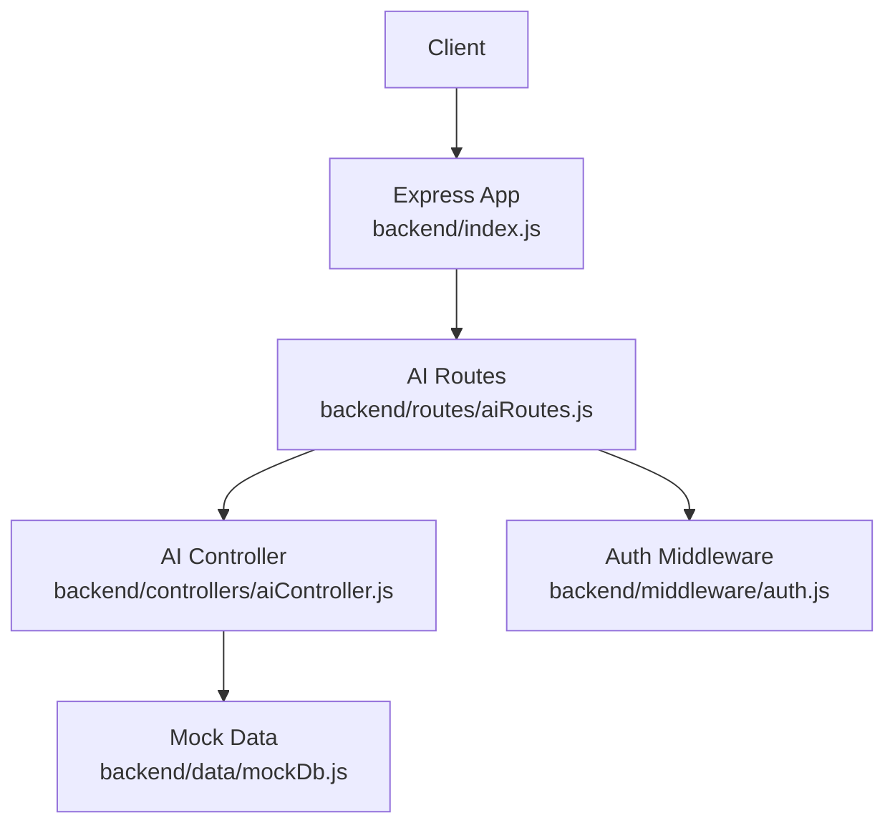
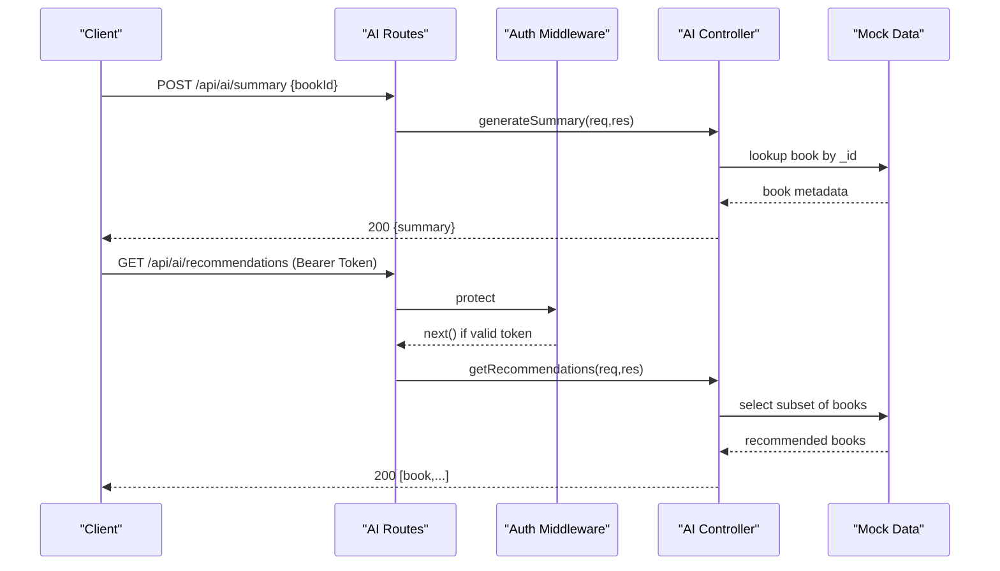
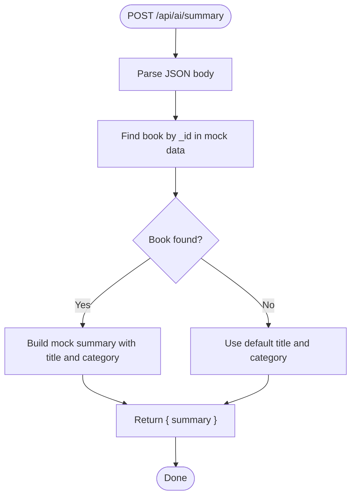
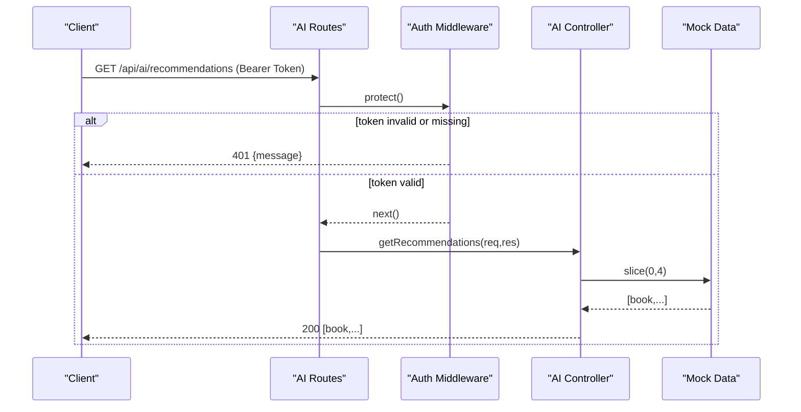
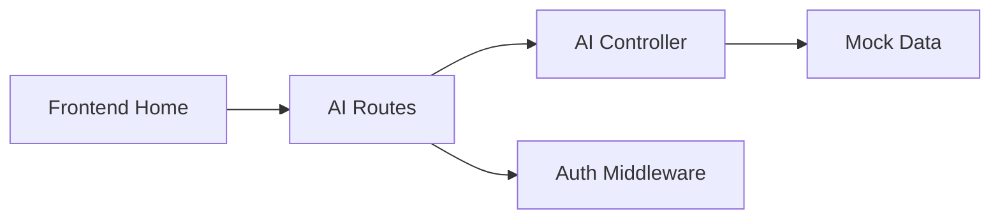

# AI Features API

<cite>
**Referenced Files in This Document**
- [index.js](file://backend/index.js)
- [aiRoutes.js](file://backend/routes/aiRoutes.js)
- [aiController.js](file://backend/controllers/aiController.js)
- [auth.js](file://backend/middleware/auth.js)
- [mockDb.js](file://backend/data/mockDb.js)
- [Home.jsx](file://frontend/src/pages/Home.jsx)
</cite>

## Table of Contents
1. [Introduction](#introduction)
2. [Project Structure](#project-structure)
3. [Core Components](#core-components)
4. [Architecture Overview](#architecture-overview)
5. [Detailed Component Analysis](#detailed-component-analysis)
6. [Dependency Analysis](#dependency-analysis)
7. [Performance Considerations](#performance-considerations)
8. [Troubleshooting Guide](#troubleshooting-guide)
9. [Conclusion](#conclusion)

## Introduction
This document describes ReadSphere’s AI-powered features API endpoints currently implemented in the backend. It focuses on:
- Smart summary generation endpoint for a given book identifier
- Personalized recommendations endpoint for authenticated users
It also documents the current mock implementation, placeholder responses, integration patterns for future AI service integration, request validation, error handling, fallback mechanisms, and performance considerations.

## Project Structure
The AI features are exposed under the base route /api/ai and are composed of:
- A route definition that registers two endpoints
- A controller that implements the business logic using mock data
- A middleware that enforces authentication for recommendations
- Mock data used to simulate book metadata and categories

**Diagram sources**
- [index.js:12-15](file://backend/index.js#L12-L15)
- [aiRoutes.js:1-9](file://backend/routes/aiRoutes.js#L1-L9)
- [aiController.js:1-26](file://backend/controllers/aiController.js#L1-L26)
- [mockDb.js:1-51](file://backend/data/mockDb.js#L1-L51)
- [auth.js:1-34](file://backend/middleware/auth.js#L1-L34)

**Section sources**
- [index.js:12-15](file://backend/index.js#L12-L15)
- [aiRoutes.js:1-9](file://backend/routes/aiRoutes.js#L1-L9)

## Core Components
- Smart Summary Endpoint: POST /api/ai/summary
  - Purpose: Returns a mock AI-generated summary for a given book identifier.
  - Request: JSON body containing bookId.
  - Response: JSON object with a summary field.
  - Validation: None performed on the request body.
  - Error Handling: Returns 500 with a generic message on failure.
- Personalized Recommendations Endpoint: GET /api/ai/recommendations
  - Purpose: Returns a small set of recommended books for authenticated users.
  - Authentication: Requires a valid JWT Bearer token.
  - Response: JSON array of book objects (subset of mock books).
  - Validation: None performed on query parameters.
  - Error Handling: Returns 500 with a generic message on failure.

**Section sources**
- [aiController.js:3-14](file://backend/controllers/aiController.js#L3-L14)
- [aiController.js:16-24](file://backend/controllers/aiController.js#L16-L24)
- [aiRoutes.js:6-7](file://backend/routes/aiRoutes.js#L6-L7)
- [auth.js:3-23](file://backend/middleware/auth.js#L3-L23)

## Architecture Overview
The AI endpoints follow a layered architecture:
- Routes define the HTTP interface
- Middleware enforces authentication for recommendations
- Controller encapsulates the logic and interacts with mock data
- Frontend surfaces AI features in the home page copy

**Diagram sources**
- [aiRoutes.js:6-7](file://backend/routes/aiRoutes.js#L6-L7)
- [auth.js:3-23](file://backend/middleware/auth.js#L3-L23)
- [aiController.js:3-14](file://backend/controllers/aiController.js#L3-L14)
- [aiController.js:16-24](file://backend/controllers/aiController.js#L16-L24)
- [mockDb.js:7-42](file://backend/data/mockDb.js#L7-L42)

## Detailed Component Analysis

### Smart Summary Endpoint
- Endpoint: POST /api/ai/summary
- Request Body
  - bookId: string (required)
- Response
  - summary: string (AI-generated summary text)
- Behavior
  - Looks up the book by _id in mock data; if not found, defaults to a generic title/category.
  - Constructs a deterministic mock summary string incorporating the book title and category.
  - Returns the summary in a JSON envelope.
- Error Handling
  - Catches exceptions and returns 500 with a generic message.
- Validation
  - No explicit validation of the request body shape or presence of bookId is performed in the current implementation.

**Diagram sources**
- [aiController.js:3-14](file://backend/controllers/aiController.js#L3-L14)
- [mockDb.js:7-42](file://backend/data/mockDb.js#L7-L42)

**Section sources**
- [aiController.js:3-14](file://backend/controllers/aiController.js#L3-L14)
- [mockDb.js:7-42](file://backend/data/mockDb.js#L7-L42)

### Personalized Recommendations Endpoint
- Endpoint: GET /api/ai/recommendations
- Authentication
  - Requires Authorization: Bearer <token>
  - Protected by the auth middleware
- Response
  - Returns an array of book objects (first four entries from mock data)
- Behavior
  - Returns a fixed subset of books from mock data
  - Does not incorporate user preferences or history
- Error Handling
  - Catches exceptions and returns 500 with a generic message

**Diagram sources**
- [aiRoutes.js:7](file://backend/routes/aiRoutes.js#L7)
- [auth.js:3-23](file://backend/middleware/auth.js#L3-L23)
- [aiController.js:16-24](file://backend/controllers/aiController.js#L16-L24)
- [mockDb.js:7-42](file://backend/data/mockDb.js#L7-L42)

**Section sources**
- [aiRoutes.js:7](file://backend/routes/aiRoutes.js#L7)
- [auth.js:3-23](file://backend/middleware/auth.js#L3-L23)
- [aiController.js:16-24](file://backend/controllers/aiController.js#L16-L24)
- [mockDb.js:7-42](file://backend/data/mockDb.js#L7-L42)

### Frontend Integration Notes
- The frontend highlights AI-powered reading features in the home page, including “Smart Summaries,” “Key Insights,” and “Personalized Picks.”
- These visuals indicate planned integration points for the backend AI endpoints.

**Section sources**
- [Home.jsx:431-437](file://frontend/src/pages/Home.jsx#L431-L437)
- [Home.jsx:440-444](file://frontend/src/pages/Home.jsx#L440-L444)
- [Home.jsx:458-472](file://frontend/src/pages/Home.jsx#L458-L472)

## Dependency Analysis
- Route to Controller
  - POST /api/ai/summary -> generateSummary
  - GET /api/ai/recommendations -> getRecommendations
- Controller to Data
  - Uses MOCK_BOOKS for book metadata
- Controller to Middleware
  - Recommendations endpoint depends on protect middleware for authentication
- Frontend to Backend
  - Home page copy indicates intent to surface AI features

**Diagram sources**
- [aiRoutes.js:1-9](file://backend/routes/aiRoutes.js#L1-L9)
- [aiController.js:1-26](file://backend/controllers/aiController.js#L1-L26)
- [mockDb.js:7-42](file://backend/data/mockDb.js#L7-L42)
- [auth.js:1-34](file://backend/middleware/auth.js#L1-L34)
- [Home.jsx:431-437](file://frontend/src/pages/Home.jsx#L431-L437)

**Section sources**
- [aiRoutes.js:1-9](file://backend/routes/aiRoutes.js#L1-L9)
- [aiController.js:1-26](file://backend/controllers/aiController.js#L1-L26)
- [mockDb.js:7-42](file://backend/data/mockDb.js#L7-L42)
- [auth.js:1-34](file://backend/middleware/auth.js#L1-L34)
- [Home.jsx:431-437](file://frontend/src/pages/Home.jsx#L431-L437)

## Performance Considerations
- Current Implementation
  - Both endpoints perform in-memory lookups/slicing over a small mock dataset; latency is negligible.
- Recommendations
  - The recommendations endpoint returns a fixed subset of books without user preference computation.
- Future AI Service Integration
  - Introduce request/response timeouts and circuit breakers around external AI services.
  - Add caching for repeated summaries and recommendations to reduce latency and cost.
  - Implement pagination for recommendations when scaling beyond mock data.
  - Apply rate limiting per client or per user to prevent abuse.
  - Consider asynchronous processing for long-running AI tasks with polling or webhooks.

## Troubleshooting Guide
- Authentication Failures (Recommendations)
  - Symptom: 401 Not authorized, no token or token failed
  - Cause: Missing or invalid Bearer token
  - Resolution: Ensure Authorization header includes a valid JWT
- Summary Generation Errors
  - Symptom: 500 Error generating summary
  - Cause: Exception thrown in controller
  - Resolution: Verify controller logic and ensure mock data availability
- Recommendations Errors
  - Symptom: 500 Error getting recommendations
  - Cause: Exception thrown in controller
  - Resolution: Verify controller logic and ensure mock data availability
- Request Validation
  - Current implementation does not validate the presence or type of bookId in the summary request body. Consider adding validation to return 400 for malformed requests.

**Section sources**
- [auth.js:15-22](file://backend/middleware/auth.js#L15-L22)
- [aiController.js:11-13](file://backend/controllers/aiController.js#L11-L13)
- [aiController.js:21-23](file://backend/controllers/aiController.js#L21-L23)

## Conclusion
The AI features API currently exposes two endpoints backed by mock data:
- POST /api/ai/summary returns a deterministic summary for a given book identifier
- GET /api/ai/recommendations returns a static subset of books and requires authentication

To evolve toward production-grade AI services:
- Integrate with an external AI provider while preserving the existing endpoint signatures
- Add robust request validation, rate limiting, and error handling
- Implement caching, timeouts, and fallbacks
- Expand recommendations to incorporate user preferences and reading history