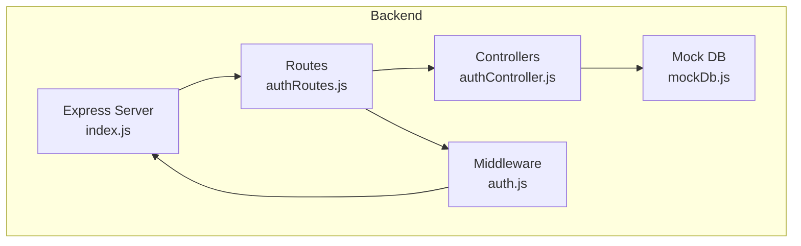
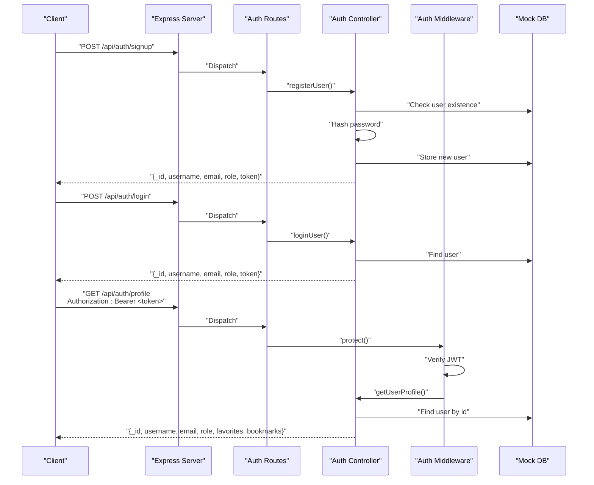
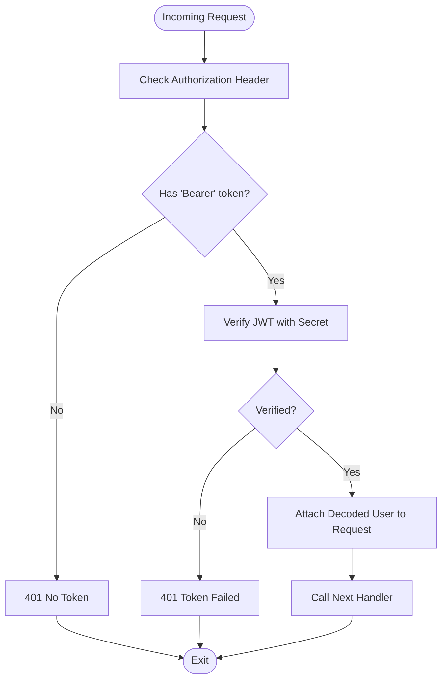
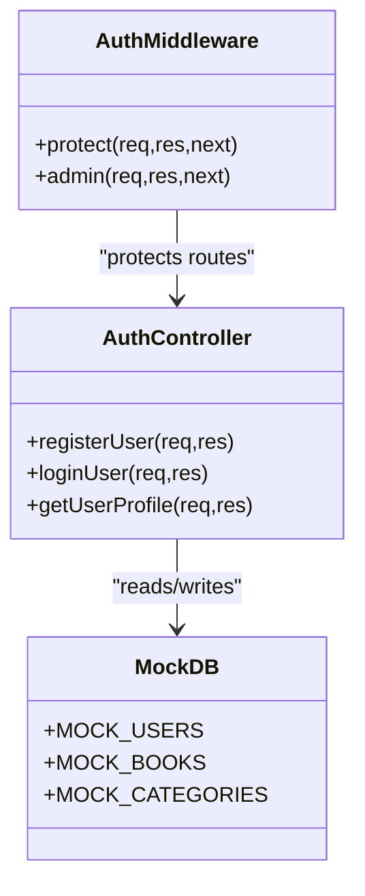
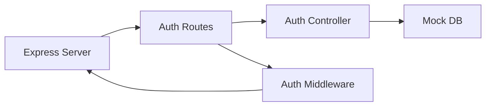

# Authentication API

<cite>
**Referenced Files in This Document**
- [backend/index.js](file://backend/index.js)
- [backend/package.json](file://backend/package.json)
- [backend/routes/authRoutes.js](file://backend/routes/authRoutes.js)
- [backend/controllers/authController.js](file://backend/controllers/authController.js)
- [backend/middleware/auth.js](file://backend/middleware/auth.js)
- [backend/data/mockDb.js](file://backend/data/mockDb.js)
- [frontend/src/pages/Login.jsx](file://frontend/src/pages/Login.jsx)
- [frontend/src/pages/Register.jsx](file://frontend/src/pages/Register.jsx)
</cite>

## Table of Contents
1. [Introduction](#introduction)
2. [Project Structure](#project-structure)
3. [Core Components](#core-components)
4. [Architecture Overview](#architecture-overview)
5. [Detailed Component Analysis](#detailed-component-analysis)
6. [Dependency Analysis](#dependency-analysis)
7. [Performance Considerations](#performance-considerations)
8. [Troubleshooting Guide](#troubleshooting-guide)
9. [Conclusion](#conclusion)
10. [Appendices](#appendices)

## Introduction
This document provides comprehensive API documentation for ReadSphere’s authentication endpoints. It covers:
- User registration endpoint for creating new accounts
- User login endpoint for authenticating existing users
- Protected user profile endpoint requiring a valid JWT
- Authentication middleware implementation and token verification
- Error handling patterns (401 Unauthorized, 404 Not Found)
- Security considerations and practical curl examples

The backend is implemented with Express.js and uses JSON Web Tokens (JWT) for sessionless authentication. The mock database simulates user storage for demonstration purposes.

## Project Structure
The authentication module is organized into routes, controllers, middleware, and a mock data store. The server exposes the authentication endpoints under the /api/auth base path.

**Diagram sources**
- [backend/index.js:1-27](file://backend/index.js#L1-L27)
- [backend/routes/authRoutes.js:1-11](file://backend/routes/authRoutes.js#L1-L11)
- [backend/controllers/authController.js:1-90](file://backend/controllers/authController.js#L1-L90)
- [backend/middleware/auth.js:1-34](file://backend/middleware/auth.js#L1-L34)
- [backend/data/mockDb.js:1-51](file://backend/data/mockDb.js#L1-L51)

**Section sources**
- [backend/index.js:11-16](file://backend/index.js#L11-L16)
- [backend/routes/authRoutes.js:1-11](file://backend/routes/authRoutes.js#L1-L11)

## Core Components
- Authentication routes define the endpoints and apply middleware for protection.
- Controllers implement the business logic for registration, login, and profile retrieval.
- Middleware enforces JWT-based authentication and authorization checks.
- Mock database stores users and roles for demonstration.

Key responsibilities:
- Registration validates uniqueness and hashes passwords before storing.
- Login verifies credentials and returns a signed JWT.
- Profile endpoint requires a valid bearer token and returns user data without sensitive fields.

**Section sources**
- [backend/controllers/authController.js:11-87](file://backend/controllers/authController.js#L11-L87)
- [backend/middleware/auth.js:3-31](file://backend/middleware/auth.js#L3-L31)
- [backend/data/mockDb.js:2-5](file://backend/data/mockDb.js#L2-L5)

## Architecture Overview
The authentication flow integrates routing, middleware, and controller logic with a mock data store.

**Diagram sources**
- [backend/routes/authRoutes.js:6-8](file://backend/routes/authRoutes.js#L6-L8)
- [backend/controllers/authController.js:11-87](file://backend/controllers/authController.js#L11-L87)
- [backend/middleware/auth.js:3-23](file://backend/middleware/auth.js#L3-L23)
- [backend/data/mockDb.js:2-5](file://backend/data/mockDb.js#L2-L5)

## Detailed Component Analysis

### Authentication Endpoints

#### POST /api/auth/signup (User Registration)
- Purpose: Create a new user account.
- Request body schema:
  - username: string, required
  - email: string, required
  - password: string, required
- Validation rules:
  - Email must be unique; registration fails if the email already exists.
  - Password is hashed before storage.
- Success response (201 Created):
  - Body includes user identifiers, role, and a JWT token.
- Error responses:
  - 400 Bad Request: User already exists.
  - 500 Internal Server Error: General server error during registration.

curl example:
- curl -X POST http://localhost:5000/api/auth/signup -H "Content-Type: application/json" -d '{"username":"jane","email":"jane@example.com","password":"SecurePass123!"}'

Response schema:
- Fields: _id, username, email, role, token
- Notes: token is a JWT string

Common errors and solutions:
- Duplicate email: Change email to a unique value.
- Server failure: Retry after checking service health.

**Section sources**
- [backend/controllers/authController.js:11-46](file://backend/controllers/authController.js#L11-L46)
- [backend/routes/authRoutes.js:6](file://backend/routes/authRoutes.js#L6)

#### POST /api/auth/login (User Login)
- Purpose: Authenticate an existing user and issue a JWT.
- Request body schema:
  - email: string, required
  - password: string, required
- Authentication flow:
  - Validates credentials against stored user data.
  - Returns user profile and a JWT token upon successful authentication.
- Success response (200 OK):
  - Body includes user identifiers, role, and a JWT token.
- Error responses:
  - 401 Unauthorized: Invalid email or password.
  - 500 Internal Server Error: General server error during login.

curl example:
- curl -X POST http://localhost:5000/api/auth/login -H "Content-Type: application/json" -d '{"email":"user@example.com","password":"AnyPassword"}'

Response schema:
- Fields: _id, username, email, role, token
- Notes: token is a JWT string

Common errors and solutions:
- Invalid credentials: Verify email and password.
- Server failure: Retry after checking service health.

**Section sources**
- [backend/controllers/authController.js:48-72](file://backend/controllers/authController.js#L48-L72)
- [backend/routes/authRoutes.js:7](file://backend/routes/authRoutes.js#L7)

#### GET /api/auth/profile (Protected User Profile)
- Purpose: Retrieve the authenticated user’s profile.
- Authentication requirement:
  - Requires a valid Authorization header with a Bearer token.
- Success response (200 OK):
  - Body includes user identifiers, role, favorites, and bookmarks.
  - Password field is excluded from the response.
- Error responses:
  - 401 Unauthorized: Missing or invalid token; not authorized.
  - 404 Not Found: User not found in the mock database.
  - 500 Internal Server Error: Error retrieving profile.

curl example:
- curl -X GET http://localhost:5000/api/auth/profile -H "Authorization: Bearer YOUR_JWT_TOKEN_HERE"

Response schema:
- Fields: _id, username, email, role, favorites, bookmarks
- Notes: excludes password

Common errors and solutions:
- Missing Authorization header: Include a Bearer token.
- Invalid/expired token: Re-authenticate to obtain a new token.
- User not found: Confirm user exists in the system.

**Section sources**
- [backend/controllers/authController.js:74-87](file://backend/controllers/authController.js#L74-L87)
- [backend/middleware/auth.js:3-23](file://backend/middleware/auth.js#L3-L23)
- [backend/routes/authRoutes.js:8](file://backend/routes/authRoutes.js#L8)

### Authentication Middleware
- protect middleware:
  - Extracts the Bearer token from the Authorization header.
  - Verifies the JWT using the configured secret.
  - Attaches decoded user payload (id, role) to the request object.
  - Returns 401 Unauthorized if token is missing or invalid.
- admin middleware:
  - Checks that the authenticated user has role=admin.
  - Returns 401 Unauthorized if the user is not an admin.

**Diagram sources**
- [backend/middleware/auth.js:3-23](file://backend/middleware/auth.js#L3-L23)

**Section sources**
- [backend/middleware/auth.js:3-31](file://backend/middleware/auth.js#L3-L31)

### Token Generation and Storage
- Token generation:
  - Uses a signing secret from environment variables.
  - Expires in 30 days.
- Mock user storage:
  - Maintains an in-memory array of users with roles and preferences.
  - Roles include user and admin.

**Diagram sources**
- [backend/controllers/authController.js:1-90](file://backend/controllers/authController.js#L1-L90)
- [backend/middleware/auth.js:1-34](file://backend/middleware/auth.js#L1-L34)
- [backend/data/mockDb.js:1-51](file://backend/data/mockDb.js#L1-L51)

**Section sources**
- [backend/controllers/authController.js:5-9](file://backend/controllers/authController.js#L5-L9)
- [backend/data/mockDb.js:2-5](file://backend/data/mockDb.js#L2-L5)

## Dependency Analysis
- Express server mounts authentication routes under /api/auth.
- Routes depend on controllers for business logic and middleware for protection.
- Controllers depend on the mock database for user data.
- Middleware depends on JWT library for token verification.

**Diagram sources**
- [backend/index.js:11-16](file://backend/index.js#L11-L16)
- [backend/routes/authRoutes.js:1-11](file://backend/routes/authRoutes.js#L1-L11)
- [backend/controllers/authController.js:1-90](file://backend/controllers/authController.js#L1-L90)
- [backend/middleware/auth.js:1-34](file://backend/middleware/auth.js#L1-L34)
- [backend/data/mockDb.js:1-51](file://backend/data/mockDb.js#L1-L51)

**Section sources**
- [backend/package.json:13-18](file://backend/package.json#L13-L18)

## Performance Considerations
- Token expiration: 30-day expiry balances convenience and security.
- Password hashing: bcrypt is used during registration to securely hash passwords.
- In-memory storage: Suitable for demos; consider persistent storage for production.
- Middleware overhead: Minimal cost for token parsing and verification.

[No sources needed since this section provides general guidance]

## Troubleshooting Guide
Common issues and resolutions:
- 401 Unauthorized (no token):
  - Ensure Authorization header includes a Bearer token.
  - Re-authenticate to obtain a fresh token.
- 401 Unauthorized (invalid token):
  - Verify the JWT secret matches the server configuration.
  - Confirm token has not expired.
- 404 Not Found (profile):
  - Confirm the user exists in the mock database.
  - Ensure the token corresponds to an existing user.
- Registration conflicts:
  - Use a unique email address.
- Server errors:
  - Check server logs and retry after verifying service availability.

**Section sources**
- [backend/middleware/auth.js:3-23](file://backend/middleware/auth.js#L3-L23)
- [backend/controllers/authController.js:16](file://backend/controllers/authController.js#L16)
- [backend/controllers/authController.js:82](file://backend/controllers/authController.js#L82)

## Conclusion
ReadSphere’s authentication API provides a clean, JWT-based authentication mechanism with protected routes. The implementation demonstrates secure password hashing, token verification, and consistent error handling. For production, integrate environment variables for secrets, switch to persistent storage, and enforce stricter input validation.

[No sources needed since this section summarizes without analyzing specific files]

## Appendices

### Endpoint Reference Summary
- POST /api/auth/signup
  - Request: username, email, password
  - Responses: 201 (success), 400 (duplicate), 500 (server error)
- POST /api/auth/login
  - Request: email, password
  - Responses: 200 (success), 401 (invalid credentials), 500 (server error)
- GET /api/auth/profile
  - Headers: Authorization: Bearer <token>
  - Responses: 200 (success), 401 (unauthorized), 404 (not found), 500 (server error)

### Frontend Integration Notes
- The frontend pages for login and registration capture form inputs and log submission events.
- The authentication API endpoints align with the form fields described above.

**Section sources**
- [frontend/src/pages/Login.jsx:9-13](file://frontend/src/pages/Login.jsx#L9-L13)
- [frontend/src/pages/Register.jsx:10-14](file://frontend/src/pages/Register.jsx#L10-L14)