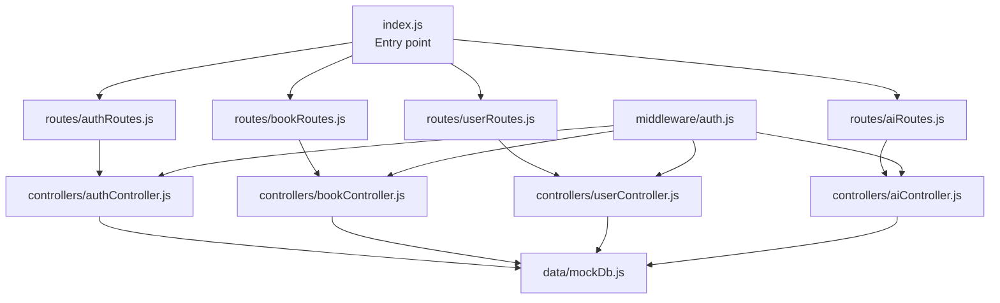
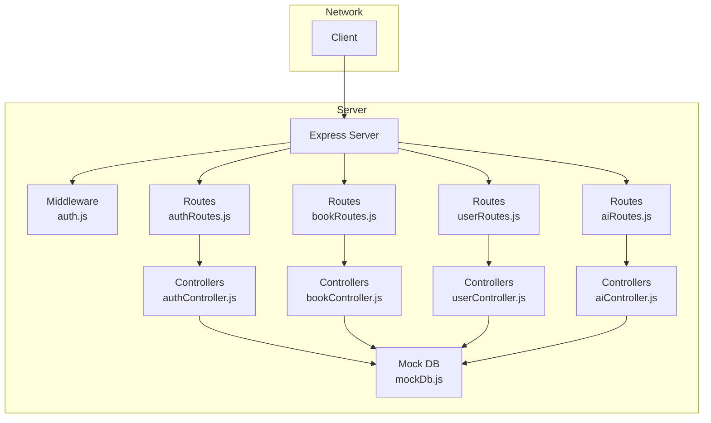
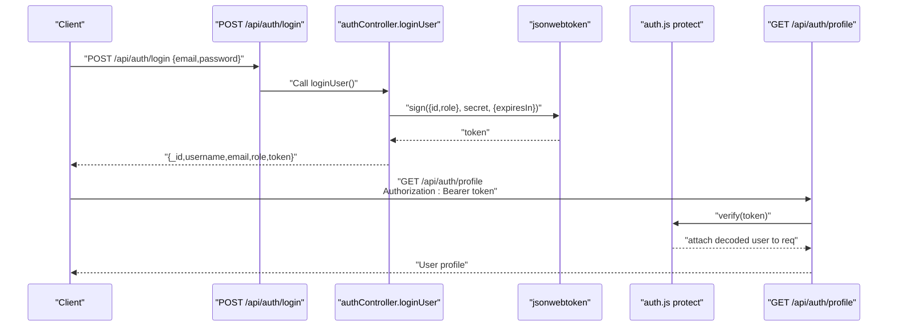
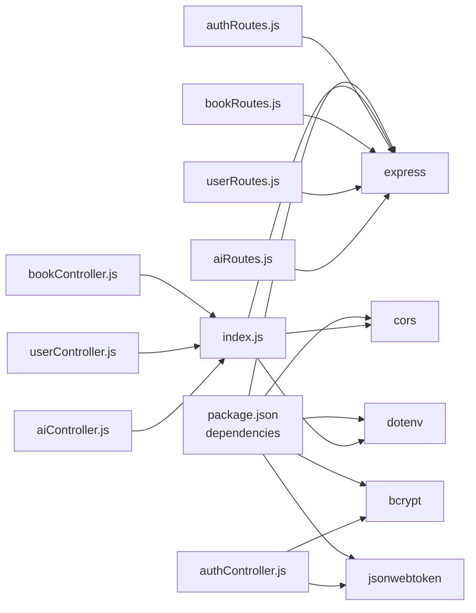
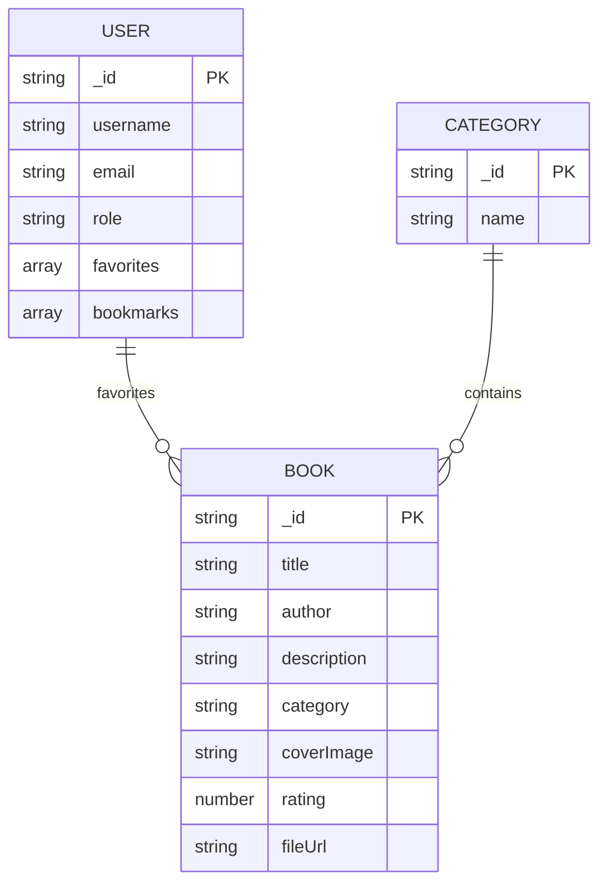

# Backend API Documentation

<cite>
**Referenced Files in This Document**
- [index.js](file://backend/index.js)
- [package.json](file://backend/package.json)
- [auth.js](file://backend/middleware/auth.js)
- [authRoutes.js](file://backend/routes/authRoutes.js)
- [bookRoutes.js](file://backend/routes/bookRoutes.js)
- [userRoutes.js](file://backend/routes/userRoutes.js)
- [aiRoutes.js](file://backend/routes/aiRoutes.js)
- [authController.js](file://backend/controllers/authController.js)
- [bookController.js](file://backend/controllers/bookController.js)
- [userController.js](file://backend/controllers/userController.js)
- [aiController.js](file://backend/controllers/aiController.js)
- [mockDb.js](file://backend/data/mockDb.js)
</cite>

## Table of Contents
1. [Introduction](#introduction)
2. [Project Structure](#project-structure)
3. [Core Components](#core-components)
4. [Architecture Overview](#architecture-overview)
5. [Detailed Component Analysis](#detailed-component-analysis)
6. [Dependency Analysis](#dependency-analysis)
7. [Performance Considerations](#performance-considerations)
8. [Troubleshooting Guide](#troubleshooting-guide)
9. [Conclusion](#conclusion)
10. [Appendices](#appendices)

## Introduction
This document provides comprehensive API documentation for ReadSphere’s backend RESTful services. It covers authentication, book management, user favorites/bookmarks, and AI features. For each endpoint, you will find HTTP methods, URL patterns, request/response schemas, authentication requirements, parameter descriptions, validation rules, and expected responses. Practical curl examples and response samples are included, along with notes on rate limiting, security headers, CORS configuration, API versioning strategy, and backward compatibility.

## Project Structure
The backend is organized around Express routes and controllers, with shared middleware for authentication and authorization. Data is stored in-memory via mock databases.

**Diagram sources**
- [index.js:12-15](file://backend/index.js#L12-L15)
- [authRoutes.js:1-11](file://backend/routes/authRoutes.js#L1-L11)
- [bookRoutes.js:1-10](file://backend/routes/bookRoutes.js#L1-L10)
- [userRoutes.js:1-11](file://backend/routes/userRoutes.js#L1-L11)
- [aiRoutes.js:1-10](file://backend/routes/aiRoutes.js#L1-L10)
- [authController.js:1-90](file://backend/controllers/authController.js#L1-L90)
- [bookController.js:1-69](file://backend/controllers/bookController.js#L1-L69)
- [userController.js:1-42](file://backend/controllers/userController.js#L1-L42)
- [aiController.js:1-27](file://backend/controllers/aiController.js#L1-L27)
- [mockDb.js:1-20](file://backend/data/mockDb.js#L1-L20)
- [auth.js:1-34](file://backend/middleware/auth.js#L1-L34)

**Section sources**
- [index.js:1-27](file://backend/index.js#L1-L27)
- [package.json:1-24](file://backend/package.json#L1-L24)

## Core Components
- Express server with CORS enabled globally and JSON body parsing.
- Authentication middleware supporting bearer token verification and admin role checks.
- Route groups under /api/{auth,books,users,ai}.
- Controllers implementing business logic with in-memory mock data.

Key runtime and configuration highlights:
- Port defaults to environment variable or 5000.
- Global CORS enabled; no origin restrictions configured.
- JSON request bodies supported.

**Section sources**
- [index.js:1-27](file://backend/index.js#L1-L27)
- [package.json:13-19](file://backend/package.json#L13-L19)

## Architecture Overview
The API follows a layered architecture:
- Entry point initializes Express, middleware, and mounts route groups.
- Routes define endpoint contracts.
- Controllers encapsulate business logic and interact with mock data.
- Middleware enforces authentication and authorization.

**Diagram sources**
- [index.js:8-15](file://backend/index.js#L8-L15)
- [auth.js:1-34](file://backend/middleware/auth.js#L1-L34)
- [authRoutes.js:1-11](file://backend/routes/authRoutes.js#L1-L11)
- [bookRoutes.js:1-10](file://backend/routes/bookRoutes.js#L1-L10)
- [userRoutes.js:1-11](file://backend/routes/userRoutes.js#L1-L11)
- [aiRoutes.js:1-10](file://backend/routes/aiRoutes.js#L1-L10)
- [authController.js:1-90](file://backend/controllers/authController.js#L1-L90)
- [bookController.js:1-69](file://backend/controllers/bookController.js#L1-L69)
- [userController.js:1-42](file://backend/controllers/userController.js#L1-L42)
- [aiController.js:1-27](file://backend/controllers/aiController.js#L1-L27)
- [mockDb.js:1-20](file://backend/data/mockDb.js#L1-L20)

## Detailed Component Analysis

### Authentication Endpoints
Authentication endpoints support user registration, login, and profile retrieval. All endpoints are under /api/auth.

- Base Path: /api/auth
- Authentication: None for signup/login; /profile requires Bearer token.

Endpoints:
- POST /signup
  - Description: Registers a new user.
  - Authentication: Not required.
  - Request Body:
    - username: string, required
    - email: string, required
    - password: string, required
  - Responses:
    - 201 Created: Returns user profile and JWT token.
    - 400 Bad Request: User already exists.
    - 500 Internal Server Error: Registration failure.
  - Example curl:
    - curl -X POST http://localhost:5000/api/auth/signup -H "Content-Type: application/json" -d '{"username":"jane","email":"jane@example.com","password":"SecurePass!"}'
  - Example Response:
    - {"_id":"...","username":"jane","email":"jane@example.com","role":"user","token":"..."}

- POST /login
  - Description: Logs in an existing user.
  - Authentication: Not required.
  - Request Body:
    - email: string, required
    - password: string, required
  - Responses:
    - 200 OK: Returns user profile and JWT token.
    - 401 Unauthorized: Invalid credentials.
    - 500 Internal Server Error: Login failure.
  - Example curl:
    - curl -X POST http://localhost:5000/api/auth/login -H "Content-Type: application/json" -d '{"email":"user@example.com","password":"..."}'
  - Example Response:
    - {"_id":"u2","username":"user1","email":"user@example.com","role":"user","token":"..."}

- GET /profile
  - Description: Retrieves authenticated user profile.
  - Authentication: Bearer token required.
  - Request Headers:
    - Authorization: Bearer <token>
  - Responses:
    - 200 OK: Returns user profile excluding sensitive fields.
    - 401 Unauthorized: No token or invalid token; Not authorized as user/admin.
    - 404 Not Found: User not found.
    - 500 Internal Server Error: Profile retrieval error.
  - Example curl:
    - curl -H "Authorization: Bearer eyJhbGciOiJI..." http://localhost:5000/api/auth/profile
  - Example Response:
    - {"_id":"u2","username":"user1","email":"user@example.com","role":"user"}

Security Notes:
- Token payload includes user id and role.
- Token expiration is set to 30 days.
- Admin role is enforced by dedicated middleware.

**Section sources**
- [authRoutes.js:6-8](file://backend/routes/authRoutes.js#L6-L8)
- [authController.js:11-46](file://backend/controllers/authController.js#L11-L46)
- [authController.js:48-72](file://backend/controllers/authController.js#L48-L72)
- [authController.js:74-87](file://backend/controllers/authController.js#L74-L87)
- [auth.js:3-23](file://backend/middleware/auth.js#L3-L23)
- [auth.js:25-31](file://backend/middleware/auth.js#L25-L31)

### Book Management Endpoints
Book endpoints support listing, viewing details, and creating books. All endpoints are under /api/books. Creation requires admin privileges.

- Base Path: /api/books
- Authentication:
  - GET / (list): Optional (no protection).
  - POST / (create): Bearer token required and admin role.

Endpoints:
- GET /
  - Description: Lists books with optional filtering.
  - Query Parameters:
    - keyword: string, optional; filters by title or author.
    - category: string, optional; filters by category id.
  - Responses:
    - 200 OK: Array of books with category populated.
    - 500 Internal Server Error: Books retrieval error.
  - Example curl:
    - curl "http://localhost:5000/api/books?keyword=habit&category=c2"
  - Example Response:
    - [{"_id":"b2","title":"...","author":"...","category":{"name":"Self-Help"},"rating":4.9},...]

- GET /:id
  - Description: Retrieves a single book by id.
  - Path Parameters:
    - id: string, required.
  - Responses:
    - 200 OK: Book with category populated.
    - 404 Not Found: Book not found.
    - 500 Internal Server Error: Detail retrieval error.
  - Example curl:
    - curl http://localhost:5000/api/books/b1
  - Example Response:
    - {"_id":"b1","title":"...","author":"...","category":{"name":"Thriller"},...}

- POST /
  - Description: Creates a new book.
  - Authentication: Bearer token required and admin role.
  - Request Body:
    - title: string, required
    - author: string, required
    - description: string, required
    - category: string, required
    - coverImage: string, required
    - fileUrl: string, required
  - Responses:
    - 201 Created: Newly created book.
    - 401 Unauthorized: Not authorized as admin.
    - 500 Internal Server Error: Creation error.
  - Example curl:
    - curl -X POST http://localhost:5000/api/books -H "Authorization: Bearer ..." -H "Content-Type: application/json" -d '{"title":"...","author":"...","description":"...","category":"c1","coverImage":"https://...","fileUrl":"#"}'
  - Example Response:
    - {"_id":"b4","title":"...","author":"...","category":"c1","description":"...","coverImage":"https://...","fileUrl":"#","rating":0}

Validation Rules:
- Required fields for creation: title, author, description, category, coverImage, fileUrl.
- Filtering supports partial matches for keyword across title and author.

**Section sources**
- [bookRoutes.js:6-7](file://backend/routes/bookRoutes.js#L6-L7)
- [bookController.js:3-29](file://backend/controllers/bookController.js#L3-L29)
- [bookController.js:31-44](file://backend/controllers/bookController.js#L31-L44)
- [bookController.js:46-66](file://backend/controllers/bookController.js#L46-L66)
- [auth.js:25-31](file://backend/middleware/auth.js#L25-L31)

### User Favorites and Bookmarks Endpoints
User endpoints manage favorites and bookmarks. All endpoints are under /api/users and require a Bearer token.

- Base Path: /api/users
- Authentication: Bearer token required.

Endpoints:
- POST /favorites
  - Description: Adds a book to user favorites.
  - Authentication: Bearer token required.
  - Request Body:
    - bookId: string, required.
  - Responses:
    - 200 OK: Updated favorites array.
    - 400 Bad Request: Book already in favorites.
    - 500 Internal Server Error: Add failure.
  - Example curl:
    - curl -X POST http://localhost:5000/api/users/favorites -H "Authorization: Bearer ..." -H "Content-Type: application/json" -d '{"bookId":"b3"}'
  - Example Response:
    - ["b1","b2","b3"]

- DELETE /favorites/:bookId
  - Description: Removes a book from user favorites.
  - Authentication: Bearer token required.
  - Path Parameters:
    - bookId: string, required.
  - Responses:
    - 200 OK: Updated favorites array.
    - 500 Internal Server Error: Remove failure.
  - Example curl:
    - curl -X DELETE http://localhost:5000/api/users/favorites/b2 -H "Authorization: Bearer ..."
  - Example Response:
    - ["b1"]

- POST /bookmarks
  - Description: Adds a bookmark for a book at a specific page.
  - Authentication: Bearer token required.
  - Request Body:
    - bookId: string, required
    - page: number, required
  - Responses:
    - 200 OK: Updated bookmarks array.
    - 500 Internal Server Error: Bookmark add failure.
  - Example curl:
    - curl -X POST http://localhost:5000/api/users/bookmarks -H "Authorization: Bearer ..." -H "Content-Type: application/json" -d '{"bookId":"b3","page":45}'
  - Example Response:
    - [{"book":"b3","page":45}]

Notes:
- Favorites are stored per user.
- Bookmarks store book id and page number.

**Section sources**
- [userRoutes.js:6-8](file://backend/routes/userRoutes.js#L6-L8)
- [userController.js:3-17](file://backend/controllers/userController.js#L3-L17)
- [userController.js:19-27](file://backend/controllers/userController.js#L19-L27)
- [userController.js:29-39](file://backend/controllers/userController.js#L29-L39)

### AI Features Endpoints
AI endpoints provide generated summaries and recommendations. Endpoints are under /api/ai and require a Bearer token except recommendations.

- Base Path: /api/ai
- Authentication:
  - POST /summary: Bearer token required.
  - GET /recommendations: Bearer token required.

Endpoints:
- POST /summary
  - Description: Generates a mock AI summary for a given book.
  - Authentication: Bearer token required.
  - Request Body:
    - bookId: string, required.
  - Responses:
    - 200 OK: Summary text.
    - 500 Internal Server Error: Generation error.
  - Example curl:
    - curl -X POST http://localhost:5000/api/ai/summary -H "Authorization: Bearer ..." -H "Content-Type: application/json" -d '{"bookId":"b1"}'
  - Example Response:
    - {"summary":"This is a smart AI-generated summary for \"The Silent Patient\". The text masterfully delves into core themes associated with the Thriller genre. It breaks down complex ideas into digestible insights, making it perfect for quick review. Key takeaways predict an emphasis on sustained character growth and thematic depth."}

- GET /recommendations
  - Description: Returns mock AI recommendations (first 4 books).
  - Authentication: Bearer token required.
  - Responses:
    - 200 OK: Array of recommended books.
    - 500 Internal Server Error: Recommendations retrieval error.
  - Example curl:
    - curl http://localhost:5000/api/ai/recommendations -H "Authorization: Bearer ..."
  - Example Response:
    - [{"_id":"b1","title":"...","author":"...","category":"c1",...},{"_id":"b2","title":"...","author":"...","category":"c2",...},...]

Notes:
- Recommendations are simulated and not personalized.
- Summary generation uses a mock algorithm returning predefined text.

**Section sources**
- [aiRoutes.js:6-7](file://backend/routes/aiRoutes.js#L6-L7)
- [aiController.js:3-14](file://backend/controllers/aiController.js#L3-L14)
- [aiRoutes.js:7](file://backend/routes/aiRoutes.js#L7)
- [aiController.js:16-24](file://backend/controllers/aiController.js#L16-L24)

### Authentication Flow (JWT)
The authentication flow uses bearer tokens signed with a secret. The middleware verifies tokens and attaches user info to the request.

**Diagram sources**
- [authRoutes.js:7](file://backend/routes/authRoutes.js#L7)
- [authController.js:48-72](file://backend/controllers/authController.js#L48-L72)
- [auth.js:3-23](file://backend/middleware/auth.js#L3-L23)
- [authRoutes.js:8](file://backend/routes/authRoutes.js#L8)

## Dependency Analysis
The API depends on Express, CORS, dotenv, bcrypt, and jsonwebtoken. The server exposes routes grouped by domain concerns.

**Diagram sources**
- [package.json:13-19](file://backend/package.json#L13-L19)
- [index.js:2-9](file://backend/index.js#L2-L9)
- [authRoutes.js:1](file://backend/routes/authRoutes.js#L1)
- [bookRoutes.js:1](file://backend/routes/bookRoutes.js#L1)
- [userRoutes.js:1](file://backend/routes/userRoutes.js#L1)
- [aiRoutes.js:1](file://backend/routes/aiRoutes.js#L1)
- [authController.js:1-3](file://backend/controllers/authController.js#L1-L3)
- [bookController.js:1](file://backend/controllers/bookController.js#L1)
- [userController.js:1](file://backend/controllers/userController.js#L1)
- [aiController.js:1](file://backend/controllers/aiController.js#L1)

**Section sources**
- [package.json:13-19](file://backend/package.json#L13-L19)
- [index.js:2-9](file://backend/index.js#L2-L9)

## Performance Considerations
- In-memory data storage: Suitable for demos but not scalable; consider persistence for production.
- Filtering complexity: Linear scans over mock arrays; optimize with indexing or a database for larger datasets.
- Token verification: One-time signature verification per protected request; keep secret secure and rotate periodically.
- CORS: Enabled globally; consider restricting origins and methods for production.

[No sources needed since this section provides general guidance]

## Troubleshooting Guide
Common errors and resolutions:
- 401 Unauthorized:
  - Cause: Missing or invalid Bearer token; token verification fails; insufficient permissions (admin).
  - Resolution: Ensure Authorization header is present and valid; confirm user role if admin access is required.
- 400 Bad Request:
  - Registration: User already exists.
  - Favorites: Book already in favorites.
- 404 Not Found:
  - Profile or book not found.
- 5xx Internal Server Error:
  - General failures during processing; inspect server logs.

Operational tips:
- Verify JWT_SECRET environment variable is set.
- Confirm CORS configuration allows your client origin.
- Use curl with -v to inspect headers and status codes.

**Section sources**
- [auth.js:15-22](file://backend/middleware/auth.js#L15-L22)
- [authController.js:16-18](file://backend/controllers/authController.js#L16-L18)
- [userController.js:8-10](file://backend/controllers/userController.js#L8-L10)
- [authController.js:81-83](file://backend/controllers/authController.js#L81-L83)
- [bookController.js:38-40](file://backend/controllers/bookController.js#L38-L40)

## Conclusion
ReadSphere’s backend provides a clean REST API surface covering authentication, book management, user favorites/bookmarks, and AI features. The design leverages Express routing, middleware for auth, and controller logic backed by in-memory mock data. For production, consider persistent storage, stricter CORS policies, rate limiting, and robust input validation.

[No sources needed since this section summarizes without analyzing specific files]

## Appendices

### API Versioning Strategy
- Current implementation does not include explicit API versioning in URLs or headers.
- Recommendation: Prefix routes with /api/v1 (e.g., /api/v1/auth) to maintain backward compatibility and enable future breaking changes behind new versions.

[No sources needed since this section provides general guidance]

### Security Headers and CORS
- CORS: Enabled globally without origin restrictions; configure origin, methods, and headers as needed for production.
- Content-Type: Ensure requests include application/json where applicable.
- Rate Limiting: Not implemented; consider adding rate limiting middleware for production.

[No sources needed since this section provides general guidance]

### Data Models
Representative models inferred from mock data:

**Diagram sources**
- [mockDb.js:2-17](file://backend/data/mockDb.js#L2-L17)