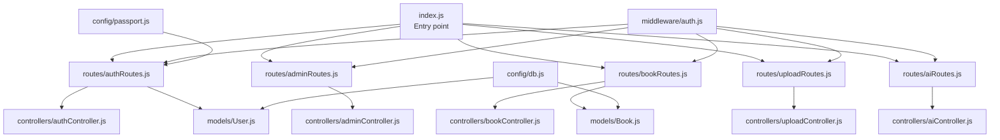
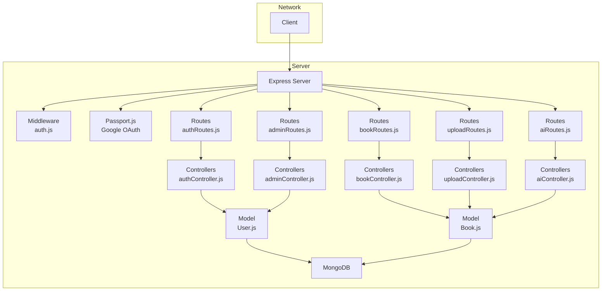
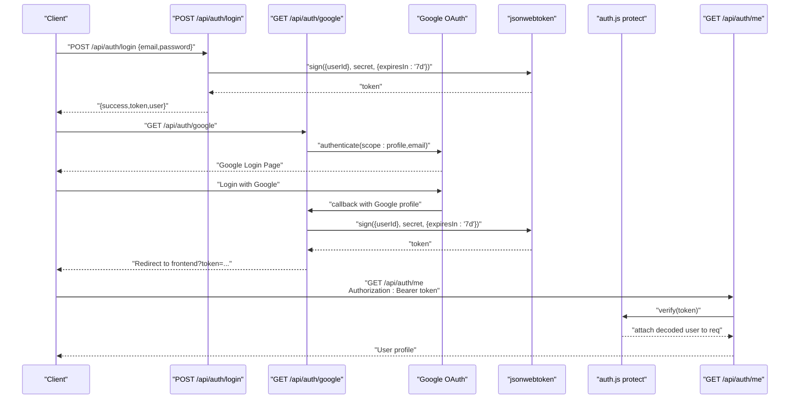
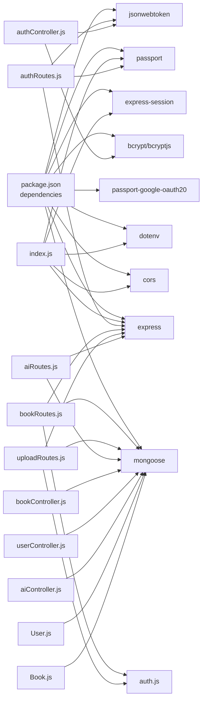
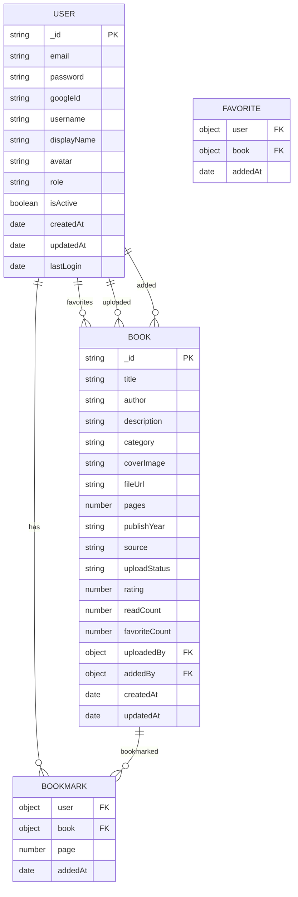

# Backend API Documentation

<cite>
**Referenced Files in This Document**
- [index.js](file://backend/index.js)
- [package.json](file://backend/package.json)
- [auth.js](file://backend/middleware/auth.js)
- [authRoutes.js](file://backend/routes/authRoutes.js)
- [bookRoutes.js](file://backend/routes/bookRoutes.js)
- [adminRoutes.js](file://backend/routes/adminRoutes.js)
- [uploadRoutes.js](file://backend/routes/uploadRoutes.js)
- [aiRoutes.js](file://backend/routes/aiRoutes.js)
- [authController.js](file://backend/controllers/authController.js)
- [bookController.js](file://backend/controllers/bookController.js)
- [userController.js](file://backend/controllers/userController.js)
- [aiController.js](file://backend/controllers/aiController.js)
- [mockDb.js](file://backend/data/mockDb.js)
- [User.js](file://backend/models/User.js)
- [Book.js](file://backend/models/Book.js)
</cite>

## Table of Contents
1. [Introduction](#introduction)
2. [Project Structure](#project-structure)
3. [Core Components](#core-components)
4. [Architecture Overview](#architecture-overview)
5. [Detailed Component Analysis](#detailed-component-analysis)
6. [Dependency Analysis](#dependency-analysis)
7. [Performance Considerations](#performance-considerations)
8. [Troubleshooting Guide](#troubleshooting-guide)
9. [Conclusion](#conclusion)
10. [Appendices](#appendices)

## Introduction
This document provides comprehensive API documentation for ReadSphere's backend RESTful services. It covers authentication (including Google OAuth), book management, admin functions, user uploads, and AI features. For each endpoint, you will find HTTP methods, URL patterns, request/response schemas, authentication requirements, parameter descriptions, validation rules, and expected responses. Practical curl examples and response samples are included, along with notes on rate limiting, security headers, CORS configuration, API versioning strategy, and backward compatibility.

## Project Structure
The backend is organized around Express routes and controllers, with shared middleware for authentication and authorization. Data is persisted using MongoDB with Mongoose models, and Passport.js handles Google OAuth integration.



**Diagram sources**
- [index.js:54-59](file://backend/index.js#L54-L59)
- [authRoutes.js:1-202](file://backend/routes/authRoutes.js#L1-L202)
- [adminRoutes.js:1-96](file://backend/routes/adminRoutes.js#L1-L96)
- [bookRoutes.js:1-226](file://backend/routes/bookRoutes.js#L1-L226)
- [uploadRoutes.js:1-141](file://backend/routes/uploadRoutes.js#L1-L141)
- [aiRoutes.js:1-88](file://backend/routes/aiRoutes.js#L1-L88)
- [authController.js:1-90](file://backend/controllers/authController.js#L1-L90)
- [bookController.js:1-69](file://backend/controllers/bookController.js#L1-L69)
- [userController.js:1-42](file://backend/controllers/userController.js#L1-L42)
- [aiController.js:1-88](file://backend/controllers/aiController.js#L1-L88)
- [User.js:1-129](file://backend/models/User.js#L1-L129)
- [Book.js:1-200](file://backend/models/Book.js#L1-L200)
- [auth.js:1-36](file://backend/middleware/auth.js#L1-L36)

**Section sources**
- [index.js:1-71](file://backend/index.js#L1-L71)
- [package.json:1-29](file://backend/package.json#L1-L29)

## Core Components
- Express server with CORS enabled for multiple frontend origins and JSON body parsing.
- Authentication middleware supporting bearer token verification and admin role checks.
- Passport.js integration for Google OAuth with session management.
- MongoDB/Mongoose models for User and Book entities with comprehensive schemas.
- Route groups under /api/{auth,admin,books,uploads,ai}.
- Controllers implementing business logic with MongoDB database operations.

Key runtime and configuration highlights:
- Port defaults to environment variable or 5000.
- CORS enabled for localhost ports 5173-5178 and 3000; configurable via FRONTEND_URL.
- Session management with configurable cookie security.
- JWT token expiration set to 7 days for OAuth flows.

**Section sources**
- [index.js:14-47](file://backend/index.js#L14-L47)
- [package.json:13-24](file://backend/package.json#L13-L24)

## Architecture Overview
The API follows a layered architecture with MongoDB persistence:
- Entry point initializes Express, middleware, Passport, and mounts route groups.
- Routes define endpoint contracts with comprehensive validation.
- Controllers encapsulate business logic and interact with MongoDB models.
- Middleware enforces authentication, authorization, and role-based access control.
- Passport.js handles Google OAuth with session storage and token generation.



**Diagram sources**
- [index.js:8-51](file://backend/index.js#L8-L51)
- [auth.js:1-36](file://backend/middleware/auth.js#L1-L36)
- [authRoutes.js:113-145](file://backend/routes/authRoutes.js#L113-L145)
- [adminRoutes.js:1-96](file://backend/routes/adminRoutes.js#L1-L96)
- [bookRoutes.js:1-226](file://backend/routes/bookRoutes.js#L1-L226)
- [uploadRoutes.js:1-141](file://backend/routes/uploadRoutes.js#L1-L141)
- [aiRoutes.js:1-88](file://backend/routes/aiRoutes.js#L1-L88)
- [authController.js:1-90](file://backend/controllers/authController.js#L1-L90)
- [User.js:1-129](file://backend/models/User.js#L1-L129)
- [Book.js:1-200](file://backend/models/Book.js#L1-L200)

## Detailed Component Analysis

### Authentication Endpoints
Authentication endpoints support local registration/login, Google OAuth, profile retrieval, and logout. All endpoints are under /api/auth.

- Base Path: /api/auth
- Authentication: None for registration/login; /me and /logout require Bearer token.

Endpoints:
- POST /register
  - Description: Registers a new user with email/password.
  - Authentication: Not required.
  - Request Body:
    - username: string, required
    - email: string, required
    - password: string, required (minimum 6 characters)
  - Responses:
    - 201 Created: Returns success message, JWT token, and user profile.
    - 400 Bad Request: Missing fields or user already exists.
    - 500 Internal Server Error: Registration failure.
  - Example curl:
    - curl -X POST http://localhost:5000/api/auth/register -H "Content-Type: application/json" -d '{"username":"jane","email":"jane@example.com","password":"SecurePass!"}'
  - Example Response:
    - {"success":true,"message":"User registered successfully","token":"...","user":{"id":"...","email":"jane@example.com","username":"jane","displayName":"jane","avatar":null,"role":"user","createdAt":"..."}}

- POST /login
  - Description: Logs in an existing user with email/password.
  - Authentication: Not required.
  - Request Body:
    - email: string, required
    - password: string, required
  - Responses:
    - 200 OK: Returns success message, JWT token, and user profile.
    - 400 Bad Request: Missing fields.
    - 401 Unauthorized: Invalid credentials or OAuth-only account.
    - 500 Internal Server Error: Login failure.
  - Example curl:
    - curl -X POST http://localhost:5000/api/auth/login -H "Content-Type: application/json" -d '{"email":"user@example.com","password":"..."}'
  - Example Response:
    - {"success":true,"message":"Login successful","token":"...","user":{"id":"...","email":"user@example.com","username":"user1","displayName":"user1","avatar":null,"role":"user","createdAt":"..."}}

- GET /google
  - Description: Initiates Google OAuth login flow.
  - Authentication: Not required.
  - Response: Redirects to Google OAuth with scope profile/email.
  - Example curl:
    - curl -L http://localhost:5000/api/auth/google

- GET /google/callback
  - Description: Handles Google OAuth callback and redirects with JWT token.
  - Authentication: Not required.
  - Response: Redirects to frontend with token in query parameter.
  - Example curl:
    - curl -L http://localhost:5000/api/auth/google/callback

- GET /me
  - Description: Retrieves authenticated user profile.
  - Authentication: Bearer token required.
  - Request Headers:
    - Authorization: Bearer <token>
  - Responses:
    - 200 OK: Returns user profile excluding sensitive fields.
    - 401 Unauthorized: No token or invalid token.
    - 404 Not Found: User not found.
    - 500 Internal Server Error: Profile retrieval error.
  - Example curl:
    - curl -H "Authorization: Bearer eyJhbGciOiJI..." http://localhost:5000/api/auth/me
  - Example Response:
    - {"success":true,"user":{"id":"...","email":"user@example.com","username":"user1","displayName":"user1","avatar":null,"role":"user","createdAt":"..."}}

- POST /logout
  - Description: Logs out current user.
  - Authentication: Bearer token required.
  - Responses:
    - 200 OK: Success message.
    - 500 Internal Server Error: Logout failure.
  - Example curl:
    - curl -X POST http://localhost:5000/api/auth/logout -H "Authorization: Bearer ..."

Security Notes:
- Token payload includes user id and role.
- Token expiration is set to 7 days.
- Admin role enforcement via dedicated middleware.
- Google OAuth requires proper client configuration.

**Section sources**
- [authRoutes.js:16-111](file://backend/routes/authRoutes.js#L16-L111)
- [authRoutes.js:113-145](file://backend/routes/authRoutes.js#L113-L145)
- [authRoutes.js:147-181](file://backend/routes/authRoutes.js#L147-L181)
- [authRoutes.js:183-199](file://backend/routes/authRoutes.js#L183-L199)
- [auth.js:3-31](file://backend/middleware/auth.js#L3-L31)
- [User.js:113-124](file://backend/models/User.js#L113-L124)

### Admin Management Endpoints
Admin endpoints handle initial admin setup and user administration. All endpoints are under /api/admin.

- Base Path: /api/admin
- Authentication: Public for setup; /create requires secret key.

Endpoints:
- POST /setup
  - Description: Creates initial admin user if none exists.
  - Authentication: Public (disabled after first use).
  - Responses:
    - 201 Created: Admin created successfully.
    - 403 Forbidden: Admin already exists.
    - 500 Internal Server Error: Setup failure.
  - Example curl:
    - curl -X POST http://localhost:5000/api/admin/setup

- POST /create
  - Description: Creates or promotes user to admin (development only).
  - Authentication: Public (secret key required).
  - Request Body:
    - username: string, required
    - email: string, required
    - password: string, required
    - secretKey: string, required ("setup-admin-2024")
  - Responses:
    - 201 Created: Admin created successfully.
    - 400 Bad Request: Missing fields.
    - 401 Unauthorized: Invalid secret key.
    - 500 Internal Server Error: Creation failure.
  - Example curl:
    - curl -X POST http://localhost:5000/api/admin/create -H "Content-Type: application/json" -d '{"username":"admin","email":"admin@example.com","password":"AdminPass!","secretKey":"setup-admin-2024"}'

Security Notes:
- Secret key validation for development use only.
- Should be disabled in production environments.
- Admin role enforcement via middleware.

**Section sources**
- [adminRoutes.js:5-44](file://backend/routes/adminRoutes.js#L5-L44)
- [adminRoutes.js:46-93](file://backend/routes/adminRoutes.js#L46-L93)

### Book Management Endpoints
Book endpoints support comprehensive CRUD operations with advanced filtering, sorting, and pagination. All endpoints are under /api/books.

- Base Path: /api/books
- Authentication:
  - GET /: Public (list/search).
  - GET /:id: Public (detail).
  - POST /: Requires admin role.
  - PUT /:id: Requires admin role.
  - DELETE /:id: Requires admin role.
  - GET /stats/overview: Requires admin role.

Endpoints:
- GET /
  - Description: Lists books with pagination, search, and filters.
  - Query Parameters:
    - page: number, default 1
    - limit: number, default 24
    - search: string, optional; filters by title, author, or description
    - category: string, optional; filters by category
    - sortBy: string, default "popular"; options: rating, title, newest
    - source: string, optional; filters by upload source
  - Responses:
    - 200 OK: Books with pagination metadata.
    - 500 Internal Server Error: Books retrieval error.
  - Example curl:
    - curl "http://localhost:5000/api/books?page=1&limit=12&search=harry&category=Fiction&sortBy=rating"

- GET /:id
  - Description: Retrieves a single book by id with read count increment.
  - Path Parameters:
    - id: string, required.
  - Responses:
    - 200 OK: Book with populated uploader and adder information.
    - 404 Not Found: Book not found.
    - 500 Internal Server Error: Detail retrieval error.
  - Example curl:
    - curl http://localhost:5000/api/books/123

- POST /
  - Description: Creates a new book (Admin only).
  - Authentication: Bearer token required and admin role.
  - Request Body:
    - title: string, required
    - author: string, required
    - description: string, optional
    - category: string, required
    - coverImage: string, optional
    - fileUrl: string, required
    - pages: number, optional
    - publishYear: string, optional
  - Responses:
    - 201 Created: Newly created book with success message.
    - 400 Bad Request: Missing required fields.
    - 403 Forbidden: Not authorized as admin.
    - 500 Internal Server Error: Creation error.
  - Example curl:
    - curl -X POST http://localhost:5000/api/books -H "Authorization: Bearer ..." -H "Content-Type: application/json" -d '{"title":"Book Title","author":"Author Name","description":"Description","category":"Fiction","coverImage":"https://image.url","fileUrl":"https://file.url","pages":300,"publishYear":"2024"}'

- PUT /:id
  - Description: Updates an existing book (Admin only).
  - Authentication: Bearer token required and admin role.
  - Path Parameters:
    - id: string, required
  - Request Body:
    - Fields from POST endpoint (all optional)
  - Responses:
    - 200 OK: Updated book with success message.
    - 403 Forbidden: Not authorized as admin.
    - 404 Not Found: Book not found.
    - 500 Internal Server Error: Update error.
  - Example curl:
    - curl -X PUT http://localhost:5000/api/books/123 -H "Authorization: Bearer ..." -H "Content-Type: application/json" -d '{"title":"Updated Title"}'

- DELETE /:id
  - Description: Deletes a book (Admin only).
  - Authentication: Bearer token required and admin role.
  - Path Parameters:
    - id: string, required
  - Responses:
    - 200 OK: Success message.
    - 403 Forbidden: Not authorized as admin.
    - 404 Not Found: Book not found.
    - 500 Internal Server Error: Deletion error.
  - Example curl:
    - curl -X DELETE http://localhost:5000/api/books/123 -H "Authorization: Bearer ..."

- GET /categories/list
  - Description: Gets all unique book categories.
  - Responses:
    - 200 OK: Array of category names.
    - 500 Internal Server Error: Categories retrieval error.

- GET /stats/overview
  - Description: Returns book statistics (Admin only).
  - Authentication: Bearer token required and admin role.
  - Responses:
    - 200 OK: Statistics object with counts.
    - 403 Forbidden: Not authorized as admin.
    - 500 Internal Server Error: Stats retrieval error.

Validation Rules:
- Required fields for creation: title, author, fileUrl.
- Search uses regex matching with case-insensitive options.
- Pagination supports up to 100 items per page.
- Sorting prioritizes readCount and favoriteCount for popular books.

**Section sources**
- [bookRoutes.js:6-74](file://backend/routes/bookRoutes.js#L6-L74)
- [bookRoutes.js:76-98](file://backend/routes/bookRoutes.js#L76-L98)
- [bookRoutes.js:100-182](file://backend/routes/bookRoutes.js#L100-L182)
- [bookRoutes.js:184-195](file://backend/routes/bookRoutes.js#L184-L195)
- [bookRoutes.js:197-223](file://backend/routes/bookRoutes.js#L197-L223)
- [auth.js:25-31](file://backend/middleware/auth.js#L25-L31)

### User Upload Workflow Endpoints
Upload endpoints handle user book submissions with admin approval workflow. All endpoints are under /api/uploads.

- Base Path: /api/uploads
- Authentication: All require Bearer token.

Endpoints:
- POST /
  - Description: Submits a new book for admin approval.
  - Authentication: Bearer token required.
  - Request Body:
    - title: string, required
    - author: string, required
    - description: string, optional
    - category: string, optional (defaults to "Other")
    - coverImage: string, optional
    - fileUrl: string, required
    - pages: number, optional (defaults to 0)
    - publishYear: string, optional
  - Responses:
    - 201 Created: Upload submitted with success message and pending status.
    - 400 Bad Request: Missing required fields.
    - 500 Internal Server Error: Submission error.
  - Example curl:
    - curl -X POST http://localhost:5000/api/uploads -H "Authorization: Bearer ..." -H "Content-Type: application/json" -d '{"title":"My Book","author":"Me","fileUrl":"https://book.pdf"}'

- GET /my-uploads
  - Description: Lists user's uploaded books.
  - Authentication: Bearer token required.
  - Responses:
    - 200 OK: Array of user's books sorted by creation date.
    - 500 Internal Server Error: Fetch error.

- GET /pending
  - Description: Lists all pending uploads (Admin only).
  - Authentication: Bearer token required and admin role.
  - Responses:
    - 200 OK: Array of pending uploads with uploader information.
    - 403 Forbidden: Not authorized as admin.
    - 500 Internal Server Error: Fetch error.

- PUT /:id/approve
  - Description: Approves a pending upload (Admin only).
  - Authentication: Bearer token required and admin role.
  - Path Parameters:
    - id: string, required
  - Responses:
    - 200 OK: Approved book with success message.
    - 403 Forbidden: Not authorized as admin.
    - 404 Not Found: Book not found.
    - 500 Internal Server Error: Approval error.

- PUT /:id/reject
  - Description: Rejects a pending upload (Admin only).
  - Authentication: Bearer token required and admin role.
  - Path Parameters:
    - id: string, required
  - Responses:
    - 200 OK: Rejected book with success message.
    - 403 Forbidden: Not authorized as admin.
    - 404 Not Found: Book not found.
    - 500 Internal Server Error: Rejection error.

Workflow:
1. User submits book → status: pending
2. Admin reviews → approve or reject
3. Approved books become active and searchable

**Section sources**
- [uploadRoutes.js:6-43](file://backend/routes/uploadRoutes.js#L6-L43)
- [uploadRoutes.js:45-58](file://backend/routes/uploadRoutes.js#L45-L58)
- [uploadRoutes.js:60-78](file://backend/routes/uploadRoutes.js#L60-L78)
- [uploadRoutes.js:80-108](file://backend/routes/uploadRoutes.js#L80-L108)
- [uploadRoutes.js:110-138](file://backend/routes/uploadRoutes.js#L110-L138)

### AI Features Endpoints
AI endpoints provide intelligent summaries and personalized recommendations. Endpoints are under /api/ai and require a Bearer token.

- Base Path: /api/ai
- Authentication: Bearer token required for both endpoints.

Endpoints:
- POST /summary
  - Description: Generates AI summary for a book or custom text.
  - Authentication: Bearer token required.
  - Request Body:
    - bookId: string, optional; MongoDB ObjectId
    - text: string, optional; custom text to summarize
  - Responses:
    - 200 OK: Summary object with content and source indicator.
    - 500 Internal Server Error: Generation error.
  - Example curl:
    - curl -X POST http://localhost:5000/api/ai/summary -H "Authorization: Bearer ..." -H "Content-Type: application/json" -d '{"bookId":"64b9f1a8e4b0a1a4e8c2b3a1"}'

- GET /recommendations
  - Description: Returns personalized book recommendations based on user's reading history.
  - Authentication: Bearer token required.
  - Responses:
    - 200 OK: Array of recommended books (up to 6).
    - 500 Internal Server Error: Recommendations retrieval error.
  - Example curl:
    - curl http://localhost:5000/api/ai/recommendations -H "Authorization: Bearer ..."

Summary Logic:
- Uses stored AI summary if available for the book.
- Generates contextual summary based on book metadata (title, author, category, description).
- Enhances with user-provided text content when available.
- Returns both generated and stored summary sources.

Recommendations Logic:
- Analyzes user's favorite books and categories.
- Recommends similar category books with high popularity.
- Excludes already favorited books from results.
- Returns up to 6 recommendations sorted by popularity.

**Section sources**
- [aiRoutes.js:1-88](file://backend/routes/aiRoutes.js#L1-L88)
- [aiController.js:4-52](file://backend/controllers/aiController.js#L4-L52)
- [aiController.js:54-85](file://backend/controllers/aiController.js#L54-L85)

### Authentication Flow (JWT and Google OAuth)
The authentication flow supports both JWT tokens and Google OAuth with seamless integration.



**Diagram sources**
- [authRoutes.js:63-111](file://backend/routes/authRoutes.js#L63-L111)
- [authRoutes.js:113-145](file://backend/routes/authRoutes.js#L113-L145)
- [authRoutes.js:147-164](file://backend/routes/authRoutes.js#L147-L164)
- [auth.js:3-23](file://backend/middleware/auth.js#L3-L23)

## Dependency Analysis
The API depends on Express, CORS, Passport.js, MongoDB/Mongoose, bcrypt, and jsonwebtoken. The server exposes comprehensive routes grouped by domain concerns with robust authentication and authorization.



**Diagram sources**
- [package.json:13-24](file://backend/package.json#L13-L24)
- [index.js:2-6](file://backend/index.js#L2-L6)
- [authRoutes.js:1-5](file://backend/routes/authRoutes.js#L1-L5)
- [bookRoutes.js:1-4](file://backend/routes/bookRoutes.js#L1-L4)
- [uploadRoutes.js:1-4](file://backend/routes/uploadRoutes.js#L1-L4)
- [aiRoutes.js:1-88](file://backend/routes/aiRoutes.js#L1-L88)
- [User.js:1-129](file://backend/models/User.js#L1-L129)
- [Book.js:1-200](file://backend/models/Book.js#L1-L200)

**Section sources**
- [package.json:13-24](file://backend/package.json#L13-L24)
- [index.js:2-6](file://backend/index.js#L2-L6)

## Performance Considerations
- MongoDB performance: Indexes recommended for frequent queries (email, category, createdAt).
- Pagination optimization: Current limit of 24 items per page; consider caching popular queries.
- JWT verification: Single signature verification per request; ensure secret rotation strategy.
- Google OAuth: Session storage adds overhead; consider Redis for production scaling.
- CORS configuration: Multiple origins configured; restrict to production domains only.
- Database connections: Pool configuration recommended for high concurrency.

## Troubleshooting Guide
Common errors and resolutions:
- 401 Unauthorized:
  - Cause: Missing or invalid Bearer token; token verification fails; insufficient permissions (admin).
  - Resolution: Ensure Authorization header is present and valid; confirm user role if admin access is required.
- 403 Forbidden:
  - Cause: Admin-only endpoints accessed by non-admin users.
  - Resolution: Verify user role is 'admin' or use appropriate authentication.
- 400 Bad Request:
  - Registration: Missing required fields or password too short.
  - Upload: Missing required fields (title, author, fileUrl).
  - Login: Missing email or password.
- 404 Not Found:
  - Profile, book, or user not found.
- 5xx Internal Server Error:
  - General failures during processing; check MongoDB connectivity and server logs.

Operational tips:
- Verify JWT_SECRET and GOOGLE_CLIENT_ID/SECRET environment variables are set.
- Confirm CORS configuration allows your client origin.
- Use curl with -v to inspect headers and status codes.
- Check MongoDB connection string in config/db.js.

**Section sources**
- [auth.js:15-22](file://backend/middleware/auth.js#L15-L22)
- [authRoutes.js:23-30](file://backend/routes/authRoutes.js#L23-L30)
- [uploadRoutes.js:13-16](file://backend/routes/uploadRoutes.js#L13-L16)
- [bookRoutes.js:105](file://backend/routes/bookRoutes.js#L105)
- [authRoutes.js:77-86](file://backend/routes/authRoutes.js#L77-L86)

## Conclusion
ReadSphere's backend provides a comprehensive REST API with modern authentication, robust admin capabilities, user-driven content workflows, and intelligent AI features. The implementation leverages Express routing, Passport.js OAuth, MongoDB/Mongoose persistence, and JWT-based authorization. For production deployment, consider implementing rate limiting, enhanced security headers, stricter CORS policies, database indexing, and connection pooling.

## Appendices

### API Versioning Strategy
- Current implementation does not include explicit API versioning in URLs or headers.
- Recommendation: Prefix routes with /api/v1 (e.g., /api/v1/auth) to maintain backward compatibility and enable future breaking changes behind new versions.

### Security Headers and CORS
- CORS: Enabled for multiple localhost origins (5173-5178, 3000) and configurable via FRONTEND_URL environment variable.
- Content-Type: Ensure requests include application/json where applicable.
- Rate Limiting: Not implemented; consider adding rate limiting middleware for production.
- Session Security: Cookie secure flag enabled in production mode; maxAge 24 hours.

### Data Models
Core data models with comprehensive schemas:



**Diagram sources**
- [User.js:4-93](file://backend/models/User.js#L4-L93)
- [Book.js:1-200](file://backend/models/Book.js#L1-L200)

### Environment Variables
Required environment variables:
- JWT_SECRET: Secret key for JWT token signing
- GOOGLE_CLIENT_ID: Google OAuth client ID
- GOOGLE_CLIENT_SECRET: Google OAuth client secret
- SESSION_SECRET: Session secret for Passport.js
- FRONTEND_URL: Frontend application URL for redirects
- MONGODB_URI: MongoDB connection string

### Error Response Format
Standardized error responses:
```json
{
  "message": "Error description",
  "success": false
}
```

Success responses typically include:
```json
{
  "success": true,
  "message": "Operation description"
}
```