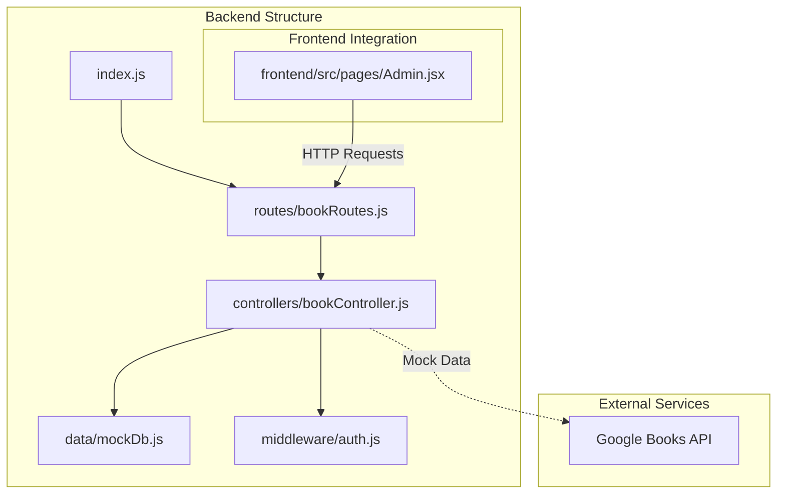
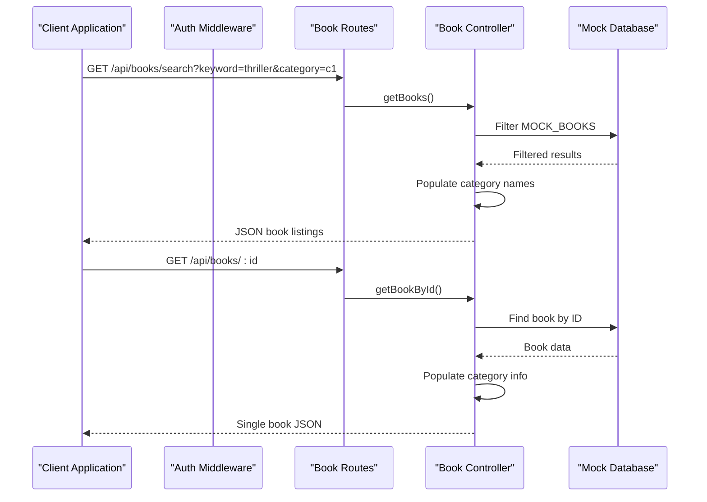
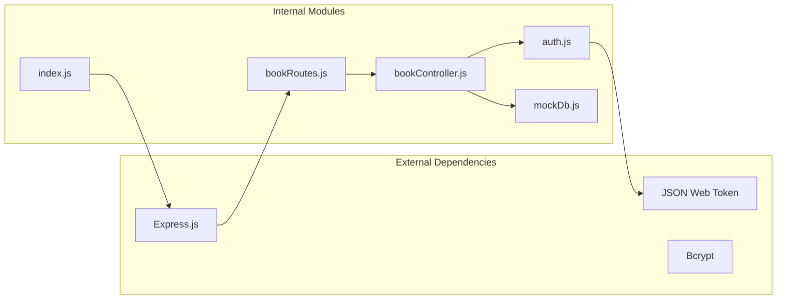

# Book Management API

<cite>
**Referenced Files in This Document**
- [bookController.js](file://backend/controllers/bookController.js)
- [bookRoutes.js](file://backend/routes/bookRoutes.js)
- [mockDb.js](file://backend/data/mockDb.js)
- [auth.js](file://backend/middleware/auth.js)
- [index.js](file://backend/index.js)
- [Admin.jsx](file://frontend/src/pages/Admin.jsx)
</cite>

## Table of Contents
1. [Introduction](#introduction)
2. [Project Structure](#project-structure)
3. [Core Components](#core-components)
4. [Architecture Overview](#architecture-overview)
5. [Detailed Component Analysis](#detailed-component-analysis)
6. [Dependency Analysis](#dependency-analysis)
7. [Performance Considerations](#performance-considerations)
8. [Troubleshooting Guide](#troubleshooting-guide)
9. [Conclusion](#conclusion)

## Introduction
The Book Management API provides endpoints for browsing, searching, and managing books within the ReadSphere platform. This API serves both public users for book discovery and administrative users for content management. The system integrates with a mock database containing book collections and categories, and includes authentication middleware for admin-only operations.

## Project Structure
The book management functionality is organized across several key components:



**Diagram sources**
- [index.js:11-15](file://backend/index.js#L11-L15)
- [bookRoutes.js:1-9](file://backend/routes/bookRoutes.js#L1-L9)
- [bookController.js:1](file://backend/controllers/bookController.js#L1)

**Section sources**
- [index.js:1-27](file://backend/index.js#L1-L27)
- [bookRoutes.js:1-10](file://backend/routes/bookRoutes.js#L1-L10)

## Core Components

### Authentication Middleware
The system implements JWT-based authentication with role-based access control:

- **Token Verification**: Validates Bearer tokens in Authorization headers
- **Admin Access**: Restricts certain operations to users with admin role
- **Error Handling**: Returns standardized 401 responses for unauthorized access

### Mock Database Structure
The system uses an in-memory mock database with three primary collections:

- **MOCK_BOOKS**: Contains book records with metadata
- **MOCK_CATEGORIES**: Defines available book categories
- **MOCK_USERS**: Manages user accounts and permissions

**Section sources**
- [auth.js:1-34](file://backend/middleware/auth.js#L1-L34)
- [mockDb.js:7-48](file://backend/data/mockDb.js#L7-L48)

## Architecture Overview



**Diagram sources**
- [bookRoutes.js:6](file://backend/routes/bookRoutes.js#L6)
- [bookController.js:3](file://backend/controllers/bookController.js#L3)
- [mockDb.js:7](file://backend/data/mockDb.js#L7)

## Detailed Component Analysis

### Book Search Endpoint
**Endpoint**: `GET /api/books/search`

#### Query Parameters
| Parameter | Type | Description | Required |
|-----------|------|-------------|----------|
| keyword | string | Search term for title or author | No |
| category | string | Category ID filter | No |

#### Request Format
```
GET /api/books/search?keyword=thriller&category=c1
Authorization: Bearer <jwt-token>
```

#### Response Format
```json
[
  {
    "_id": "string",
    "title": "string",
    "author": "string",
    "description": "string",
    "category": {
      "_id": "string",
      "name": "string"
    },
    "coverImage": "string",
    "rating": "number",
    "fileUrl": "string"
  }
]
```

#### Implementation Details
- **Filtering Logic**: Case-insensitive substring matching for titles and authors
- **Category Filtering**: Exact match on category ID
- **Category Population**: Resolves category objects from MOCK_CATEGORIES
- **Response Transformation**: Converts category IDs to readable category objects

**Section sources**
- [bookController.js:3](file://backend/controllers/bookController.js#L3-L29)
- [bookRoutes.js:6](file://backend/routes/bookRoutes.js#L6)

### Book Details Endpoint
**Endpoint**: `GET /api/books/:id`

#### Path Parameters
| Parameter | Type | Description |
|-----------|------|-------------|
| id | string | Unique book identifier (format: b1, b2, etc.) |

#### Request Format
```
GET /api/books/b1
Authorization: Bearer <jwt-token>
```

#### Response Format
```json
{
  "_id": "string",
  "title": "string",
  "author": "string",
  "description": "string",
  "category": {
    "_id": "string",
    "name": "string"
  },
  "coverImage": "string",
  "rating": "number",
  "fileUrl": "string"
}
```

#### Implementation Details
- **ID Matching**: Exact string comparison with book identifiers
- **Category Resolution**: Populates category information from MOCK_CATEGORIES
- **Error Handling**: Returns 404 for non-existent books

**Section sources**
- [bookController.js:31](file://backend/controllers/bookController.js#L31-L44)
- [bookRoutes.js:7](file://backend/routes/bookRoutes.js#L7)

### Admin Book Creation Endpoint
**Endpoint**: `POST /api/books/`

#### Authentication Requirements
- **Required**: Bearer token in Authorization header
- **Role**: Must be admin user
- **Token Validation**: JWT verification against secret key

#### Request Body Schema
```json
{
  "title": "string",
  "author": "string",
  "description": "string",
  "category": "string",
  "coverImage": "string",
  "fileUrl": "string"
}
```

#### Response Format
Returns the newly created book object with auto-generated ID

#### Implementation Details
- **Validation**: Extracts required fields from request body
- **ID Generation**: Creates sequential IDs (b1, b2, etc.)
- **Default Values**: Sets initial rating to 0
- **Authorization**: Requires both authentication and admin role

**Section sources**
- [bookController.js:46](file://backend/controllers/bookController.js#L46-L66)
- [bookRoutes.js:6](file://backend/routes/bookRoutes.js#L6)
- [auth.js:25](file://backend/middleware/auth.js#L25-L31)

### Current Limitations
The current implementation lacks:
- **Book Update Endpoint**: PUT/PATCH `/api/books/:id`
- **Book Delete Endpoint**: DELETE `/api/books/:id`
- **Pagination Support**: No limit/offset or cursor-based pagination
- **Advanced Search**: No sorting, filtering, or faceted search capabilities
- **Google Books Integration**: No external API integration

## Dependency Analysis



**Diagram sources**
- [bookController.js:1](file://backend/controllers/bookController.js#L1)
- [bookRoutes.js:3](file://backend/routes/bookRoutes.js#L3)
- [auth.js:1](file://backend/middleware/auth.js#L1)

**Section sources**
- [bookController.js:1](file://backend/controllers/bookController.js#L1)
- [bookRoutes.js:3](file://backend/routes/bookRoutes.js#L3)
- [auth.js:1](file://backend/middleware/auth.js#L1)

## Performance Considerations

### Current Performance Characteristics
- **Memory Usage**: All data stored in memory (O(n) for book operations)
- **Search Complexity**: Linear search through MOCK_BOOKS (O(n))
- **Filtering**: Two-pass filtering for keyword and category
- **Response Size**: Full book objects returned without pagination

### Optimization Opportunities
- **Indexing**: Implement category and author indexes for faster lookups
- **Pagination**: Add limit/offset parameters for large datasets
- **Caching**: Cache frequently accessed book details
- **Database Migration**: Replace mock database with persistent storage

## Troubleshooting Guide

### Common Issues and Solutions

#### Authentication Errors
**Problem**: 401 Not authorized responses
**Causes**: 
- Missing Authorization header
- Invalid or expired JWT token
- Non-admin user attempting admin operation

**Solutions**:
- Verify Bearer token format: `Authorization: Bearer <token>`
- Check JWT_SECRET environment variable
- Ensure user has admin role

#### Book Not Found
**Problem**: 404 responses for book details
**Causes**:
- Incorrect book ID format
- Non-existent book ID
- ID mismatch between client and server

**Solutions**:
- Verify book ID follows format (b1, b2, etc.)
- Check MOCK_BOOKS array for existing entries
- Confirm URL encoding for special characters

#### Search Results Issues
**Problem**: Empty or unexpected search results
**Causes**:
- Case sensitivity in search terms
- Incorrect category ID format
- Special characters in search queries

**Solutions**:
- Use lowercase search terms for consistent matching
- Verify category IDs exist in MOCK_CATEGORIES
- URL encode special characters in queries

**Section sources**
- [auth.js:3](file://backend/middleware/auth.js#L3-L31)
- [bookController.js:38](file://backend/controllers/bookController.js#L38)
- [bookController.js:27](file://backend/controllers/bookController.js#L27)

## Conclusion

The ReadSphere Book Management API provides a solid foundation for book discovery and administration with the following strengths:

**Current Capabilities**:
- Comprehensive book search with keyword and category filtering
- Detailed book information retrieval
- Admin-only book creation with robust authentication
- Clean separation of concerns with modular architecture

**Areas for Enhancement**:
- Implement full CRUD operations (update/delete endpoints)
- Add pagination and advanced search capabilities
- Integrate with Google Books API for enhanced book discovery
- Implement database persistence and caching
- Add comprehensive input validation and sanitization

The current implementation demonstrates good architectural patterns with clear separation between controllers, routes, and middleware, providing an excellent foundation for future enhancements.