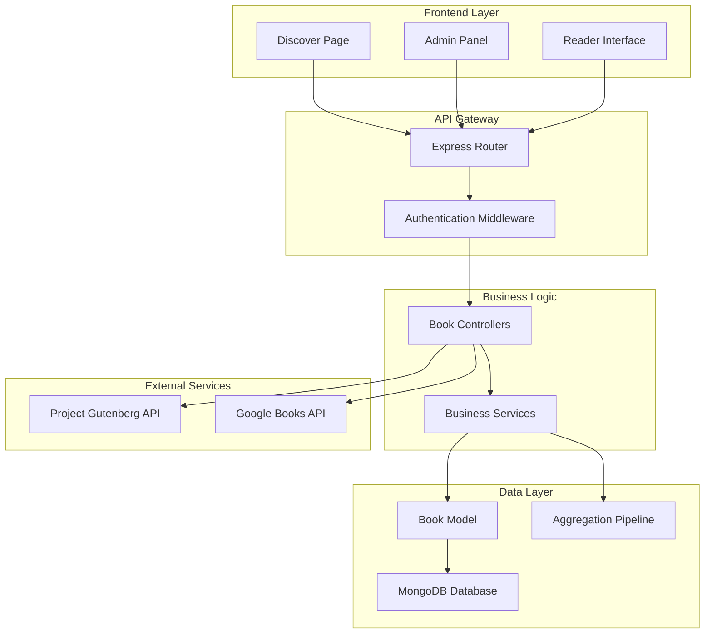

# Book Management API

<cite>
**Referenced Files in This Document**
- [bookController.js](file://backend/controllers/bookController.js)
- [bookRoutes.js](file://backend/routes/bookRoutes.js)
- [Book.js](file://backend/models/Book.js)
- [db.js](file://backend/config/db.js)
- [auth.js](file://backend/middleware/auth.js)
- [index.js](file://backend/index.js)
- [Admin.jsx](file://frontend/src/pages/Admin.jsx)
- [Discover.jsx](file://frontend/src/pages/Discover.jsx)
- [api.js](file://frontend/src/services/api.js)
</cite>

## Update Summary
**Changes Made**
- Complete migration from mock database to MongoDB with Mongoose ODM
- Added comprehensive CRUD operations (Create, Read, Update, Delete)
- Implemented advanced search with MongoDB text indexes and aggregation
- Enhanced pagination with configurable page sizes and cursor-based navigation
- Added category-based browsing with distinct category listing
- Integrated Google Books API (via Project Gutenberg) for enhanced book discovery
- Added comprehensive statistics tracking with MongoDB aggregation
- Implemented role-based access control for admin operations
- Enhanced book model with rich metadata and validation rules

## Table of Contents
1. [Introduction](#introduction)
2. [System Architecture](#system-architecture)
3. [Core Components](#core-components)
4. [Advanced Features](#advanced-features)
5. [API Endpoints](#api-endpoints)
6. [Data Models](#data-models)
7. [Integration Patterns](#integration-patterns)
8. [Performance Optimizations](#performance-optimizations)
9. [Security Implementation](#security-implementation)
10. [Troubleshooting Guide](#troubleshooting-guide)
11. [Conclusion](#conclusion)

## Introduction
The ReadSphere Book Management API represents a comprehensive solution for digital book management with advanced search, filtering, and administrative capabilities. Built on MongoDB with Mongoose ODM, the system provides scalable book discovery, management, and analytics through a RESTful API interface.

The platform integrates with Project Gutenberg's API to provide extensive public domain book collections while maintaining its own database for user-uploaded and admin-added content. Advanced features include real-time statistics tracking, sophisticated search algorithms, and comprehensive administrative controls.

## System Architecture



**Diagram sources**
- [index.js:54-59](file://backend/index.js#L54-L59)
- [bookRoutes.js:1-226](file://backend/routes/bookRoutes.js#L1-L226)
- [Book.js:1-113](file://backend/models/Book.js#L1-L113)

## Core Components

### MongoDB Integration
The system utilizes MongoDB as its primary data store, providing:

- **Rich Document Storage**: Flexible schema for diverse book metadata
- **Text Search**: Full-text search capabilities with MongoDB text indexes
- **Aggregation Framework**: Complex analytics and reporting through aggregation pipelines
- **Index Optimization**: Strategic indexing for optimal query performance

### Advanced Search Engine
Built-in search functionality powered by:

- **Text Indexes**: Multi-field text search across titles, authors, and descriptions
- **Regex Pattern Matching**: Flexible pattern matching for partial searches
- **Category Filtering**: Efficient category-based book filtering
- **Source Tracking**: Differentiation between user uploads, admin additions, and public domain sources

### Statistics and Analytics
Comprehensive tracking system:

- **Read Count Tracking**: Real-time book popularity metrics
- **Favorite Count**: User engagement measurement
- **Source Analytics**: Platform usage insights by content source
- **Aggregate Reporting**: MongoDB aggregation for complex statistical queries

**Section sources**
- [db.js:1-15](file://backend/config/db.js#L1-L15)
- [Book.js:107-108](file://backend/models/Book.js#L107-L108)
- [bookRoutes.js:209-218](file://backend/routes/bookRoutes.js#L209-L218)

## Advanced Features

### Comprehensive CRUD Operations
Full lifecycle management of book content:

- **Create**: Admin-only book creation with validation
- **Read**: Multiple retrieval methods with pagination and filtering
- **Update**: Atomic updates with validation and timestamp tracking
- **Delete**: Safe deletion with cascade handling

### Advanced Pagination System
Sophisticated pagination with:

- **Configurable Limits**: Adjustable page sizes (default: 24 books per page)
- **Cursor-Based Navigation**: Efficient large dataset traversal
- **Metadata Enrichment**: Total counts, page calculations, and navigation indicators
- **Performance Optimization**: Skip/limit optimization for large collections

### Category Management
Dynamic category system:

- **Distinct Category Listing**: Automatic category discovery
- **Category Filtering**: Efficient category-based book retrieval
- **Category Analytics**: Category-wise statistics and popularity tracking

### Source Integration
Multi-source content management:

- **Project Gutenberg Integration**: Automated public domain book import
- **User Upload Management**: Pending approval workflow
- **Admin Addition**: Direct content management
- **Source Tracking**: Origin-based analytics and filtering

**Section sources**
- [bookRoutes.js:9-74](file://backend/routes/bookRoutes.js#L9-L74)
- [bookRoutes.js:129-182](file://backend/routes/bookRoutes.js#L129-L182)
- [bookRoutes.js:184-195](file://backend/routes/bookRoutes.js#L184-L195)

## API Endpoints

### Public Book Discovery Endpoints

#### GET /api/books
**Advanced Book Search with Pagination**

**Query Parameters**
| Parameter | Type | Description | Default | Example |
|-----------|------|-------------|---------|---------|
| page | number | Page number for pagination | 1 | 2 |
| limit | number | Number of books per page | 24 | 50 |
| search | string | Search term for title, author, or description | "" | "mystery" |
| category | string | Category filter | "" | "Fiction" |
| sortBy | string | Sorting criteria | "popular" | "rating" |
| source | string | Content source filter | "" | "gutenberg" |

**Sorting Options**
- `popular`: Sort by readCount and favoriteCount (default)
- `rating`: Sort by rating descending
- `title`: Sort by title ascending
- `newest`: Sort by creation date descending

**Response Format**
```json
{
  "books": [
    {
      "id": "string",
      "title": "string",
      "author": "string",
      "description": "string",
      "category": "string",
      "coverImage": "string",
      "fileUrl": "string",
      "fileType": "string",
      "pages": "number",
      "publishYear": "string",
      "rating": "number",
      "source": "string",
      "readCount": "number",
      "favoriteCount": "number",
      "isActive": "boolean",
      "createdAt": "date",
      "updatedAt": "date",
      "uploadedBy": {
        "username": "string",
        "displayName": "string"
      },
      "addedBy": {
        "username": "string",
        "displayName": "string"
      }
    }
  ],
  "totalPages": "number",
  "currentPage": "number",
  "total": "number"
}
```

**Section sources**
- [bookRoutes.js:6-74](file://backend/routes/bookRoutes.js#L6-L74)

#### GET /api/books/:id
**Single Book Retrieval with Analytics**

**Request Format**
```
GET /api/books/b123
Authorization: Bearer <jwt-token>
```

**Response Format**
```json
{
  "id": "string",
  "title": "string",
  "author": "string",
  "description": "string",
  "category": "string",
  "coverImage": "string",
  "fileUrl": "string",
  "fileType": "string",
  "pages": "number",
  "publishYear": "string",
  "rating": "number",
  "source": "string",
  "readCount": "number",
  "favoriteCount": "number",
  "isActive": "boolean",
  "createdAt": "date",
  "updatedAt": "date",
  "uploadedBy": {
    "username": "string",
    "displayName": "string"
  },
  "addedBy": {
    "username": "string",
    "displayName": "string"
  }
}
```

**Implementation Details**
- Automatically increments readCount on successful retrieval
- Populates user information for uploadedBy and addedBy fields
- Returns 404 for non-existent books

**Section sources**
- [bookRoutes.js:76-98](file://backend/routes/bookRoutes.js#L76-L98)

### Administrative Endpoints

#### POST /api/books
**Create New Book (Admin Only)**

**Authentication Requirements**
- Bearer token required
- Admin role mandatory
- JWT verification against secret key

**Request Body Schema**
```json
{
  "title": "string",
  "author": "string",
  "description": "string",
  "category": "string",
  "coverImage": "string",
  "fileUrl": "string",
  "fileType": "string",
  "pages": "number",
  "publishYear": "string",
  "rating": "number"
}
```

**Response Format**
```json
{
  "success": "boolean",
  "message": "string",
  "book": {
    "id": "string",
    "title": "string",
    "author": "string",
    "category": "string",
    "source": "string",
    "addedBy": "string",
    "createdAt": "date",
    "updatedAt": "date"
  }
}
```

**Section sources**
- [bookRoutes.js:100-127](file://backend/routes/bookRoutes.js#L100-L127)

#### PUT /api/books/:id
**Update Book Information (Admin Only)**

**Request Body**
Same as create endpoint with optional fields

**Response Format**
```json
{
  "success": "boolean",
  "message": "string",
  "book": {
    "id": "string",
    "title": "string",
    "author": "string",
    "category": "string",
    "source": "string",
    "addedBy": "string",
    "createdAt": "date",
    "updatedAt": "date"
  }
}
```

**Section sources**
- [bookRoutes.js:129-157](file://backend/routes/bookRoutes.js#L129-L157)

#### DELETE /api/books/:id
**Delete Book (Admin Only)**

**Response Format**
```json
{
  "success": "boolean",
  "message": "string"
}
```

**Section sources**
- [bookRoutes.js:159-182](file://backend/routes/bookRoutes.js#L159-L182)

### Category and Statistics Endpoints

#### GET /api/books/categories/list
**Get Distinct Categories**

**Response Format**
```json
["Fiction", "Mystery", "Romance", "Sci-Fi", "Horror"]
```

**Section sources**
- [bookRoutes.js:184-195](file://backend/routes/bookRoutes.js#L184-L195)

#### GET /api/books/stats/overview
**Admin Statistics Dashboard**

**Authentication Required**: Admin role

**Response Format**
```json
{
  "totalBooks": "number",
  "activeBooks": "number",
  "pendingUploads": "number",
  "totalReads": "number"
}
```

**Section sources**
- [bookRoutes.js:197-223](file://backend/routes/bookRoutes.js#L197-L223)

## Data Models

### Book Model Schema
The Book model defines comprehensive book metadata with validation:

```javascript
const bookSchema = new mongoose.Schema({
  title: {
    type: String,
    required: true,
    trim: true
  },
  author: {
    type: String,
    required: true,
    trim: true
  },
  description: {
    type: String,
    default: ''
  },
  category: {
    type: String,
    required: true,
    enum: ['Fiction', 'Mystery', 'Romance', 'Sci-Fi', 'Horror', 'History', 'Classic', 'Adventure', 'Poetry', 'Self-Help', 'Productivity', 'Thriller', 'Other']
  },
  coverImage: {
    type: String,
    default: ''
  },
  fileUrl: {
    type: String,
    required: true
  },
  fileType: {
    type: String,
    enum: ['pdf', 'epub', 'txt'],
    default: 'pdf'
  },
  pages: {
    type: Number,
    default: 0
  },
  publishYear: {
    type: String,
    default: ''
  },
  rating: {
    type: Number,
    default: 0,
    min: 0,
    max: 5
  },
  aiSummary: {
    type: String,
    default: ''
  },
  source: {
    type: String,
    enum: ['gutenberg', 'uploaded', 'admin'],
    default: 'uploaded'
  },
  uploadedBy: {
    type: mongoose.Schema.Types.ObjectId,
    ref: 'User',
    default: null
  },
  uploadStatus: {
    type: String,
    enum: ['pending', 'approved', 'rejected'],
    default: 'approved'
  },
  addedBy: {
    type: mongoose.Schema.Types.ObjectId,
    ref: 'User',
    default: null
  },
  createdAt: {
    type: Date,
    default: Date.now
  },
  updatedAt: {
    type: Date,
    default: Date.now
  },
  readCount: {
    type: Number,
    default: 0
  },
  favoriteCount: {
    type: Number,
    default: 0
  },
  isActive: {
    type: Boolean,
    default: true
  }
});
```

**Key Features**
- **Validation**: Comprehensive field validation with enums and ranges
- **Indexes**: Text indexes for search optimization
- **Timestamps**: Automatic createdAt/updatedAt tracking
- **References**: User relationships for content attribution
- **Statistics**: Built-in counters for analytics

**Section sources**
- [Book.js:1-113](file://backend/models/Book.js#L1-L113)

## Integration Patterns

### Frontend Integration
The frontend components demonstrate sophisticated integration patterns:

#### Discover Page Integration
The Discover page implements:
- **Debounced Search**: 600ms delay for efficient search
- **Category Filtering**: Dynamic category-based book loading
- **View Modes**: Grid and list view switching
- **Load More**: Infinite scroll with pagination

#### Admin Panel Integration
The Admin panel provides:
- **Real-time Stats**: Live dashboard with MongoDB aggregation
- **Bulk Operations**: Mass book management capabilities
- **Approval Workflow**: Pending upload review system
- **Form Validation**: Comprehensive form validation and error handling

### External API Integration
Integration with Project Gutenberg API provides:
- **Automatic Book Discovery**: Real-time access to public domain books
- **Format Detection**: Automatic detection of available file formats
- **Fallback Mechanisms**: Graceful degradation when API is unavailable
- **Data Transformation**: Consistent formatting across different API responses

**Section sources**
- [Discover.jsx:63-98](file://frontend/src/pages/Discover.jsx#L63-L98)
- [Admin.jsx:35-72](file://frontend/src/pages/Admin.jsx#L35-L72)
- [api.js:131-153](file://frontend/src/services/api.js#L131-L153)

## Performance Optimizations

### Database Optimization
- **Text Indexes**: MongoDB text indexes for full-text search
- **Aggregation Pipelines**: Complex analytics with efficient aggregation
- **Population Strategy**: Selective population of related documents
- **Query Optimization**: Efficient filtering and sorting strategies

### Caching Strategies
- **Static Assets**: CDN optimization for book covers and images
- **API Response Caching**: Strategic caching for frequently accessed data
- **Search Result Caching**: Temporary caching for search queries

### Scalability Considerations
- **Pagination**: Configurable limits to prevent large result sets
- **Indexing**: Strategic indexing for optimal query performance
- **Connection Pooling**: Efficient database connection management
- **Load Balancing**: Horizontal scaling considerations

## Security Implementation

### Authentication and Authorization
- **JWT Tokens**: Secure token-based authentication
- **Role-Based Access Control**: Admin-only operations
- **Middleware Protection**: Centralized security middleware
- **Token Validation**: Comprehensive token verification

### Input Validation
- **Schema Validation**: Mongoose schema-based validation
- **Request Sanitization**: Input sanitization and validation
- **Error Handling**: Comprehensive error handling and logging
- **Rate Limiting**: Protection against abuse and DDOS attacks

### Data Protection
- **Sensitive Data**: Password hashing with bcrypt
- **Audit Trails**: Comprehensive logging of admin actions
- **Data Integrity**: Validation of all data modifications
- **Privacy Controls**: User data protection and privacy compliance

**Section sources**
- [auth.js:1-36](file://backend/middleware/auth.js#L1-L36)
- [Book.js:102-105](file://backend/models/Book.js#L102-L105)

## Troubleshooting Guide

### Common Issues and Solutions

#### Database Connection Problems
**Problem**: MongoDB connection failures
**Causes**:
- MongoDB server not running
- Incorrect connection string
- Network connectivity issues

**Solutions**:
- Verify MongoDB service status
- Check connection string in environment variables
- Test network connectivity to database server

#### Authentication Errors
**Problem**: 401 Unauthorized responses
**Causes**:
- Missing Authorization header
- Invalid or expired JWT token
- Incorrect JWT_SECRET configuration

**Solutions**:
- Verify Bearer token format: `Authorization: Bearer <token>`
- Check JWT_SECRET environment variable
- Regenerate tokens if expired

#### Search Performance Issues
**Problem**: Slow search responses
**Causes**:
- Missing text indexes
- Large result sets without pagination
- Inefficient query patterns

**Solutions**:
- Verify text indexes exist on title, author, and description fields
- Implement pagination with appropriate limit values
- Optimize search queries with proper filtering

#### Admin Operation Failures
**Problem**: 403 Forbidden responses for admin operations
**Causes**:
- User lacks admin role
- Incorrect user authentication
- Role verification failures

**Solutions**:
- Verify user has admin role in database
- Check authentication token contains correct role
- Ensure admin setup completed successfully

**Section sources**
- [db.js:3-12](file://backend/config/db.js#L3-L12)
- [auth.js:3-31](file://backend/middleware/auth.js#L3-L31)

## Conclusion

The ReadSphere Book Management API represents a mature, feature-rich solution for digital book management with the following key strengths:

**Advanced Capabilities**:
- Comprehensive MongoDB integration with rich document modeling
- Sophisticated search engine with text indexes and aggregation
- Full CRUD operations with comprehensive validation
- Advanced pagination and filtering systems
- Real-time statistics and analytics
- Multi-source content integration

**Scalability and Performance**:
- Optimized database queries with strategic indexing
- Efficient pagination for large datasets
- Comprehensive error handling and logging
- Security-first design with role-based access control

**Developer Experience**:
- Well-documented API with comprehensive examples
- Modular architecture with clear separation of concerns
- Extensive frontend integration patterns
- Robust error handling and debugging support

The system provides an excellent foundation for digital library platforms, offering both technical excellence and practical usability for book discovery, management, and administration.