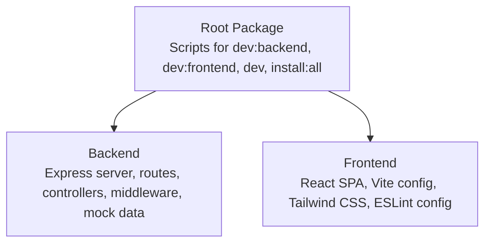
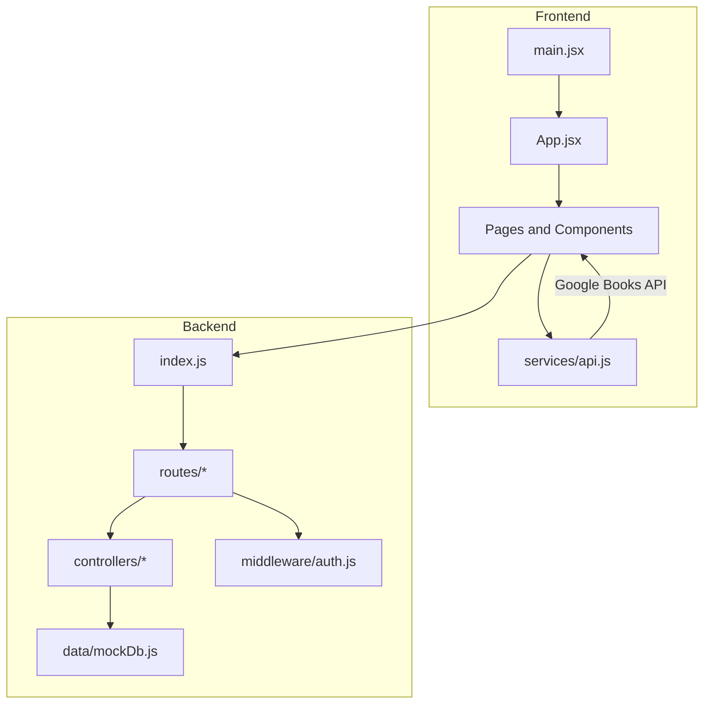
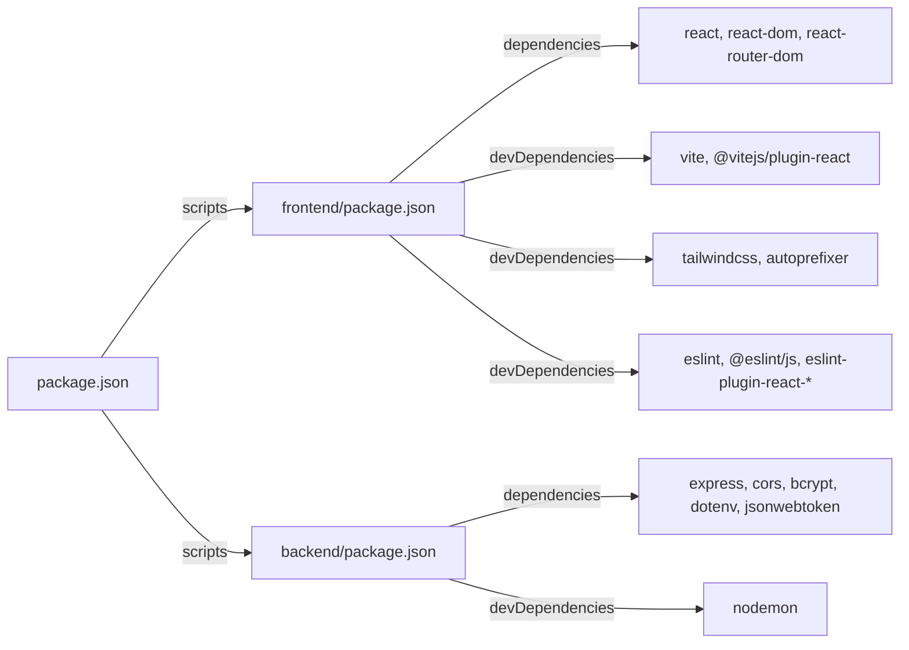

# Contributing and Development Guidelines

<cite>
**Referenced Files in This Document**
- [package.json](file://package.json)
- [backend/package.json](file://backend/package.json)
- [frontend/package.json](file://frontend/package.json)
- [frontend/eslint.config.js](file://frontend/eslint.config.js)
- [frontend/tailwind.config.js](file://frontend/tailwind.config.js)
- [frontend/vite.config.js](file://frontend/vite.config.js)
- [frontend/src/main.jsx](file://frontend/src/main.jsx)
- [frontend/src/App.jsx](file://frontend/src/App.jsx)
- [frontend/src/components/Navbar.jsx](file://frontend/src/components/Navbar.jsx)
- [frontend/src/components/BookCard.jsx](file://frontend/src/components/BookCard.jsx)
- [frontend/src/pages/Home.jsx](file://frontend/src/pages/Home.jsx)
- [frontend/src/services/api.js](file://frontend/src/services/api.js)
- [backend/index.js](file://backend/index.js)
- [backend/controllers/bookController.js](file://backend/controllers/bookController.js)
- [backend/routes/bookRoutes.js](file://backend/routes/bookRoutes.js)
- [backend/middleware/auth.js](file://backend/middleware/auth.js)
- [backend/data/mockDb.js](file://backend/data/mockDb.js)
</cite>

## Table of Contents
1. [Introduction](#introduction)
2. [Project Structure](#project-structure)
3. [Core Components](#core-components)
4. [Architecture Overview](#architecture-overview)
5. [Detailed Component Analysis](#detailed-component-analysis)
6. [Dependency Analysis](#dependency-analysis)
7. [Performance Considerations](#performance-considerations)
8. [Troubleshooting Guide](#troubleshooting-guide)
9. [Development Workflow](#development-workflow)
10. [Code Standards and Conventions](#code-standards-and-conventions)
11. [Testing and Quality Assurance](#testing-and-quality-assurance)
12. [Issue Reporting and Community Guidelines](#issue-reporting-and-community-guidelines)
13. [Conclusion](#conclusion)

## Introduction
This document defines the contributing and development guidelines for ReadSphere. It covers code standards for JavaScript/ES6+, React component structure, file naming conventions, commenting practices, development workflow, branching and commit conventions, pull request processes, code review guidelines, testing and QA procedures, project structure conventions, architectural decision-making, contribution acceptance criteria, environment setup, debugging procedures, and community expectations.

## Project Structure
ReadSphere follows a monorepo-like structure with a frontend (React + Vite) and a backend (Express) located under separate directories. Scripts in the root automate development across both parts.

**Diagram sources**
- [package.json:1-14](file://package.json#L1-L14)
- [backend/package.json:1-24](file://backend/package.json#L1-L24)
- [frontend/package.json:1-34](file://frontend/package.json#L1-L34)

**Section sources**
- [package.json:1-14](file://package.json#L1-L14)
- [backend/package.json:1-24](file://backend/package.json#L1-L24)
- [frontend/package.json:1-34](file://frontend/package.json#L1-L34)

## Core Components
- Frontend entrypoint initializes the React root and mounts the App.
- App composes routing and layout components.
- Components implement UI and interactivity; pages orchestrate data fetching and rendering.
- Services encapsulate API interactions and data formatting.
- Backend exposes REST endpoints with route controllers and middleware for auth.

**Section sources**
- [frontend/src/main.jsx:1-11](file://frontend/src/main.jsx#L1-L11)
- [frontend/src/App.jsx:1-40](file://frontend/src/App.jsx#L1-L40)
- [frontend/src/components/Navbar.jsx:1-56](file://frontend/src/components/Navbar.jsx#L1-L56)
- [frontend/src/components/BookCard.jsx:1-71](file://frontend/src/components/BookCard.jsx#L1-L71)
- [frontend/src/pages/Home.jsx:1-483](file://frontend/src/pages/Home.jsx#L1-L483)
- [frontend/src/services/api.js:1-284](file://frontend/src/services/api.js#L1-L284)
- [backend/index.js:1-27](file://backend/index.js#L1-L27)
- [backend/controllers/bookController.js:1-69](file://backend/controllers/bookController.js#L1-L69)
- [backend/routes/bookRoutes.js:1-10](file://backend/routes/bookRoutes.js#L1-L10)
- [backend/middleware/auth.js:1-34](file://backend/middleware/auth.js#L1-L34)
- [backend/data/mockDb.js:1-20](file://backend/data/mockDb.js#L1-L20)

## Architecture Overview
The frontend is a React SPA built with Vite and styled with Tailwind CSS. It communicates with the backend via REST endpoints and external APIs (Google Books). The backend is an Express server with modular routes, controllers, and middleware for authentication.

**Diagram sources**
- [frontend/src/main.jsx:1-11](file://frontend/src/main.jsx#L1-L11)
- [frontend/src/App.jsx:1-40](file://frontend/src/App.jsx#L1-L40)
- [frontend/src/services/api.js:1-284](file://frontend/src/services/api.js#L1-L284)
- [backend/index.js:1-27](file://backend/index.js#L1-L27)
- [backend/routes/bookRoutes.js:1-10](file://backend/routes/bookRoutes.js#L1-L10)
- [backend/controllers/bookController.js:1-69](file://backend/controllers/bookController.js#L1-L69)
- [backend/middleware/auth.js:1-34](file://backend/middleware/auth.js#L1-L34)
- [backend/data/mockDb.js:1-20](file://backend/data/mockDb.js#L1-L20)

## Detailed Component Analysis

### Frontend Application Entry
- Initializes React root and mounts the App component.
- Ensures strict mode and imports global styles.

**Section sources**
- [frontend/src/main.jsx:1-11](file://frontend/src/main.jsx#L1-L11)

### Routing and Layout
- App composes routing and layout components (Navbar, Footer).
- Defines routes for pages and nested admin area.

**Section sources**
- [frontend/src/App.jsx:1-40](file://frontend/src/App.jsx#L1-L40)

### Navigation Component
- Implements responsive navigation with mobile menu toggle and scroll-aware styling.
- Uses Lucide icons and Tailwind utilities for styling.

**Section sources**
- [frontend/src/components/Navbar.jsx:1-56](file://frontend/src/components/Navbar.jsx#L1-L56)

### Book Card Component
- Renders book metadata with hover effects and conditional action buttons.
- Handles image loading states and fallbacks.

**Section sources**
- [frontend/src/components/BookCard.jsx:1-71](file://frontend/src/components/BookCard.jsx#L1-L71)

### Home Page
- Orchestrates multiple data fetches for trending, new releases, previews, and categories.
- Implements skeleton loaders and scrollable sections.

**Section sources**
- [frontend/src/pages/Home.jsx:1-483](file://frontend/src/pages/Home.jsx#L1-L483)

### API Service
- Encapsulates Google Books API interactions with robust fallbacks.
- Formats raw API responses into a normalized shape for the frontend.

**Section sources**
- [frontend/src/services/api.js:1-284](file://frontend/src/services/api.js#L1-L284)

### Backend Server
- Express server with CORS and JSON middleware.
- Mounts routes for auth, books, users, and AI.

**Section sources**
- [backend/index.js:1-27](file://backend/index.js#L1-L27)

### Book Controller
- Implements CRUD operations against mock data.
- Supports filtering by keyword and category.

**Section sources**
- [backend/controllers/bookController.js:1-69](file://backend/controllers/bookController.js#L1-L69)

### Book Routes
- Exposes GET /api/books, GET /api/books/:id, and POST /api/books guarded by auth middleware.

**Section sources**
- [backend/routes/bookRoutes.js:1-10](file://backend/routes/bookRoutes.js#L1-L10)

### Authentication Middleware
- Validates JWT tokens and enforces admin role checks.

**Section sources**
- [backend/middleware/auth.js:1-34](file://backend/middleware/auth.js#L1-L34)

### Mock Data
- Provides in-memory datasets for users, books, and categories.

**Section sources**
- [backend/data/mockDb.js:1-20](file://backend/data/mockDb.js#L1-L20)

## Dependency Analysis
- Frontend depends on React, React Router DOM, Axios, Tailwind CSS, and Vite.
- Backend depends on Express, CORS, bcrypt, dotenv, jsonwebtoken, and nodemon for development.
- Root scripts coordinate development across both packages.

**Diagram sources**
- [frontend/package.json:1-34](file://frontend/package.json#L1-L34)
- [backend/package.json:1-24](file://backend/package.json#L1-L24)
- [package.json:1-14](file://package.json#L1-L14)

**Section sources**
- [frontend/package.json:1-34](file://frontend/package.json#L1-L34)
- [backend/package.json:1-24](file://backend/package.json#L1-L24)
- [package.json:1-14](file://package.json#L1-L14)

## Performance Considerations
- Prefer lazy loading and skeleton UIs for data-heavy views.
- Debounce or throttle search inputs to reduce API calls.
- Use efficient list virtualization for long grids.
- Minimize re-renders by memoizing derived data and callbacks.
- Cache API responses where appropriate and invalidate on demand.

## Troubleshooting Guide
- Environment variables: Ensure backend .env variables are configured for JWT secret and port. Frontend requires VITE_GOOGLE_BOOKS_API_KEY for extended API usage.
- CORS errors: Verify backend CORS configuration and origin settings.
- API failures: The frontend service falls back to mock data when external API calls fail; confirm network connectivity and API key validity.
- Build issues: Confirm Node.js version compatibility and run the installation scripts from the root.

**Section sources**
- [frontend/src/services/api.js:10-14](file://frontend/src/services/api.js#L10-L14)
- [backend/middleware/auth.js:12](file://backend/middleware/auth.js#L12)
- [backend/index.js:8](file://backend/index.js#L8)
- [package.json:8](file://package.json#L8)

## Development Workflow
- Setup
  - Install dependencies at root to bootstrap backend and frontend.
  - Start development servers for both backend and frontend concurrently or separately.
- Branching
  - Use feature branches prefixed with feature/, fix/, chore/, or docs/.
  - Keep branches focused and small to facilitate reviews.
- Commit Messages
  - Use imperative mood: "Add feature", "Fix bug", "Refactor component".
  - Include scope when applicable: feat(frontend): Add new component.
  - Keep subject under 50 characters; wrap body at 72 characters.
- Pull Requests
  - Open PRs targeting develop or main depending on project policy.
  - Reference related issues and include screenshots/links for UI changes.
  - Ensure CI passes and all reviewers approve before merging.

## Code Standards and Conventions

### JavaScript/ES6+ and React
- Use functional components with hooks.
- Export default components and named helpers.
- Keep components single-responsibility and compose them.
- Use explicit prop types and defaults where helpful.
- Avoid magic numbers and strings; extract constants.

**Section sources**
- [frontend/src/components/Navbar.jsx:1-56](file://frontend/src/components/Navbar.jsx#L1-L56)
- [frontend/src/components/BookCard.jsx:1-71](file://frontend/src/components/BookCard.jsx#L1-L71)
- [frontend/src/pages/Home.jsx:1-483](file://frontend/src/pages/Home.jsx#L1-L483)

### File Naming Conventions
- React components: PascalCase.jsx (e.g., Navbar.jsx, BookCard.jsx).
- Pages: PascalCase.jsx (e.g., Home.jsx, Login.jsx).
- Services: camelCase.js (e.g., api.js).
- Utilities/helpers: camelCase.js.
- Styles: index.css for global styles.

**Section sources**
- [frontend/src/components/Navbar.jsx:1](file://frontend/src/components/Navbar.jsx#L1)
- [frontend/src/components/BookCard.jsx:1](file://frontend/src/components/BookCard.jsx#L1)
- [frontend/src/pages/Home.jsx:1](file://frontend/src/pages/Home.jsx#L1)
- [frontend/src/services/api.js:1](file://frontend/src/services/api.js#L1)

### Commenting Practices
- JSDoc-style comments for exported functions and services.
- Inline comments for complex logic or non-obvious decisions.
- Explain “why” not just “what”.

**Section sources**
- [frontend/src/services/api.js:6-14](file://frontend/src/services/api.js#L6-L14)
- [frontend/src/services/api.js:78-112](file://frontend/src/services/api.js#L78-L112)

### ESLint and Formatting
- ESLint is configured for React Hooks and React Refresh.
- Enforce no-unused-vars with exceptions for uppercase/patterns.
- Run linting locally before committing.

**Section sources**
- [frontend/eslint.config.js:1-30](file://frontend/eslint.config.js#L1-L30)

### Styling and Tooling
- Tailwind CSS for styling; configure content globs to scan React components.
- Vite for fast builds and HMR; React plugin enabled.

**Section sources**
- [frontend/tailwind.config.js:1-13](file://frontend/tailwind.config.js#L1-L13)
- [frontend/vite.config.js:1-8](file://frontend/vite.config.js#L1-L8)

## Testing and Quality Assurance
- Unit tests: Add tests for pure functions and services (e.g., data formatting).
- Component tests: Test rendering, props, and user interactions for key components.
- E2E tests: Validate critical flows like search, category browsing, and reading actions.
- Linting and formatting: Run ESLint and Prettier checks.
- Accessibility: Ensure semantic HTML and ARIA attributes where needed.
- Performance: Measure bundle size and runtime performance with browser devtools.

## Issue Reporting and Community Guidelines
- Issues
  - Provide a clear title and description.
  - Include steps to reproduce, expected vs. actual behavior, and environment details.
  - Attach screenshots or screen recordings for UI issues.
- Feature Requests
  - Describe the problem being solved and proposed solution.
  - Include acceptance criteria and potential alternatives considered.
- Community Expectations
  - Be respectful and inclusive.
  - Provide constructive feedback during reviews.
  - Help others by sharing knowledge and reviewing contributions.

## Conclusion
These guidelines standardize development practices, streamline collaboration, and maintain code quality across the ReadSphere project. Contributors should align their work with the established conventions, testing, and review processes outlined here.