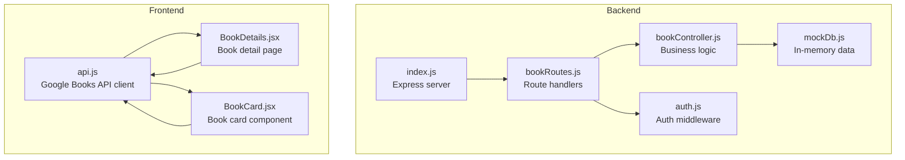
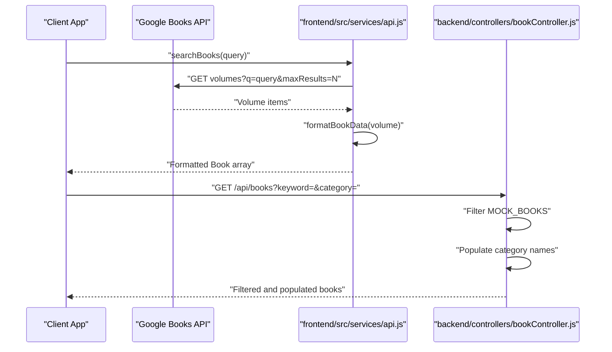
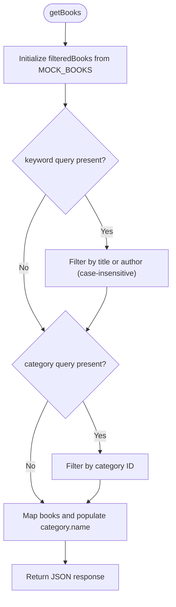
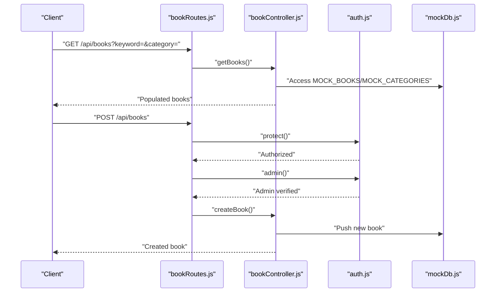
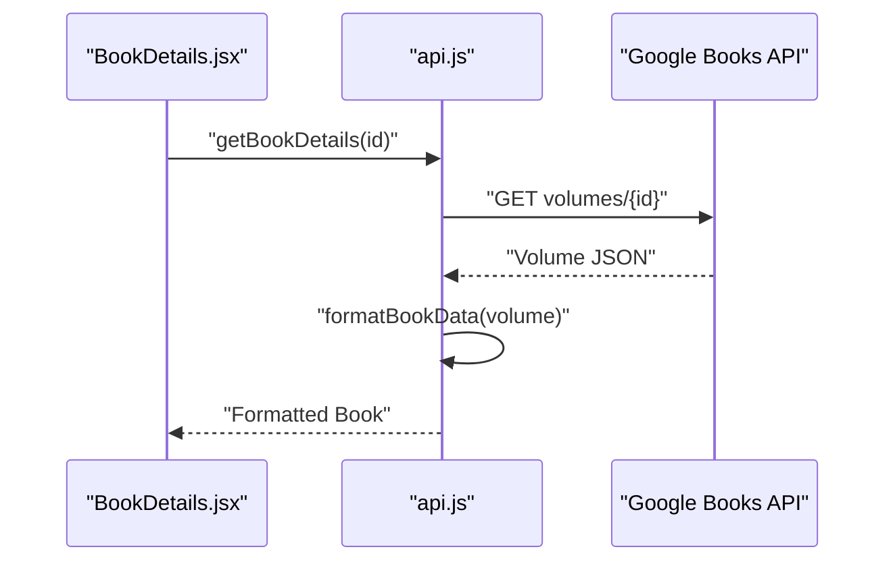
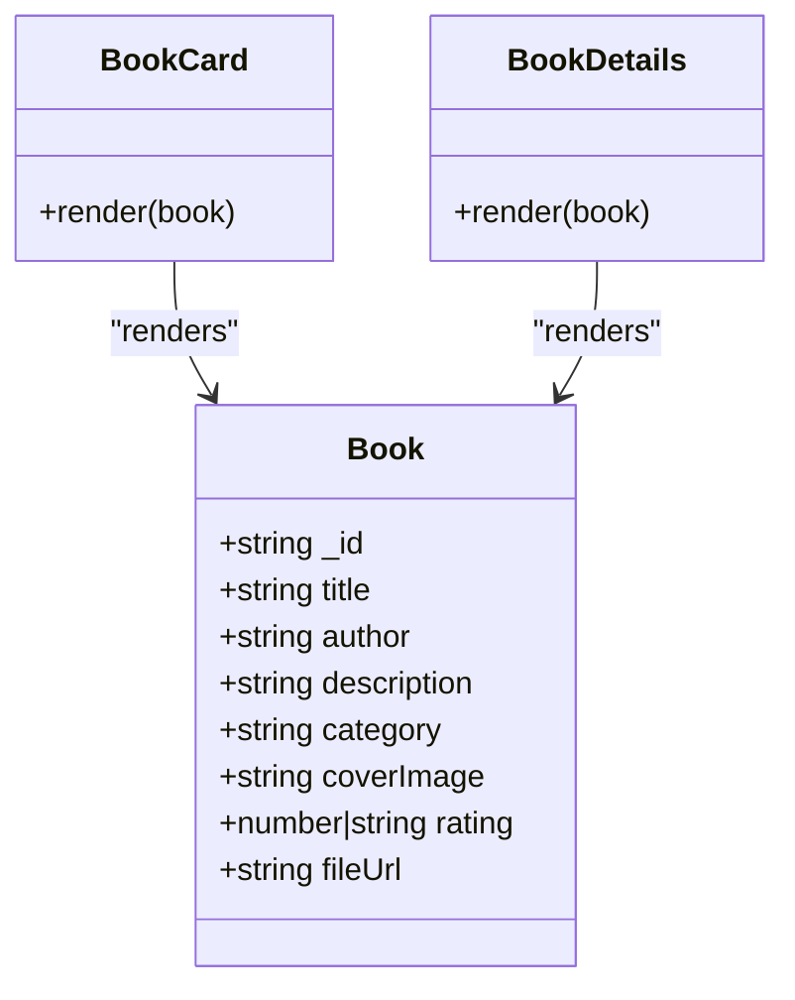
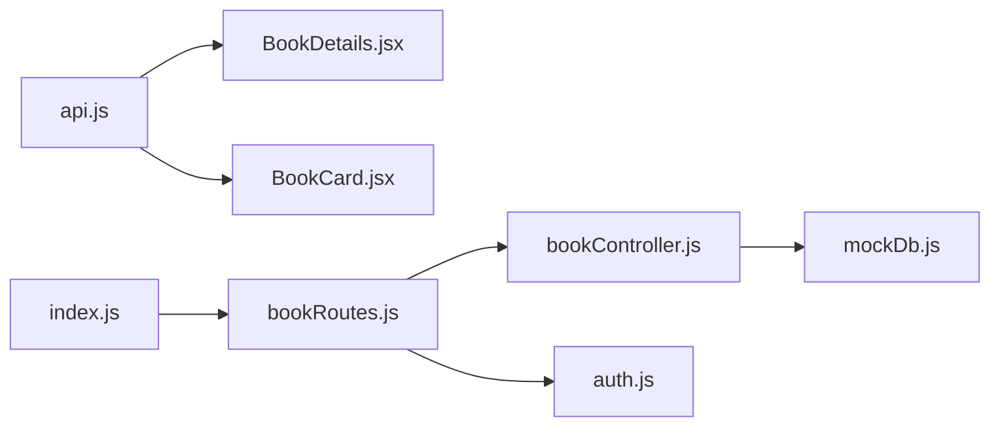

# Book Data Model

<cite>
**Referenced Files in This Document**
- [mockDb.js](file://backend/data/mockDb.js)
- [bookController.js](file://backend/controllers/bookController.js)
- [bookRoutes.js](file://backend/routes/bookRoutes.js)
- [index.js](file://backend/index.js)
- [auth.js](file://backend/middleware/auth.js)
- [api.js](file://frontend/src/services/api.js)
- [BookDetails.jsx](file://frontend/src/pages/BookDetails.jsx)
- [BookCard.jsx](file://frontend/src/components/BookCard.jsx)
</cite>

## Table of Contents
1. [Introduction](#introduction)
2. [Project Structure](#project-structure)
3. [Core Components](#core-components)
4. [Architecture Overview](#architecture-overview)
5. [Detailed Component Analysis](#detailed-component-analysis)
6. [Dependency Analysis](#dependency-analysis)
7. [Performance Considerations](#performance-considerations)
8. [Troubleshooting Guide](#troubleshooting-guide)
9. [Conclusion](#conclusion)
10. [Appendices](#appendices)

## Introduction
This document provides comprehensive data model documentation for the Book entity in ReadSphere. It covers all book properties, relationships with Category entities, rating system implementation, image handling patterns, search and filtering capabilities, validation rules, lifecycle management, and integration with external book sources. It also documents mock data implementation, testing strategies, and common CRUD operations.

## Project Structure
The Book data model spans backend and frontend layers:
- Backend: In-memory mock database, controllers, routes, and middleware define the Book entity and its operations.
- Frontend: Services integrate with external book APIs, format data, and render Book components.

**Diagram sources**
- [index.js:1-27](file://backend/index.js#L1-L27)
- [bookRoutes.js:1-10](file://backend/routes/bookRoutes.js#L1-L10)
- [bookController.js:1-69](file://backend/controllers/bookController.js#L1-L69)
- [mockDb.js:1-51](file://backend/data/mockDb.js#L1-L51)
- [auth.js:1-34](file://backend/middleware/auth.js#L1-L34)
- [api.js:1-284](file://frontend/src/services/api.js#L1-L284)
- [BookDetails.jsx:1-233](file://frontend/src/pages/BookDetails.jsx#L1-L233)
- [BookCard.jsx:1-71](file://frontend/src/components/BookCard.jsx#L1-L71)

**Section sources**
- [index.js:1-27](file://backend/index.js#L1-L27)
- [bookRoutes.js:1-10](file://backend/routes/bookRoutes.js#L1-L10)
- [bookController.js:1-69](file://backend/controllers/bookController.js#L1-L69)
- [mockDb.js:1-51](file://backend/data/mockDb.js#L1-L51)
- [auth.js:1-34](file://backend/middleware/auth.js#L1-L34)
- [api.js:1-284](file://frontend/src/services/api.js#L1-L284)
- [BookDetails.jsx:1-233](file://frontend/src/pages/BookDetails.jsx#L1-L233)
- [BookCard.jsx:1-71](file://frontend/src/components/BookCard.jsx#L1-L71)

## Core Components
This section defines the Book entity and its relationships with Categories, along with property-level documentation and validation rules.

- Entity: Book
  - _id: Unique identifier for the book record. In backend mock data, IDs are prefixed (e.g., "b1", "b2"). In frontend Google Books integration, IDs are provided by the external API (e.g., "zyTCAlFPjgYC").
  - title: String. Required. Display name of the book.
  - author: String. Required. Author(s) of the book.
  - description: String. Optional. Summary or synopsis of the book.
  - category: Reference to Category. In backend mock data, category is a foreign key string (e.g., "c1", "c2", "c3"). In frontend integration, category is a string label (e.g., "Fiction", "Self-Help").
  - coverImage: URL string. Optional. HTTPS URL to the book cover image. Defaults to a fallback image if unavailable.
  - rating: Number or string. Optional. Numeric rating value (e.g., 4.5). In backend mock data, ratings are numeric; in frontend integration, ratings may be numeric or mocked if missing.
  - fileUrl: URL string. Optional. Direct link to a downloadable file (PDF). Used to enable direct reading in the application.

- Entity: Category
  - _id: Unique identifier for the category (backend mock data).
  - name: String. Category label (e.g., "Thriller", "Self-Help", "Sci-Fi").

- Relationships
  - One-to-many: Category to Books. Each Book belongs to one Category.
  - Foreign key pattern: Backend uses category IDs as strings ("c1", "c2") to reference categories. Frontend receives category labels from external APIs.

- Validation Rules
  - Required fields for creation: title, author, category.
  - Optional fields: description, coverImage, rating, fileUrl.
  - Image handling: coverImage URLs are normalized to HTTPS to prevent mixed content warnings.

- Data Integrity Constraints
  - Category existence: Backend resolves category names by matching category IDs. Unknown categories default to a generic label.
  - Rating normalization: Ratings are stored as numeric values in backend mock data; frontend may normalize or mock ratings if missing.

**Section sources**
- [mockDb.js:7-48](file://backend/data/mockDb.js#L7-L48)
- [bookController.js:46-66](file://backend/controllers/bookController.js#L46-L66)
- [api.js:82-112](file://frontend/src/services/api.js#L82-L112)
- [BookCard.jsx:57](file://frontend/src/components/BookCard.jsx#L57)

## Architecture Overview
The Book data model integrates internal mock data with external book sources. Backend routes expose CRUD endpoints for internal books, while frontend services integrate with Google Books API to enrich the data model with external metadata.

**Diagram sources**
- [api.js:120-144](file://frontend/src/services/api.js#L120-L144)
- [bookController.js:3-29](file://backend/controllers/bookController.js#L3-L29)

**Section sources**
- [api.js:120-144](file://frontend/src/services/api.js#L120-L144)
- [bookController.js:3-29](file://backend/controllers/bookController.js#L3-L29)

## Detailed Component Analysis

### Backend Book Controller
The backend controller implements search, filtering, population of category names, and creation of new books. It operates on in-memory mock data and exposes endpoints via Express routes.

**Diagram sources**
- [bookController.js:3-29](file://backend/controllers/bookController.js#L3-L29)

Key behaviors:
- Search and filtering: Supports keyword-based search across title and author, and category filtering by category ID.
- Category population: Resolves category names by matching category IDs against mock categories.
- Creation: Accepts title, author, description, category, coverImage, fileUrl; assigns a default rating of zero and generates a sequential ID.

**Section sources**
- [bookController.js:3-29](file://backend/controllers/bookController.js#L3-L29)
- [bookController.js:46-66](file://backend/controllers/bookController.js#L46-L66)

### Backend Routes and Authentication
The routes define endpoint contracts and apply authentication middleware. GET endpoints are publicly accessible for listing and retrieving books; POST requires JWT protection and admin role.

**Diagram sources**
- [bookRoutes.js:6](file://backend/routes/bookRoutes.js#L6)
- [auth.js:3-31](file://backend/middleware/auth.js#L3-L31)
- [bookController.js:46-66](file://backend/controllers/bookController.js#L46-L66)
- [mockDb.js:7-48](file://backend/data/mockDb.js#L7-L48)

**Section sources**
- [bookRoutes.js:6](file://backend/routes/bookRoutes.js#L6)
- [auth.js:3-31](file://backend/middleware/auth.js#L3-L31)
- [bookController.js:46-66](file://backend/controllers/bookController.js#L46-L66)
- [mockDb.js:7-48](file://backend/data/mockDb.js#L7-L48)

### Frontend Integration with External Book Sources
The frontend service integrates with the Google Books API to search, fetch details, and filter books with embedded previews. It normalizes and enriches the Book data model with external metadata.

**Diagram sources**
- [BookDetails.jsx:21](file://frontend/src/pages/BookDetails.jsx#L21)
- [api.js:151-168](file://frontend/src/services/api.js#L151-L168)
- [api.js:82-112](file://frontend/src/services/api.js#L82-L112)

Key behaviors:
- Data enrichment: Formats raw API responses into the internal Book model with standardized fields.
- Fallback handling: Uses mock data when API requests fail or return empty results.
- Preview detection: Checks embeddable and viewability flags to determine reading options.

**Section sources**
- [api.js:120-144](file://frontend/src/services/api.js#L120-L144)
- [api.js:151-168](file://frontend/src/services/api.js#L151-L168)
- [api.js:217-237](file://frontend/src/services/api.js#L217-L237)
- [BookDetails.jsx:40-57](file://frontend/src/pages/BookDetails.jsx#L40-L57)

### Book Rendering Components
Book rendering components consume both internal and external Book data models to display cover images, ratings, categories, and action buttons.

**Diagram sources**
- [BookCard.jsx:5](file://frontend/src/components/BookCard.jsx#L5)
- [BookDetails.jsx:6](file://frontend/src/pages/BookDetails.jsx#L6)

**Section sources**
- [BookCard.jsx:5](file://frontend/src/components/BookCard.jsx#L5)
- [BookDetails.jsx:6](file://frontend/src/pages/BookDetails.jsx#L6)

## Dependency Analysis
The Book data model depends on:
- Backend mock data for internal operations.
- External Google Books API for enrichment and discovery.
- Authentication middleware for protected operations.

**Diagram sources**
- [api.js:1-284](file://frontend/src/services/api.js#L1-L284)
- [BookDetails.jsx:1-233](file://frontend/src/pages/BookDetails.jsx#L1-L233)
- [BookCard.jsx:1-71](file://frontend/src/components/BookCard.jsx#L1-L71)
- [bookController.js:1-69](file://backend/controllers/bookController.js#L1-L69)
- [mockDb.js:1-51](file://backend/data/mockDb.js#L1-L51)
- [bookRoutes.js:1-10](file://backend/routes/bookRoutes.js#L1-L10)
- [auth.js:1-34](file://backend/middleware/auth.js#L1-L34)
- [index.js:1-27](file://backend/index.js#L1-L27)

**Section sources**
- [api.js:1-284](file://frontend/src/services/api.js#L1-L284)
- [bookController.js:1-69](file://backend/controllers/bookController.js#L1-L69)
- [mockDb.js:1-51](file://backend/data/mockDb.js#L1-L51)
- [bookRoutes.js:1-10](file://backend/routes/bookRoutes.js#L1-L10)
- [auth.js:1-34](file://backend/middleware/auth.js#L1-L34)
- [index.js:1-27](file://backend/index.js#L1-L27)

## Performance Considerations
- Filtering complexity: Backend filtering uses linear scans over mock arrays. For larger datasets, consider indexing or database-backed storage.
- Image loading: Frontend components use lazy loading and skeleton placeholders to improve perceived performance.
- API fallback: Frontend services fall back to mock data when external APIs are unavailable, reducing downtime and improving reliability.

## Troubleshooting Guide
Common issues and resolutions:
- Missing category name: Backend populates category names by matching category IDs. If a category ID is unknown, it defaults to a generic label.
- Empty or malformed coverImage: Frontend normalizes URLs to HTTPS and falls back to a default image if unavailable.
- API errors: Frontend services log warnings and return mock data to maintain functionality during outages.
- Authentication failures: Protected endpoints require a valid JWT and admin role; unauthorized requests receive explicit error responses.

**Section sources**
- [bookController.js:19-23](file://backend/controllers/bookController.js#L19-L23)
- [api.js:86-95](file://frontend/src/services/api.js#L86-L95)
- [api.js:128-131](file://frontend/src/services/api.js#L128-L131)
- [auth.js:15-22](file://backend/middleware/auth.js#L15-L22)

## Conclusion
The Book data model in ReadSphere combines an internal mock representation with external enrichment from Google Books. It supports robust search and filtering, category association, image handling, and lifecycle operations. The architecture balances simplicity for development with extensibility for production-grade persistence and scaling.

## Appendices

### Sample Records from Mock Database
- Internal mock books include fields such as _id, title, author, category, description, coverImage, rating, and fileUrl. Categories are represented by IDs mapped to names in backend responses.

**Section sources**
- [mockDb.js:7-48](file://backend/data/mockDb.js#L7-L48)

### External Book Integration Examples
- The frontend service formats Google Books API responses into the internal Book model, including cover image normalization, rating handling, and optional AI summary generation.

**Section sources**
- [api.js:82-112](file://frontend/src/services/api.js#L82-L112)

### Common CRUD Operations
- Retrieve all books with optional keyword and category filters.
- Retrieve a single book by ID.
- Create a new book with required fields and optional metadata.

**Section sources**
- [bookController.js:3-44](file://backend/controllers/bookController.js#L3-L44)
- [bookController.js:46-66](file://backend/controllers/bookController.js#L46-L66)

### Testing Strategies
- Unit tests for backend filtering and population logic.
- Frontend snapshot tests for BookCard and BookDetails rendering.
- Integration tests for API service functions and fallback behavior.
- Mock data-driven tests to validate category resolution and image handling.

[No sources needed since this section provides general guidance]