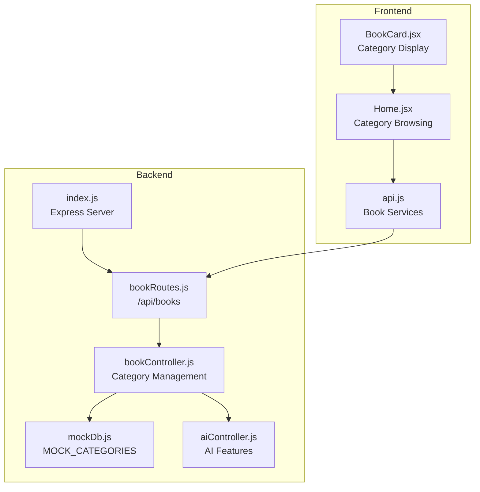
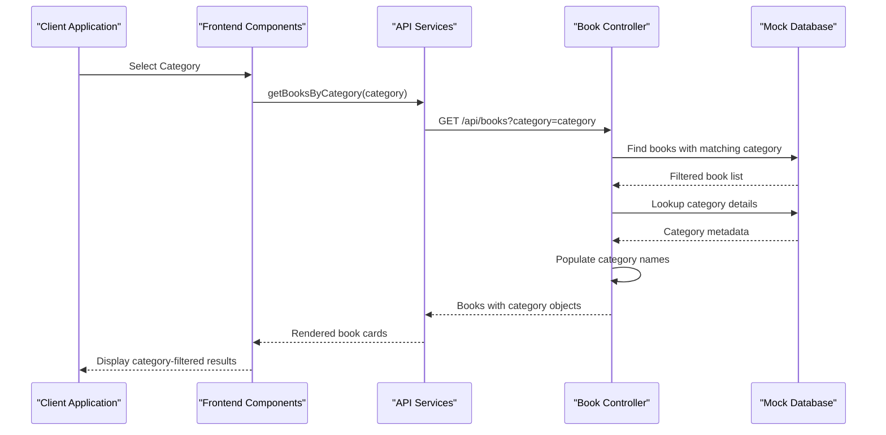
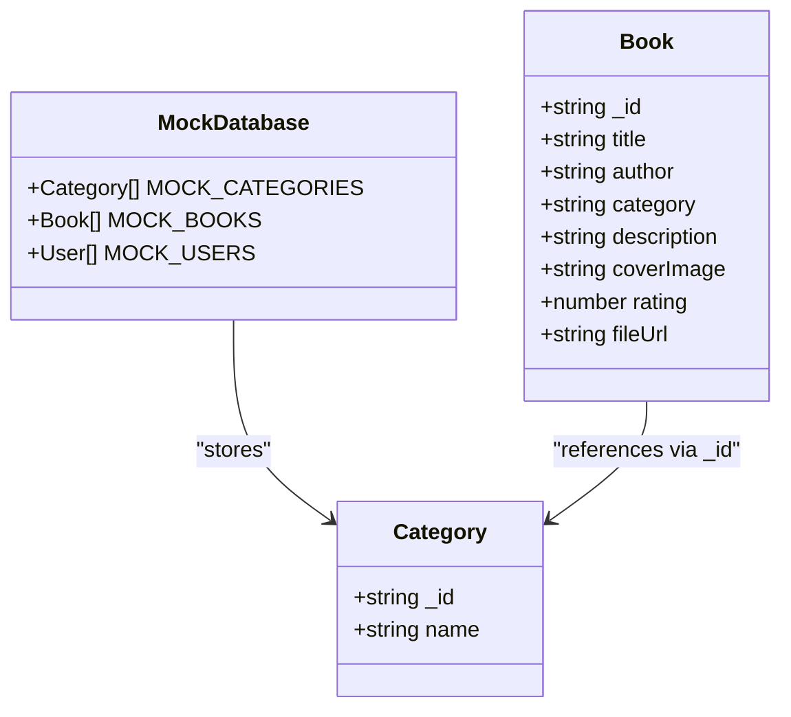
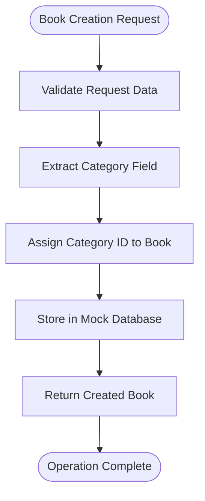
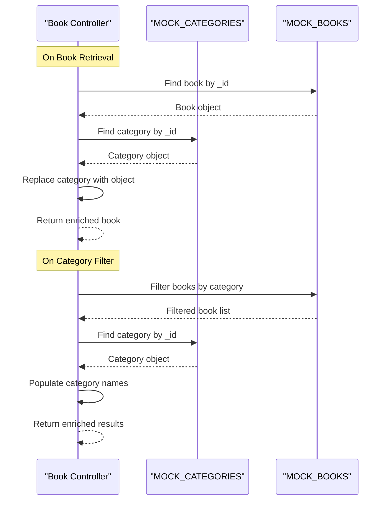
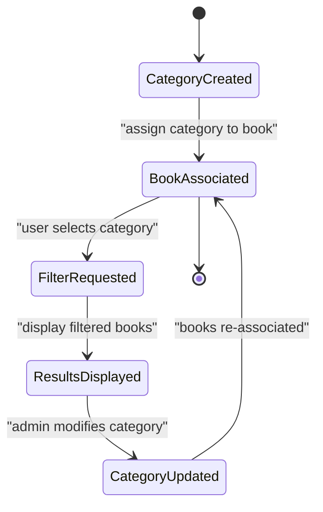
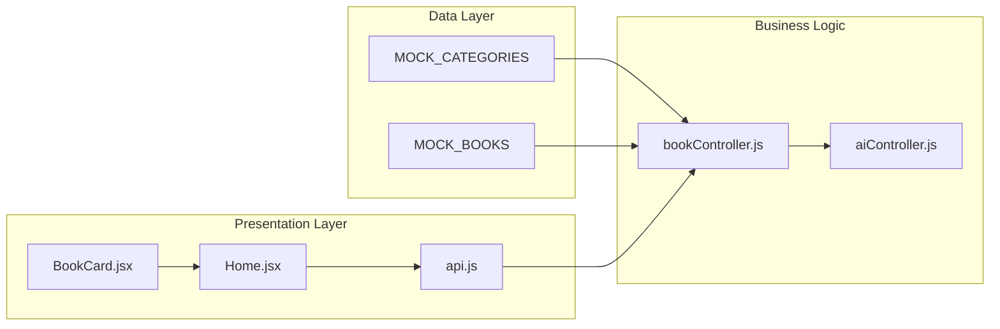

# Category Data Model

<cite>
**Referenced Files in This Document**
- [mockDb.js](file://backend/data/mockDb.js)
- [bookController.js](file://backend/controllers/bookController.js)
- [bookRoutes.js](file://backend/routes/bookRoutes.js)
- [aiController.js](file://backend/controllers/aiController.js)
- [Home.jsx](file://frontend/src/pages/Home.jsx)
- [BookCard.jsx](file://frontend/src/components/BookCard.jsx)
- [api.js](file://frontend/src/services/api.js)
- [index.js](file://backend/index.js)
</cite>

## Table of Contents
1. [Introduction](#introduction)
2. [Project Structure](#project-structure)
3. [Core Components](#core-components)
4. [Architecture Overview](#architecture-overview)
5. [Detailed Component Analysis](#detailed-component-analysis)
6. [Dependency Analysis](#dependency-analysis)
7. [Performance Considerations](#performance-considerations)
8. [Troubleshooting Guide](#troubleshooting-guide)
9. [Conclusion](#conclusion)

## Introduction
This document provides comprehensive data model documentation for the Category entity in ReadSphere. It explains the category structure with `_id` and `name` properties, details the relationship between categories and books through foreign key references, and documents category management capabilities including creation, association with books, and filtering functionality. The document also covers predefined categories in the mock data (Thriller, Self-Help, Sci-Fi), integration with book filtering systems, category lifecycle management, data integrity considerations, and usage patterns in book discovery and browsing features.

## Project Structure
The category data model is implemented using a mock database approach with in-memory arrays for users, books, and categories. The backend exposes REST endpoints for book operations, while the frontend provides category-based browsing and filtering capabilities.

**Diagram sources**
- [index.js:11-15](file://backend/index.js#L11-L15)
- [bookRoutes.js:1-9](file://backend/routes/bookRoutes.js#L1-L9)
- [bookController.js:1-68](file://backend/controllers/bookController.js#L1-L68)
- [mockDb.js:44-48](file://backend/data/mockDb.js#L44-L48)
- [aiController.js:1-27](file://backend/controllers/aiController.js#L1-L27)
- [Home.jsx:317-334](file://frontend/src/pages/Home.jsx#L317-L334)
- [BookCard.jsx:57](file://frontend/src/components/BookCard.jsx#L57)
- [api.js:184-189](file://frontend/src/services/api.js#L184-L189)

**Section sources**
- [index.js:11-15](file://backend/index.js#L11-L15)
- [bookRoutes.js:1-9](file://backend/routes/bookRoutes.js#L1-L9)
- [mockDb.js:44-48](file://backend/data/mockDb.js#L44-L48)

## Core Components
The Category entity consists of two primary properties:
- `_id`: Unique identifier for the category (string)
- `name`: Human-readable category name (string)

Categories are stored in the mock database as an array of objects with these properties. The current predefined categories include Thriller, Self-Help, and Sci-Fi, each with distinct identifiers.

**Section sources**
- [mockDb.js:44-48](file://backend/data/mockDb.js#L44-L48)

## Architecture Overview
The category system operates through a client-server architecture with clear separation of concerns:

**Diagram sources**
- [bookController.js:15-23](file://backend/controllers/bookController.js#L15-L23)
- [bookController.js:36-37](file://backend/controllers/bookController.js#L36-L37)
- [api.js:184-189](file://frontend/src/services/api.js#L184-L189)

The architecture demonstrates a clean separation between data storage (in-memory arrays), business logic (controller methods), and presentation (frontend components). Categories serve as foreign keys linking books to their respective genres.

**Section sources**
- [bookController.js:1-68](file://backend/controllers/bookController.js#L1-L68)
- [Home.jsx:317-334](file://frontend/src/pages/Home.jsx#L317-L334)

## Detailed Component Analysis

### Category Data Structure
The Category entity follows a simple yet effective data model:

**Diagram sources**
- [mockDb.js:44-48](file://backend/data/mockDb.js#L44-L48)
- [mockDb.js:7-42](file://backend/data/mockDb.js#L7-L42)

The category structure provides:
- Unique identification through `_id` field
- Human-readable categorization via `name` field
- Foreign key relationship with books through the `category` property

**Section sources**
- [mockDb.js:44-48](file://backend/data/mockDb.js#L44-L48)
- [mockDb.js:7-42](file://backend/data/mockDb.js#L7-L42)

### Category Management Capabilities

#### Creation and Association
Books can be created with category associations through the backend API. The creation process involves:

1. **Category Validation**: The system expects a valid category identifier
2. **Foreign Key Assignment**: The book receives the category `_id` as its `category` property
3. **Storage Persistence**: New books are appended to the mock database array

**Diagram sources**
- [bookController.js:46-66](file://backend/controllers/bookController.js#L46-L66)

#### Filtering Functionality
The system provides robust category filtering through multiple mechanisms:

**Backend Filtering**:
- Query parameter support (`?category=categoryName`)
- Manual category population for display consistency
- Graceful fallback to "General" category for unknown references

**Frontend Integration**:
- Category pill navigation with visual selection state
- Real-time filtering updates without page reload
- Responsive category display in book cards

**Section sources**
- [bookController.js:15-23](file://backend/controllers/bookController.js#L15-L23)
- [bookController.js:36-37](file://backend/controllers/bookController.js#L36-L37)
- [Home.jsx:317-334](file://frontend/src/pages/Home.jsx#L317-L334)

### Predefined Categories and Mock Data
The current mock data defines three primary categories:

| Category ID | Category Name | Description |
|-------------|---------------|-------------|
| c1 | Thriller | Psychological thrillers and mystery novels |
| c2 | Self-Help | Personal development and self-improvement books |
| c3 | Sci-Fi | Science fiction and fantasy literature |

These categories demonstrate the foreign key relationship pattern where books reference categories by their `_id` values rather than storing redundant category data.

**Section sources**
- [mockDb.js:44-48](file://backend/data/mockDb.js#L44-L48)

### Category Lookup Patterns
The system implements several category lookup patterns for different use cases:

**Diagram sources**
- [bookController.js:20-23](file://backend/controllers/bookController.js#L20-L23)
- [bookController.js:36-37](file://backend/controllers/bookController.js#L36-L37)

**Section sources**
- [bookController.js:20-23](file://backend/controllers/bookController.js#L20-L23)
- [bookController.js:36-37](file://backend/controllers/bookController.js#L36-L37)

### Integration with Book Filtering Systems
The category system integrates seamlessly with the book filtering infrastructure:

**Backend Integration**:
- Category-aware book retrieval with automatic enrichment
- Support for both category-based filtering and keyword searches
- Consistent category object structure across all book operations

**Frontend Integration**:
- Category pill navigation with active state management
- Dynamic book grid updates based on category selection
- Responsive category display in book cards and hero sections

**Section sources**
- [bookController.js:15-23](file://backend/controllers/bookController.js#L15-L23)
- [Home.jsx:317-334](file://frontend/src/pages/Home.jsx#L317-L334)
- [BookCard.jsx:57](file://frontend/src/components/BookCard.jsx#L57)

### Category Lifecycle Management
The category lifecycle encompasses creation, association, filtering, and display phases:

**Diagram sources**
- [bookController.js:46-66](file://backend/controllers/bookController.js#L46-L66)
- [mockDb.js:44-48](file://backend/data/mockDb.js#L44-L48)

**Section sources**
- [bookController.js:46-66](file://backend/controllers/bookController.js#L46-L66)
- [mockDb.js:44-48](file://backend/data/mockDb.js#L44-L48)

## Dependency Analysis
The category system exhibits clear dependency relationships:

**Diagram sources**
- [bookController.js:1](file://backend/controllers/bookController.js#L1)
- [aiController.js:1](file://backend/controllers/aiController.js#L1)
- [Home.jsx:5](file://frontend/src/pages/Home.jsx#L5)
- [BookCard.jsx:1](file://frontend/src/components/BookCard.jsx#L1)
- [api.js:5](file://frontend/src/services/api.js#L5)

**Section sources**
- [bookController.js:1](file://backend/controllers/bookController.js#L1)
- [aiController.js:1](file://backend/controllers/aiController.js#L1)
- [Home.jsx:5](file://frontend/src/pages/Home.jsx#L5)

## Performance Considerations
The current implementation uses in-memory arrays with O(n) lookup complexity. For production scenarios, consider:

- **Indexing**: Create category lookup indices for faster O(1) access
- **Caching**: Implement category caching to reduce repeated lookups
- **Pagination**: Add pagination for large category collections
- **Database Migration**: Transition to persistent storage with proper indexing

## Troubleshooting Guide
Common category-related issues and solutions:

**Missing Category References**:
- Symptom: Books display as "General" category
- Cause: Category ID not found in MOCK_CATEGORIES
- Solution: Verify category exists in mock database or create missing category

**Category Filtering Not Working**:
- Symptom: Category filter returns empty results
- Cause: Mismatch between category names and book category IDs
- Solution: Ensure category names match the expected format and IDs

**Category Display Issues**:
- Symptom: Category names not displaying correctly
- Cause: Frontend expects category object structure
- Solution: Verify backend properly populates category objects during enrichment

**Section sources**
- [bookController.js:22](file://backend/controllers/bookController.js#L22)
- [bookController.js:37](file://backend/controllers/bookController.js#L37)
- [BookCard.jsx:57](file://frontend/src/components/BookCard.jsx#L57)

## Conclusion
The Category data model in ReadSphere provides a clean, efficient solution for organizing and filtering books by genre. The implementation demonstrates good separation of concerns with clear data structures, robust filtering capabilities, and seamless frontend integration. The current mock-based approach serves as an excellent foundation for development and testing, with clear migration paths to persistent storage for production deployment.

The category system successfully balances simplicity with functionality, enabling users to discover books through intuitive category-based browsing while maintaining data integrity through foreign key relationships. Future enhancements should focus on performance optimization and persistence layer improvements to support larger-scale operations.