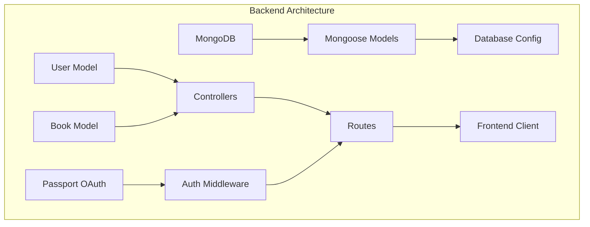
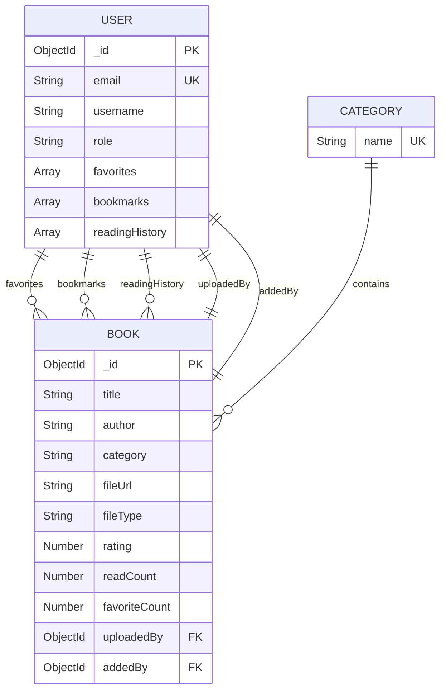
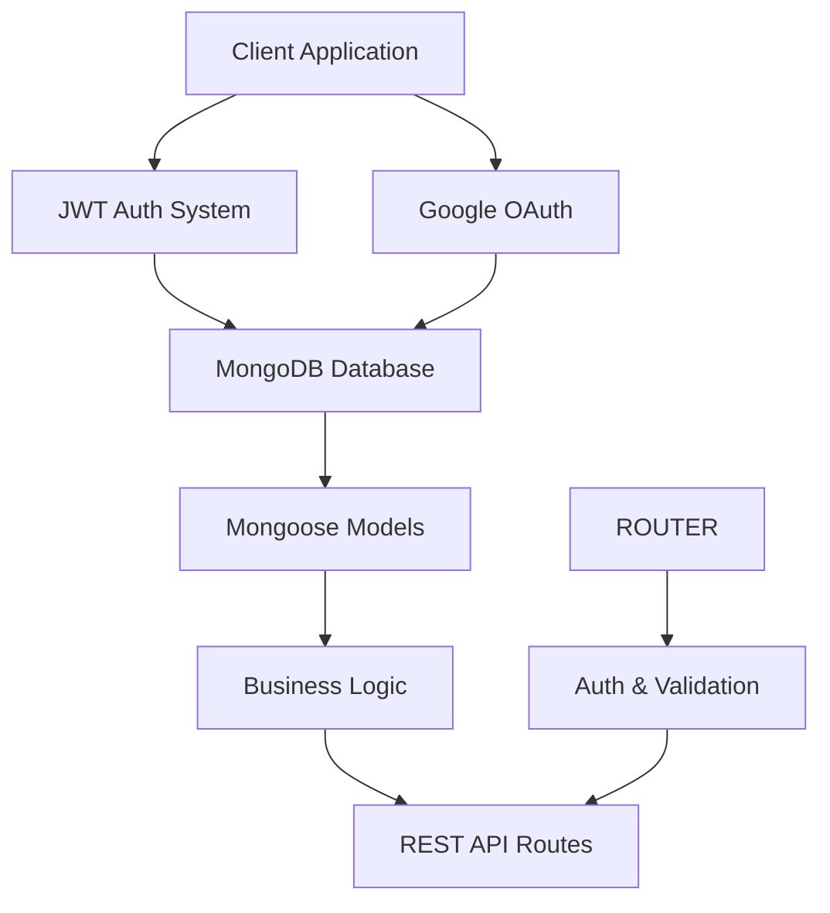
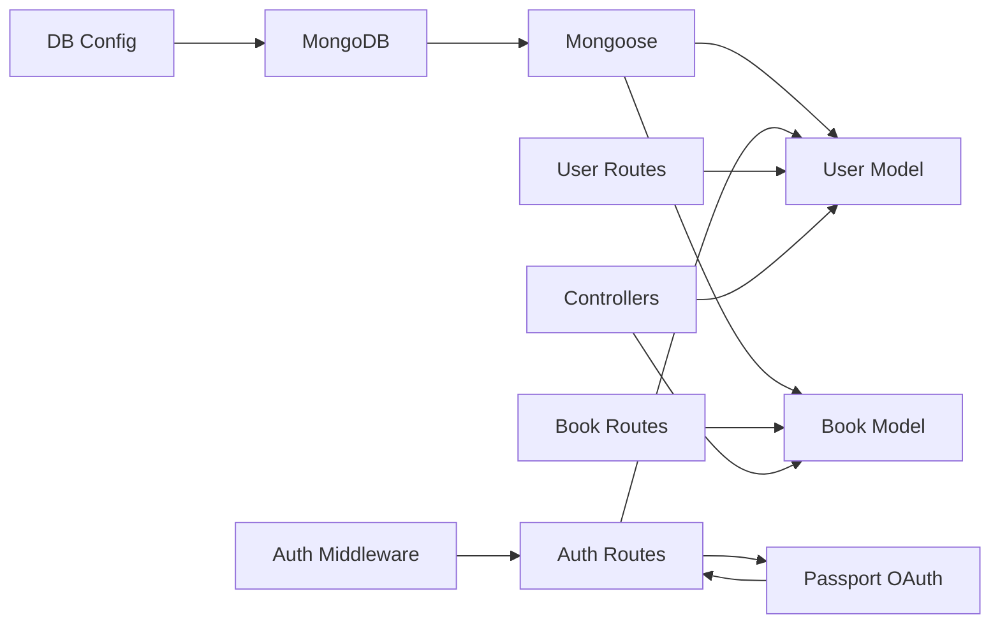

# Data Models and Database Schema

<cite>
**Referenced Files in This Document**
- [User.js](file://backend/models/User.js)
- [Book.js](file://backend/models/Book.js)
- [db.js](file://backend/config/db.js)
- [passport.js](file://backend/config/passport.js)
- [userController.js](file://backend/controllers/userController.js)
- [bookController.js](file://backend/controllers/bookController.js)
- [authController.js](file://backend/controllers/authController.js)
- [userRoutes.js](file://backend/routes/userRoutes.js)
- [bookRoutes.js](file://backend/routes/bookRoutes.js)
- [authRoutes.js](file://backend/routes/authRoutes.js)
- [mockDb.js](file://backend/data/mockDb.js)
</cite>

## Update Summary
**Changes Made**
- Updated User model documentation to reflect comprehensive Mongoose schema with OAuth support
- Enhanced Book model documentation with advanced metadata tracking and file format support
- Added MongoDB/Mongoose integration details and connection management
- Updated authentication system documentation with OAuth capabilities
- Expanded data validation rules and business constraints
- Added advanced relationship definitions and population strategies
- Updated mock database implementation to reflect current in-memory structure

## Table of Contents
1. [Introduction](#introduction)
2. [Project Structure](#project-structure)
3. [Core Components](#core-components)
4. [Architecture Overview](#architecture-overview)
5. [Detailed Component Analysis](#detailed-component-analysis)
6. [Dependency Analysis](#dependency-analysis)
7. [Performance Considerations](#performance-considerations)
8. [Troubleshooting Guide](#troubleshooting-guide)
9. [Conclusion](#conclusion)
10. [Appendices](#appendices)

## Introduction
This document provides comprehensive data model documentation for ReadSphere's entities and relationships. The application has evolved from a simple mock database implementation to a full-featured MongoDB-based system with advanced user management, OAuth integration, and sophisticated book metadata tracking. This documentation covers the User, Book, and Category models, along with MongoDB integration, data population strategies, CRUD operations, validation rules, business constraints, and data integrity considerations.

## Project Structure
The backend follows a modern Express.js architecture with MongoDB integration:
- Data layer: Mongoose models with comprehensive schemas and validation
- Authentication: JWT-based local auth plus Google OAuth integration
- Controllers: Handle business logic with proper error handling
- Routes: Expose REST endpoints with role-based access control
- Middleware: Authentication, authorization, and request validation
- Database: MongoDB connection management and model definitions

**Diagram sources**
- [db.js:1-15](file://backend/config/db.js#L1-L15)
- [passport.js:1-80](file://backend/config/passport.js#L1-L80)
- [User.js:1-129](file://backend/models/User.js#L1-L129)
- [Book.js:1-113](file://backend/models/Book.js#L1-L113)

**Section sources**
- [db.js:1-15](file://backend/config/db.js#L1-L15)
- [passport.js:1-80](file://backend/config/passport.js#L1-L80)
- [User.js:1-129](file://backend/models/User.js#L1-L129)
- [Book.js:1-113](file://backend/models/Book.js#L1-L113)

## Core Components
This section documents the three primary data models and their relationships with comprehensive validation rules and business constraints.

### User Model
The User entity stores identity, authentication credentials, OAuth integration, and comprehensive reading preferences.

#### Core Properties
- **Local Authentication**
  - email: String, required, unique, lowercase, trimmed
  - password: String (hashed, optional for OAuth users)
  
- **Google OAuth Fields**
  - googleId: String (sparse index for unique OAuth identification)
  
- **Profile Information**
  - username: String, required, trimmed
  - displayName: String, trimmed
  - avatar: String (URL for profile image)
  
- **Account Management**
  - role: Enum ['user', 'admin'], defaults to 'user'
  - isActive: Boolean, defaults to true
  - lastLogin: Date (track user activity)
  
- **Reading Preferences**
  - favorites: Array of ObjectId references to Book
  - bookmarks: Array of objects with book (ObjectId), page (Number), addedAt (Date)
  - readingHistory: Array of objects with book (ObjectId), lastPage (Number), lastRead (Date)

#### Advanced Features
- **Timestamp Management**: Automatic updatedAt timestamps on save
- **Password Security**: Bcrypt hashing with salt rounds (10)
- **Public Profile**: Exposable profile data excluding sensitive fields
- **OAuth Integration**: Seamless Google login with automatic user linking

#### Business Constraints
- Email uniqueness enforced via MongoDB unique index
- Password hashing performed before persistence
- Role-based access control for administrative endpoints
- OAuth users may not have passwords (handled gracefully)
- Favorites and bookmarks arrays managed with duplicate prevention

#### Data Integrity
- Mongoose schema validation with type checking
- Population of referenced documents in routes
- Automatic timestamp updates on modifications
- Safe handling of OAuth-only accounts

**Section sources**
- [User.js:4-93](file://backend/models/User.js#L4-L93)
- [User.js:95-124](file://backend/models/User.js#L95-L124)
- [authRoutes.js:33-46](file://backend/routes/authRoutes.js#L33-L46)
- [userRoutes.js:10-27](file://backend/routes/userRoutes.js#L10-L27)

### Book Model
The Book entity represents literary works with comprehensive metadata, file management, and source tracking.

#### Core Properties
- **Basic Metadata**
  - title: String, required, trimmed
  - author: String, required, trimmed
  - description: String, defaults to empty string
  
- **Classification & Organization**
  - category: String, required, enum validation ['Fiction', 'Mystery', 'Romance', 'Sci-Fi', 'Horror', 'History', 'Classic', 'Adventure', 'Poetry', 'Self-Help', 'Productivity', 'Thriller', 'Other']
  - coverImage: String, defaults to empty string
  
- **File Management**
  - fileUrl: String, required (supports multiple formats)
  - fileType: Enum ['pdf', 'epub', 'txt'], defaults to 'pdf'
  - pages: Number, defaults to 0
  
- **Publication Details**
  - publishYear: String, defaults to empty string
  
- **Rating & Analytics**
  - rating: Number, defaults to 0, min 0, max 5
  - readCount: Number, defaults to 0
  - favoriteCount: Number, defaults to 0
  
- **Source Tracking**
  - source: Enum ['gutenberg', 'uploaded', 'admin'], defaults to 'uploaded'
  - uploadedBy: ObjectId reference to User (for uploaded books)
  - uploadStatus: Enum ['pending', 'approved', 'rejected'], defaults to 'approved'
  - addedBy: ObjectId reference to User (for admin-added books)
  
- **Lifecycle Management**
  - isActive: Boolean, defaults to true
  - createdAt/updatedAt: Automatic timestamps

#### Advanced Features
- **Search Optimization**: Text index on title, author, and description
- **Source Integration**: Built-in support for Project Gutenberg books
- **Upload Management**: Pending approval workflow for user uploads
- **Analytics Tracking**: Comprehensive read and favorite metrics

#### Business Constraints
- Category validation ensures consistent classification
- File type enumeration prevents unsupported formats
- Rating bounds enforcement (0-5 scale)
- Source tracking maintains provenance
- Upload status workflow manages content moderation

#### Data Integrity
- Mongoose schema validation with enums and ranges
- Population of user references for audit trails
- Automatic timestamp management
- Search index optimization for performance

**Section sources**
- [Book.js:3-99](file://backend/models/Book.js#L3-L99)
- [Book.js:107-108](file://backend/models/Book.js#L107-L108)
- [bookRoutes.js:103-127](file://backend/routes/bookRoutes.js#L103-L127)

### Category Model
The Category entity defines subject classifications for books with comprehensive validation.

#### Properties
- **Identification**
  - name: String, required, unique
  
- **Business Rules**
  - Categories are validated against predefined list
  - Used for filtering and organization
  - Supports hierarchical categorization through naming conventions

#### Data Integrity
- Category names are unique and validated
- Used as display labels throughout the application
- References maintained across Book documents

**Section sources**
- [bookRoutes.js:188-195](file://backend/routes/bookRoutes.js#L188-L195)

### Entity Relationships
The relationships among entities are defined through Mongoose ObjectId references:

**Diagram sources**
- [User.js:44-71](file://backend/models/User.js#L44-L71)
- [Book.js:18-76](file://backend/models/Book.js#L18-L76)

**Section sources**
- [User.js:44-71](file://backend/models/User.js#L44-L71)
- [Book.js:18-76](file://backend/models/Book.js#L18-L76)

## Architecture Overview
The data model architecture is built on MongoDB with Mongoose for schema definition and validation. The system supports both local authentication and Google OAuth, with comprehensive user preferences and book metadata tracking.

**Diagram sources**
- [authRoutes.js:8-14](file://backend/routes/authRoutes.js#L8-L14)
- [passport.js:20-77](file://backend/config/passport.js#L20-L77)
- [db.js:3-12](file://backend/config/db.js#L3-L12)

## Detailed Component Analysis

### Database Connection & Configuration
The application uses MongoDB with Mongoose for data persistence and schema validation.

#### Connection Management
- **Environment-based Configuration**: Uses MONGODB_URI environment variable or localhost fallback
- **Connection Error Handling**: Graceful error handling with process termination on failure
- **Connection Logging**: Verifies successful database connection

#### Model Integration
- **Schema Validation**: Mongoose automatically validates data against defined schemas
- **Index Management**: Text indexes for search optimization
- **Population**: Automatic reference resolution in routes

**Section sources**
- [db.js:3-12](file://backend/config/db.js#L3-L12)
- [Book.js:107-108](file://backend/models/Book.js#L107-L108)

### Authentication System
The authentication system supports both local registration/login and Google OAuth integration.

#### Local Authentication
- **Password Security**: Bcrypt hashing with salt rounds (10)
- **Token Generation**: JWT tokens with 7-day expiration
- **Validation**: Input validation with minimum password length (6 characters)
- **User Existence**: Email uniqueness enforcement

#### Google OAuth Integration
- **Strategy Configuration**: Passport Google OAuth 2.0 integration
- **Automatic User Creation**: New users created from Google profiles
- **Account Linking**: Existing email users linked to Google accounts
- **Profile Synchronization**: Avatar and display name updates from Google

#### Security Features
- **Token Verification**: JWT verification middleware
- **Role-based Access**: Admin-only endpoints
- **Session Management**: Passport serialization/deserialization
- **OAuth Safety**: Proper error handling for OAuth failures

**Section sources**
- [authRoutes.js:19-61](file://backend/routes/authRoutes.js#L19-L61)
- [authRoutes.js:66-111](file://backend/routes/authRoutes.js#L66-L111)
- [passport.js:20-77](file://backend/config/passport.js#L20-L77)

### User Management Endpoints
Comprehensive user management with favorites, bookmarks, and reading history.

#### Core Operations
- **Profile Management**: GET/PUT user profile with selective field exposure
- **Favorites System**: Add/remove books from favorites with duplicate prevention
- **Bookmark Management**: Add/update bookmarks with page tracking and timestamps
- **Reading History**: Track last read position and timestamps

#### Advanced Features
- **Favorite Counting**: Automatic increment/decrement of book favorite counts
- **History Tracking**: Comprehensive reading progress monitoring
- **Profile Updates**: DisplayName and avatar updates with validation
- **Populated Responses**: Automatic user and book reference population

**Section sources**
- [userRoutes.js:10-27](file://backend/routes/userRoutes.js#L10-L27)
- [userRoutes.js:48-93](file://backend/routes/userRoutes.js#L48-L93)
- [userRoutes.js:95-145](file://backend/routes/userRoutes.js#L95-L145)
- [userRoutes.js:147-179](file://backend/routes/userRoutes.js#L147-L179)

### Book Management Endpoints
Advanced book management with comprehensive filtering, sorting, and analytics.

#### Core Operations
- **Search & Filter**: Multi-field search with category and source filtering
- **Pagination**: Configurable page size with total count calculation
- **Sorting Options**: Multiple sorting criteria (rating, title, newest, popularity)
- **Statistics**: Admin-only analytics dashboard

#### Advanced Features
- **Text Search**: Full-text search across title, author, and description
- **Category Management**: Dynamic category listing and filtering
- **Upload Workflow**: Pending approval for user-uploaded content
- **Analytics**: Read count tracking and favorite metrics

**Section sources**
- [bookRoutes.js:9-74](file://backend/routes/bookRoutes.js#L9-L74)
- [bookRoutes.js:76-98](file://backend/routes/bookRoutes.js#L76-L98)
- [bookRoutes.js:100-182](file://backend/routes/bookRoutes.js#L100-L182)
- [bookRoutes.js:184-223](file://backend/routes/bookRoutes.js#L184-L223)

### Mock Database Implementation
The legacy mock database implementation is maintained for backward compatibility and testing scenarios.

#### Structure
- **MOCK_USERS**: Array of user objects with basic fields
- **MOCK_BOOKS**: Array of book objects with simplified metadata
- **MOCK_CATEGORIES**: Array of category objects

#### Usage Context
- **Development Testing**: Legacy controller compatibility
- **Demo Mode**: Simplified data for demonstration
- **Migration Support**: Temporary bridge during transition

**Section sources**
- [mockDb.js:1-51](file://backend/data/mockDb.js#L1-L51)
- [userController.js:1-42](file://backend/controllers/userController.js#L1-L42)
- [bookController.js:1-69](file://backend/controllers/bookController.js#L1-L69)

## Dependency Analysis
The following diagram shows the complete dependency graph among components and their relationships to the database models.

**Diagram sources**
- [db.js:1-15](file://backend/config/db.js#L1-L15)
- [User.js:1-129](file://backend/models/User.js#L1-L129)
- [Book.js:1-113](file://backend/models/Book.js#L1-L113)
- [authRoutes.js:1-202](file://backend/routes/authRoutes.js#L1-L202)
- [userRoutes.js:1-182](file://backend/routes/userRoutes.js#L1-L182)
- [bookRoutes.js:1-226](file://backend/routes/bookRoutes.js#L1-L226)

**Section sources**
- [db.js:1-15](file://backend/config/db.js#L1-L15)
- [User.js:1-129](file://backend/models/User.js#L1-L129)
- [Book.js:1-113](file://backend/models/Book.js#L1-L113)
- [authRoutes.js:1-202](file://backend/routes/authRoutes.js#L1-L202)
- [userRoutes.js:1-182](file://backend/routes/userRoutes.js#L1-L182)
- [bookRoutes.js:1-226](file://backend/routes/bookRoutes.js#L1-L226)

## Performance Considerations
- **Database Indexing**: Text indexes on searchable fields for optimal search performance
- **Population Strategy**: Efficient reference population in routes to minimize N+1 queries
- **Pagination**: Server-side pagination prevents large result set processing
- **Connection Pooling**: Mongoose connection pooling for concurrent operations
- **Caching Opportunities**: Potential for Redis caching of frequently accessed books and categories
- **Search Optimization**: Text indexes enable efficient full-text search across multiple fields

## Troubleshooting Guide
Common issues and resolutions:

#### Authentication Issues
- **JWT Token Errors**: Verify JWT_SECRET environment variable is set and correct
- **Google OAuth Failures**: Check GOOGLE_CLIENT_ID and GOOGLE_CLIENT_SECRET configuration
- **Password Hashing**: Ensure bcrypt is properly installed and configured

#### Database Connection Problems
- **MongoDB Connection**: Verify MongoDB service is running and accessible
- **Connection String**: Check MONGODB_URI environment variable format
- **Model Validation**: Review schema validation errors for required fields

#### User Management Issues
- **Email Uniqueness**: Ensure unique email addresses during registration
- **Password Requirements**: Minimum 6-character passwords required
- **OAuth Account Linking**: Verify Google account not already linked to another email

#### Book Management Issues
- **Category Validation**: Use only predefined category values
- **File Type Support**: Ensure supported file types (pdf, epub, txt)
- **Search Performance**: Verify text indexes are properly created

**Section sources**
- [authRoutes.js:117-127](file://backend/routes/authRoutes.js#L117-L127)
- [db.js:8-12](file://backend/config/db.js#L8-L12)
- [User.js:102-111](file://backend/models/User.js#L102-L111)
- [Book.js:21-35](file://backend/models/Book.js#L21-L35)

## Conclusion
ReadSphere's data model has evolved into a comprehensive MongoDB-based system with advanced user management, OAuth integration, and sophisticated book metadata tracking. The Mongoose schemas provide robust validation and the REST API supports complex operations with proper authentication and authorization. While suitable for production deployment, consider adding caching layers, connection pooling optimization, and comprehensive error logging for enterprise-scale usage.

## Appendices

### Data Validation Rules and Business Constraints
- **User Registration**: Unique email validation, password strength requirements, OAuth compatibility
- **Book Creation**: Category validation, file type restrictions, rating bounds (0-5)
- **File Management**: Supported formats (pdf, epub, txt), file URL validation
- **Source Tracking**: Content provenance with gutenberg, uploaded, and admin sources
- **Upload Workflow**: Pending approval system for user-generated content

**Section sources**
- [authRoutes.js:23-36](file://backend/routes/authRoutes.js#L23-L36)
- [Book.js:21-35](file://backend/models/Book.js#L21-L35)
- [bookRoutes.js:103-127](file://backend/routes/bookRoutes.js#L103-L127)

### Data Structures and Sample Records
- **User**
  - Admin user with role 'admin', empty favorites, and bookmarks array
  - Regular user with role 'user', sample favorites, bookmarks with page numbers, and reading history
- **Book**
  - Fiction, Mystery, Romance, Sci-Fi, Horror, History, Classic, Adventure, Poetry, Self-Help, Productivity, Thriller, Other categories
  - Project Gutenberg integration with actual PDF URLs for testing
  - Uploaded books with pending approval workflow
- **Category**
  - Comprehensive category list for book classification

**Section sources**
- [mockDb.js:2-42](file://backend/data/mockDb.js#L2-L42)
- [Book.js:18-22](file://backend/models/Book.js#L18-L22)

### Common Query Patterns
- **User Operations**: GET/PUT user profile, manage favorites and bookmarks
- **Book Operations**: GET books with search and filtering, pagination, category listing
- **Authentication**: POST register, POST login, Google OAuth flow
- **Admin Operations**: Book CRUD operations, statistics dashboard, upload management

**Section sources**
- [userRoutes.js:10-179](file://backend/routes/userRoutes.js#L10-L179)
- [bookRoutes.js:9-223](file://backend/routes/bookRoutes.js#L9-L223)
- [authRoutes.js:19-111](file://backend/routes/authRoutes.js#L19-L111)

### Testing Strategies with Mock Implementations
- **Unit Testing**: Mock database exports for isolated controller testing
- **Integration Testing**: Route testing with in-memory database connections
- **End-to-End Testing**: Complete user flows with JWT authentication
- **OAuth Testing**: Simulated Google OAuth responses for authentication testing
- **Database Testing**: Separate test databases or in-memory snapshots for isolation