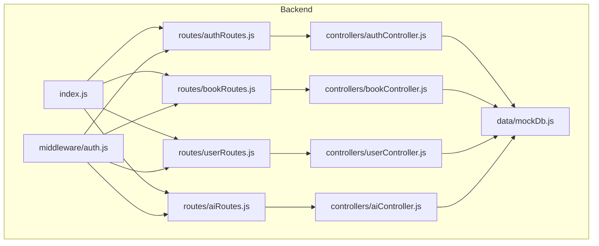
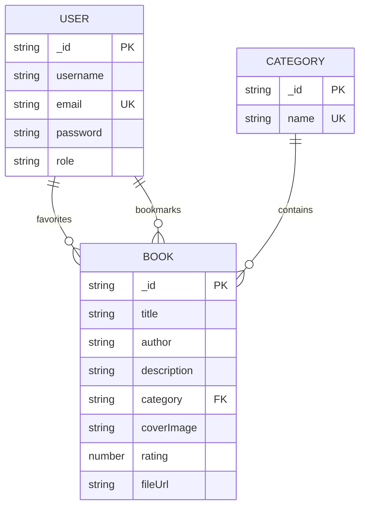
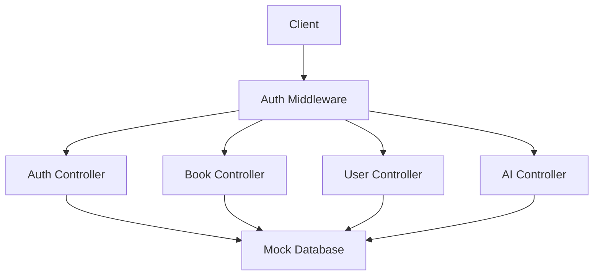
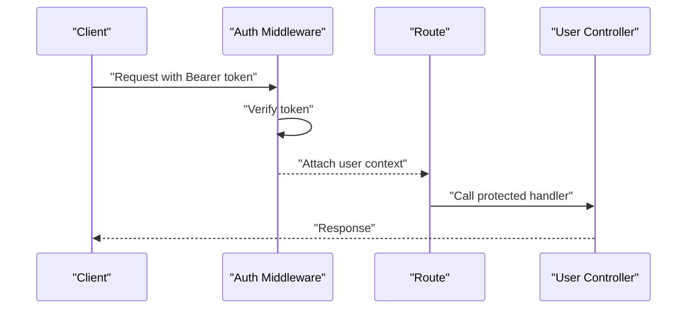
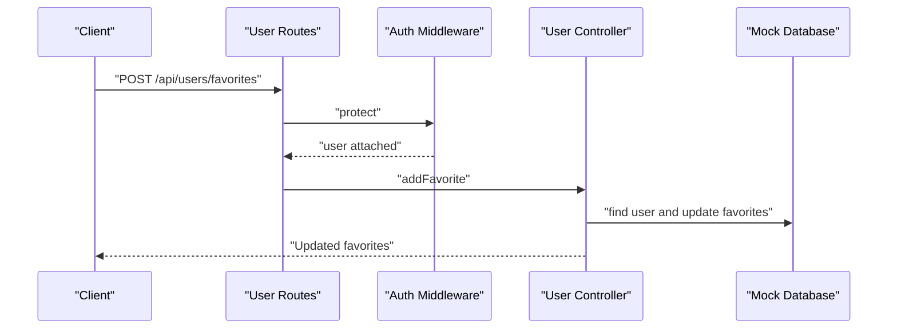
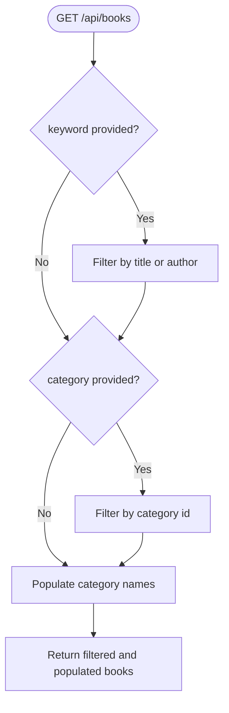
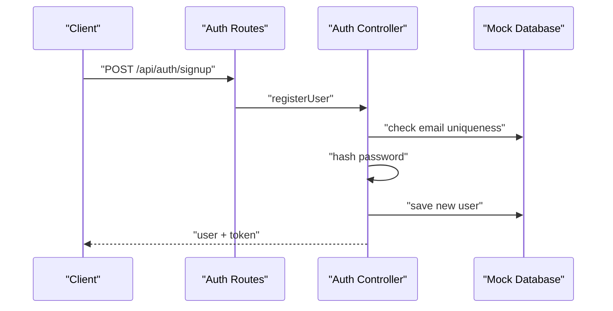
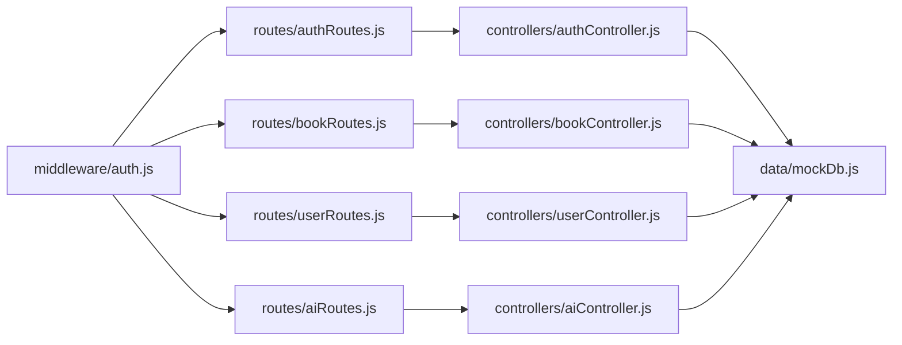

# Data Models and Database Schema

<cite>
**Referenced Files in This Document**
- [mockDb.js](file://backend/data/mockDb.js)
- [userController.js](file://backend/controllers/userController.js)
- [bookController.js](file://backend/controllers/bookController.js)
- [authController.js](file://backend/controllers/authController.js)
- [aiController.js](file://backend/controllers/aiController.js)
- [auth.js](file://backend/middleware/auth.js)
- [userRoutes.js](file://backend/routes/userRoutes.js)
- [bookRoutes.js](file://backend/routes/bookRoutes.js)
- [authRoutes.js](file://backend/routes/authRoutes.js)
- [aiRoutes.js](file://backend/routes/aiRoutes.js)
- [index.js](file://backend/index.js)
</cite>

## Table of Contents
1. [Introduction](#introduction)
2. [Project Structure](#project-structure)
3. [Core Components](#core-components)
4. [Architecture Overview](#architecture-overview)
5. [Detailed Component Analysis](#detailed-component-analysis)
6. [Dependency Analysis](#dependency-analysis)
7. [Performance Considerations](#performance-considerations)
8. [Troubleshooting Guide](#troubleshooting-guide)
9. [Conclusion](#conclusion)
10. [Appendices](#appendices)

## Introduction
This document provides comprehensive data model documentation for ReadSphere’s entities and relationships. It covers the User, Book, and Category models, along with the in-memory mock database implementation, data population strategies, CRUD operations, validation rules, business constraints, and data integrity considerations. It also includes examples of data structures, sample records, common query patterns, data lifecycle management, mock data maintenance, and testing strategies with mock implementations.

## Project Structure
The backend follows a modular structure with clear separation of concerns:
- Data layer: in-memory mock database containing Users, Books, and Categories
- Controllers: handle business logic for Users, Books, Authentication, and AI features
- Routes: expose REST endpoints grouped by domain
- Middleware: authentication and authorization guards
- Entry point: Express server configuration and route registration

**Diagram sources**
- [index.js:11-15](file://backend/index.js#L11-L15)
- [authRoutes.js:1-11](file://backend/routes/authRoutes.js#L1-L11)
- [bookRoutes.js:1-10](file://backend/routes/bookRoutes.js#L1-L10)
- [userRoutes.js:1-11](file://backend/routes/userRoutes.js#L1-L11)
- [aiRoutes.js:1-10](file://backend/routes/aiRoutes.js#L1-L10)
- [authController.js:1-90](file://backend/controllers/authController.js#L1-L90)
- [bookController.js:1-69](file://backend/controllers/bookController.js#L1-L69)
- [userController.js:1-42](file://backend/controllers/userController.js#L1-L42)
- [aiController.js:1-27](file://backend/controllers/aiController.js#L1-L27)
- [mockDb.js:1-20](file://backend/data/mockDb.js#L1-L20)
- [auth.js:1-34](file://backend/middleware/auth.js#L1-L34)

**Section sources**
- [index.js:11-15](file://backend/index.js#L11-L15)
- [authRoutes.js:1-11](file://backend/routes/authRoutes.js#L1-L11)
- [bookRoutes.js:1-10](file://backend/routes/bookRoutes.js#L1-L10)
- [userRoutes.js:1-11](file://backend/routes/userRoutes.js#L1-L11)
- [aiRoutes.js:1-10](file://backend/routes/aiRoutes.js#L1-L10)

## Core Components
This section documents the three primary data models and their relationships.

### User Model
The User entity stores identity, authentication credentials, roles, and personal preferences.

- Properties
  - _id: Unique identifier (auto-generated)
  - username: String, required, unique
  - email: String, required, unique
  - password: String, required (hashed)
  - role: Enumerated string ('user' or 'admin'), defaults to 'user'
  - favorites: Array of book identifiers
  - bookmarks: Array of bookmark objects with book and page fields

- Business Constraints
  - Email uniqueness enforced during registration
  - Password hashing performed before persistence
  - Role-based access control via middleware
  - Favorites and bookmarks arrays managed per user

- Data Integrity
  - In-memory enforcement via array operations
  - Profile endpoint excludes sensitive fields

- CRUD Operations
  - Registration: Creates a new user with default role and empty collections
  - Login: Validates credentials and issues JWT token
  - Profile retrieval: Returns user profile without password
  - Favorite management: Add/remove favorite books
  - Bookmark management: Add bookmarks with page metadata

- Sample Record
  - Admin user with no favorites or bookmarks
  - Regular user with sample favorites and a bookmark with page number

**Section sources**
- [mockDb.js:2-5](file://backend/data/mockDb.js#L2-L5)
- [authController.js:11-46](file://backend/controllers/authController.js#L11-L46)
- [authController.js:48-87](file://backend/controllers/authController.js#L48-L87)
- [userController.js:3-27](file://backend/controllers/userController.js#L3-L27)
- [userController.js:29-39](file://backend/controllers/userController.js#L29-L39)

### Book Model
The Book entity represents literary works with metadata and categorization.

- Properties
  - _id: Unique identifier (auto-generated)
  - title: String, required
  - author: String, required
  - description: Text, optional
  - category: Reference to Category via _id
  - coverImage: URL string, optional
  - rating: Numeric score, defaults to 0
  - fileUrl: URL string, optional

- Business Constraints
  - Category reference must match existing Category _id
  - Rating defaults to 0 upon creation
  - Filtering supports keyword and category queries

- Data Integrity
  - Category resolution performed client-side in controllers
  - Safe fallback to a default category name when missing

- CRUD Operations
  - Listing: Supports keyword and category filters
  - Retrieval by ID: Resolves category name
  - Creation: Admin-only operation with auto-generated _id

- Sample Record
  - Thriller, Self-Help, and Sci-Fi examples with placeholder images and URLs

**Section sources**
- [mockDb.js:7-11](file://backend/data/mockDb.js#L7-L11)
- [bookController.js:3-44](file://backend/controllers/bookController.js#L3-L44)
- [bookController.js:46-66](file://backend/controllers/bookController.js#L46-L66)

### Category Model
The Category entity defines subject classifications for books.

- Properties
  - _id: Unique identifier (auto-generated)
  - name: String, required, unique

- Business Constraints
  - Category names are unique and used as display labels
  - Category references in Books must correspond to existing categories

- Data Integrity
  - Category lookup performed via _id
  - Safe fallback to a default category name when reference is missing

- CRUD Operations
  - Used implicitly by Book queries and listings

- Sample Record
  - Thriller, Self-Help, and Sci-Fi categories

**Section sources**
- [mockDb.js:13-17](file://backend/data/mockDb.js#L13-L17)
- [bookController.js:19-23](file://backend/controllers/bookController.js#L19-L23)
- [bookController.js:36](file://backend/controllers/bookController.js#L36)

### Entity Relationships
The relationships among entities are as follows:
- User has many favorites (book ids)
- User has many bookmarks (book id + page)
- Book belongs to one Category (via category field)
- Category has many Books

**Diagram sources**
- [mockDb.js:2-17](file://backend/data/mockDb.js#L2-L17)
- [userController.js:3-39](file://backend/controllers/userController.js#L3-L39)
- [bookController.js:19-23](file://backend/controllers/bookController.js#L19-L23)

## Architecture Overview
The data model architecture is centered around an in-memory mock database that simulates persistence. Controllers orchestrate CRUD operations, while middleware enforces authentication and authorization. Routes expose endpoints grouped by domain.

**Diagram sources**
- [auth.js:3-31](file://backend/middleware/auth.js#L3-L31)
- [authController.js:11-87](file://backend/controllers/authController.js#L11-L87)
- [bookController.js:3-66](file://backend/controllers/bookController.js#L3-L66)
- [userController.js:3-39](file://backend/controllers/userController.js#L3-L39)
- [aiController.js:3-24](file://backend/controllers/aiController.js#L3-L24)
- [mockDb.js:1-20](file://backend/data/mockDb.js#L1-L20)

## Detailed Component Analysis

### Mock Database Implementation
The mock database is implemented as a module exporting three arrays:
- MOCK_USERS: array of user objects
- MOCK_BOOKS: array of book objects
- MOCK_CATEGORIES: array of category objects

Data population strategies:
- Auto-incremental identifiers generated by concatenating prefixes with indices
- Manual category population in controllers for book listings and details
- Safe fallback to a default category name when references are missing

Data lifecycle:
- In-memory storage with no persistence layer
- CRUD operations performed via array mutations
- No transaction support; concurrency is not handled

Validation and constraints:
- Enforced at runtime via controller logic and middleware checks
- No schema validation library; type checks performed conditionally

**Section sources**
- [mockDb.js:1-20](file://backend/data/mockDb.js#L1-L20)
- [bookController.js:19-23](file://backend/controllers/bookController.js#L19-L23)
- [bookController.js:36](file://backend/controllers/bookController.js#L36)
- [authController.js:15](file://backend/controllers/authController.js#L15)
- [authController.js:23-31](file://backend/controllers/authController.js#L23-L31)

### Authentication and Authorization
Authentication middleware verifies JWT tokens and attaches user context to requests. Authorization middleware restricts access to admin-only routes.

Key behaviors:
- Token extraction from Authorization header
- Decoding and verification against environment secret
- Role-based protection for administrative endpoints

**Diagram sources**
- [auth.js:3-23](file://backend/middleware/auth.js#L3-L23)
- [userRoutes.js:6-8](file://backend/routes/userRoutes.js#L6-L8)
- [bookRoutes.js:6](file://backend/routes/bookRoutes.js#L6)

**Section sources**
- [auth.js:3-31](file://backend/middleware/auth.js#L3-L31)
- [bookRoutes.js:6](file://backend/routes/bookRoutes.js#L6)
- [userRoutes.js:6-8](file://backend/routes/userRoutes.js#L6-L8)

### User Management Endpoints
Endpoints for managing user preferences and bookmarks:
- POST /api/users/favorites: Add a book to favorites
- DELETE /api/users/favorites/:bookId: Remove a book from favorites
- POST /api/users/bookmarks: Add a bookmark with page number

Validation and constraints:
- Requests require a valid JWT token
- Favorites are stored as book identifiers
- Bookmarks store book id and page number

**Diagram sources**
- [userRoutes.js:6](file://backend/routes/userRoutes.js#L6)
- [auth.js:3-23](file://backend/middleware/auth.js#L3-L23)
- [userController.js:3-17](file://backend/controllers/userController.js#L3-L17)
- [mockDb.js:2-5](file://backend/data/mockDb.js#L2-L5)

**Section sources**
- [userRoutes.js:1-11](file://backend/routes/userRoutes.js#L1-L11)
- [userController.js:3-39](file://backend/controllers/userController.js#L3-L39)

### Book Management Endpoints
Endpoints for browsing and creating books:
- GET /api/books: List books with optional keyword and category filters
- GET /api/books/:id: Retrieve a specific book with category name populated
- POST /api/books: Create a new book (admin-only)

Filtering logic:
- Keyword filter matches title or author
- Category filter matches category id
- Category name resolution performed via mock categories

**Diagram sources**
- [bookController.js:3-29](file://backend/controllers/bookController.js#L3-L29)
- [mockDb.js:13-17](file://backend/data/mockDb.js#L13-L17)

**Section sources**
- [bookRoutes.js:1-10](file://backend/routes/bookRoutes.js#L1-L10)
- [bookController.js:3-44](file://backend/controllers/bookController.js#L3-L44)

### Authentication Endpoints
Endpoints for user registration, login, and profile retrieval:
- POST /api/auth/signup: Register a new user with hashed password
- POST /api/auth/login: Authenticate user and issue JWT
- GET /api/auth/profile: Retrieve user profile (without password)

Security considerations:
- Passwords are hashed before storage
- JWT tokens carry user id and role
- Profile response excludes sensitive fields

**Diagram sources**
- [authRoutes.js:6-8](file://backend/routes/authRoutes.js#L6-L8)
- [authController.js:11-46](file://backend/controllers/authController.js#L11-L46)
- [mockDb.js:2-5](file://backend/data/mockDb.js#L2-L5)

**Section sources**
- [authRoutes.js:1-11](file://backend/routes/authRoutes.js#L1-L11)
- [authController.js:11-87](file://backend/controllers/authController.js#L11-L87)

### AI Features and Data Interactions
AI endpoints consume book data to generate summaries and recommendations:
- POST /api/ai/summary: Generate a mock summary for a given book
- GET /api/ai/recommendations: Return mock recommendations

Data interactions:
- Summaries reference book title and category
- Recommendations return a subset of books

**Section sources**
- [aiRoutes.js:1-10](file://backend/routes/aiRoutes.js#L1-L10)
- [aiController.js:3-24](file://backend/controllers/aiController.js#L3-L24)

## Dependency Analysis
The following diagram shows dependencies among components and their relationships to the mock database.

**Diagram sources**
- [auth.js:1-34](file://backend/middleware/auth.js#L1-L34)
- [authRoutes.js:1-11](file://backend/routes/authRoutes.js#L1-L11)
- [bookRoutes.js:1-10](file://backend/routes/bookRoutes.js#L1-L10)
- [userRoutes.js:1-11](file://backend/routes/userRoutes.js#L1-L11)
- [aiRoutes.js:1-10](file://backend/routes/aiRoutes.js#L1-L10)
- [authController.js:1-90](file://backend/controllers/authController.js#L1-L90)
- [bookController.js:1-69](file://backend/controllers/bookController.js#L1-L69)
- [userController.js:1-42](file://backend/controllers/userController.js#L1-L42)
- [aiController.js:1-27](file://backend/controllers/aiController.js#L1-L27)
- [mockDb.js:1-20](file://backend/data/mockDb.js#L1-L20)

**Section sources**
- [auth.js:1-34](file://backend/middleware/auth.js#L1-L34)
- [authController.js:1-90](file://backend/controllers/authController.js#L1-L90)
- [bookController.js:1-69](file://backend/controllers/bookController.js#L1-L69)
- [userController.js:1-42](file://backend/controllers/userController.js#L1-L42)
- [aiController.js:1-27](file://backend/controllers/aiController.js#L1-L27)
- [mockDb.js:1-20](file://backend/data/mockDb.js#L1-L20)

## Performance Considerations
- In-memory operations are fast but scale poorly beyond single-threaded environments
- Filtering and population are linear in the number of items
- Consider indexing strategies if expanding to larger datasets
- For production, replace mock database with a persistent store and add caching layers

## Troubleshooting Guide
Common issues and resolutions:
- Not authorized, token failed: Verify JWT_SECRET environment variable and token format
- Not authorized, no token: Ensure Authorization header with Bearer token is present
- User already exists: Use a unique email address during registration
- Invalid email or password: Confirm credentials and note that password comparison is mocked for demo
- Book not found: Verify book id exists in mock database
- Error adding to favorites: Ensure book id is valid and not already favorited
- Error removing from favorites: Ensure book id exists in favorites
- Error adding bookmark: Ensure book id is valid and page number is provided

**Section sources**
- [auth.js:15-17](file://backend/middleware/auth.js#L15-L17)
- [auth.js:20-22](file://backend/middleware/auth.js#L20-L22)
- [authController.js:16](file://backend/controllers/authController.js#L16)
- [authController.js:67](file://backend/controllers/authController.js#L67)
- [bookController.js:39](file://backend/controllers/bookController.js#L39)
- [userController.js:9](file://backend/controllers/userController.js#L9)

## Conclusion
ReadSphere’s data model is designed around three core entities with straightforward relationships. The in-memory mock database simplifies development and testing, enabling rapid iteration. While suitable for demos and small-scale usage, production deployments should incorporate robust persistence, validation, and security measures.

## Appendices

### Data Validation Rules and Business Constraints
- User registration requires unique email and hashed password
- Role-based access control restricts administrative endpoints
- Favorites and bookmarks are validated per-user operations
- Book creation is restricted to administrators
- Category references are resolved with safe fallbacks

**Section sources**
- [authController.js:15-18](file://backend/controllers/authController.js#L15-L18)
- [authController.js:20-31](file://backend/controllers/authController.js#L20-L31)
- [bookController.js:46-66](file://backend/controllers/bookController.js#L46-L66)
- [userController.js:8](file://backend/controllers/userController.js#L8)

### Data Structures and Sample Records
- User
  - Example: admin user with role 'admin' and empty favorites/bookmarks
  - Example: regular user with role 'user', two favorites, and one bookmark
- Book
  - Example: thriller, self-help, and sci-fi entries with placeholder images and URLs
- Category
  - Example: thriller, self-help, and sci-fi categories

**Section sources**
- [mockDb.js:2-5](file://backend/data/mockDb.js#L2-L5)
- [mockDb.js:7-11](file://backend/data/mockDb.js#L7-L11)
- [mockDb.js:13-17](file://backend/data/mockDb.js#L13-L17)

### Common Query Patterns
- List books by keyword: GET /api/books?keyword={term}
- List books by category: GET /api/books?category={categoryId}
- Get book by id: GET /api/books/{id}
- Add favorite: POST /api/users/favorites with body { bookId }
- Remove favorite: DELETE /api/users/favorites/{bookId}
- Add bookmark: POST /api/users/bookmarks with body { bookId, page }

**Section sources**
- [bookController.js:7-17](file://backend/controllers/bookController.js#L7-L17)
- [bookController.js:31-44](file://backend/controllers/bookController.js#L31-L44)
- [userRoutes.js:6-8](file://backend/routes/userRoutes.js#L6-L8)

### Testing Strategies with Mock Implementations
- Unit tests for controllers can stub mock database exports
- Integration tests can mount routes and assert responses
- End-to-end tests can simulate user flows with JWT tokens
- Use separate test databases or in-memory snapshots for isolation

[No sources needed since this section provides general guidance]