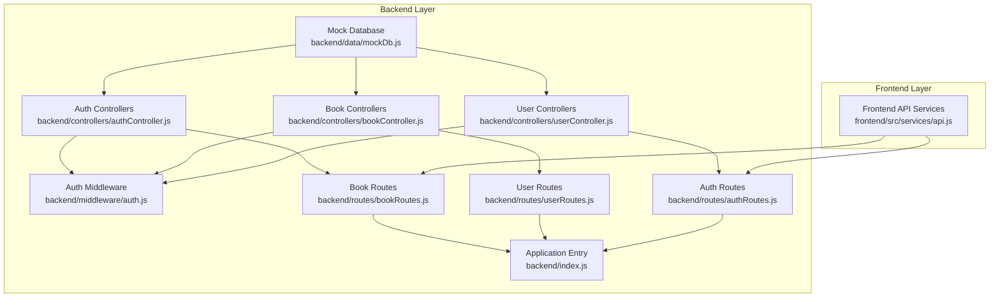
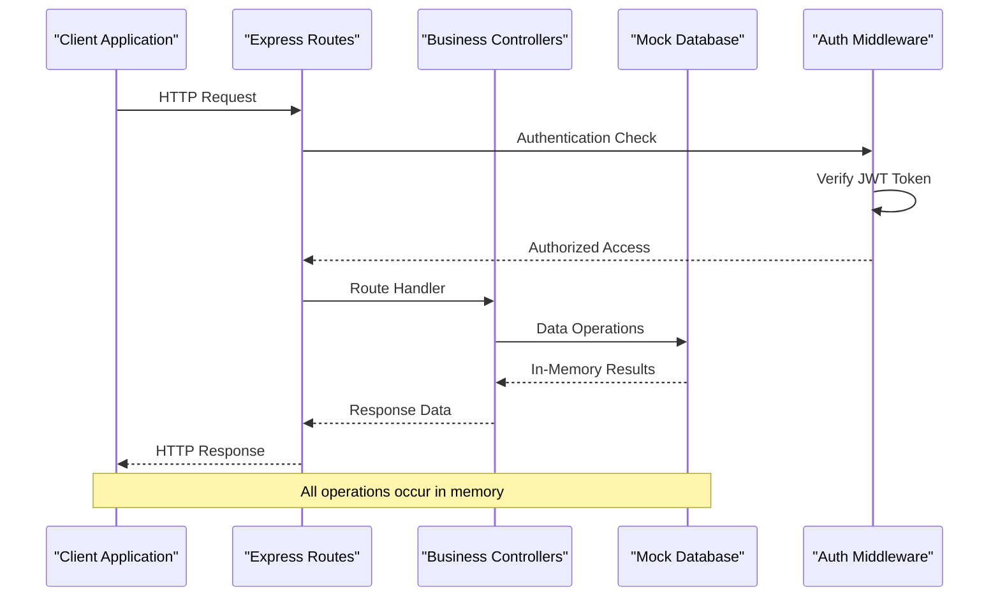
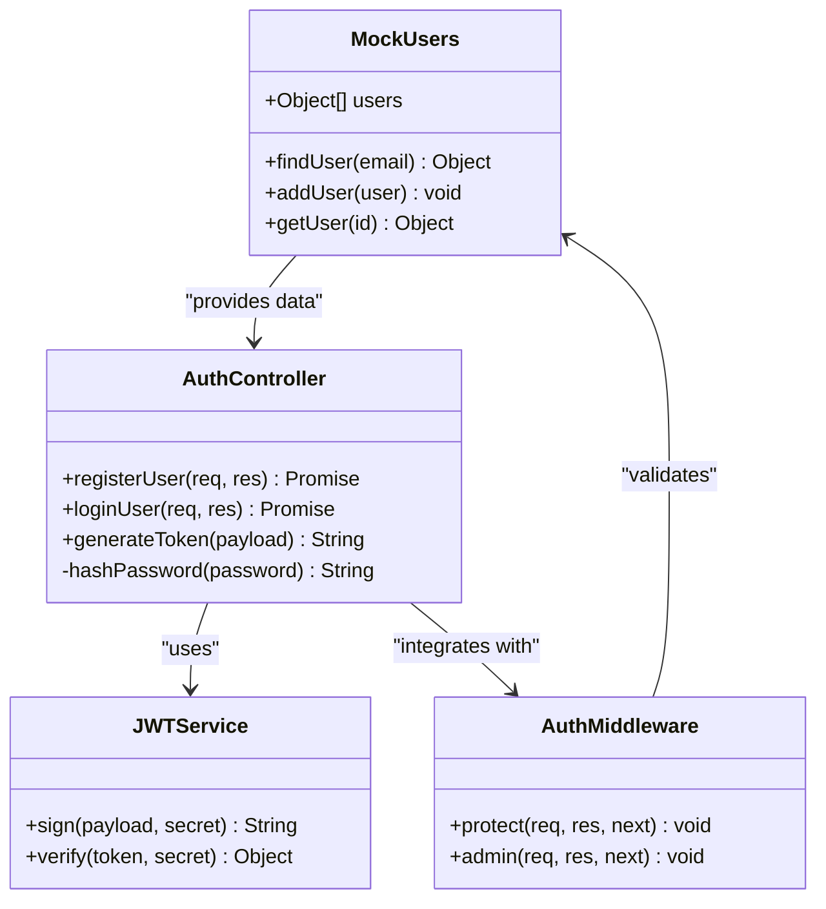
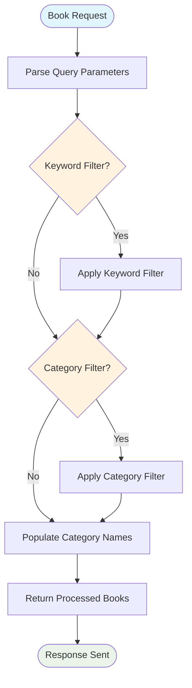
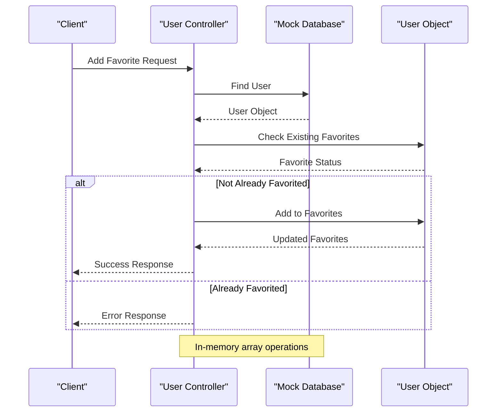
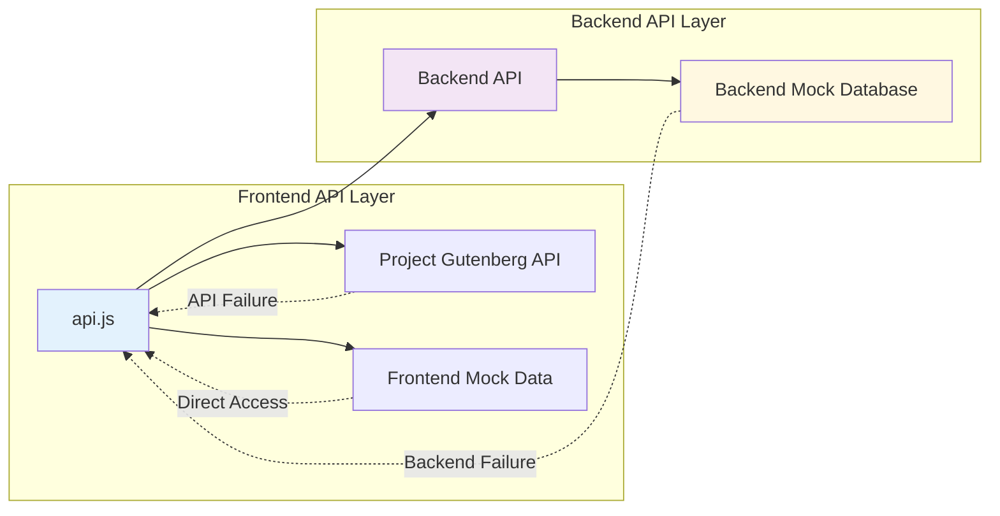
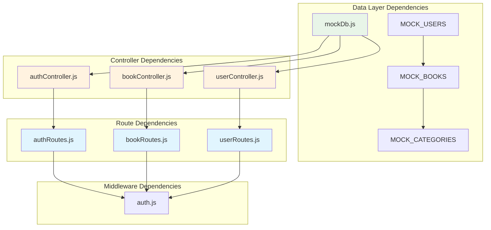
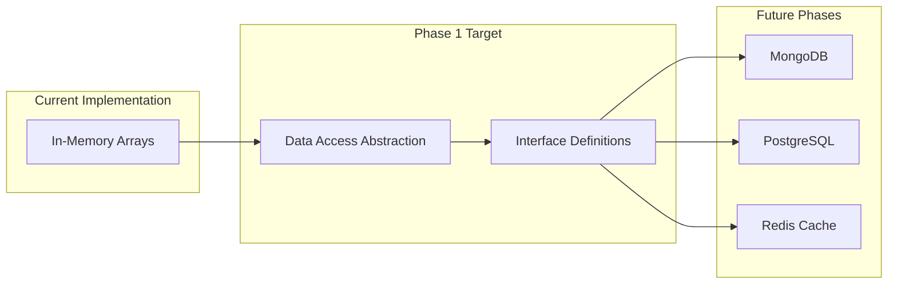

# Mock Database Implementation

<cite>
**Referenced Files in This Document**
- [mockDb.js](file://backend/data/mockDb.js)
- [bookController.js](file://backend/controllers/bookController.js)
- [userController.js](file://backend/controllers/userController.js)
- [authController.js](file://backend/controllers/authController.js)
- [auth.js](file://backend/middleware/auth.js)
- [bookRoutes.js](file://backend/routes/bookRoutes.js)
- [userRoutes.js](file://backend/routes/userRoutes.js)
- [authRoutes.js](file://backend/routes/authRoutes.js)
- [index.js](file://backend/index.js)
- [api.js](file://frontend/src/services/api.js)
</cite>

## Table of Contents
1. [Introduction](#introduction)
2. [Project Structure](#project-structure)
3. [Core Components](#core-components)
4. [Architecture Overview](#architecture-overview)
5. [Detailed Component Analysis](#detailed-component-analysis)
6. [Dependency Analysis](#dependency-analysis)
7. [Performance Considerations](#performance-considerations)
8. [Testing Strategies](#testing-strategies)
9. [Migration Path](#migration-path)
10. [Conclusion](#conclusion)

## Introduction

The ReadSphere application implements a comprehensive mock database system using in-memory JavaScript arrays to simulate persistent data storage. This approach enables rapid development, seamless testing, and effective demonstration of the complete application stack without requiring external database infrastructure.

The mock database consists of three primary collections: users, books, and categories, each represented as arrays of JavaScript objects. These collections serve as the foundation for all data operations throughout the application, supporting authentication, book management, user preferences, and content discovery features.

## Project Structure

The mock database implementation follows a modular architecture with clear separation of concerns:

**Diagram sources**
- [mockDb.js:1-51](file://backend/data/mockDb.js#L1-L51)
- [authController.js:1-90](file://backend/controllers/authController.js#L1-L90)
- [bookController.js:1-69](file://backend/controllers/bookController.js#L1-L69)
- [userController.js:1-42](file://backend/controllers/userController.js#L1-L42)
- [auth.js:1-34](file://backend/middleware/auth.js#L1-L34)
- [bookRoutes.js:1-10](file://backend/routes/bookRoutes.js#L1-L10)
- [userRoutes.js:1-11](file://backend/routes/userRoutes.js#L1-L11)
- [authRoutes.js:1-11](file://backend/routes/authRoutes.js#L1-L11)
- [index.js:1-27](file://backend/index.js#L1-L27)

**Section sources**
- [mockDb.js:1-51](file://backend/data/mockDb.js#L1-L51)
- [index.js:1-27](file://backend/index.js#L1-L27)

## Core Components

### Mock Data Collections

The mock database consists of three fundamental collections that form the application's data backbone:

#### Users Collection
The users collection contains authentication and preference data for all registered users. Each user object includes:
- Unique identifier (_id)
- Authentication credentials (username, email, password)
- Role-based permissions (admin/user)
- Personal preferences (favorites, bookmarks)

#### Books Collection
The books collection stores literary works with comprehensive metadata:
- Unique identifiers and titles
- Author information
- Category associations
- Rich metadata (descriptions, ratings, images)
- File URLs for public domain content

#### Categories Collection
The categories collection provides organizational structure for books:
- Category identifiers
- Human-readable names
- Used for content classification and filtering

**Section sources**
- [mockDb.js:2-48](file://backend/data/mockDb.js#L2-L48)

### Data Initialization Patterns

The mock database employs several initialization strategies:

**Static Population**: All collections are pre-populated with realistic test data during module loading, ensuring immediate usability for development and testing scenarios.

**Dynamic Generation**: New records receive auto-generated identifiers based on collection length, maintaining uniqueness without external ID generation systems.

**Fallback Mechanisms**: Both backend and frontend implementations include fallback data to maintain application functionality even when external APIs fail.

**Section sources**
- [mockDb.js:1-51](file://backend/data/mockDb.js#L1-L51)

## Architecture Overview

The mock database architecture integrates seamlessly with the Express.js application layer through a clean controller pattern:

**Diagram sources**
- [bookRoutes.js:1-10](file://backend/routes/bookRoutes.js#L1-L10)
- [authRoutes.js:1-11](file://backend/routes/authRoutes.js#L1-L11)
- [userRoutes.js:1-11](file://backend/routes/userRoutes.js#L1-L11)
- [auth.js:1-34](file://backend/middleware/auth.js#L1-L34)

The architecture ensures that all data operations remain within the Node.js process, eliminating network latency while providing a realistic simulation of database interactions.

**Section sources**
- [bookController.js:1-69](file://backend/controllers/bookController.js#L1-L69)
- [authController.js:1-90](file://backend/controllers/authController.js#L1-L90)
- [userController.js:1-42](file://backend/controllers/userController.js#L1-L42)

## Detailed Component Analysis

### Authentication System

The authentication system demonstrates sophisticated mock database integration with comprehensive user management:

**Diagram sources**
- [authController.js:1-90](file://backend/controllers/authController.js#L1-L90)
- [auth.js:1-34](file://backend/middleware/auth.js#L1-L34)
- [mockDb.js:2-5](file://backend/data/mockDb.js#L2-L5)

The authentication flow includes comprehensive error handling, password hashing, and token-based session management, all operating against the in-memory user collection.

**Section sources**
- [authController.js:11-46](file://backend/controllers/authController.js#L11-L46)
- [auth.js:3-23](file://backend/middleware/auth.js#L3-L23)

### Book Management System

The book management system showcases advanced filtering and search capabilities:

**Diagram sources**
- [bookController.js:3-29](file://backend/controllers/bookController.js#L3-L29)

The system implements multi-criteria filtering with keyword matching across titles and authors, category-based filtering, and intelligent category name resolution.

**Section sources**
- [bookController.js:3-44](file://backend/controllers/bookController.js#L3-L44)

### User Preference Management

The user preference system handles favorites and bookmarks with sophisticated data manipulation:

**Diagram sources**
- [userController.js:3-17](file://backend/controllers/userController.js#L3-L17)

The system provides atomic operations for managing user preferences with proper validation and error handling.

**Section sources**
- [userController.js:1-42](file://backend/controllers/userController.js#L1-L42)

### Frontend Integration

The frontend implements comprehensive fallback mechanisms using mock data:

**Diagram sources**
- [api.js:131-179](file://frontend/src/services/api.js#L131-L179)
- [mockDb.js:8-42](file://backend/data/mockDb.js#L8-L42)

**Section sources**
- [api.js:1-308](file://frontend/src/services/api.js#L1-L308)

## Dependency Analysis

The mock database implementation exhibits clear dependency relationships:

**Diagram sources**
- [mockDb.js:1-51](file://backend/data/mockDb.js#L1-L51)
- [authController.js:1](file://backend/controllers/authController.js#L1)
- [bookController.js:1](file://backend/controllers/bookController.js#L1)
- [userController.js:1](file://backend/controllers/userController.js#L1)
- [authRoutes.js:1-11](file://backend/routes/authRoutes.js#L1-L11)
- [bookRoutes.js:1-10](file://backend/routes/bookRoutes.js#L1-L10)
- [userRoutes.js:1-11](file://backend/routes/userRoutes.js#L1-L11)
- [auth.js:1-34](file://backend/middleware/auth.js#L1-L34)

**Section sources**
- [mockDb.js:1-51](file://backend/data/mockDb.js#L1-L51)

## Performance Considerations

### Memory Efficiency
The mock database operates entirely in RAM, providing optimal performance for development and testing scenarios. Each collection maintains O(n) lookup complexity for basic operations, which is acceptable given the small scale of test data.

### Scalability Limitations
- **Memory Constraints**: Data persists only during runtime; server restarts reset all collections
- **Concurrency Issues**: No built-in locking mechanisms for concurrent modifications
- **Persistence Gap**: No automatic data persistence across application restarts

### Optimization Opportunities
- **Index Structures**: Implement hash maps for frequently accessed fields (email, book IDs)
- **Batch Operations**: Add support for bulk insert/update operations
- **Lazy Loading**: Implement virtual scrolling for large book collections

## Testing Strategies

### Unit Testing Approaches
The mock database enables comprehensive unit testing through direct data manipulation:

**Test Data Isolation**: Each test suite can safely modify mock collections without affecting other tests

**Deterministic Behavior**: Consistent test results through predictable data initialization

**Fast Execution**: In-memory operations eliminate database connection overhead

### Integration Testing Patterns
- **End-to-End Flows**: Complete user registration, authentication, and preference management
- **Error Scenarios**: Validation failures, duplicate entries, and boundary conditions
- **API Contract Testing**: Verifying response formats and HTTP status codes

### Mock Data Validation
The system includes built-in validation through:
- Duplicate detection for user registration
- Authorization checks for administrative operations
- Data integrity maintenance for cross-referenced collections

**Section sources**
- [authController.js:15-18](file://backend/controllers/authController.js#L15-L18)
- [userController.js:8-10](file://backend/controllers/userController.js#L8-L10)

## Migration Path

### Current State Assessment
The mock database currently serves as a proof-of-concept implementation with the following characteristics:
- **Development-Ready**: Excellent for prototyping and feature development
- **Testing-Friendly**: Comprehensive coverage for unit and integration tests
- **Demo-Functional**: Suitable for presentations and stakeholder demonstrations

### Migration Strategy

#### Phase 1: Data Layer Abstraction

#### Phase 2: Database Implementation
- **MongoDB**: Natural fit for document-based collections
- **PostgreSQL**: Structured queries and relationships
- **Redis**: Caching layer for frequently accessed data

#### Phase 3: Advanced Features
- **Connection Pooling**: Optimized database connections
- **Transaction Support**: ACID compliance for critical operations
- **Backup and Recovery**: Automated data protection

### Implementation Timeline
- **Week 1-2**: Abstract data access layer
- **Week 3-4**: Implement MongoDB adapter
- **Week 5-6**: Add caching and connection pooling
- **Week 7**: Performance optimization and monitoring

## Conclusion

The ReadSphere mock database implementation provides an exemplary model for rapid application development using in-memory data structures. The system successfully balances simplicity with functionality, enabling comprehensive testing, demonstration, and development workflows.

### Key Benefits
- **Development Speed**: Rapid iteration without database setup
- **Testing Excellence**: Reliable unit and integration testing capabilities
- **Demonstration Quality**: Complete functional prototype for stakeholders
- **Learning Value**: Clear implementation patterns for educational purposes

### Strategic Recommendations
1. **Gradual Migration**: Plan systematic transition to persistent storage
2. **Data Abstraction**: Maintain current interface compatibility during migration
3. **Performance Monitoring**: Track memory usage and optimize as data scales
4. **Security Hardening**: Implement proper password hashing and input validation

The mock database approach proves invaluable for modern web application development, particularly in agile environments where rapid prototyping and continuous testing are paramount to success.