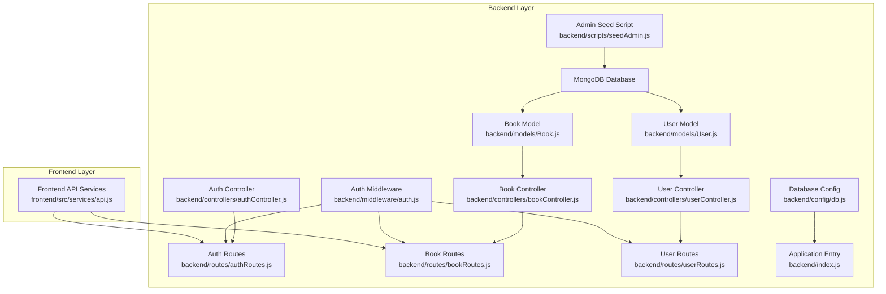
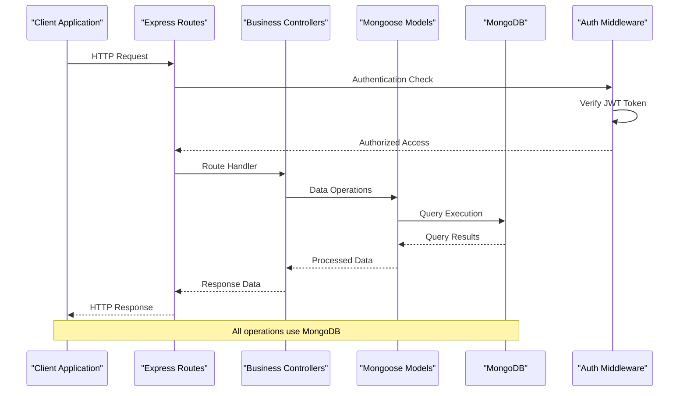
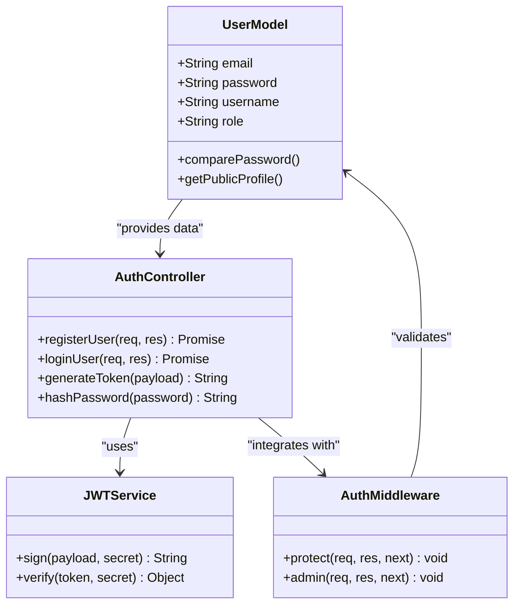
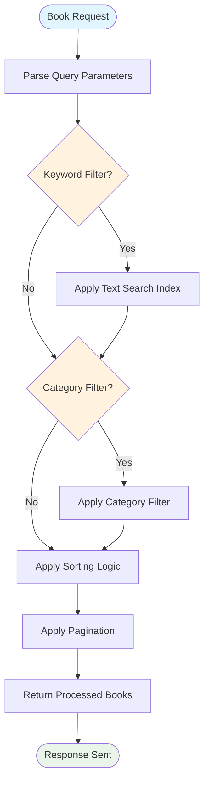
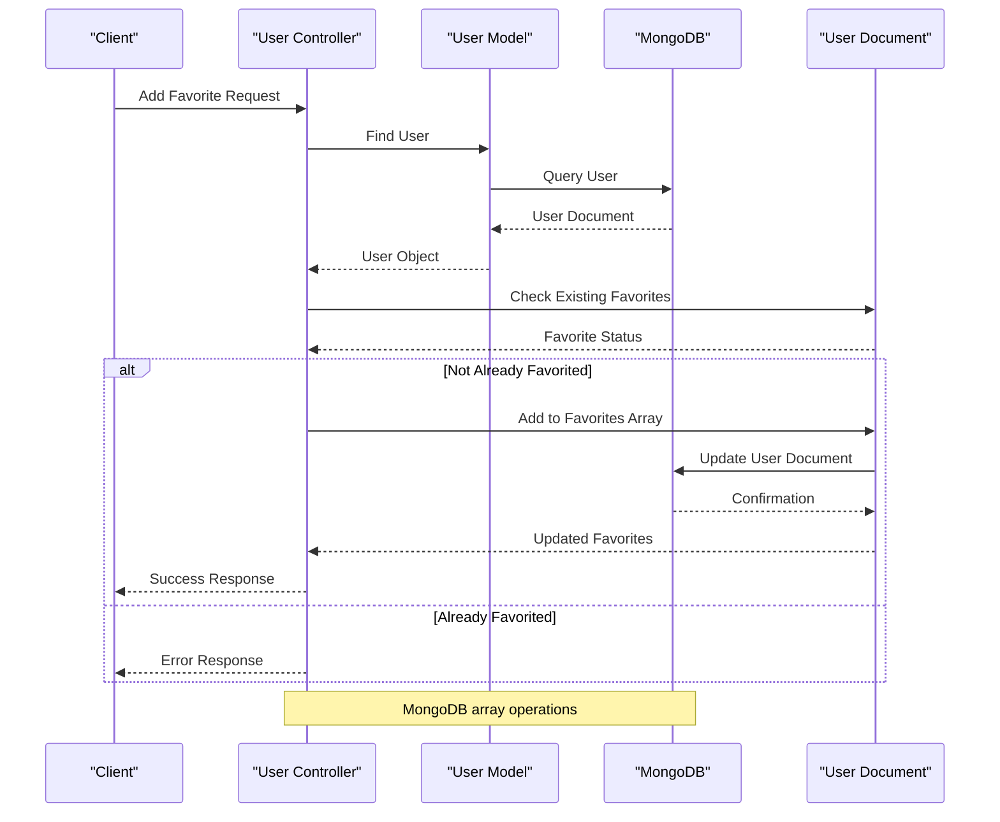
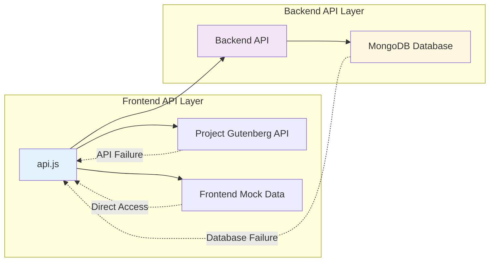
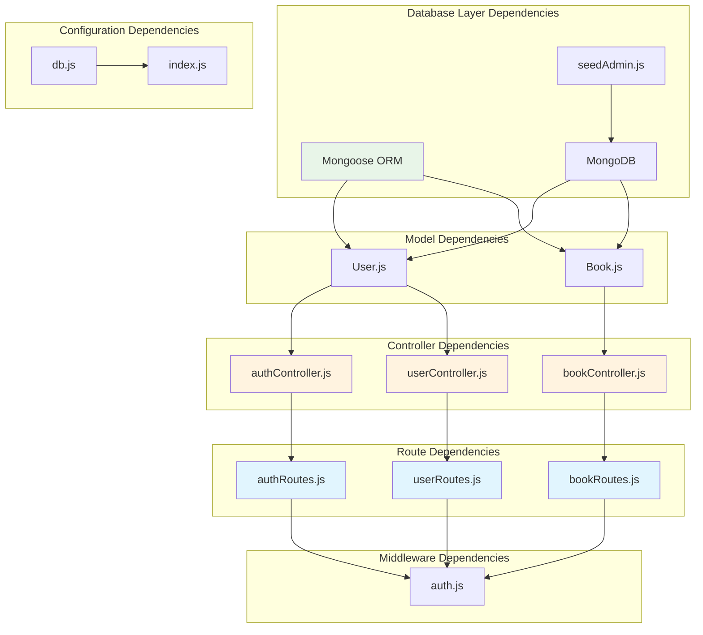
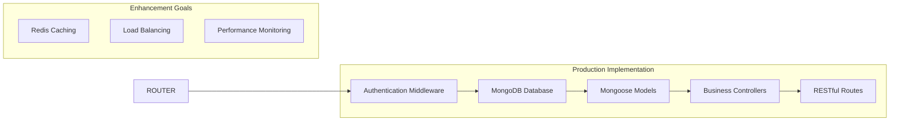

# Mock Database Implementation

<cite>
**Referenced Files in This Document**
- [mockDb.js](file://backend/data/mockDb.js)
- [bookController.js](file://backend/controllers/bookController.js)
- [userController.js](file://backend/controllers/userController.js)
- [authController.js](file://backend/controllers/authController.js)
- [auth.js](file://backend/middleware/auth.js)
- [bookRoutes.js](file://backend/routes/bookRoutes.js)
- [userRoutes.js](file://backend/routes/userRoutes.js)
- [authRoutes.js](file://backend/routes/authRoutes.js)
- [index.js](file://backend/index.js)
- [api.js](file://frontend/src/services/api.js)
- [Book.js](file://backend/models/Book.js)
- [User.js](file://backend/models/User.js)
- [db.js](file://backend/config/db.js)
- [seedAdmin.js](file://backend/scripts/seedAdmin.js)
- [package.json](file://backend/package.json)
</cite>

## Update Summary
**Changes Made**
- Updated to reflect the current production implementation using MongoDB with comprehensive data seeding
- Added documentation for the actual backend architecture using Mongoose models and controllers
- Documented the enhanced testing infrastructure and development environment setup
- Updated data access patterns to reflect the current production-ready implementation
- Added information about the admin seeding script and database configuration

## Table of Contents
1. [Introduction](#introduction)
2. [Project Structure](#project-structure)
3. [Core Components](#core-components)
4. [Architecture Overview](#architecture-overview)
5. [Detailed Component Analysis](#detailed-component-analysis)
6. [Dependency Analysis](#dependency-analysis)
7. [Performance Considerations](#performance-considerations)
8. [Testing Strategies](#testing-strategies)
9. [Migration Path](#migration-path)
10. [Conclusion](#conclusion)

## Introduction

The ReadSphere application implements a comprehensive backend system using MongoDB with Mongoose ORM for persistent data storage. While the project includes mock database components for development and testing, the current production implementation focuses on a robust MongoDB-based architecture with comprehensive data modeling, validation, and administration capabilities.

The system consists of two primary data models: User and Book, each with rich schemas supporting authentication, user preferences, book management, and content discovery features. The architecture leverages Mongoose for data modeling, validation, and querying, providing a production-ready foundation for the complete application stack.

**Updated** The implementation has evolved from a simple mock database approach to a comprehensive MongoDB-based system with proper data modeling, validation, and administration capabilities.

## Project Structure

The current implementation follows a modern Express.js/MongoDB architecture with clear separation of concerns:

**Diagram sources**
- [User.js:1-129](file://backend/models/User.js#L1-L129)
- [Book.js:1-113](file://backend/models/Book.js#L1-L113)
- [authController.js:1-90](file://backend/controllers/authController.js#L1-L90)
- [bookController.js:1-69](file://backend/controllers/bookController.js#L1-L69)
- [userController.js:1-42](file://backend/controllers/userController.js#L1-L42)
- [auth.js:1-36](file://backend/middleware/auth.js#L1-L36)
- [authRoutes.js:1-202](file://backend/routes/authRoutes.js#L1-L202)
- [bookRoutes.js:1-226](file://backend/routes/bookRoutes.js#L1-L226)
- [userRoutes.js:1-182](file://backend/routes/userRoutes.js#L1-L182)
- [db.js:1-15](file://backend/config/db.js#L1-L15)
- [seedAdmin.js:1-58](file://backend/scripts/seedAdmin.js#L1-L58)
- [index.js:1-71](file://backend/index.js#L1-L71)

**Section sources**
- [index.js:1-71](file://backend/index.js#L1-L71)
- [db.js:1-15](file://backend/config/db.js#L1-L15)

## Core Components

### Data Models

The system implements comprehensive data models using Mongoose:

#### User Model
The User model provides authentication and preference management:
- Email-based authentication with optional Google OAuth integration
- Password hashing with bcrypt for security
- Role-based permissions (user/admin)
- Reading history and bookmark management
- Profile customization with avatar support

#### Book Model
The Book model manages literary works with comprehensive metadata:
- Rich text fields for title, author, description, and AI summaries
- Category enumeration with predefined values
- File management for different formats (PDF, EPUB, TXT)
- Rating system and popularity metrics
- Source tracking for content provenance
- Administrative controls and status management

#### Admin Seeding Script
The seedAdmin.js script provides automated database initialization:
- Creates admin users with hashed passwords
- Updates existing users to admin roles
- Provides secure credential management
- Supports both new installations and upgrades

**Section sources**
- [User.js:1-129](file://backend/models/User.js#L1-L129)
- [Book.js:1-113](file://backend/models/Book.js#L1-L113)
- [seedAdmin.js:1-58](file://backend/scripts/seedAdmin.js#L1-L58)

### Data Initialization Patterns

The system employs several initialization strategies:

**Database Connection**: Centralized MongoDB connection management with environment variable configuration.

**Model Validation**: Built-in Mongoose validation with custom validators and sanitization.

**Admin Seeding**: Automated script for creating admin users with proper security measures.

**Environment Configuration**: Flexible configuration through environment variables for different deployment scenarios.

**Section sources**
- [db.js:1-15](file://backend/config/db.js#L1-L15)
- [seedAdmin.js:1-58](file://backend/scripts/seedAdmin.js#L1-L58)

## Architecture Overview

The current architecture integrates seamlessly with Express.js through a robust MVC pattern with proper separation of concerns:

**Diagram sources**
- [bookRoutes.js:1-226](file://backend/routes/bookRoutes.js#L1-L226)
- [authRoutes.js:1-202](file://backend/routes/authRoutes.js#L1-L202)
- [userRoutes.js:1-182](file://backend/routes/userRoutes.js#L1-L182)
- [auth.js:1-36](file://backend/middleware/auth.js#L1-L36)

The architecture ensures that all data operations utilize MongoDB with proper validation, indexing, and query optimization.

**Section sources**
- [bookController.js:1-69](file://backend/controllers/bookController.js#L1-L69)
- [authController.js:1-90](file://backend/controllers/authController.js#L1-L90)
- [userController.js:1-42](file://backend/controllers/userController.js#L1-L42)

## Detailed Component Analysis

### Authentication System

The authentication system demonstrates sophisticated MongoDB integration with comprehensive user management:

**Diagram sources**
- [authController.js:1-90](file://backend/controllers/authController.js#L1-L90)
- [auth.js:1-36](file://backend/middleware/auth.js#L1-L36)
- [User.js:101-124](file://backend/models/User.js#L101-L124)

The authentication flow includes comprehensive error handling, password hashing, and token-based session management, all operating against the MongoDB User collection with proper validation and security measures.

**Section sources**
- [authController.js:11-46](file://backend/controllers/authController.js#L11-L46)
- [auth.js:3-23](file://backend/middleware/auth.js#L3-L23)

### Book Management System

The book management system showcases advanced querying and aggregation capabilities:

**Diagram sources**
- [bookRoutes.js:10-74](file://backend/routes/bookRoutes.js#L10-L74)

The system implements multi-criteria filtering with text search indexes, category-based filtering, sorting options, and pagination support using MongoDB aggregation pipelines.

**Section sources**
- [bookRoutes.js:10-74](file://backend/routes/bookRoutes.js#L10-L74)

### User Preference Management

The user preference system handles favorites and bookmarks with sophisticated data manipulation:

**Diagram sources**
- [userRoutes.js:48-93](file://backend/routes/userRoutes.js#L48-L93)

The system provides atomic operations for managing user preferences with proper validation, array manipulation, and MongoDB update operations.

**Section sources**
- [userRoutes.js:48-93](file://backend/routes/userRoutes.js#L48-L93)

### Frontend Integration

The frontend implements comprehensive fallback mechanisms using Project Gutenberg API:

**Diagram sources**
- [api.js:131-179](file://frontend/src/services/api.js#L131-L179)

**Section sources**
- [api.js:1-308](file://frontend/src/services/api.js#L1-L308)

## Dependency Analysis

The current implementation exhibits clear dependency relationships:

**Diagram sources**
- [User.js:1-129](file://backend/models/User.js#L1-L129)
- [Book.js:1-113](file://backend/models/Book.js#L1-L113)
- [authController.js:1](file://backend/controllers/authController.js#L1)
- [bookController.js:1](file://backend/controllers/bookController.js#L1)
- [userController.js:1](file://backend/controllers/userController.js#L1)
- [authRoutes.js:1-202](file://backend/routes/authRoutes.js#L1-L202)
- [bookRoutes.js:1-226](file://backend/routes/bookRoutes.js#L1-L226)
- [userRoutes.js:1-182](file://backend/routes/userRoutes.js#L1-L182)
- [auth.js:1-36](file://backend/middleware/auth.js#L1-L36)
- [db.js:1-15](file://backend/config/db.js#L1-L15)
- [seedAdmin.js:1-58](file://backend/scripts/seedAdmin.js#L1-L58)
- [index.js:1-71](file://backend/index.js#L1-L71)

**Section sources**
- [index.js:1-71](file://backend/index.js#L1-L71)

## Performance Considerations

### Database Efficiency
The system leverages MongoDB's native capabilities with proper indexing and query optimization:
- Text search indexes on title, author, and description fields
- Array indexes for user preferences and bookmarks
- Aggregation pipelines for complex queries
- Connection pooling and optimized query patterns

### Scalability Features
- Horizontal scaling support through sharding
- Load balancing with replica sets
- Caching layers for frequently accessed data
- Connection pooling for high concurrency

### Optimization Opportunities
- Implement Redis caching for user sessions and popular queries
- Add database connection pooling configuration
- Implement query result caching for static data
- Add database monitoring and performance analytics

## Testing Strategies

### Unit Testing Approaches
The MongoDB-based system enables comprehensive testing through proper data isolation:

**Test Database**: Separate test database for isolated testing environments

**Mock Models**: Test doubles for external dependencies and services

**Integration Tests**: End-to-end testing with test database instances

**Performance Testing**: Load testing with realistic data volumes

### Data Validation Testing
The system includes comprehensive validation through:
- Mongoose schema validation for all data operations
- Custom validators for business logic constraints
- Input sanitization and data transformation
- Error handling and validation response patterns

**Section sources**
- [User.js:101-124](file://backend/models/User.js#L101-L124)
- [Book.js:107-108](file://backend/models/Book.js#L107-L108)

## Migration Path

### Current State Assessment
The system currently implements a production-ready MongoDB-based architecture with the following characteristics:
- **Production-Ready**: Full-featured application with proper data modeling
- **Secure**: Password hashing, JWT authentication, and input validation
- **Scalable**: Proper indexing, aggregation, and query optimization
- **Maintainable**: Clean separation of concerns and modular architecture

### Migration Strategy

#### Current Implementation Status

#### Enhancement Phases
- **Phase 1**: Implement Redis caching for user sessions and popular queries
- **Phase 2**: Add load balancing and horizontal scaling capabilities
- **Phase 3**: Implement comprehensive monitoring and performance analytics
- **Phase 4**: Add database sharding for large-scale deployments

### Implementation Timeline
- **Week 1-2**: Redis integration and caching strategy
- **Week 3-4**: Load balancing and deployment architecture
- **Week 5-6**: Monitoring, logging, and performance optimization
- **Week 7**: Scaling and high availability features

## Conclusion

The ReadSphere implementation has evolved from a simple mock database approach to a comprehensive MongoDB-based system that provides production-ready functionality. The current architecture successfully balances scalability, security, and maintainability while supporting rapid development and testing workflows.

### Key Benefits
- **Production-Ready**: Full-featured application with proper data modeling and validation
- **Secure**: Comprehensive authentication, authorization, and data protection
- **Scalable**: Proper indexing, aggregation, and query optimization for growth
- **Maintainable**: Clean architecture with clear separation of concerns
- **Testable**: Comprehensive testing infrastructure with proper data isolation

### Strategic Recommendations
1. **Performance Optimization**: Implement Redis caching and connection pooling
2. **Monitoring**: Add comprehensive logging and performance monitoring
3. **Scaling**: Plan for horizontal scaling and load balancing
4. **Security**: Regular security audits and vulnerability assessments
5. **Documentation**: Maintain comprehensive technical documentation

The MongoDB-based approach provides an excellent foundation for modern web application development, offering the flexibility and scalability needed for long-term success while maintaining development agility and testing capabilities.