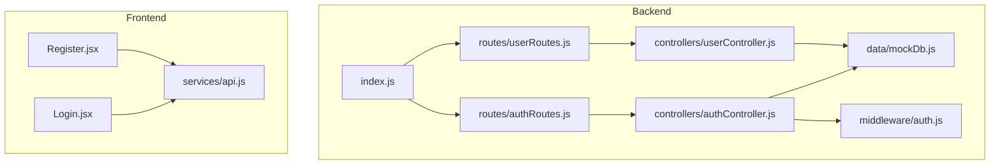
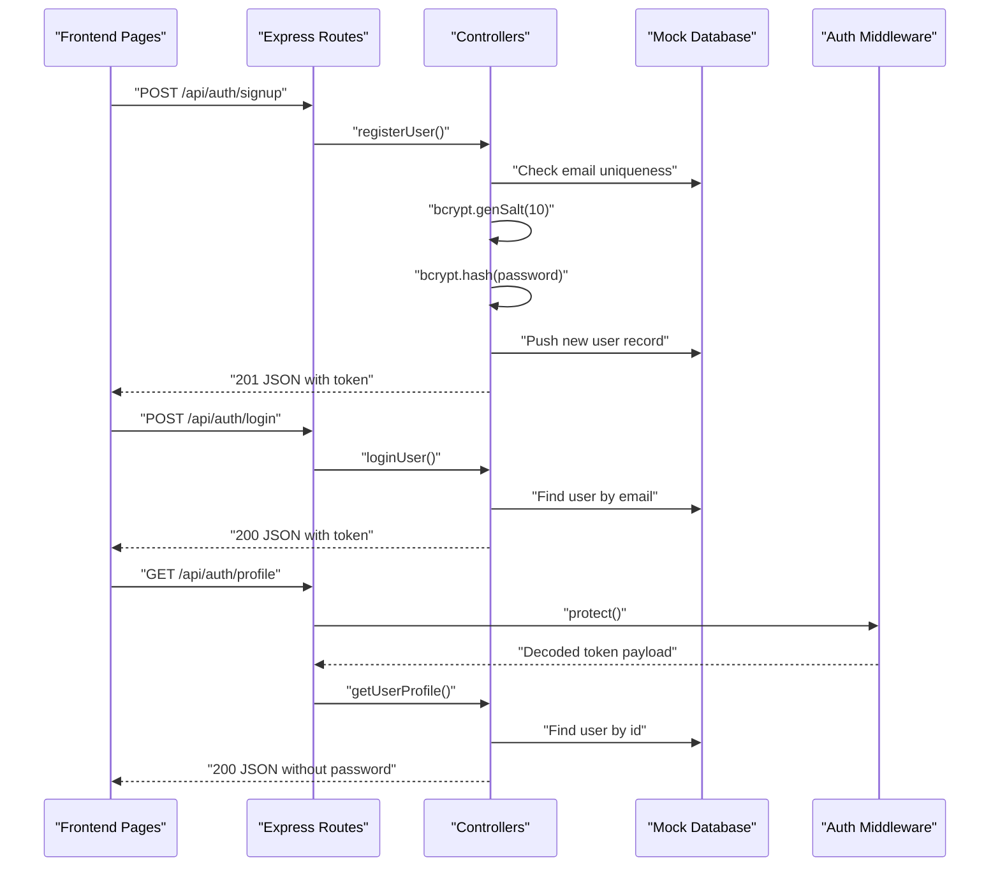
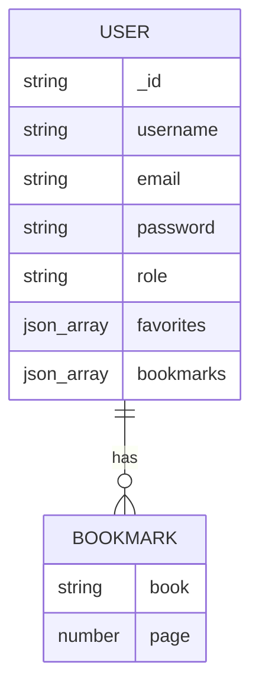
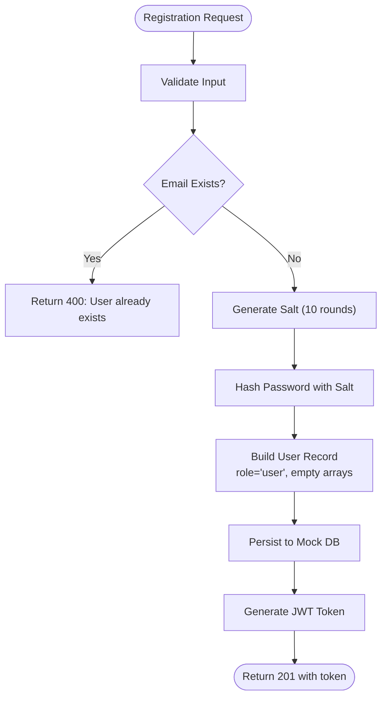
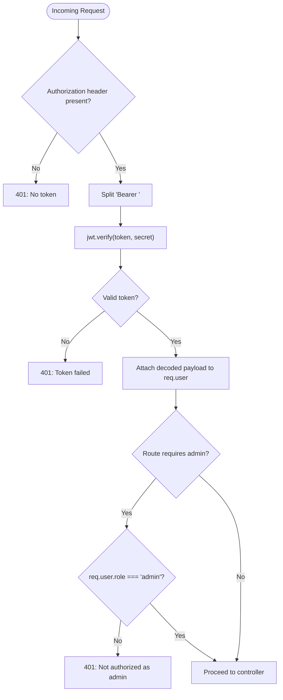
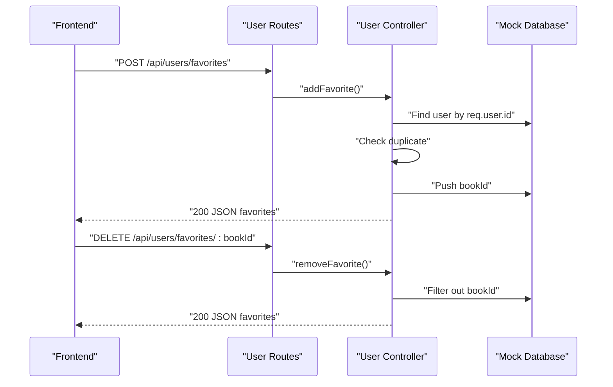
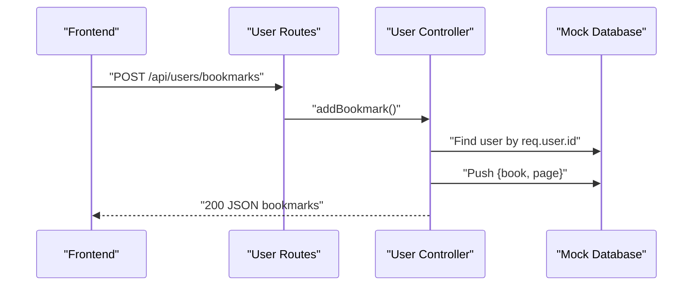
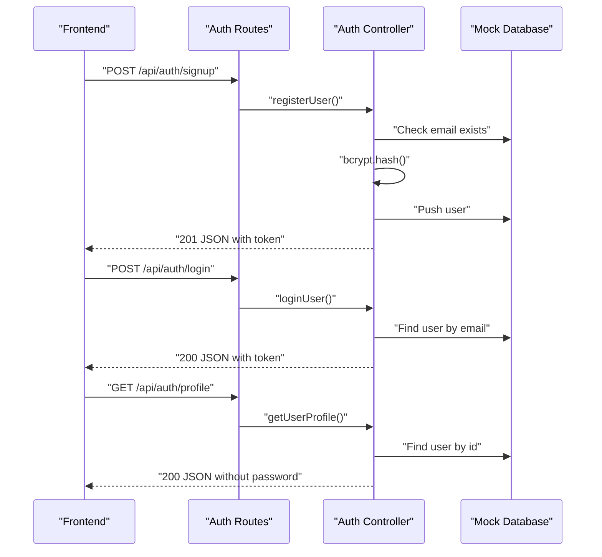
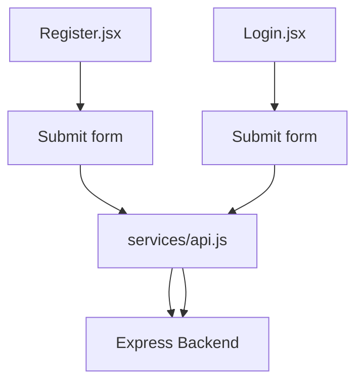
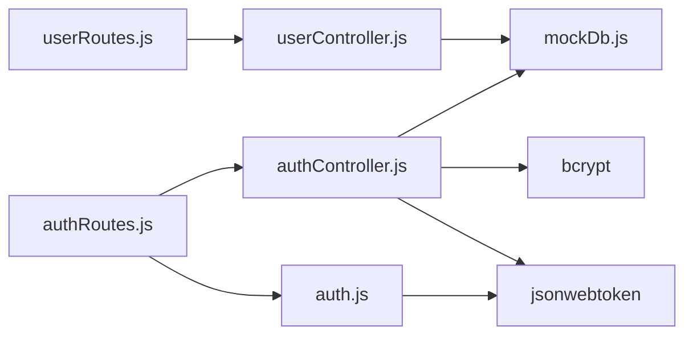

# User Data Model

<cite>
**Referenced Files in This Document**
- [mockDb.js](file://backend/data/mockDb.js)
- [authController.js](file://backend/controllers/authController.js)
- [userController.js](file://backend/controllers/userController.js)
- [auth.js](file://backend/middleware/auth.js)
- [authRoutes.js](file://backend/routes/authRoutes.js)
- [userRoutes.js](file://backend/routes/userRoutes.js)
- [index.js](file://backend/index.js)
- [Register.jsx](file://frontend/src/pages/Register.jsx)
- [Login.jsx](file://frontend/src/pages/Login.jsx)
- [api.js](file://frontend/src/services/api.js)
</cite>

## Table of Contents
1. [Introduction](#introduction)
2. [Project Structure](#project-structure)
3. [Core Components](#core-components)
4. [Architecture Overview](#architecture-overview)
5. [Detailed Component Analysis](#detailed-component-analysis)
6. [Dependency Analysis](#dependency-analysis)
7. [Performance Considerations](#performance-considerations)
8. [Troubleshooting Guide](#troubleshooting-guide)
9. [Conclusion](#conclusion)
10. [Appendices](#appendices)

## Introduction
This document provides comprehensive data model documentation for the User entity in ReadSphere. It covers all user properties, password hashing with bcrypt, role-based access control, favorites and bookmarks systems, validation rules, unique constraints, and the end-to-end user registration and authentication flows. It also includes examples of user data structures, sample records from the mock database, and common CRUD operations for user-related features.

## Project Structure
The user data model is implemented using an in-memory mock database and Express-based controllers. Authentication and authorization are handled via JWT tokens and middleware. Frontend pages capture user input for registration and login.

**Diagram sources**
- [index.js:11-16](file://backend/index.js#L11-L16)
- [authRoutes.js:1-11](file://backend/routes/authRoutes.js#L1-L11)
- [userRoutes.js:1-11](file://backend/routes/userRoutes.js#L1-L11)
- [authController.js:1-90](file://backend/controllers/authController.js#L1-L90)
- [userController.js:1-42](file://backend/controllers/userController.js#L1-L42)
- [auth.js:1-34](file://backend/middleware/auth.js#L1-L34)
- [mockDb.js:1-51](file://backend/data/mockDb.js#L1-L51)
- [Register.jsx:1-99](file://frontend/src/pages/Register.jsx#L1-L99)
- [Login.jsx:1-84](file://frontend/src/pages/Login.jsx#L1-L84)
- [api.js:1-284](file://frontend/src/services/api.js#L1-L284)

**Section sources**
- [index.js:11-16](file://backend/index.js#L11-L16)
- [authRoutes.js:1-11](file://backend/routes/authRoutes.js#L1-L11)
- [userRoutes.js:1-11](file://backend/routes/userRoutes.js#L1-L11)
- [authController.js:1-90](file://backend/controllers/authController.js#L1-L90)
- [userController.js:1-42](file://backend/controllers/userController.js#L1-L42)
- [auth.js:1-34](file://backend/middleware/auth.js#L1-L34)
- [mockDb.js:1-51](file://backend/data/mockDb.js#L1-L51)
- [Register.jsx:1-99](file://frontend/src/pages/Register.jsx#L1-L99)
- [Login.jsx:1-84](file://frontend/src/pages/Login.jsx#L1-L84)
- [api.js:1-284](file://frontend/src/services/api.js#L1-L284)

## Core Components
- User Entity Properties
  - _id: Unique identifier for the user
  - username: User’s chosen display name
  - email: User’s email address
  - password: Hashed password using bcrypt
  - role: Either admin or user
  - favorites: Array of book identifiers
  - bookmarks: Array of bookmark entries with book and page fields

- Password Hashing Mechanism
  - bcrypt is used to hash passwords during registration
  - A salt round of 10 is applied

- Role-Based Access Control
  - JWT tokens carry id and role claims
  - Middleware enforces protected routes and admin-only routes

- Favorites and Bookmarks Systems
  - Favorites: Array of book IDs
  - Bookmarks: Array of objects containing book and page fields

- Validation Rules and Constraints
  - Email uniqueness is enforced at registration
  - Username presence is required in frontend forms
  - Password presence is required in frontend forms

**Section sources**
- [mockDb.js:2-5](file://backend/data/mockDb.js#L2-L5)
- [authController.js:11-46](file://backend/controllers/authController.js#L11-L46)
- [auth.js:3-31](file://backend/middleware/auth.js#L3-L31)
- [userController.js:3-39](file://backend/controllers/userController.js#L3-L39)
- [Register.jsx:31-81](file://frontend/src/pages/Register.jsx#L31-L81)
- [Login.jsx:30-66](file://frontend/src/pages/Login.jsx#L30-L66)

## Architecture Overview
The user data model is part of a layered architecture:
- Frontend captures credentials and navigates to backend endpoints
- Express routes delegate to controllers
- Controllers interact with the mock database and apply business logic
- Middleware enforces authentication and authorization
- JWT tokens are generated and verified for session management

**Diagram sources**
- [authRoutes.js:6-8](file://backend/routes/authRoutes.js#L6-L8)
- [authController.js:11-87](file://backend/controllers/authController.js#L11-L87)
- [auth.js:3-23](file://backend/middleware/auth.js#L3-L23)
- [mockDb.js:2-5](file://backend/data/mockDb.js#L2-L5)

## Detailed Component Analysis

### User Data Model Definition
The User entity is defined in the mock database with the following structure:
- _id: String
- username: String
- email: String
- password: String (bcrypt hash)
- role: Enum-like string ("admin" or "user")
- favorites: Array of strings (book IDs)
- bookmarks: Array of objects with book and page fields

Sample records demonstrate:
- An admin user with empty favorites and bookmarks arrays
- A regular user with pre-populated favorites and a bookmark entry

**Diagram sources**
- [mockDb.js:2-5](file://backend/data/mockDb.js#L2-L5)

**Section sources**
- [mockDb.js:2-5](file://backend/data/mockDb.js#L2-L5)

### Password Hashing with bcrypt
During registration:
- A salt is generated with 10 rounds
- The plaintext password is hashed using bcrypt
- The hashed password is stored in the user record

**Diagram sources**
- [authController.js:11-46](file://backend/controllers/authController.js#L11-L46)

**Section sources**
- [authController.js:11-46](file://backend/controllers/authController.js#L11-L46)

### Role-Based Access Control
- JWT verification middleware decodes tokens and attaches user info to the request
- Admin middleware checks the role claim for admin-only routes
- Protected routes require a valid bearer token

**Diagram sources**
- [auth.js:3-31](file://backend/middleware/auth.js#L3-L31)

**Section sources**
- [auth.js:3-31](file://backend/middleware/auth.js#L3-L31)

### Favorites Management
Users can add/remove books to favorites and retrieve the updated list. The system prevents duplicates when adding.

**Diagram sources**
- [userRoutes.js:6-8](file://backend/routes/userRoutes.js#L6-L8)
- [userController.js:3-27](file://backend/controllers/userController.js#L3-L27)

**Section sources**
- [userController.js:3-27](file://backend/controllers/userController.js#L3-L27)
- [userRoutes.js:6-8](file://backend/routes/userRoutes.js#L6-L8)

### Bookmarks Management
Users can add bookmarks with a book identifier and page number. Retrieval returns the full bookmarks array.

**Diagram sources**
- [userRoutes.js:8](file://backend/routes/userRoutes.js#L8)
- [userController.js:29-39](file://backend/controllers/userController.js#L29-L39)

**Section sources**
- [userController.js:29-39](file://backend/controllers/userController.js#L29-L39)
- [userRoutes.js:8](file://backend/routes/userRoutes.js#L8)

### User Registration and Authentication
- Registration endpoint validates email uniqueness, hashes the password, creates a user record, and returns a JWT
- Login endpoint retrieves the user by email and returns a JWT
- Profile endpoint returns user data without exposing the password

**Diagram sources**
- [authRoutes.js:6-8](file://backend/routes/authRoutes.js#L6-L8)
- [authController.js:11-87](file://backend/controllers/authController.js#L11-L87)
- [mockDb.js:2-5](file://backend/data/mockDb.js#L2-L5)

**Section sources**
- [authController.js:11-87](file://backend/controllers/authController.js#L11-L87)
- [authRoutes.js:6-8](file://backend/routes/authRoutes.js#L6-L8)

### Frontend Integration
- Registration and login pages capture username, email, and password
- These values are submitted to backend endpoints via the frontend service layer
- The frontend does not directly manipulate user data; it delegates to backend APIs

**Diagram sources**
- [Register.jsx:10-14](file://frontend/src/pages/Register.jsx#L10-L14)
- [Login.jsx:9-13](file://frontend/src/pages/Login.jsx#L9-L13)
- [api.js:120-144](file://frontend/src/services/api.js#L120-L144)

**Section sources**
- [Register.jsx:10-14](file://frontend/src/pages/Register.jsx#L10-L14)
- [Login.jsx:9-13](file://frontend/src/pages/Login.jsx#L9-L13)
- [api.js:120-144](file://frontend/src/services/api.js#L120-L144)

## Dependency Analysis
- Controllers depend on the mock database for persistence
- Controllers depend on bcrypt for password hashing and JWT for token generation
- Routes depend on controllers for business logic
- Middleware depends on JWT for token verification and role enforcement
- Frontend pages depend on the API service for network requests

**Diagram sources**
- [authController.js:1-90](file://backend/controllers/authController.js#L1-L90)
- [userController.js:1-42](file://backend/controllers/userController.js#L1-L42)
- [auth.js:1-34](file://backend/middleware/auth.js#L1-L34)
- [authRoutes.js:1-11](file://backend/routes/authRoutes.js#L1-L11)
- [userRoutes.js:1-11](file://backend/routes/userRoutes.js#L1-L11)
- [mockDb.js:1-51](file://backend/data/mockDb.js#L1-L51)

**Section sources**
- [authController.js:1-90](file://backend/controllers/authController.js#L1-L90)
- [userController.js:1-42](file://backend/controllers/userController.js#L1-L42)
- [auth.js:1-34](file://backend/middleware/auth.js#L1-L34)
- [authRoutes.js:1-11](file://backend/routes/authRoutes.js#L1-L11)
- [userRoutes.js:1-11](file://backend/routes/userRoutes.js#L1-L11)
- [mockDb.js:1-51](file://backend/data/mockDb.js#L1-L51)

## Performance Considerations
- In-memory mock database is suitable for development and small-scale testing
- For production, replace with a persistent database and add indexing on email for fast lookups
- Consider rate limiting for authentication endpoints to mitigate brute-force attacks
- Token expiration is set to 30 days; evaluate shorter expirations for enhanced security

## Troubleshooting Guide
- Registration fails with “User already exists”
  - Cause: Email already registered
  - Resolution: Use a different email or reset password flow
- Login fails with “Invalid email or password”
  - Cause: Incorrect credentials or mock password match bypass
  - Resolution: Verify credentials; in production, use bcrypt.compare
- “Not authorized, token failed” or “Not authorized, no token”
  - Cause: Missing or invalid JWT
  - Resolution: Ensure Authorization header with Bearer token is sent
- “Not authorized as an admin”
  - Cause: Non-admin user attempting admin-only route
  - Resolution: Authenticate as an admin user or adjust route permissions

**Section sources**
- [authController.js:15-18](file://backend/controllers/authController.js#L15-L18)
- [authController.js:58-68](file://backend/controllers/authController.js#L58-L68)
- [auth.js:15-22](file://backend/middleware/auth.js#L15-L22)
- [auth.js:28-30](file://backend/middleware/auth.js#L28-L30)

## Conclusion
The User data model in ReadSphere is designed around simplicity and clarity for development and demonstration. It includes robust password hashing, role-based access control, and practical user features like favorites and bookmarks. While the current implementation uses an in-memory mock database, the architecture supports easy migration to a production-grade persistence layer and enhanced validation rules.

## Appendices

### User Data Structure Examples
- Minimal user record
  - _id: "u1"
  - username: "admin"
  - email: "admin@readsphere.com"
  - password: "$2b$10$YourHashedPasswordHere"
  - role: "admin"
  - favorites: []
  - bookmarks: []

- Regular user record with data
  - _id: "u2"
  - username: "user1"
  - email: "user@example.com"
  - password: "$2b$10$YourHashedPasswordHere"
  - role: "user"
  - favorites: ["b1", "b2"]
  - bookmarks: [{ book: "b3", page: 45 }]

**Section sources**
- [mockDb.js:2-5](file://backend/data/mockDb.js#L2-L5)

### Sample Records from mockDb.js
- Admin user: [mockDb.js:3](file://backend/data/mockDb.js#L3)
- Regular user with favorites and bookmarks: [mockDb.js:4](file://backend/data/mockDb.js#L4)

### Common CRUD Operations
- Create (Register)
  - Endpoint: POST /api/auth/signup
  - Payload: { username, email, password }
  - Behavior: Validates uniqueness, hashes password, persists user, returns token

- Read (Profile)
  - Endpoint: GET /api/auth/profile
  - Behavior: Returns user profile without password

- Update (Favorites)
  - Add favorite: POST /api/users/favorites
  - Remove favorite: DELETE /api/users/favorites/:bookId

- Update (Bookmarks)
  - Add bookmark: POST /api/users/bookmarks

**Section sources**
- [authRoutes.js:6-8](file://backend/routes/authRoutes.js#L6-L8)
- [userRoutes.js:6-8](file://backend/routes/userRoutes.js#L6-L8)
- [authController.js:11-46](file://backend/controllers/authController.js#L11-L46)
- [userController.js:3-39](file://backend/controllers/userController.js#L3-L39)

### Security Implications
- Password storage
  - bcrypt hashing is used; ensure secure random salts and appropriate cost factors
- Token security
  - Store JWT secret securely in environment variables
  - Consider short-lived access tokens with refresh token rotation
- Input validation
  - Enforce minimum password length and complexity
  - Sanitize and validate all inputs on the server

### Data Integrity Considerations
- Unique constraints
  - Email uniqueness is enforced at registration
  - Consider adding username uniqueness for consistency
- Referential integrity
  - Favorites and bookmarks reference book IDs; ensure these IDs correspond to existing books
- Cascading effects
  - Deleting a user should remove associated favorites and bookmarks
  - Deleting a book should remove references from all users’ favorites and bookmarks