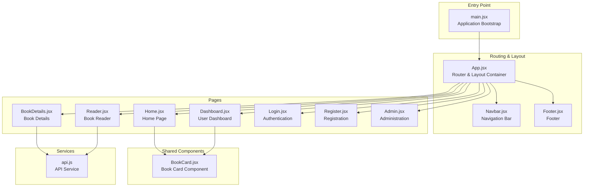
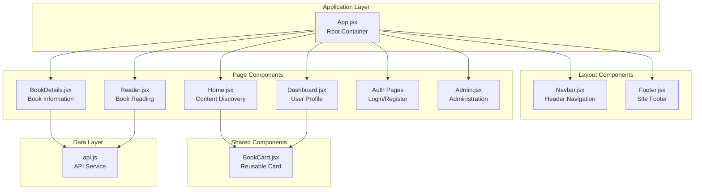
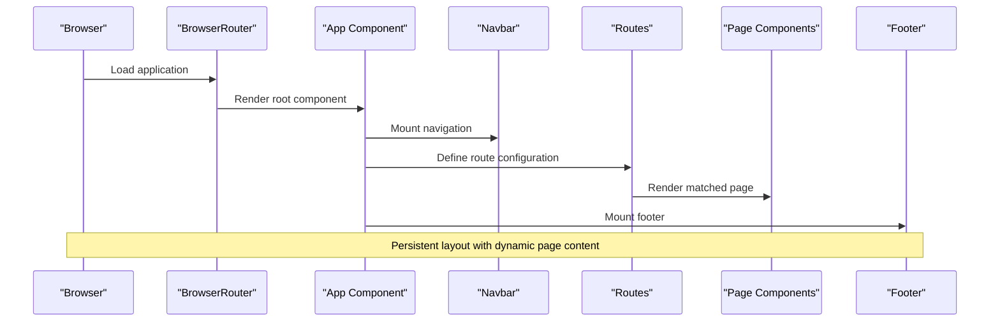
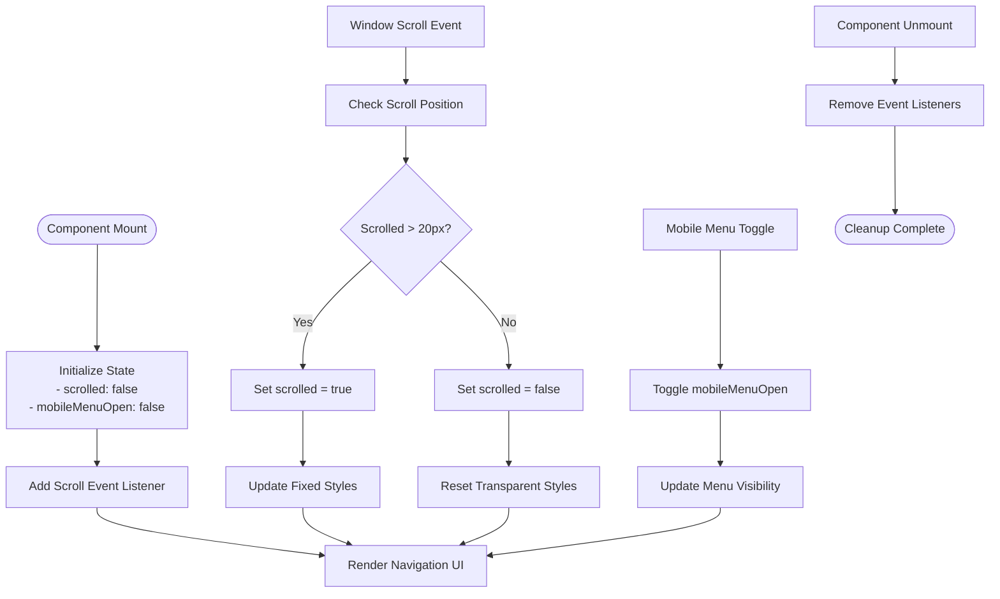
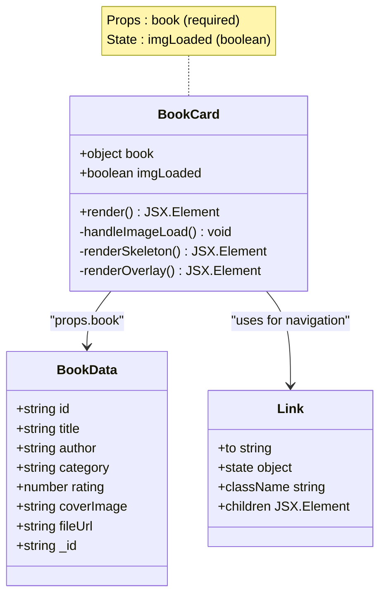
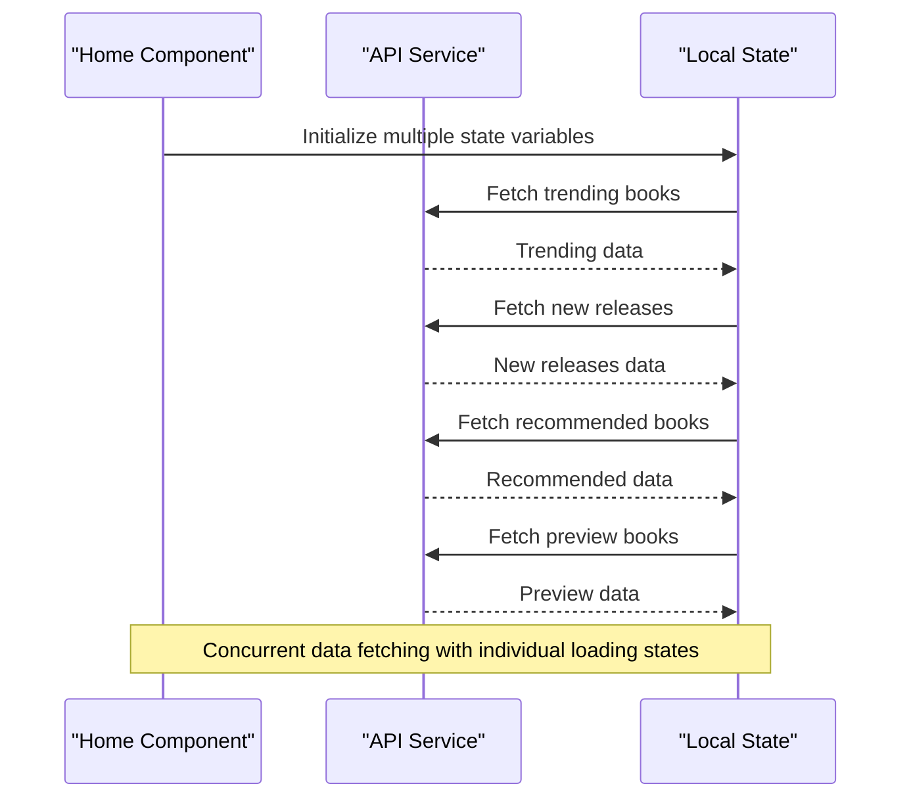
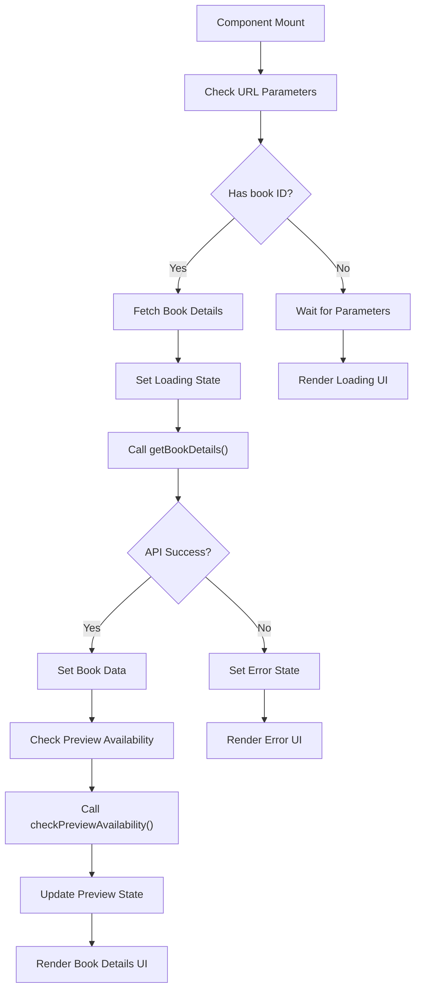
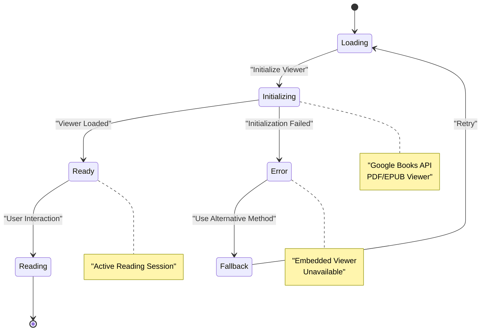
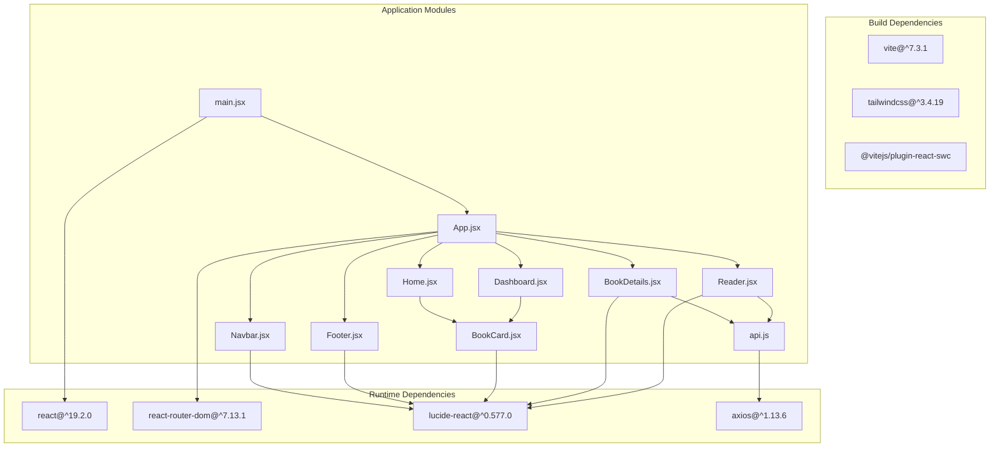

# Component Hierarchy and Structure

<cite>
**Referenced Files in This Document**
- [App.jsx](file://frontend/src/App.jsx)
- [main.jsx](file://frontend/src/main.jsx)
- [Navbar.jsx](file://frontend/src/components/Navbar.jsx)
- [BookCard.jsx](file://frontend/src/components/BookCard.jsx)
- [Footer.jsx](file://frontend/src/components/Footer.jsx)
- [Home.jsx](file://frontend/src/pages/Home.jsx)
- [Dashboard.jsx](file://frontend/src/pages/Dashboard.jsx)
- [BookDetails.jsx](file://frontend/src/pages/BookDetails.jsx)
- [Reader.jsx](file://frontend/src/pages/Reader.jsx)
- [api.js](file://frontend/src/services/api.js)
- [package.json](file://frontend/package.json)
</cite>

## Table of Contents
1. [Introduction](#introduction)
2. [Project Structure](#project-structure)
3. [Core Components](#core-components)
4. [Architecture Overview](#architecture-overview)
5. [Detailed Component Analysis](#detailed-component-analysis)
6. [Dependency Analysis](#dependency-analysis)
7. [Performance Considerations](#performance-considerations)
8. [Troubleshooting Guide](#troubleshooting-guide)
9. [Conclusion](#conclusion)

## Introduction
This document provides comprehensive documentation for ReadSphere's React component hierarchy and structure. It focuses on the main App.jsx component as the root container and routing hub, and explains the component tree starting from App.jsx through Navbar, BookCard, and Footer components. The document details component composition patterns, prop passing strategies, state sharing approaches, and the relationship between layout components and page components. It also covers component lifecycle management, event propagation, reusability patterns, component registration, import/export patterns, and modular architecture principles used throughout the frontend.

## Project Structure
The frontend follows a clear modular structure organized by feature-based separation:
- Root entry point renders the App component
- Layout components (Navbar, Footer) wrap page components
- Page components implement specific views and business logic
- Shared components (BookCard) are reusable across pages
- Services encapsulate API interactions

**Diagram sources**
- [main.jsx:1-11](file://frontend/src/main.jsx#L1-L11)
- [App.jsx:16-39](file://frontend/src/App.jsx#L16-L39)
- [Navbar.jsx:1-56](file://frontend/src/components/Navbar.jsx#L1-L56)
- [Footer.jsx:1-74](file://frontend/src/components/Footer.jsx#L1-L74)
- [Home.jsx:1-483](file://frontend/src/pages/Home.jsx#L1-L483)
- [Dashboard.jsx:1-159](file://frontend/src/pages/Dashboard.jsx#L1-L159)
- [BookDetails.jsx:1-233](file://frontend/src/pages/BookDetails.jsx#L1-L233)
- [Reader.jsx:1-242](file://frontend/src/pages/Reader.jsx#L1-L242)
- [BookCard.jsx:1-71](file://frontend/src/components/BookCard.jsx#L1-L71)
- [api.js:1-284](file://frontend/src/services/api.js#L1-L284)

**Section sources**
- [main.jsx:1-11](file://frontend/src/main.jsx#L1-L11)
- [App.jsx:16-39](file://frontend/src/App.jsx#L16-L39)

## Core Components
The core components form the foundation of the application's UI structure:

### App.jsx - Root Container and Routing Hub
App.jsx serves as the central orchestrator managing:
- Application-wide routing configuration
- Global layout structure with fixed header and footer
- Navigation between different page components
- State management for route-based rendering

Key architectural decisions:
- Uses React Router v6 for declarative routing
- Implements a flexbox layout with sticky navbar and full-height content area
- Provides comprehensive route coverage for all major application features
- Integrates layout components (Navbar, Footer) as persistent UI elements

### Navbar.jsx - Navigation and User Interface
The navigation component implements:
- Responsive mobile-first design with collapsible menu
- Scroll-aware styling with backdrop blur effects
- Dynamic active state highlighting based on current location
- Integrated search functionality and user actions
- Mobile menu toggle with smooth transitions

### BookCard.jsx - Reusable Content Component
BookCard provides a standardized presentation for book data:
- Consistent card layout with hover effects and interactive elements
- Image loading with skeleton placeholders
- Rating display with star icons
- Conditional action buttons (Read Now vs View Details)
- Responsive grid compatibility

### Footer.jsx - Site-wide Information
The footer component delivers:
- Multi-column responsive grid layout
- Brand identity with gradient accents
- Comprehensive link organization across categories
- Social media integration
- Legal and copyright information

**Section sources**
- [App.jsx:16-39](file://frontend/src/App.jsx#L16-L39)
- [Navbar.jsx:5-56](file://frontend/src/components/Navbar.jsx#L5-L56)
- [BookCard.jsx:5-71](file://frontend/src/components/BookCard.jsx#L5-L71)
- [Footer.jsx:5-74](file://frontend/src/components/Footer.jsx#L5-L74)

## Architecture Overview
The application follows a hierarchical component architecture with clear separation of concerns:

**Diagram sources**
- [App.jsx:16-39](file://frontend/src/App.jsx#L16-L39)
- [Home.jsx:1-483](file://frontend/src/pages/Home.jsx#L1-L483)
- [Dashboard.jsx:1-159](file://frontend/src/pages/Dashboard.jsx#L1-L159)
- [BookDetails.jsx:1-233](file://frontend/src/pages/BookDetails.jsx#L1-L233)
- [Reader.jsx:1-242](file://frontend/src/pages/Reader.jsx#L1-L242)
- [BookCard.jsx:1-71](file://frontend/src/components/BookCard.jsx#L1-L71)
- [api.js:1-284](file://frontend/src/services/api.js#L1-L284)

## Detailed Component Analysis

### App.jsx - Routing and Layout Management
App.jsx implements the primary routing configuration and layout structure:

**Diagram sources**
- [App.jsx:16-39](file://frontend/src/App.jsx#L16-L39)

Key routing patterns:
- Path-based routing with dedicated components for each route
- Nested routes for administrative functionality
- Route parameters for dynamic content (book IDs)
- Fallback pages for demonstration purposes

**Section sources**
- [App.jsx:16-39](file://frontend/src/App.jsx#L16-L39)

### Navbar.jsx - Navigation and State Management
The Navbar component demonstrates sophisticated state management and responsive design:

**Diagram sources**
- [Navbar.jsx:10-16](file://frontend/src/components/Navbar.jsx#L10-L16)

State management patterns:
- Local component state for UI interactions
- Effect hooks for lifecycle management
- Location-based active state tracking
- Responsive design with mobile-first approach

**Section sources**
- [Navbar.jsx:5-56](file://frontend/src/components/Navbar.jsx#L5-L56)

### BookCard.jsx - Component Composition and Prop Passing
BookCard exemplifies reusable component design with comprehensive prop handling:

**Diagram sources**
- [BookCard.jsx:5-71](file://frontend/src/components/BookCard.jsx#L5-L71)

Prop passing strategies:
- Single props object containing all book data
- Conditional rendering based on book properties
- State management for image loading completion
- Event handlers for user interactions

**Section sources**
- [BookCard.jsx:5-71](file://frontend/src/components/BookCard.jsx#L5-L71)

### Page Components - State Sharing and Data Flow

#### Home.jsx - Complex State Management
Home.jsx demonstrates advanced state management patterns:

**Diagram sources**
- [Home.jsx:29-92](file://frontend/src/pages/Home.jsx#L29-L92)

State sharing approaches:
- Multiple local state variables for different data sets
- Individual loading states for each data source
- Category-based filtering with debounced updates
- Search functionality with controlled inputs

#### BookDetails.jsx - Parameter-based Data Loading
BookDetails.jsx showcases parameter-driven data fetching:

**Diagram sources**
- [BookDetails.jsx:16-57](file://frontend/src/pages/BookDetails.jsx#L16-L57)

**Section sources**
- [Home.jsx:29-127](file://frontend/src/pages/Home.jsx#L29-L127)
- [BookDetails.jsx:6-57](file://frontend/src/pages/BookDetails.jsx#L6-L57)

### Reader.jsx - Dynamic Viewer Integration
Reader.jsx implements sophisticated viewer selection and initialization:

**Diagram sources**
- [Reader.jsx:6-54](file://frontend/src/pages/Reader.jsx#L6-L54)

Viewer integration patterns:
- Dynamic viewer selection based on file type
- Lazy loading of external APIs
- Graceful fallback mechanisms
- Theme switching capabilities

**Section sources**
- [Reader.jsx:6-137](file://frontend/src/pages/Reader.jsx#L6-L137)

## Dependency Analysis
The component hierarchy exhibits clear dependency relationships:

**Diagram sources**
- [package.json:12-32](file://frontend/package.json#L12-L32)
- [main.jsx:1-11](file://frontend/src/main.jsx#L1-L11)
- [App.jsx:1-11](file://frontend/src/App.jsx#L1-L11)

**Section sources**
- [package.json:12-32](file://frontend/package.json#L12-L32)

## Performance Considerations
The component architecture incorporates several performance optimization strategies:

### Image Loading Optimization
BookCard implements progressive image loading with skeleton placeholders to improve perceived performance during content loading.

### Lazy Loading Patterns
- Google Books API integration is dynamically loaded only when needed
- External viewer libraries are loaded conditionally based on content availability
- Route-based code splitting through separate page components

### State Management Efficiency
- Local state management minimizes unnecessary re-renders
- Debounced search functionality prevents excessive API calls
- Individual loading states prevent blocking of unrelated content areas

### Memory Management
- Proper cleanup of event listeners in Navbar component
- Cleanup functions in effect hooks prevent memory leaks
- Conditional rendering reduces DOM complexity

## Troubleshooting Guide

### Common Component Issues

#### Navigation Problems
- Verify router configuration in App.jsx
- Check route parameter handling in page components
- Ensure proper Link component usage with react-router-dom

#### API Integration Issues
- Confirm API key configuration in environment variables
- Check network connectivity for external API calls
- Validate response format expectations in service layer

#### Component Rendering Issues
- Verify prop shapes passed to shared components
- Check CSS class names for Tailwind styling conflicts
- Ensure proper state initialization in components

**Section sources**
- [api.js:10-144](file://frontend/src/services/api.js#L10-L144)
- [Navbar.jsx:10-16](file://frontend/src/components/Navbar.jsx#L10-L16)

## Conclusion
ReadSphere's React component hierarchy demonstrates a well-architected frontend with clear separation of concerns and reusable patterns. The App.jsx root container effectively manages routing and layout, while shared components like BookCard provide consistent user interface elements across different contexts. The page components implement sophisticated state management patterns, and the service layer encapsulates API interactions with robust error handling and fallback mechanisms.

The modular architecture enables easy maintenance and extension, with clear boundaries between layout, content, and shared components. The component composition patterns promote reusability and maintainability, while the state management strategies ensure efficient data flow and user experience. The integration of modern React features like hooks and context provides a solid foundation for future enhancements and scalability.