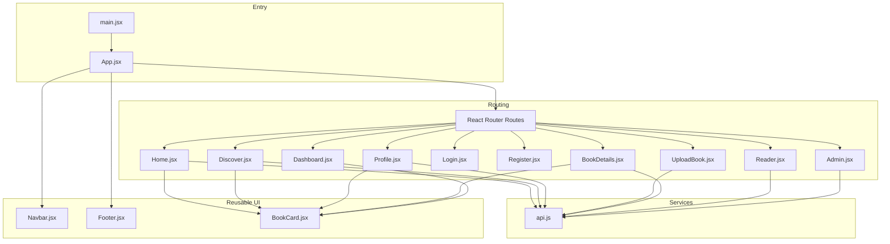
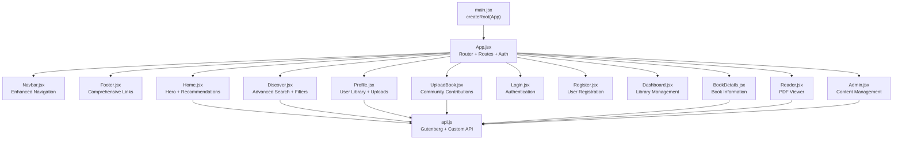
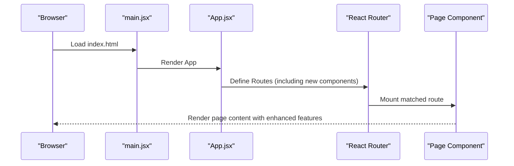
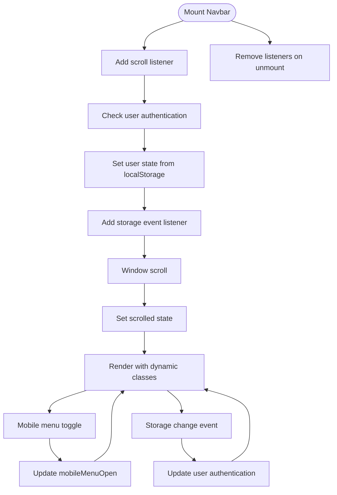
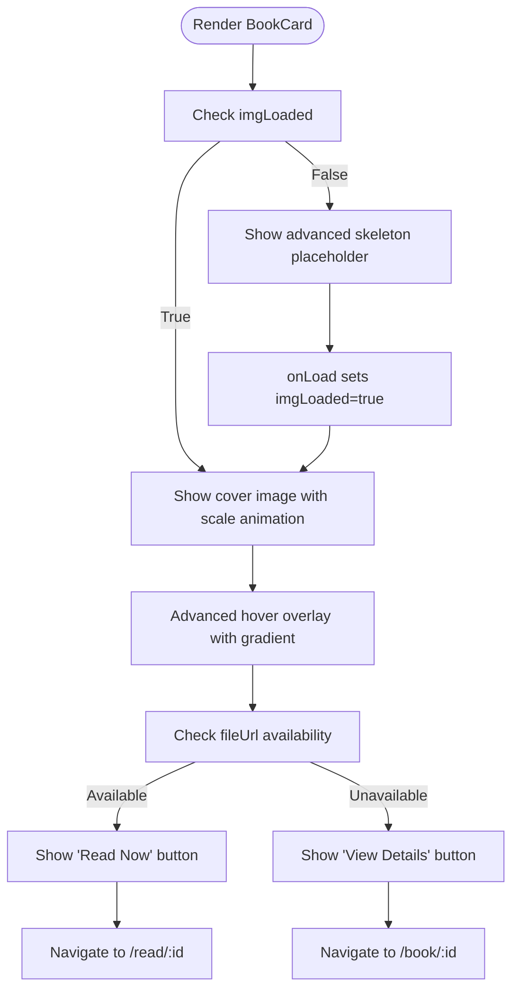
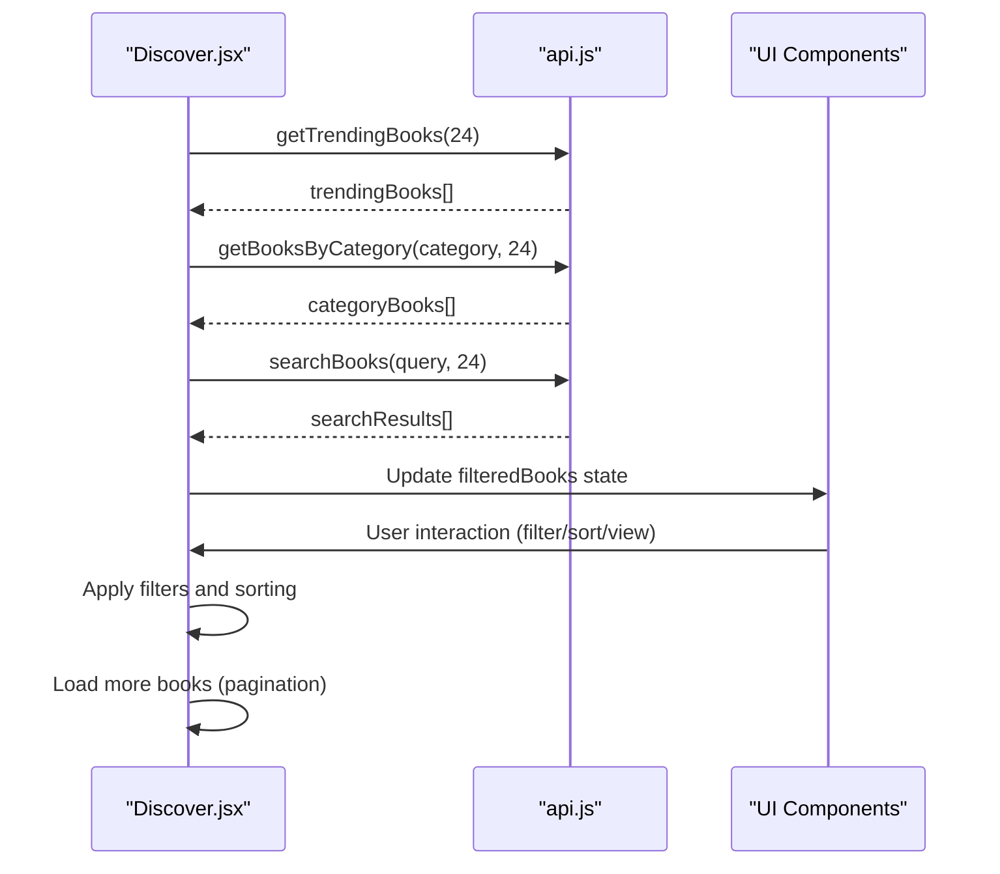
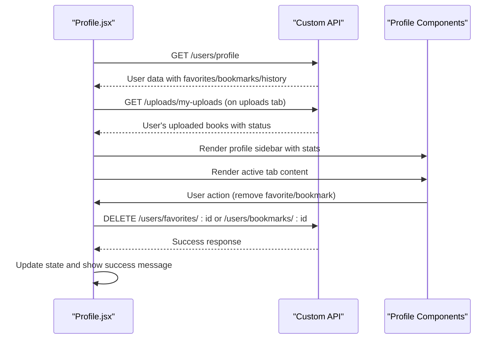
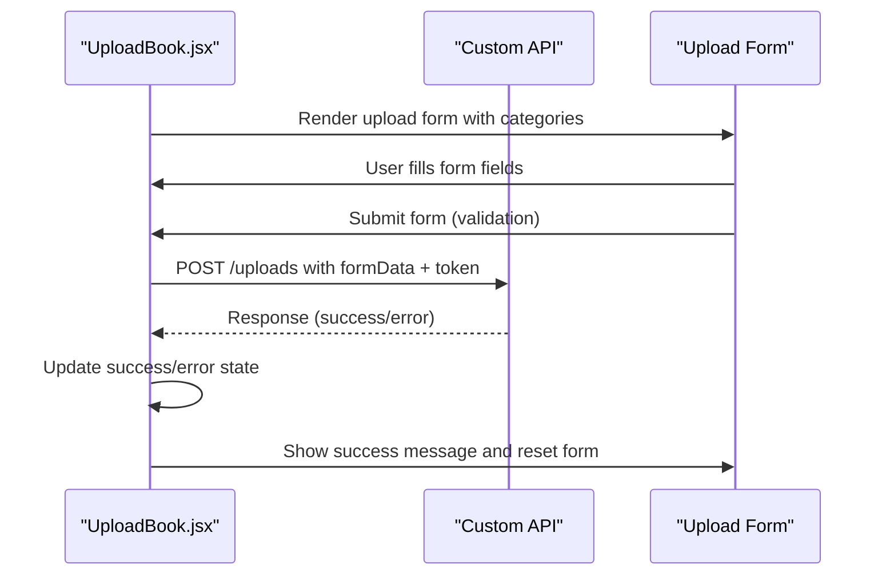
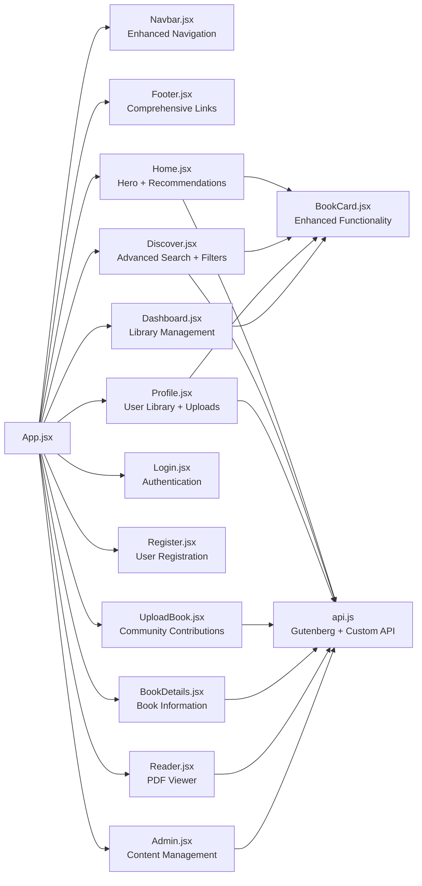

# Frontend Component Architecture

<cite>
**Referenced Files in This Document**
- [App.jsx](file://frontend/src/App.jsx)
- [main.jsx](file://frontend/src/main.jsx)
- [Navbar.jsx](file://frontend/src/components/Navbar.jsx)
- [BookCard.jsx](file://frontend/src/components/BookCard.jsx)
- [Footer.jsx](file://frontend/src/components/Footer.jsx)
- [Home.jsx](file://frontend/src/pages/Home.jsx)
- [Login.jsx](file://frontend/src/pages/Login.jsx)
- [Register.jsx](file://frontend/src/pages/Register.jsx)
- [Dashboard.jsx](file://frontend/src/pages/Dashboard.jsx)
- [Discover.jsx](file://frontend/src/pages/Discover.jsx)
- [Profile.jsx](file://frontend/src/pages/Profile.jsx)
- [UploadBook.jsx](file://frontend/src/pages/UploadBook.jsx)
- [BookDetails.jsx](file://frontend/src/pages/BookDetails.jsx)
- [Reader.jsx](file://frontend/src/pages/Reader.jsx)
- [Admin.jsx](file://frontend/src/pages/Admin.jsx)
- [api.js](file://frontend/src/services/api.js)
- [index.css](file://frontend/src/index.css)
- [tailwind.config.js](file://frontend/tailwind.config.js)
</cite>

## Update Summary
**Changes Made**
- Added comprehensive documentation for new page components: Discover, Profile, and UploadBook
- Enhanced BookCard component documentation with improved styling and functionality
- Updated Navbar component documentation with new navigation features and user authentication
- Expanded component architecture overview to include advanced page components
- Added detailed analysis of new user-centric features and enhanced UI components

## Table of Contents
1. [Introduction](#introduction)
2. [Project Structure](#project-structure)
3. [Core Components](#core-components)
4. [Architecture Overview](#architecture-overview)
5. [Detailed Component Analysis](#detailed-component-analysis)
6. [Advanced Page Components](#advanced-page-components)
7. [Enhanced UI Components](#enhanced-ui-components)
8. [Dependency Analysis](#dependency-analysis)
9. [Performance Considerations](#performance-considerations)
10. [Troubleshooting Guide](#troubleshooting-guide)
11. [Conclusion](#conclusion)

## Introduction
This document describes ReadSphere's React component architecture with a focus on the component hierarchy starting from the root App component and route-based page components. The architecture has been comprehensively enhanced with advanced page components including Discover, Profile, and UploadBook, along with significantly improved UI components featuring enhanced styling and functionality. The system emphasizes user-centric features, comprehensive book discovery, personalization capabilities, and community-driven content sharing.

## Project Structure
The frontend is organized by feature and responsibility with a sophisticated component hierarchy:
- Root entry renders the application shell and mounts the router.
- Routing defines the page-level components including new advanced features.
- Reusable UI components live under components/ with enhanced functionality.
- Page components live under pages/ with comprehensive user interaction capabilities.
- Services encapsulate API integrations with Project Gutenberg and custom backend.
- Styling is centralized in index.css with Tailwind configuration supporting advanced animations.

**Diagram sources**
- [main.jsx:1-11](file://frontend/src/main.jsx#L1-L11)
- [App.jsx:16-37](file://frontend/src/App.jsx#L16-L37)
- [Discover.jsx:1-452](file://frontend/src/pages/Discover.jsx#L1-L452)
- [Profile.jsx:1-333](file://frontend/src/pages/Profile.jsx#L1-L333)
- [UploadBook.jsx:1-230](file://frontend/src/pages/UploadBook.jsx#L1-L230)
- [BookCard.jsx:1-76](file://frontend/src/components/BookCard.jsx#L1-L76)
- [Navbar.jsx:1-172](file://frontend/src/components/Navbar.jsx#L1-L172)
- [Footer.jsx:1-74](file://frontend/src/components/Footer.jsx#L1-L74)
- [api.js:1-308](file://frontend/src/services/api.js#L1-L308)

**Section sources**
- [main.jsx:1-11](file://frontend/src/main.jsx#L1-L11)
- [App.jsx:16-37](file://frontend/src/App.jsx#L16-L37)

## Core Components
This section documents reusable UI components and their enhanced roles in the comprehensive architecture.

### Enhanced Navbar Component
- **Purpose**: Advanced fixed header navigation with responsive mobile menu, scroll-aware styling, active-link highlighting, and user authentication integration.
- **Props**: None.
- **State**: Tracks scroll position, mobile menu open state, user authentication status, and navigation items visibility based on user role.
- **Interactions**: Toggles mobile menu, updates active link based on current location, handles user logout, and conditionally renders admin panel access.
- **Styling**: Uses Tailwind utilities for backdrop blur, gradients, transitions, responsive layout, and dynamic user interface elements.
- **Lifecycle**: Adds and removes scroll event listener on mount/unmount, listens for storage changes for real-time user state updates.
- **Enhanced Features**: Dynamic navigation items based on user authentication, admin panel access for authorized users, and responsive design improvements.

### Enhanced BookCard Component
- **Purpose**: Sophisticated book tile with cover image, rating badge, category tag, advanced hover overlay with conditional "Read Now" or "View Details" actions, and skeleton loading.
- **Props**: book (object with id/_id, title, author, category, rating, coverImage, fileUrl).
- **State**: Tracks image load completion to swap skeleton for image and manages hover states.
- **Interactions**: Navigates to book details page or reader based on file availability, provides gradient glow effects on hover.
- **Styling**: Advanced glass panel effects, gradient overlays, hover transforms with scale animations, responsive aspect ratios, and sophisticated shadow effects.
- **Enhanced Functionality**: Conditional rendering based on file availability, improved accessibility with proper ARIA labels, and enhanced visual feedback.

### Enhanced Footer Component
- **Purpose**: Comprehensive multi-column footer with brand identity, extensive links, social media integration, and responsive design.
- **Props**: None.
- **State**: None.
- **Interactions**: Links navigate internally or externally with proper routing.
- **Styling**: Responsive grid layout, gradient accents, hover effects, and improved visual hierarchy.

**Section sources**
- [Navbar.jsx:1-172](file://frontend/src/components/Navbar.jsx#L1-L172)
- [BookCard.jsx:1-76](file://frontend/src/components/BookCard.jsx#L1-L76)
- [Footer.jsx:1-74](file://frontend/src/components/Footer.jsx#L1-L74)

## Architecture Overview
The application follows a sophisticated React SPA architecture with advanced user-centric features:
- Entry point initializes the root and mounts App with comprehensive routing.
- App configures routing and composes global UI with enhanced navigation and authentication.
- Page components orchestrate data fetching via the API service and render reusable UI components with advanced functionality.
- State management is primarily local to pages and components, with minimal prop drilling due to component composition.
- Advanced features include user profiles, book uploads, comprehensive discovery, and community interactions.

**Diagram sources**
- [main.jsx:1-11](file://frontend/src/main.jsx#L1-L11)
- [App.jsx:16-37](file://frontend/src/App.jsx#L16-L37)
- [Discover.jsx:18-141](file://frontend/src/pages/Discover.jsx#L18-L141)
- [Profile.jsx:10-64](file://frontend/src/pages/Profile.jsx#L10-L64)
- [UploadBook.jsx:13-66](file://frontend/src/pages/UploadBook.jsx#L13-L66)
- [api.js:1-308](file://frontend/src/services/api.js#L1-L308)

## Detailed Component Analysis

### App Shell and Routing
- App wraps the application in Router and renders Navbar, Routes, and Footer with comprehensive route definitions.
- Routes define page-level components including new advanced features: Discover, Profile, and UploadBook.
- The main content area is wrapped to accommodate fixed header spacing with enhanced navigation.
- Nested Admin routes provide comprehensive content management capabilities.

**Diagram sources**
- [main.jsx:1-11](file://frontend/src/main.jsx#L1-L11)
- [App.jsx:16-37](file://frontend/src/App.jsx#L16-L37)

**Section sources**
- [App.jsx:16-37](file://frontend/src/App.jsx#L16-L37)

### Enhanced Navbar Component
- **Features**: Scroll-aware background, mobile hamburger menu, active link detection, user authentication integration, conditional navigation items, and admin panel access.
- **State**: scrolled, mobileMenuOpen, user authentication status.
- **Events**: scroll listener, toggle button click, link clicks, storage change events for real-time user state updates.
- **Enhanced Styling**: backdrop blur, gradient text, transitions, mobile drawer with translate transforms, and dynamic user interface elements.
- **Authentication Integration**: Real-time user state monitoring, conditional rendering of admin panel access, and logout functionality.

**Diagram sources**
- [Navbar.jsx:11-17](file://frontend/src/components/Navbar.jsx#L11-L17)
- [Navbar.jsx:19-37](file://frontend/src/components/Navbar.jsx#L19-L37)
- [Navbar.jsx:41-46](file://frontend/src/components/Navbar.jsx#L41-L46)

**Section sources**
- [Navbar.jsx:1-172](file://frontend/src/components/Navbar.jsx#L1-L172)

### Enhanced BookCard Component
- **Features**: Advanced skeleton placeholder during image load, rating badge with star icons, category tag, sophisticated gradient overlay with conditional "Read Now" or "View Details" buttons, and hover animations.
- **Props**: book (title, author, category, rating, coverImage, id/_id, fileUrl).
- **State**: imgLoaded for image loading optimization.
- **Interactions**: Conditional navigation to reader or book details based on file availability, gradient glow effects on hover.
- **Enhanced Styling**: Advanced glass panel effects, gradient overlays, hover transforms with scale animations, responsive aspect ratios, and sophisticated shadow effects.

**Diagram sources**
- [BookCard.jsx:6-23](file://frontend/src/components/BookCard.jsx#L6-L23)
- [BookCard.jsx:38-55](file://frontend/src/components/BookCard.jsx#L38-L55)

**Section sources**
- [BookCard.jsx:1-76](file://frontend/src/components/BookCard.jsx#L1-L76)

### Enhanced Footer Component
- **Features**: Comprehensive brand identity, multi-column link sections with extensive navigation, social media integration with hover effects, and responsive design.
- **Props**: None.
- **Interactions**: Internal and external navigation with proper routing.

**Section sources**
- [Footer.jsx:1-74](file://frontend/src/components/Footer.jsx#L1-L74)

## Advanced Page Components

### Discover Page
- **Responsibilities**: Comprehensive book discovery with advanced search, category filtering, sorting options, view modes (grid/list), pagination, and active filter management.
- **Data**: Fetches trending books, category-specific books, and search results from Project Gutenberg API with debounced search functionality.
- **State**: activeCategory, searchQuery, books, filteredBooks, isLoading, viewMode, sortBy, showFilters, page, hasMore.
- **Interactions**: Category pill toggles, debounced search with 600ms delay, sort dropdown selection, view mode switching, filter clearing, and infinite scroll loading.
- **Enhanced Features**: Advanced filtering system with active filter badges, clear filters functionality, skeleton loading states, and comprehensive error handling.
- **API**: searchBooks, getBooksByCategory, getTrendingBooks with intelligent fallbacks.

**Diagram sources**
- [Discover.jsx:36-60](file://frontend/src/pages/Discover.jsx#L36-L60)
- [Discover.jsx:63-87](file://frontend/src/pages/Discover.jsx#L63-L87)
- [Discover.jsx:128-133](file://frontend/src/pages/Discover.jsx#L128-L133)

**Section sources**
- [Discover.jsx:1-452](file://frontend/src/pages/Discover.jsx#L1-L452)
- [api.js:131-153](file://frontend/src/services/api.js#L131-L153)
- [api.js:184-201](file://frontend/src/services/api.js#L184-L201)
- [api.js:207-229](file://frontend/src/services/api.js#L207-L229)

### Profile Page
- **Responsibilities**: Comprehensive user profile management with favorites, bookmarks, reading history, and uploaded books with status tracking.
- **Data**: Fetches user profile, favorites, bookmarks, reading history, and user's uploaded books from custom API endpoints.
- **State**: activeTab, user, favorites, bookmarks, readingHistory, myUploads, isLoading, error, success.
- **Interactions**: Tab switching between favorites, bookmarks, reading history, and uploads, individual item removal, logout functionality, and upload management.
- **Enhanced Features**: Status indicators for uploaded books (approved/pending/rejected), comprehensive error handling, success notifications, and responsive layout.
- **API**: Custom endpoints for user profile, favorites, bookmarks, reading history, and user uploads.

**Diagram sources**
- [Profile.jsx:31-46](file://frontend/src/pages/Profile.jsx#L31-L46)
- [Profile.jsx:48-58](file://frontend/src/pages/Profile.jsx#L48-L58)
- [Profile.jsx:66-94](file://frontend/src/pages/Profile.jsx#L66-L94)

**Section sources**
- [Profile.jsx:1-333](file://frontend/src/pages/Profile.jsx#L1-L333)

### UploadBook Page
- **Responsibilities**: Community-driven book upload system with comprehensive form validation, file URL submission, and status tracking.
- **Data**: Handles book upload form submission to custom API endpoint with authentication.
- **State**: formData (title, author, description, category, coverImage, fileUrl, pages, publishYear), isSubmitting, error, success.
- **Interactions**: Form field validation, file URL submission, success/error state management, and navigation back to profile.
- **Enhanced Features**: Comprehensive form validation, loading states with spinner animations, success/error notifications, and category selection.
- **API**: POST request to /uploads endpoint with authentication token.

**Diagram sources**
- [UploadBook.jsx:34-66](file://frontend/src/pages/UploadBook.jsx#L34-L66)
- [UploadBook.jsx:14-23](file://frontend/src/pages/UploadBook.jsx#L14-L23)

**Section sources**
- [UploadBook.jsx:1-230](file://frontend/src/pages/UploadBook.jsx#L1-L230)

### Enhanced Dashboard Page
- **Responsibilities**: Traditional user library dashboard with enhanced navigation and improved visual presentation.
- **Data**: Uses mock data for demonstration purposes with comprehensive grid layouts.
- **State**: activeTab for navigation between reading, favorites, bookmarks, and settings.
- **Interactions**: Tab switching with animated transitions, progress tracking, and interactive elements.

**Section sources**
- [Dashboard.jsx:1-159](file://frontend/src/pages/Dashboard.jsx#L1-L159)

### Enhanced BookDetails Page
- **Responsibilities**: Detailed book view with enhanced metadata display, AI summary integration, and comprehensive action buttons.
- **Data**: Fetches book details and checks preview availability from Project Gutenberg API.
- **State**: book, isLoading, error, isFavorite, isBookmarked, hasPreview, checkingPreview.
- **Interactions**: Preview availability check, navigation to Reader or external Google Books, favorite/bookmark toggles, and AI summary display.

**Section sources**
- [BookDetails.jsx:1-225](file://frontend/src/pages/BookDetails.jsx#L1-L225)

### Enhanced Reader Page
- **Responsibilities**: Advanced embedded Google Books viewer with theme toggle, error handling, and comprehensive book metadata display.
- **Data**: Fetches book title and metadata for header display.
- **State**: bookTitle, theme, isLoading, hasError.
- **Interactions**: Theme switch, back navigation, dynamic script loading for Google Books JSAPI, and error state management.
- **Lifecycle**: Optimized script loading with caching, viewer initialization, and error recovery mechanisms.

**Section sources**
- [Reader.jsx:1-178](file://frontend/src/pages/Reader.jsx#L1-L178)

### Enhanced Admin Page
- **Responsibilities**: Comprehensive administrative dashboard with advanced book and user management, search functionality, and action controls.
- **Data**: Uses mock data for demonstration with comprehensive table layouts.
- **State**: activeTab for navigation between books and users management.
- **Interactions**: Tab switching, search input handling, edit/delete actions, and bulk operations.

**Section sources**
- [Admin.jsx:1-174](file://frontend/src/pages/Admin.jsx#L1-L174)

## Enhanced UI Components

### Advanced BookCard Component
- **Enhanced Features**: Improved skeleton loading with more sophisticated animations, enhanced hover effects with gradient overlays, conditional navigation based on file availability, and refined visual hierarchy.
- **Styling Improvements**: Advanced glass-morphism effects, sophisticated shadow systems, improved aspect ratio handling, and enhanced responsive design.
- **Accessibility**: Better ARIA labels, improved keyboard navigation support, and enhanced screen reader compatibility.

### Enhanced Navbar Component
- **Advanced Navigation**: Conditional rendering of navigation items based on user authentication, admin panel access for authorized users, and real-time user state updates.
- **Visual Enhancements**: Improved mobile menu animations, enhanced user avatar display, and sophisticated active state indicators.
- **Integration**: Seamless integration with authentication system and real-time user state synchronization.

### Enhanced Footer Component
- **Comprehensive Link Structure**: Expanded navigation categories with more detailed link hierarchies, improved social media integration, and enhanced responsive design.
- **Brand Presentation**: Refined brand identity display with improved visual hierarchy and better mobile responsiveness.

**Section sources**
- [BookCard.jsx:1-76](file://frontend/src/components/BookCard.jsx#L1-L76)
- [Navbar.jsx:1-172](file://frontend/src/components/Navbar.jsx#L1-L172)
- [Footer.jsx:1-74](file://frontend/src/components/Footer.jsx#L1-L74)

## Dependency Analysis
- **Component dependencies**:
  - App depends on enhanced Navbar, Footer, and all page components including new advanced features.
  - Home, Discover, Profile, UploadBook, BookDetails, Reader depend on api.js with enhanced API integration.
  - Home, Discover, Profile, Dashboard use enhanced BookCard with improved functionality.
- **External dependencies**:
  - react-router-dom for comprehensive routing and navigation.
  - lucide-react for enhanced iconography with improved visual consistency.
  - Project Gutenberg API for comprehensive book data with fallback mechanisms.
  - Custom backend API for user management, uploads, and profile functionality.

**Diagram sources**
- [App.jsx:16-37](file://frontend/src/App.jsx#L16-L37)
- [Discover.jsx:1-452](file://frontend/src/pages/Discover.jsx#L1-L452)
- [Profile.jsx:1-333](file://frontend/src/pages/Profile.jsx#L1-L333)
- [UploadBook.jsx:1-230](file://frontend/src/pages/UploadBook.jsx#L1-L230)
- [BookCard.jsx:1-76](file://frontend/src/components/BookCard.jsx#L1-L76)
- [api.js:1-308](file://frontend/src/services/api.js#L1-L308)

**Section sources**
- [App.jsx:16-37](file://frontend/src/App.jsx#L16-L37)
- [api.js:1-308](file://frontend/src/services/api.js#L1-L308)

## Performance Considerations
- **Enhanced Image Loading**: BookCard uses sophisticated skeleton placeholders with advanced animations and opacity transitions to improve perceived performance.
- **Advanced Horizontal Scrolling**: Discover page uses optimized refs and smooth scroll for carousels to avoid layout thrashing with debounced search functionality.
- **Intelligent API Fallbacks**: api.js returns comprehensive mock data when network requests fail or rate limits are hit, preventing broken UI with enhanced error handling.
- **Optimized Lazy Initialization**: Reader dynamically loads the Google Books JSAPI only when needed with caching mechanisms.
- **Advanced CSS Animations**: Tailwind utilities provide sophisticated animations with enhanced performance optimizations; keep durations reasonable to avoid jank.
- **Debounced Search**: Discover page implements 600ms debounced search to optimize API calls and improve user experience.
- **Conditional Rendering**: Enhanced components use conditional rendering based on user authentication and data availability.

## Troubleshooting Guide
- **Navigation Issues**:
  - Verify routes in App.jsx match page component exports including new components.
  - Ensure Link components use correct paths with enhanced routing.
  - Check authentication state for conditional navigation items.
- **API Failures**:
  - Confirm environment variables for Project Gutenberg API and custom backend are set.
  - Check network tab for 403/429 responses; enhanced fallback mechanisms are used automatically.
  - Monitor debounced search functionality for optimal performance.
- **Enhanced Reader Viewer Errors**:
  - If preview is unavailable, the component displays an error state and external link option.
  - Check Google Books API integration and fallback mechanisms.
- **Mobile Menu Issues**:
  - Navbar click handlers set mobile menu state; confirm event handlers are attached.
  - Verify responsive design breakpoints and touch interactions.
- **Authentication Problems**:
  - Check localStorage for token and user data persistence.
  - Verify storage event listeners for real-time user state updates.
- **Upload Issues**:
  - Verify file URL accessibility and PDF format validation.
  - Check upload status tracking and approval workflows.

**Section sources**
- [App.jsx:22-31](file://frontend/src/App.jsx#L22-L31)
- [Discover.jsx:89-98](file://frontend/src/pages/Discover.jsx#L89-L98)
- [Profile.jsx:96-100](file://frontend/src/pages/Profile.jsx#L96-L100)
- [UploadBook.jsx:34-66](file://frontend/src/pages/UploadBook.jsx#L34-L66)
- [Navbar.jsx:31-37](file://frontend/src/components/Navbar.jsx#L31-L37)

## Conclusion
ReadSphere's frontend architecture represents a comprehensive and sophisticated React application with advanced user-centric features. The enhanced component hierarchy demonstrates clear separation of concerns with the App.jsx orchestrating routing and global UI, while page components manage domain-specific state and data fetching via the enhanced api.js service. The addition of advanced page components including Discover, Profile, and UploadBook significantly expands the platform's functionality, enabling comprehensive book discovery, user personalization, and community-driven content sharing.

The enhanced UI components showcase improved styling and functionality with sophisticated animations, responsive design patterns, and interactive state handling. The architecture supports scalability through modular components, predictable state management, and robust API integration with intelligent fallbacks. The integration of Project Gutenberg API with custom backend services provides a comprehensive solution for book discovery, user management, and community contributions.

The enhanced architecture emphasizes user experience with advanced search capabilities, personalized recommendations, comprehensive profile management, and seamless book reading experiences. The sophisticated component composition patterns, state management approaches, and prop drilling solutions demonstrate best practices in modern React development, positioning ReadSphere as a scalable and maintainable platform for digital book management and community engagement.