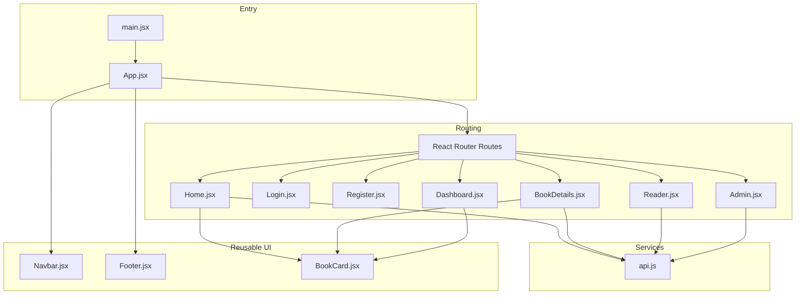
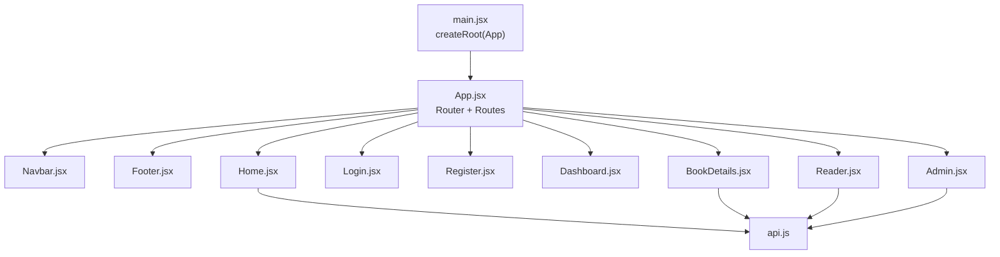
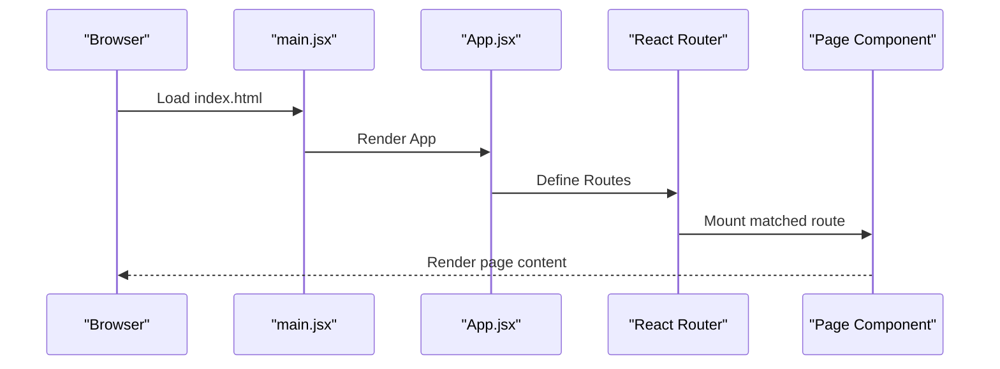
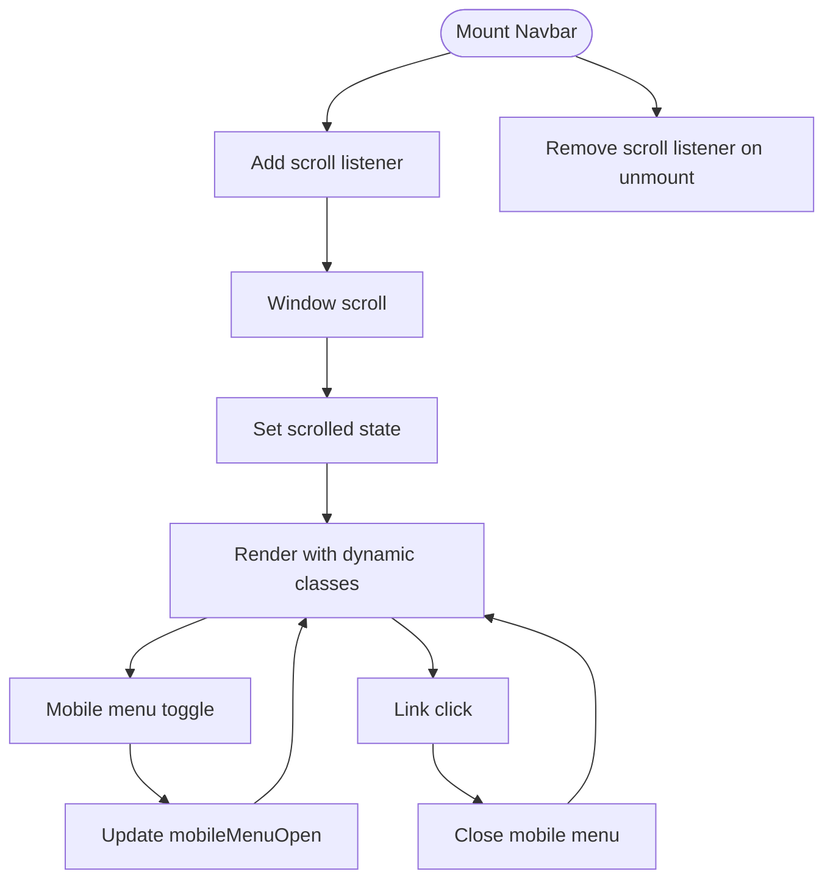
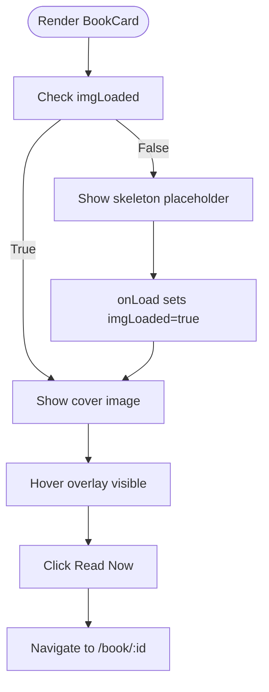
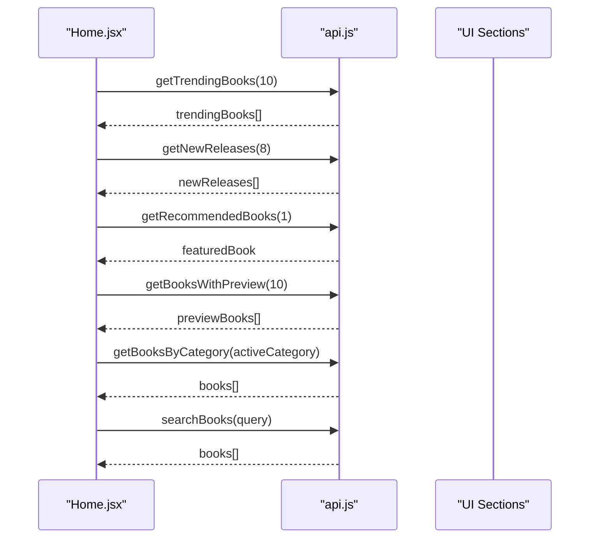
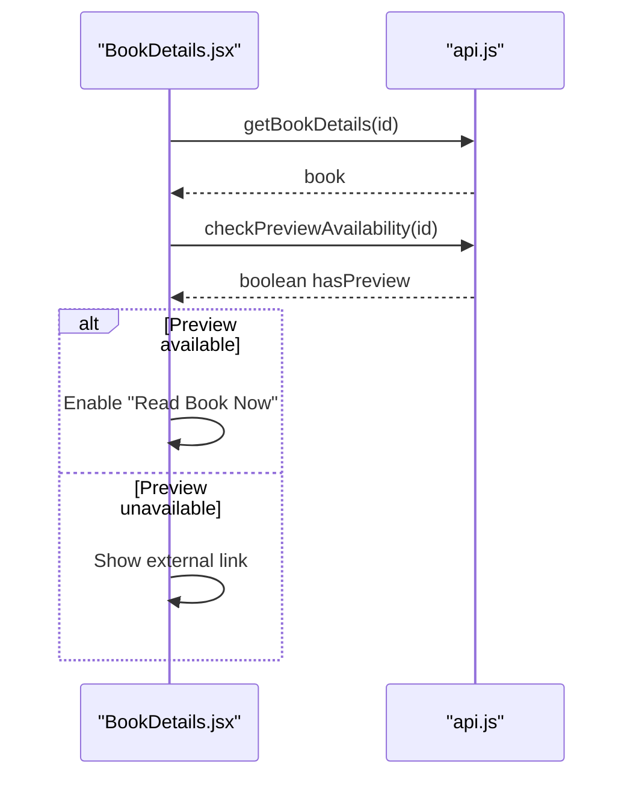
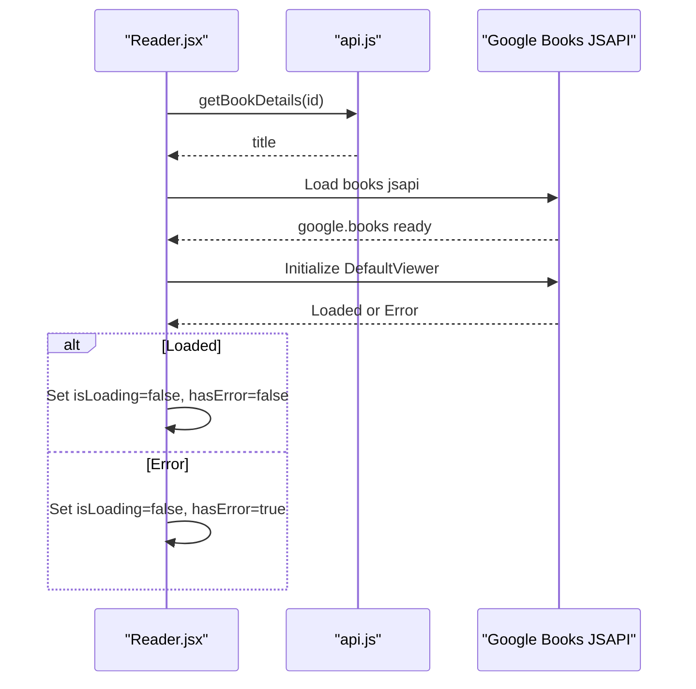
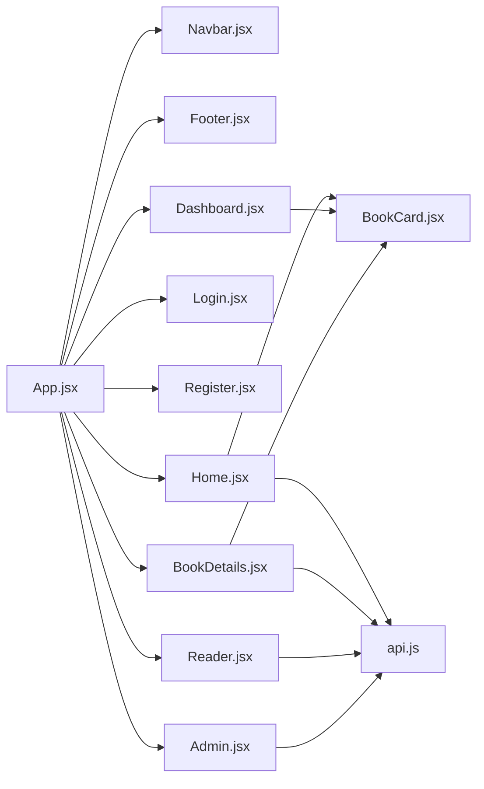

# Frontend Component Architecture

<cite>
**Referenced Files in This Document**
- [App.jsx](file://frontend/src/App.jsx)
- [main.jsx](file://frontend/src/main.jsx)
- [Navbar.jsx](file://frontend/src/components/Navbar.jsx)
- [BookCard.jsx](file://frontend/src/components/BookCard.jsx)
- [Footer.jsx](file://frontend/src/components/Footer.jsx)
- [Home.jsx](file://frontend/src/pages/Home.jsx)
- [Login.jsx](file://frontend/src/pages/Login.jsx)
- [Register.jsx](file://frontend/src/pages/Register.jsx)
- [Dashboard.jsx](file://frontend/src/pages/Dashboard.jsx)
- [BookDetails.jsx](file://frontend/src/pages/BookDetails.jsx)
- [Reader.jsx](file://frontend/src/pages/Reader.jsx)
- [Admin.jsx](file://frontend/src/pages/Admin.jsx)
- [api.js](file://frontend/src/services/api.js)
- [index.css](file://frontend/src/index.css)
- [tailwind.config.js](file://frontend/tailwind.config.js)
</cite>

## Table of Contents
1. [Introduction](#introduction)
2. [Project Structure](#project-structure)
3. [Core Components](#core-components)
4. [Architecture Overview](#architecture-overview)
5. [Detailed Component Analysis](#detailed-component-analysis)
6. [Dependency Analysis](#dependency-analysis)
7. [Performance Considerations](#performance-considerations)
8. [Troubleshooting Guide](#troubleshooting-guide)
9. [Conclusion](#conclusion)

## Introduction
This document describes ReadSphere’s React component architecture with a focus on the component hierarchy starting from the root App component and route-based page components. It explains reusable UI components such as Navbar, BookCard, and Footer, detailing their props, styling, and interaction patterns. It also documents page components including Home, Login, Register, Dashboard, BookDetails, Reader, and Admin, covering their specific functionality and data requirements. The document covers component composition patterns, state management approaches, and prop drilling solutions, along with styling implementation using Tailwind CSS, responsive design patterns, interactive state handling, component lifecycle, event handling, and integration with the API service layer.

## Project Structure
The frontend is organized by feature and responsibility:
- Root entry renders the application shell and mounts the router.
- Routing defines the page-level components.
- Reusable UI components live under components/.
- Page components live under pages/.
- Services encapsulate API integrations.
- Styling is centralized in index.css with Tailwind configuration.

**Diagram sources**
- [main.jsx:1-11](file://frontend/src/main.jsx#L1-L11)
- [App.jsx:16-37](file://frontend/src/App.jsx#L16-L37)
- [Home.jsx:1-483](file://frontend/src/pages/Home.jsx#L1-L483)
- [Login.jsx:1-84](file://frontend/src/pages/Login.jsx#L1-L84)
- [Register.jsx:1-99](file://frontend/src/pages/Register.jsx#L1-L99)
- [Dashboard.jsx:1-159](file://frontend/src/pages/Dashboard.jsx#L1-L159)
- [BookDetails.jsx:1-225](file://frontend/src/pages/BookDetails.jsx#L1-L225)
- [Reader.jsx:1-178](file://frontend/src/pages/Reader.jsx#L1-L178)
- [Admin.jsx:1-174](file://frontend/src/pages/Admin.jsx#L1-L174)
- [BookCard.jsx:1-58](file://frontend/src/components/BookCard.jsx#L1-L58)
- [Navbar.jsx:1-56](file://frontend/src/components/Navbar.jsx#L1-L56)
- [Footer.jsx:1-74](file://frontend/src/components/Footer.jsx#L1-L74)
- [api.js:1-284](file://frontend/src/services/api.js#L1-L284)

**Section sources**
- [main.jsx:1-11](file://frontend/src/main.jsx#L1-L11)
- [App.jsx:16-37](file://frontend/src/App.jsx#L16-L37)

## Core Components
This section documents reusable UI components and their roles.

- Navbar
  - Purpose: Fixed header navigation with responsive mobile menu, scroll-aware styling, and active-link highlighting.
  - Props: None.
  - State: Tracks scroll position and mobile menu open state.
  - Interactions: Toggles mobile menu, updates active link based on current location.
  - Styling: Uses Tailwind utilities for backdrop blur, gradients, transitions, and responsive layout.
  - Lifecycle: Adds and removes scroll event listener on mount/unmount.

- BookCard
  - Purpose: Compact book tile with cover image, rating badge, category tag, hover overlay with “Read Now” action, and skeleton loading.
  - Props: book (object with id/_id, title, author, category, rating, coverImage).
  - State: Tracks image load completion to swap skeleton for image.
  - Interactions: Navigates to book details page on click.
  - Styling: Glass panel, gradient overlays, hover transforms, and responsive aspect ratios.

- Footer
  - Purpose: Multi-column footer with brand identity, links, and social media.
  - Props: None.
  - State: None.
  - Interactions: Links navigate internally or externally.
  - Styling: Responsive grid layout, gradient accents, and hover effects.

**Section sources**
- [Navbar.jsx:1-56](file://frontend/src/components/Navbar.jsx#L1-L56)
- [BookCard.jsx:1-58](file://frontend/src/components/BookCard.jsx#L1-L58)
- [Footer.jsx:1-74](file://frontend/src/components/Footer.jsx#L1-L74)

## Architecture Overview
The application follows a conventional React SPA architecture:
- Entry point initializes the root and mounts App.
- App configures routing and composes global UI (Navbar and Footer).
- Page components orchestrate data fetching via the API service and render reusable UI components.
- State is primarily local to pages and components, with minimal prop drilling due to component composition.

**Diagram sources**
- [main.jsx:1-11](file://frontend/src/main.jsx#L1-L11)
- [App.jsx:16-37](file://frontend/src/App.jsx#L16-L37)
- [Home.jsx:1-483](file://frontend/src/pages/Home.jsx#L1-L483)
- [BookDetails.jsx:1-225](file://frontend/src/pages/BookDetails.jsx#L1-L225)
- [Reader.jsx:1-178](file://frontend/src/pages/Reader.jsx#L1-L178)
- [Admin.jsx:1-174](file://frontend/src/pages/Admin.jsx#L1-L174)
- [api.js:1-284](file://frontend/src/services/api.js#L1-L284)

## Detailed Component Analysis

### App Shell and Routing
- App wraps the application in Router and renders Navbar, Routes, and Footer.
- Routes define page-level components and nested Admin routes.
- The main content area is wrapped to accommodate fixed header spacing.

**Diagram sources**
- [main.jsx:1-11](file://frontend/src/main.jsx#L1-L11)
- [App.jsx:16-37](file://frontend/src/App.jsx#L16-L37)

**Section sources**
- [App.jsx:16-37](file://frontend/src/App.jsx#L16-L37)

### Navbar Component
- Features: Scroll-aware background, mobile hamburger menu, active link detection, and responsive layout.
- State: scrolled, mobileMenuOpen.
- Events: scroll listener, toggle button click, link clicks.
- Styling: backdrop blur, gradient text, transitions, and mobile drawer with translate transforms.

**Diagram sources**
- [Navbar.jsx:10-16](file://frontend/src/components/Navbar.jsx#L10-L16)
- [Navbar.jsx:43-49](file://frontend/src/components/Navbar.jsx#L43-L49)
- [Navbar.jsx:29-40](file://frontend/src/components/Navbar.jsx#L29-L40)

**Section sources**
- [Navbar.jsx:1-56](file://frontend/src/components/Navbar.jsx#L1-L56)

### BookCard Component
- Features: Skeleton placeholder during image load, rating badge, category tag, gradient overlay with “Read Now” button.
- Props: book (title, author, category, rating, coverImage, id/_id).
- State: imgLoaded.
- Interactions: Link to book details page.

**Diagram sources**
- [BookCard.jsx:6-18](file://frontend/src/components/BookCard.jsx#L6-L18)
- [BookCard.jsx:33-37](file://frontend/src/components/BookCard.jsx#L33-L37)

**Section sources**
- [BookCard.jsx:1-58](file://frontend/src/components/BookCard.jsx#L1-L58)

### Footer Component
- Features: Brand identity, multi-column link sections, social media icons.
- Props: None.
- Interactions: Internal and external navigation.

**Section sources**
- [Footer.jsx:1-74](file://frontend/src/components/Footer.jsx#L1-L74)

### Home Page
- Responsibilities: Hero search, trending carousel, preview carousel, category filtering, featured editor’s pick, new releases, and AI features CTA.
- Data: Fetches trending, new releases, recommended, and preview books; supports category and search queries.
- State: activeCategory, searchQuery, books, trendingBooks, newReleases, previewBooks, featuredBook, isLoading flags, refs for horizontal scrolling.
- Interactions: Category pill toggles, search form submission, scroll buttons, and infinite scroll placeholders.
- API: searchBooks, getBooksByCategory, getTrendingBooks, getNewReleases, getRecommendedBooks, getBooksWithPreview.

**Diagram sources**
- [Home.jsx:44-92](file://frontend/src/pages/Home.jsx#L44-L92)
- [Home.jsx:95-112](file://frontend/src/pages/Home.jsx#L95-L112)
- [Home.jsx:114-127](file://frontend/src/pages/Home.jsx#L114-L127)
- [api.js:183-204](file://frontend/src/services/api.js#L183-L204)
- [api.js:245-283](file://frontend/src/services/api.js#L245-L283)

**Section sources**
- [Home.jsx:1-483](file://frontend/src/pages/Home.jsx#L1-L483)
- [api.js:120-144](file://frontend/src/services/api.js#L120-L144)
- [api.js:173-178](file://frontend/src/services/api.js#L173-L178)
- [api.js:183-204](file://frontend/src/services/api.js#L183-L204)
- [api.js:245-283](file://frontend/src/services/api.js#L245-L283)

### Login Page
- Responsibilities: Authentication form with email and password, submit handler, and navigation to register.
- State: email, password.
- Interactions: Form submission logs credentials (placeholder).

**Section sources**
- [Login.jsx:1-84](file://frontend/src/pages/Login.jsx#L1-L84)

### Register Page
- Responsibilities: Registration form with username, email, and password, submit handler, and navigation to login.
- State: username, email, password.
- Interactions: Form submission logs credentials (placeholder).

**Section sources**
- [Register.jsx:1-99](file://frontend/src/pages/Register.jsx#L1-L99)

### Dashboard Page
- Responsibilities: User library dashboard with tabs for currently reading, favorites, bookmarks, and settings.
- Data: Mock data for favorites and currently reading.
- State: activeTab.
- Interactions: Tab switching, progress bars, and action buttons.

**Section sources**
- [Dashboard.jsx:1-159](file://frontend/src/pages/Dashboard.jsx#L1-L159)

### BookDetails Page
- Responsibilities: Detailed book view with cover, metadata, actions (favorite, bookmark, share), AI summary, and similar books placeholder.
- Data: Fetches book details and checks preview availability.
- State: book, isLoading, error, isFavorite, isBookmarked, hasPreview, checkingPreview.
- Interactions: Preview availability check, navigation to Reader or external Google Books, favorite/bookmark toggles.

**Diagram sources**
- [BookDetails.jsx:16-57](file://frontend/src/pages/BookDetails.jsx#L16-L57)
- [api.js:151-168](file://frontend/src/services/api.js#L151-L168)
- [api.js:217-237](file://frontend/src/services/api.js#L217-L237)

**Section sources**
- [BookDetails.jsx:1-225](file://frontend/src/pages/BookDetails.jsx#L1-L225)
- [api.js:151-168](file://frontend/src/services/api.js#L151-L168)
- [api.js:217-237](file://frontend/src/services/api.js#L217-L237)

### Reader Page
- Responsibilities: Embedded Google Books viewer with theme toggle and error handling.
- Data: Fetches book title for header.
- State: bookTitle, theme, isLoading, hasError.
- Interactions: Theme switch, back navigation, dynamic script loading for Google Books JSAPI.
- Lifecycle: Loads script once, initializes viewer, handles errors.

**Diagram sources**
- [Reader.jsx:15-99](file://frontend/src/pages/Reader.jsx#L15-L99)
- [Reader.jsx:101-175](file://frontend/src/pages/Reader.jsx#L101-L175)
- [api.js:151-168](file://frontend/src/services/api.js#L151-L168)

**Section sources**
- [Reader.jsx:1-178](file://frontend/src/pages/Reader.jsx#L1-L178)
- [api.js:151-168](file://frontend/src/services/api.js#L151-L168)

### Admin Page
- Responsibilities: Administrative dashboard with tabs for managing books and users, search input, and action buttons.
- Data: Mock data for books and users.
- State: activeTab.
- Interactions: Tab switching, search input, edit/delete actions.

**Section sources**
- [Admin.jsx:1-174](file://frontend/src/pages/Admin.jsx#L1-L174)

## Dependency Analysis
- Component dependencies:
  - App depends on Navbar, Footer, and page components.
  - Home, BookDetails, Reader depend on api.js.
  - Home and Dashboard use BookCard.
- External dependencies:
  - react-router-dom for routing and navigation.
  - lucide-react for icons.
  - Google Books API for data and embedded viewer.

**Diagram sources**
- [App.jsx:16-37](file://frontend/src/App.jsx#L16-L37)
- [Home.jsx:1-483](file://frontend/src/pages/Home.jsx#L1-L483)
- [BookDetails.jsx:1-225](file://frontend/src/pages/BookDetails.jsx#L1-L225)
- [Reader.jsx:1-178](file://frontend/src/pages/Reader.jsx#L1-L178)
- [Admin.jsx:1-174](file://frontend/src/pages/Admin.jsx#L1-L174)
- [BookCard.jsx:1-58](file://frontend/src/components/BookCard.jsx#L1-L58)
- [api.js:1-284](file://frontend/src/services/api.js#L1-L284)

**Section sources**
- [App.jsx:16-37](file://frontend/src/App.jsx#L16-L37)
- [api.js:1-284](file://frontend/src/services/api.js#L1-L284)

## Performance Considerations
- Image loading: BookCard uses a skeleton placeholder and opacity transitions to improve perceived performance.
- Horizontal scrolling: Home uses refs and smooth scroll for carousels to avoid layout thrashing.
- API fallbacks: api.js returns mock data when network requests fail or rate limits are hit, preventing broken UI.
- Lazy initialization: Reader dynamically loads the Google Books JSAPI only when needed.
- CSS animations: Tailwind utilities provide lightweight animations; keep durations reasonable to avoid jank.

## Troubleshooting Guide
- Navigation issues:
  - Verify routes in App.jsx match page component exports.
  - Ensure Link components use correct paths.
- API failures:
  - Confirm environment variable for Google Books API key is set if required.
  - Check network tab for 403/429 responses; fallback mock data is used automatically.
- Reader viewer errors:
  - If preview is unavailable, the component displays an error state and external link option.
- Mobile menu not closing:
  - Navbar click handlers set mobile menu state; confirm event handlers are attached.

**Section sources**
- [App.jsx:22-31](file://frontend/src/App.jsx#L22-L31)
- [api.js:10-12](file://frontend/src/services/api.js#L10-L12)
- [Reader.jsx:137-164](file://frontend/src/pages/Reader.jsx#L137-L164)
- [Navbar.jsx:37-40](file://frontend/src/components/Navbar.jsx#L37-L40)

## Conclusion
ReadSphere’s frontend is structured around a clean component hierarchy with clear separation of concerns. App.jsx orchestrates routing and global UI, while page components manage domain-specific state and data fetching via api.js. Reusable components like Navbar, BookCard, and Footer promote consistency and reduce duplication. Styling leverages Tailwind CSS with custom utilities and animations, emphasizing a cohesive dark theme with orange accents. The architecture supports scalability through modular components, predictable state management, and robust API integration with graceful fallbacks.