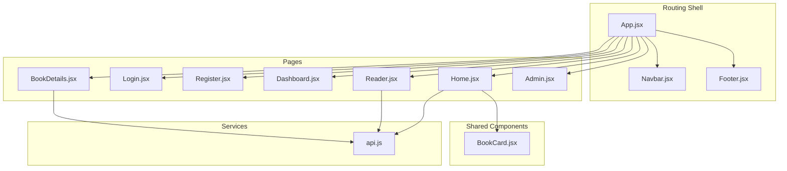
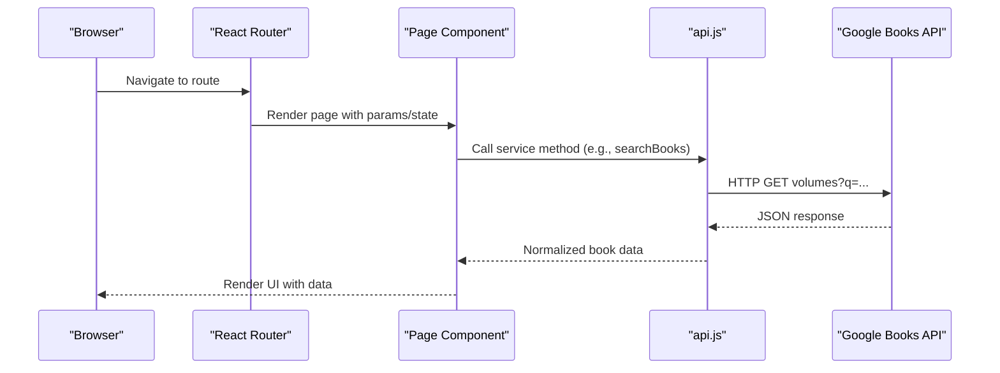
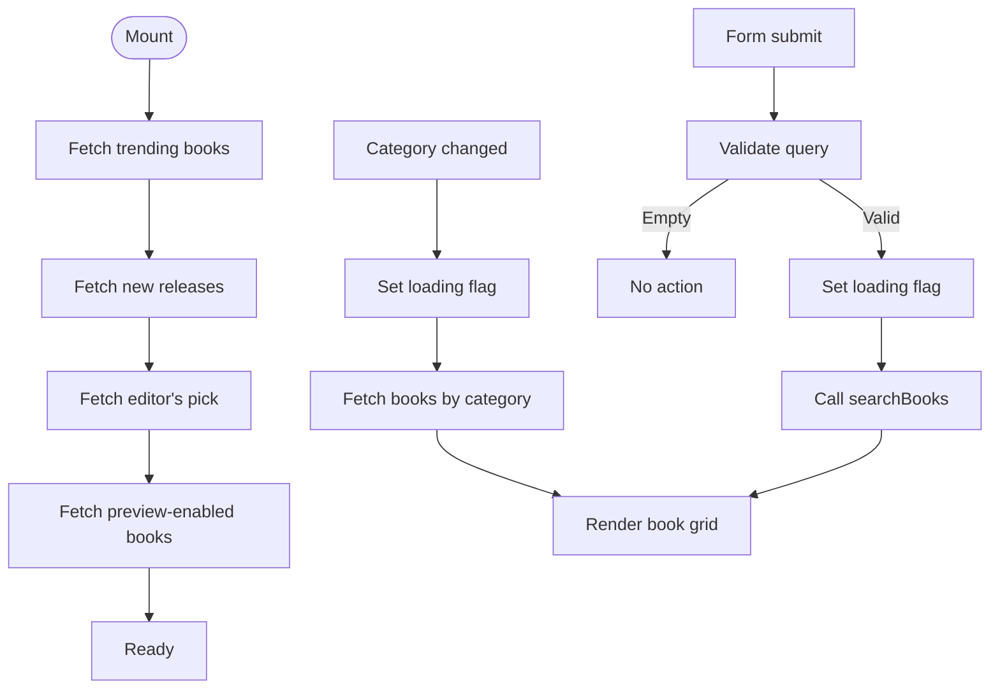
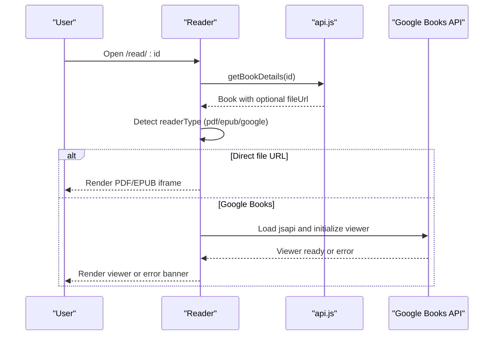
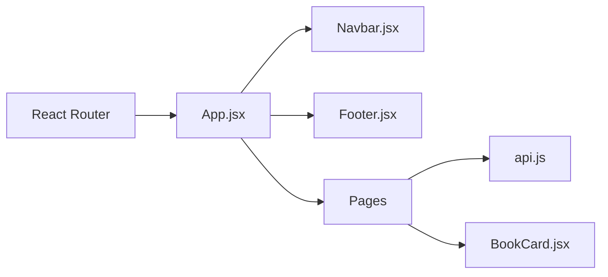

# Page Components

<cite>
**Referenced Files in This Document**
- [App.jsx](file://frontend/src/App.jsx)
- [Navbar.jsx](file://frontend/src/components/Navbar.jsx)
- [Footer.jsx](file://frontend/src/components/Footer.jsx)
- [BookCard.jsx](file://frontend/src/components/BookCard.jsx)
- [Home.jsx](file://frontend/src/pages/Home.jsx)
- [Login.jsx](file://frontend/src/pages/Login.jsx)
- [Register.jsx](file://frontend/src/pages/Register.jsx)
- [Dashboard.jsx](file://frontend/src/pages/Dashboard.jsx)
- [BookDetails.jsx](file://frontend/src/pages/BookDetails.jsx)
- [Reader.jsx](file://frontend/src/pages/Reader.jsx)
- [Admin.jsx](file://frontend/src/pages/Admin.jsx)
- [api.js](file://frontend/src/services/api.js)
</cite>

## Table of Contents
1. [Introduction](#introduction)
2. [Project Structure](#project-structure)
3. [Core Components](#core-components)
4. [Architecture Overview](#architecture-overview)
5. [Detailed Component Analysis](#detailed-component-analysis)
6. [Dependency Analysis](#dependency-analysis)
7. [Performance Considerations](#performance-considerations)
8. [Troubleshooting Guide](#troubleshooting-guide)
9. [Conclusion](#conclusion)

## Introduction
This document provides comprehensive documentation for ReadSphere’s page components and route-based views. It explains each page’s functionality, data requirements, user workflows, state management, route parameter handling, navigation patterns, and integration with the API service layer. It also covers responsive design considerations and UX patterns for each page.

## Project Structure
The frontend is a React application using React Router for client-side routing. Pages are organized under `/pages`, shared UI components under `/components`, and the API service abstraction under `/services`. Routing is configured in the main application shell.



**Diagram sources**
- [App.jsx:16-37](file://frontend/src/App.jsx#L16-L37)
- [Navbar.jsx:18-51](file://frontend/src/components/Navbar.jsx#L18-L51)
- [Footer.jsx:5-70](file://frontend/src/components/Footer.jsx#L5-L70)
- [Home.jsx:29-482](file://frontend/src/pages/Home.jsx#L29-L482)
- [Login.jsx:5-83](file://frontend/src/pages/Login.jsx#L5-L83)
- [Register.jsx:5-98](file://frontend/src/pages/Register.jsx#L5-L98)
- [Dashboard.jsx:14-158](file://frontend/src/pages/Dashboard.jsx#L14-L158)
- [BookDetails.jsx:6-232](file://frontend/src/pages/BookDetails.jsx#L6-L232)
- [Reader.jsx:6-241](file://frontend/src/pages/Reader.jsx#L6-L241)
- [Admin.jsx:15-173](file://frontend/src/pages/Admin.jsx#L15-L173)
- [BookCard.jsx:5-70](file://frontend/src/components/BookCard.jsx#L5-L70)
- [api.js:120-283](file://frontend/src/services/api.js#L120-L283)

**Section sources**
- [App.jsx:16-37](file://frontend/src/App.jsx#L16-L37)
- [Navbar.jsx:18-51](file://frontend/src/components/Navbar.jsx#L18-L51)
- [Footer.jsx:5-70](file://frontend/src/components/Footer.jsx#L5-L70)

## Core Components
- App routing and layout: Declares routes and renders the global header/footer and page components.
- Navbar: Provides responsive navigation and scroll-aware styling.
- Footer: Provides site links and branding.
- BookCard: Reusable card component used across pages to render book metadata and actions.

**Section sources**
- [App.jsx:16-37](file://frontend/src/App.jsx#L16-L37)
- [Navbar.jsx:18-51](file://frontend/src/components/Navbar.jsx#L18-L51)
- [Footer.jsx:5-70](file://frontend/src/components/Footer.jsx#L5-L70)
- [BookCard.jsx:5-70](file://frontend/src/components/BookCard.jsx#L5-L70)

## Architecture Overview
The pages integrate with the API service layer to fetch and display data. The API service wraps Google Books API, normalizes responses, and provides fallbacks. Pages orchestrate state, handle route parameters, and coordinate navigation.



**Diagram sources**
- [App.jsx:22-31](file://frontend/src/App.jsx#L22-L31)
- [Home.jsx:44-92](file://frontend/src/pages/Home.jsx#L44-L92)
- [BookDetails.jsx:16-38](file://frontend/src/pages/BookDetails.jsx#L16-L38)
- [Reader.jsx:22-54](file://frontend/src/pages/Reader.jsx#L22-L54)
- [api.js:120-144](file://frontend/src/services/api.js#L120-L144)

## Detailed Component Analysis

### Home Page
- Purpose: Discovery hub with hero search, trending/new releases, categories, and featured picks.
- State management:
  - Active category, search query, lists of books, loading flags, and refs for horizontal scrolling.
- Data fetching:
  - On mount: trending, new releases, recommended, and preview-enabled books.
  - On category change: fetch books by category; clears search query.
  - Search handler: debounced via form submission; replaces book list with results.
- UX patterns:
  - Horizontal scrollable carousels for trending and preview books.
  - Skeleton loaders during initial fetches.
  - Empty state messaging when no results.
- Navigation:
  - Category pill selection triggers category-based queries.
  - Book cards link to book details or reader depending on availability.



**Diagram sources**
- [Home.jsx:44-127](file://frontend/src/pages/Home.jsx#L44-L127)
- [Home.jsx:316-354](file://frontend/src/pages/Home.jsx#L316-L354)
- [api.js:120-144](file://frontend/src/services/api.js#L120-L144)

**Section sources**
- [Home.jsx:29-482](file://frontend/src/pages/Home.jsx#L29-L482)
- [api.js:120-144](file://frontend/src/services/api.js#L120-L144)

### Login Page
- Purpose: Authenticate returning users.
- State management: Email and password form fields.
- Form handling: Prevents default submission; logs credentials to console (placeholder).
- Navigation: Links to register and forgot-password routes.

**Section sources**
- [Login.jsx:5-83](file://frontend/src/pages/Login.jsx#L5-L83)

### Register Page
- Purpose: Create new user accounts.
- State management: Username, email, and password form fields.
- Form handling: Prevents default submission; logs credentials to console (placeholder).
- Navigation: Links to login.

**Section sources**
- [Register.jsx:5-98](file://frontend/src/pages/Register.jsx#L5-L98)

### Dashboard Page
- Purpose: Personalized reading dashboard with tabs for currently reading, favorites, bookmarks, and account settings.
- State management: Active tab state; mock data for favorites and currently reading.
- UX patterns: Tabbed interface with animated transitions; progress bars for reading; empty state for bookmarks; settings panel placeholder.
- Navigation: Tab buttons switch content; sign out button placeholder.

**Section sources**
- [Dashboard.jsx:14-158](file://frontend/src/pages/Dashboard.jsx#L14-L158)

### BookDetails Page
- Purpose: Display detailed information for a selected book, including synopsis, AI summary, and actions.
- Route parameters: Extracts book ID from URL.
- State management:
  - Book data, loading/error states, favorite/bookmark toggles, preview availability check.
- Data fetching:
  - Fetch book details by ID; check preview availability separately.
- UX patterns:
  - Loading spinner, error banner with back-to-discover option.
  - Conditional action buttons: direct read (PDF/EPUB), embedded Google Books viewer, or external link.
  - Favorite/bookmark/share actions with visual feedback.
- Navigation: Back link to discover; links to reader with optional file URL state.

```mermaid
sequenceDiagram
participant User as "User"
participant Details as "BookDetails"
participant API as "api.js"
participant GBooks as "Google Books API"
User->>Details : Open /book/ : id
Details->>API : getBookDetails(id)
API->>GBooks : GET volumes/ : id
GBooks-->>API : Volume JSON
API-->>Details : Formatted book
Details->>API : checkPreviewAvailability(id)
API-->>Details : Boolean
Details-->>User : Render details + actions
```

**Diagram sources**
- [BookDetails.jsx:16-57](file://frontend/src/pages/BookDetails.jsx#L16-L57)
- [api.js:151-168](file://frontend/src/services/api.js#L151-L168)
- [api.js:217-237](file://frontend/src/services/api.js#L217-L237)

**Section sources**
- [BookDetails.jsx:6-232](file://frontend/src/pages/BookDetails.jsx#L6-L232)
- [api.js:151-168](file://frontend/src/services/api.js#L151-L168)
- [api.js:217-237](file://frontend/src/services/api.js#L217-L237)

### Reader Page
- Purpose: Embedded reading experience for a book using Google Books viewer, or direct PDF/EPUB via iframe.
- Route parameters: Extracts book ID from URL.
- State management:
  - Theme toggle (dark/light), loading/error states, reader type detection, file URL.
- Data fetching:
  - Fetch book details to determine reader type and file URL.
- Integration:
  - Dynamically loads Google Books JSAPI and initializes DefaultViewer.
  - Falls back to Google Books viewer if no direct file URL; otherwise uses iframe for PDF/EPUB.
- UX patterns:
  - Loading overlay, error banner with alternatives (external link or back to details).
  - Theme toggle in header; responsive layout.



**Diagram sources**
- [Reader.jsx:22-137](file://frontend/src/pages/Reader.jsx#L22-L137)
- [api.js:151-168](file://frontend/src/services/api.js#L151-L168)

**Section sources**
- [Reader.jsx:6-241](file://frontend/src/pages/Reader.jsx#L6-L241)
- [api.js:151-168](file://frontend/src/services/api.js#L151-L168)

### Admin Page
- Purpose: Administrative control panel for managing books and users.
- State management: Active tab (books/users).
- UX patterns: Tabbed interface, searchable table, action buttons per row, pagination controls.
- Data: Uses mock datasets for demonstration.

**Section sources**
- [Admin.jsx:15-173](file://frontend/src/pages/Admin.jsx#L15-L173)

## Dependency Analysis
- Routing depends on React Router; pages are mounted based on routes declared in the app shell.
- Pages depend on the API service for data; the API service encapsulates Google Books API calls and normalization.
- Shared components (BookCard) are reused across pages to maintain consistent rendering and interactions.
- Navbar/Footer are global layout components integrated into the app shell.



**Diagram sources**
- [App.jsx:22-31](file://frontend/src/App.jsx#L22-L31)
- [Home.jsx:4-5](file://frontend/src/pages/Home.jsx#L4-L5)
- [BookDetails.jsx:4](file://frontend/src/pages/BookDetails.jsx#L4)
- [Reader.jsx:4](file://frontend/src/pages/Reader.jsx#L4)
- [api.js:120-283](file://frontend/src/services/api.js#L120-L283)

**Section sources**
- [App.jsx:22-31](file://frontend/src/App.jsx#L22-L31)
- [Home.jsx:4-5](file://frontend/src/pages/Home.jsx#L4-L5)
- [BookDetails.jsx:4](file://frontend/src/pages/BookDetails.jsx#L4)
- [Reader.jsx:4](file://frontend/src/pages/Reader.jsx#L4)
- [api.js:120-283](file://frontend/src/services/api.js#L120-L283)

## Performance Considerations
- API fallbacks: The API service returns mock data when external API calls fail or exceed limits, preventing broken UI states.
- Lazy initialization: Google Books viewer is initialized only when needed and after the API script is loaded.
- Image optimization: BookCard defers rendering until images are loaded to reduce layout shifts.
- Skeleton loaders: Home page uses skeleton placeholders during initial fetches to improve perceived performance.
- Minimal re-renders: Pages use targeted state updates and effect dependencies to avoid unnecessary computations.

[No sources needed since this section provides general guidance]

## Troubleshooting Guide
- API errors:
  - Symptoms: Empty results or fallback data.
  - Causes: Network failures, rate limits, or missing API key.
  - Actions: Verify environment configuration and network connectivity; the API service logs warnings and falls back to mock data.
- Google Books viewer failures:
  - Symptoms: Error banner and inability to embed viewer.
  - Causes: Publisher restrictions or unavailable volume.
  - Actions: Redirect to external Google Books link or return to book details.
- Route parameter issues:
  - Symptoms: Blank book details or reader pages.
  - Causes: Missing or invalid ID.
  - Actions: Ensure route parameters are present; handle invalid IDs gracefully with error UI.

**Section sources**
- [api.js:120-144](file://frontend/src/services/api.js#L120-L144)
- [api.js:151-168](file://frontend/src/services/api.js#L151-L168)
- [api.js:217-237](file://frontend/src/services/api.js#L217-L237)
- [BookDetails.jsx:68-81](file://frontend/src/pages/BookDetails.jsx#L68-L81)
- [Reader.jsx:177-204](file://frontend/src/pages/Reader.jsx#L177-L204)

## Conclusion
ReadSphere’s page components are structured around clear separation of concerns: routing and layout in the app shell, reusable UI components, and a cohesive API service layer. Each page implements robust state management, handles route parameters, integrates with the API, and follows responsive and accessible UX patterns. The Admin page demonstrates a scalable pattern for managing platform resources, while the Reader and BookDetails pages showcase flexible fallback strategies for diverse content sources.