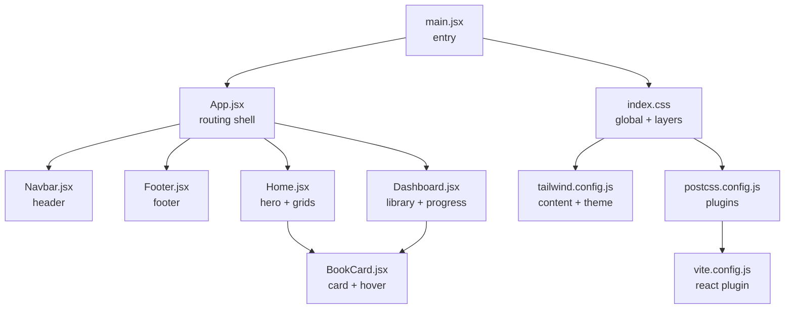
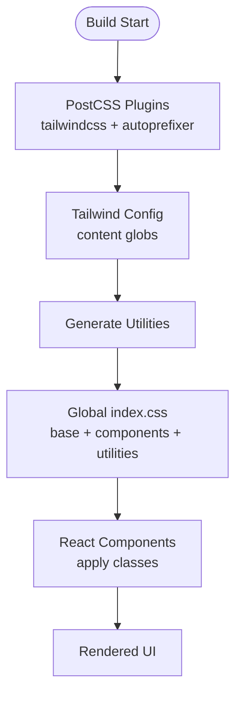
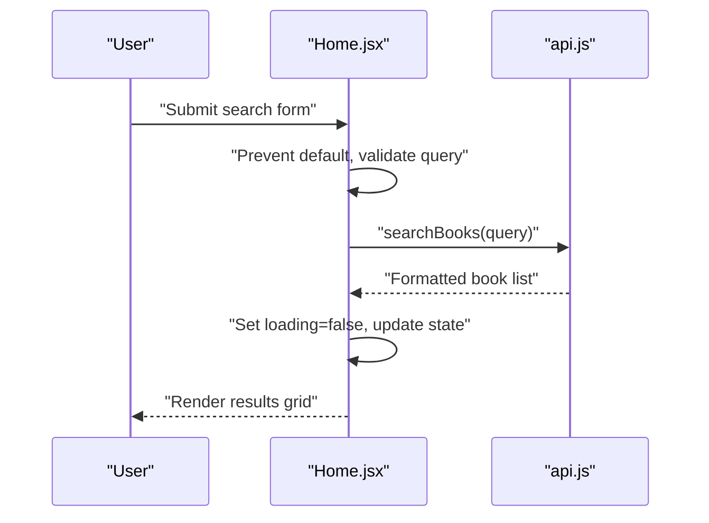
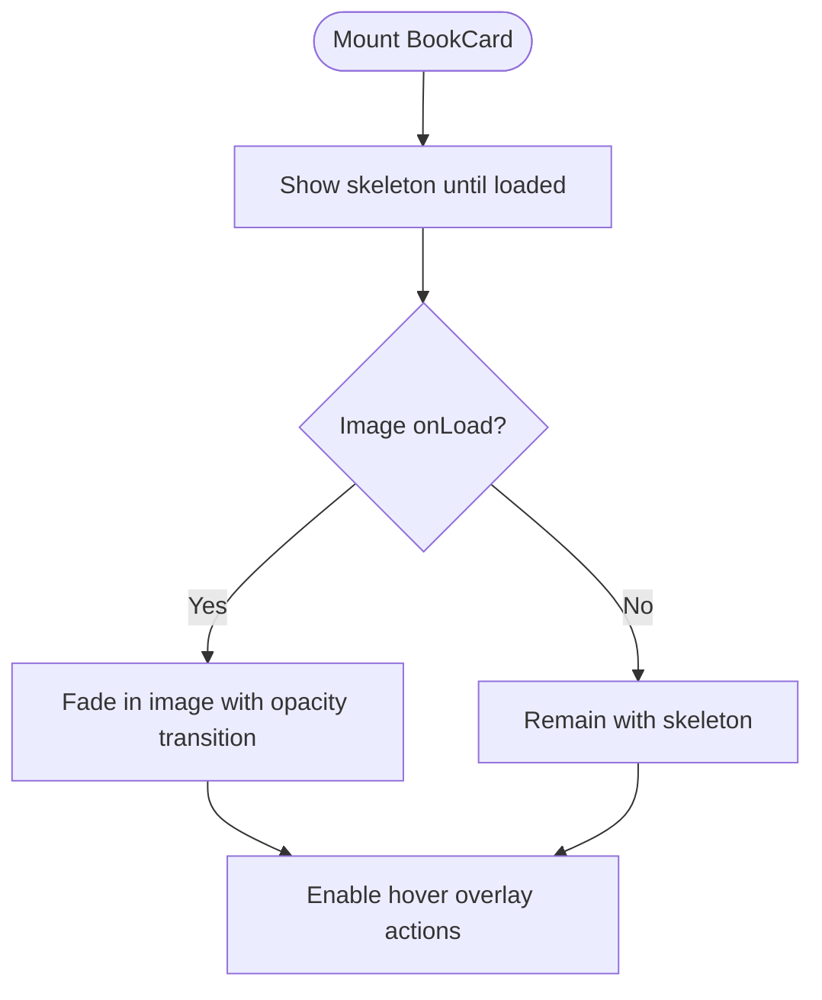
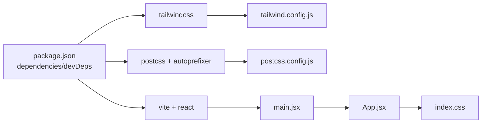

# UI Styling and Design Patterns

<cite>
**Referenced Files in This Document**
- [tailwind.config.js](file://frontend/tailwind.config.js)
- [index.css](file://frontend/src/index.css)
- [postcss.config.js](file://frontend/postcss.config.js)
- [vite.config.js](file://frontend/vite.config.js)
- [package.json](file://frontend/package.json)
- [App.jsx](file://frontend/src/App.jsx)
- [main.jsx](file://frontend/src/main.jsx)
- [Navbar.jsx](file://frontend/src/components/Navbar.jsx)
- [Footer.jsx](file://frontend/src/components/Footer.jsx)
- [BookCard.jsx](file://frontend/src/components/BookCard.jsx)
- [Home.jsx](file://frontend/src/pages/Home.jsx)
- [Dashboard.jsx](file://frontend/src/pages/Dashboard.jsx)
- [api.js](file://frontend/src/services/api.js)
</cite>

## Table of Contents
1. [Introduction](#introduction)
2. [Project Structure](#project-structure)
3. [Core Components](#core-components)
4. [Architecture Overview](#architecture-overview)
5. [Detailed Component Analysis](#detailed-component-analysis)
6. [Dependency Analysis](#dependency-analysis)
7. [Performance Considerations](#performance-considerations)
8. [Troubleshooting Guide](#troubleshooting-guide)
9. [Conclusion](#conclusion)
10. [Appendices](#appendices)

## Introduction
This document explains ReadSphere’s UI styling architecture and design patterns. It covers Tailwind CSS configuration, custom styling layers, responsive design, component styling patterns (glass morphism, gradients, animations, and interactive states), the design system (colors, typography, spacing, and variants), best practices, performance optimizations, accessibility considerations, and theme consistency across components.

## Project Structure
The frontend uses Vite with PostCSS and Tailwind CSS. Styles are authored in a single global stylesheet and applied via Tailwind utilities and custom component utilities. React components apply styles directly using Tailwind classes and custom utility classes.

**Diagram sources**
- [main.jsx:1-11](file://frontend/src/main.jsx#L1-L11)
- [App.jsx:1-40](file://frontend/src/App.jsx#L1-L40)
- [Navbar.jsx:1-56](file://frontend/src/components/Navbar.jsx#L1-L56)
- [Footer.jsx:1-74](file://frontend/src/components/Footer.jsx#L1-L74)
- [Home.jsx:1-483](file://frontend/src/pages/Home.jsx#L1-L483)
- [Dashboard.jsx:1-159](file://frontend/src/pages/Dashboard.jsx#L1-L159)
- [BookCard.jsx:1-71](file://frontend/src/components/BookCard.jsx#L1-L71)
- [index.css:1-111](file://frontend/src/index.css#L1-L111)
- [tailwind.config.js:1-13](file://frontend/tailwind.config.js#L1-L13)
- [postcss.config.js:1-7](file://frontend/postcss.config.js#L1-L7)
- [vite.config.js:1-8](file://frontend/vite.config.js#L1-L8)

**Section sources**
- [main.jsx:1-11](file://frontend/src/main.jsx#L1-L11)
- [App.jsx:1-40](file://frontend/src/App.jsx#L1-L40)
- [index.css:1-111](file://frontend/src/index.css#L1-L111)
- [tailwind.config.js:1-13](file://frontend/tailwind.config.js#L1-L13)
- [postcss.config.js:1-7](file://frontend/postcss.config.js#L1-L7)
- [vite.config.js:1-8](file://frontend/vite.config.js#L1-L8)

## Core Components
- Tailwind configuration defines content scanning and theme extension points.
- Global CSS establishes design tokens (colors, typography) and reusable utilities (buttons, glass panels, gradients, animations).
- Components compose Tailwind utilities and custom utilities to implement consistent visuals and interactions.

Key styling pillars:
- Dark-first palette with glass morphism surfaces.
- Gradient branding and accent usage.
- Motion primitives (floating, fade-up, pulse glow, shimmer).
- Responsive layout with mobile-first navigation.

**Section sources**
- [tailwind.config.js:1-13](file://frontend/tailwind.config.js#L1-L13)
- [index.css:5-24](file://frontend/src/index.css#L5-L24)
- [index.css:26-54](file://frontend/src/index.css#L26-L54)
- [index.css:56-110](file://frontend/src/index.css#L56-L110)

## Architecture Overview
The styling pipeline:
- PostCSS compiles Tailwind and Autoprefixer.
- Tailwind scans configured content paths to generate utilities.
- Global CSS defines base tokens and component/utility layers.
- React components apply classes directly, mixing Tailwind utilities with custom utilities.

**Diagram sources**
- [postcss.config.js:1-7](file://frontend/postcss.config.js#L1-L7)
- [tailwind.config.js:3-6](file://frontend/tailwind.config.js#L3-L6)
- [index.css:1-3](file://frontend/src/index.css#L1-L3)
- [main.jsx:3](file://frontend/src/main.jsx#L3)

**Section sources**
- [postcss.config.js:1-7](file://frontend/postcss.config.js#L1-L7)
- [tailwind.config.js:1-13](file://frontend/tailwind.config.js#L1-L13)
- [index.css:1-111](file://frontend/src/index.css#L1-L111)
- [main.jsx:1-11](file://frontend/src/main.jsx#L1-L11)

## Detailed Component Analysis

### Design System and Tokens
- Color scheme: dark-first with deep backgrounds, glass surfaces, and orange-accent branding.
- Typography: a custom font variable for headings and body text.
- Spacing: consistent padding/margin scales via Tailwind utilities and custom spacing classes.
- Variants: primary, outline, and gradient-based buttons; glass panels; animated utilities.

Implementation anchors:
- CSS custom properties for theme tokens.
- Base layer for global body and selection styles.
- Component layer for reusable UI primitives.
- Utility layer for motion and skeleton loaders.

**Section sources**
- [index.css:5-24](file://frontend/src/index.css#L5-L24)
- [index.css:26-54](file://frontend/src/index.css#L26-L54)
- [index.css:56-110](file://frontend/src/index.css#L56-L110)

### Glass Morphism Surfaces
- Glass panels use translucent backgrounds, backdrop blur, subtle borders, and layered shadows.
- Applied consistently in navigation, dashboard sidebar, and promotional cards.

Usage examples:
- Navigation background with backdrop blur and border on scroll.
- Dashboard sidebar and promotional cards with glass-panel class.

**Section sources**
- [index.css:31-33](file://frontend/src/index.css#L31-L33)
- [Navbar.jsx:19](file://frontend/src/components/Navbar.jsx#L19)
- [Dashboard.jsx:29](file://frontend/src/pages/Dashboard.jsx#L29)
- [Home.jsx:424](file://frontend/src/pages/Home.jsx#L424)

### Gradient Usage and Branding
- Gradient text and backgrounds unify branding across headings, buttons, and badges.
- Accent gradients derive from consistent orange palette tokens.

Patterns:
- Text gradient for headings.
- Button primary states with gradient backgrounds and hover shine pseudo-element.
- Decorative gradient overlays and radial backgrounds.

**Section sources**
- [index.css:27-29](file://frontend/src/index.css#L27-L29)
- [index.css:39-49](file://frontend/src/index.css#L39-L49)
- [Home.jsx:177](file://frontend/src/pages/Home.jsx#L177)
- [Home.jsx:426](file://frontend/src/pages/Home.jsx#L426)

### Animation Implementation
- Motion primitives include floating, fade-up, pulse glow, and shimmer skeletons.
- Animations are defined once and reused across components for consistent micro-interactions.

Patterns:
- Hero headline and paragraph stacks use staggered fade-up.
- Promotional cards use pulse glow orbs.
- Loading states use shimmer skeletons.

**Section sources**
- [index.css:57-89](file://frontend/src/index.css#L57-L89)
- [index.css:91-110](file://frontend/src/index.css#L91-L110)
- [Home.jsx:167](file://frontend/src/pages/Home.jsx#L167)
- [Home.jsx:172](file://frontend/src/pages/Home.jsx#L172)

### Interactive State Handling
- Buttons and links use hover/focus states with transitions and pseudo-elements for shine effects.
- Navigation responds to scroll and mobile menu toggles with dynamic classes.
- Cards implement hover states with scaling, elevation, and overlay actions.

Patterns:
- Button primary with before pseudo-element shine on hover.
- Navbar scroll-aware background and backdrop blur.
- Book card hover overlay with slide-in CTA.

**Section sources**
- [index.css:39-49](file://frontend/src/index.css#L39-L49)
- [Navbar.jsx:10-16](file://frontend/src/components/Navbar.jsx#L10-L16)
- [BookCard.jsx:33](file://frontend/src/components/BookCard.jsx#L33)

### Component Styling Patterns
- Navbar: fixed positioning, backdrop blur, gradient brand icon, mobile hamburger menu, and scroll-aware styling.
- Footer: multi-column layout, gradient brand identity, and social icons with hover states.
- BookCard: glass surface, skeleton loader, rating badge, gradient text on hover, and overlay CTA.
- Home: hero radial gradients, floating glow orbs, category pills, loading skeletons, and editor’s pick card.
- Dashboard: sidebar glass panel, active state indicators, progress bars with gradient fills, and tabbed content.

**Section sources**
- [Navbar.jsx:18-51](file://frontend/src/components/Navbar.jsx#L18-L51)
- [Footer.jsx:6-69](file://frontend/src/components/Footer.jsx#L6-L69)
- [BookCard.jsx:9](file://frontend/src/components/BookCard.jsx#L9)
- [Home.jsx:150](file://frontend/src/pages/Home.jsx#L150)
- [Dashboard.jsx:29](file://frontend/src/pages/Dashboard.jsx#L29)

### Sequence: Hero Search Interaction

**Diagram sources**
- [Home.jsx:114](file://frontend/src/pages/Home.jsx#L114)
- [Home.jsx:118](file://frontend/src/pages/Home.jsx#L118)
- [api.js:119](file://frontend/src/services/api.js#L119)

### Flowchart: Book Card Image Load

**Diagram sources**
- [BookCard.jsx:6](file://frontend/src/components/BookCard.jsx#L6)
- [BookCard.jsx:12](file://frontend/src/components/BookCard.jsx#L12)
- [BookCard.jsx:16](file://frontend/src/components/BookCard.jsx#L16)

## Dependency Analysis
Styling stack dependencies:
- Tailwind CSS generates utilities from configured content paths.
- PostCSS applies Tailwind and Autoprefixer during build.
- Vite runs the dev server and bundler.
- Global CSS composes base, components, and utilities layers.

**Diagram sources**
- [package.json:12-31](file://frontend/package.json#L12-L31)
- [tailwind.config.js:1-13](file://frontend/tailwind.config.js#L1-L13)
- [postcss.config.js:1-7](file://frontend/postcss.config.js#L1-L7)
- [vite.config.js:1-8](file://frontend/vite.config.js#L1-L8)
- [main.jsx:1-11](file://frontend/src/main.jsx#L1-L11)
- [App.jsx:1-40](file://frontend/src/App.jsx#L1-L40)
- [index.css:1-111](file://frontend/src/index.css#L1-L111)

**Section sources**
- [package.json:12-31](file://frontend/package.json#L12-L31)
- [tailwind.config.js:1-13](file://frontend/tailwind.config.js#L1-L13)
- [postcss.config.js:1-7](file://frontend/postcss.config.js#L1-L7)
- [vite.config.js:1-8](file://frontend/vite.config.js#L1-L8)
- [main.jsx:1-11](file://frontend/src/main.jsx#L1-L11)
- [App.jsx:1-40](file://frontend/src/App.jsx#L1-L40)
- [index.css:1-111](file://frontend/src/index.css#L1-L111)

## Performance Considerations
- Keep content globs minimal to reduce Tailwind scan work.
- Prefer utility composition over custom component CSS to leverage PurgeCSS-like pruning.
- Use skeleton loaders to improve perceived performance during image and API loads.
- Limit heavy backdrop blur and gradients to essential areas to reduce GPU cost.
- Avoid excessive nested pseudo-element animations; batch where possible.
- Reuse motion utilities to minimize keyframe duplication.

[No sources needed since this section provides general guidance]

## Troubleshooting Guide
- If gradients or glass effects appear incorrect, verify custom property values and ensure the base layer is imported.
- If animations stutter, reduce the number of animated elements on scroll or throttle scroll handlers.
- If hover shine does not appear, confirm pseudo-element selectors and stacking contexts.
- If mobile menu fails to toggle, inspect state updates and transition classes applied conditionally.
- If images load slowly, ensure skeleton placeholders are present and opacity transitions are smooth.

**Section sources**
- [index.css:5-24](file://frontend/src/index.css#L5-L24)
- [index.css:39-49](file://frontend/src/index.css#L39-L49)
- [Navbar.jsx:43-49](file://frontend/src/components/Navbar.jsx#L43-L49)
- [BookCard.jsx:12](file://frontend/src/components/BookCard.jsx#L12)

## Conclusion
ReadSphere’s styling architecture centers on a dark-first design system with consistent glass morphism, gradient branding, and motion primitives. Tailwind utilities and a single global stylesheet enable scalable, maintainable UI composition. By adhering to the established patterns—glass panels, gradient accents, skeleton loaders, and micro-animations—the team can deliver a cohesive, performant, and accessible user experience across all components.

[No sources needed since this section summarizes without analyzing specific files]

## Appendices

### Responsive Design Notes
- Mobile-first breakpoints and spacing are handled via Tailwind utilities.
- Navigation adapts from stacked mobile to horizontal desktop layout.
- Grids and carousels adjust column counts and spacing for various viewport widths.

**Section sources**
- [Navbar.jsx:20](file://frontend/src/components/Navbar.jsx#L20)
- [Home.jsx:317](file://frontend/src/pages/Home.jsx#L317)
- [Home.jsx:337](file://frontend/src/pages/Home.jsx#L337)

### Accessibility Considerations
- Maintain sufficient color contrast against glass surfaces and gradients.
- Ensure focus-visible states for interactive elements (buttons, links).
- Provide ARIA labels for icon-only controls (e.g., mobile menu, search).
- Avoid relying solely on color to convey meaning; pair with text or icons.

**Section sources**
- [Navbar.jsx:46](file://frontend/src/components/Navbar.jsx#L46)
- [Footer.jsx:23](file://frontend/src/components/Footer.jsx#L23)