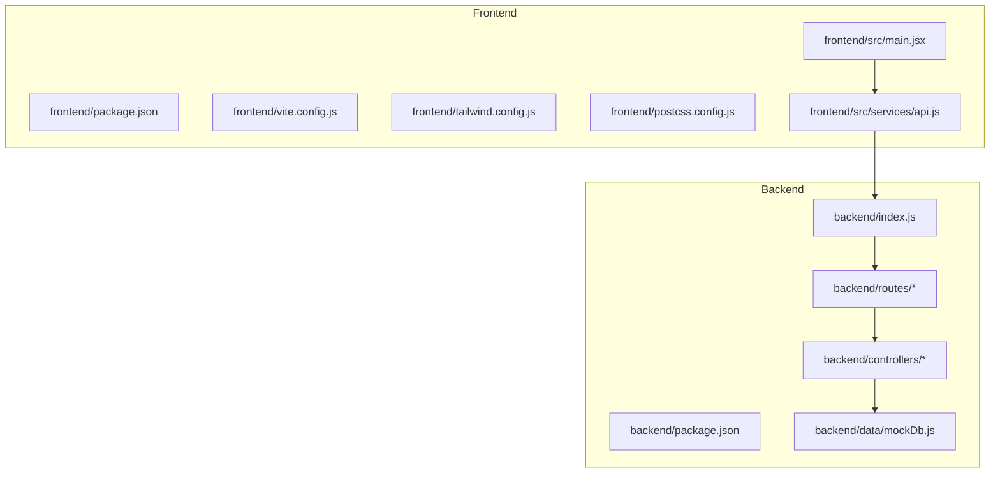
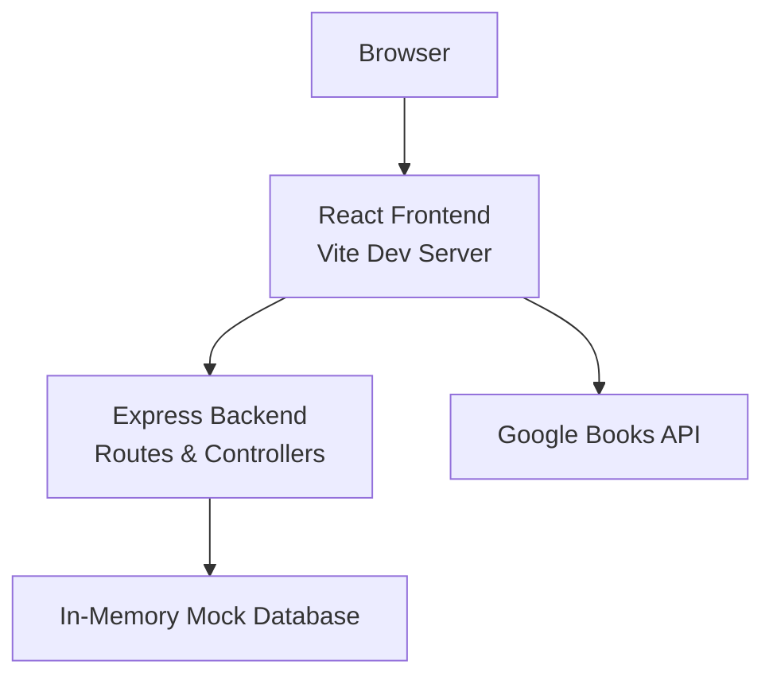

# Getting Started

<cite>
**Referenced Files in This Document**
- [backend/package.json](file://backend/package.json)
- [backend/index.js](file://backend/index.js)
- [backend/routes/authRoutes.js](file://backend/routes/authRoutes.js)
- [backend/controllers/authController.js](file://backend/controllers/authController.js)
- [backend/data/mockDb.js](file://backend/data/mockDb.js)
- [frontend/package.json](file://frontend/package.json)
- [frontend/vite.config.js](file://frontend/vite.config.js)
- [frontend/tailwind.config.js](file://frontend/tailwind.config.js)
- [frontend/postcss.config.js](file://frontend/postcss.config.js)
- [frontend/src/services/api.js](file://frontend/src/services/api.js)
- [frontend/src/main.jsx](file://frontend/src/main.jsx)
- [frontend/README.md](file://frontend/README.md)
</cite>

## Table of Contents
1. [Introduction](#introduction)
2. [Project Structure](#project-structure)
3. [Prerequisites](#prerequisites)
4. [Installation](#installation)
5. [Environment Variables](#environment-variables)
6. [Development Setup](#development-setup)
7. [Basic Usage](#basic-usage)
8. [Architecture Overview](#architecture-overview)
9. [Troubleshooting](#troubleshooting)
10. [Conclusion](#conclusion)

## Introduction
ReadSphere is a full-stack reading application with a modern frontend built with React and Vite, and a backend powered by Express.js. It integrates with the Google Books API to provide book discovery, search, and preview capabilities. The backend uses a simple in-memory mock database for demonstration and includes authentication endpoints for user registration, login, and profile retrieval.

## Project Structure
The project is organized into two primary directories:
- backend: Contains the Express server, routes, controllers, middleware, and mock data.
- frontend: Contains the React application, Vite configuration, Tailwind CSS setup, and service utilities for API interactions.

**Diagram sources**
- [backend/package.json:1-24](file://backend/package.json#L1-L24)
- [backend/index.js:1-27](file://backend/index.js#L1-L27)
- [backend/routes/authRoutes.js:1-11](file://backend/routes/authRoutes.js#L1-L11)
- [backend/controllers/authController.js:1-90](file://backend/controllers/authController.js#L1-L90)
- [backend/data/mockDb.js:1-20](file://backend/data/mockDb.js#L1-L20)
- [frontend/package.json:1-34](file://frontend/package.json#L1-L34)
- [frontend/vite.config.js:1-8](file://frontend/vite.config.js#L1-L8)
- [frontend/tailwind.config.js:1-13](file://frontend/tailwind.config.js#L1-L13)
- [frontend/postcss.config.js:1-7](file://frontend/postcss.config.js#L1-L7)
- [frontend/src/main.jsx:1-11](file://frontend/src/main.jsx#L1-L11)
- [frontend/src/services/api.js:1-284](file://frontend/src/services/api.js#L1-L284)

**Section sources**
- [backend/package.json:1-24](file://backend/package.json#L1-L24)
- [frontend/package.json:1-34](file://frontend/package.json#L1-L34)

## Prerequisites
Before installing and running ReadSphere, ensure your development environment meets the following requirements:

- Operating System
  - Windows, macOS, or Linux
- Node.js
  - Version 18 or later is recommended for compatibility with modern toolchains.
- Package Manager
  - npm (bundled with Node.js) or Yarn (optional but supported by scripts).
- Additional Tools
  - Git (recommended for cloning the repository).
  - A modern web browser for testing the frontend.

Notes:
- The backend uses Express and environment variables for configuration. The frontend uses Vite for development and build tasks, Tailwind CSS for styling, and Axios for HTTP requests.
- The project does not require a database for local development; it uses an in-memory mock database for demonstration.

**Section sources**
- [backend/package.json:13-22](file://backend/package.json#L13-L22)
- [frontend/package.json:12-32](file://frontend/package.json#L12-L32)

## Installation
Follow these steps to install and set up ReadSphere locally:

1. Clone the Repository
   - Use Git to clone the repository to your local machine.
2. Install Backend Dependencies
   - Navigate to the backend directory and install dependencies using your preferred package manager.
   - Scripts are available for production and development modes.
3. Install Frontend Dependencies
   - Navigate to the frontend directory and install dependencies using your preferred package manager.
   - Scripts include development, build, lint, and preview commands.

After installation, you will have all required packages for both backend and frontend.

**Section sources**
- [backend/package.json:5-8](file://backend/package.json#L5-L8)
- [frontend/package.json:6-11](file://frontend/package.json#L6-L11)

## Environment Variables
Configure environment variables for both backend and frontend to enable full functionality.

Backend Environment Variables
- JWT_SECRET: Used to sign JSON Web Tokens for authentication.
- PORT: Optional; defaults to 5000 if not set.
- Example:
  - Create a .env file in the backend directory with the required variables.

Frontend Environment Variables
- VITE_GOOGLE_BOOKS_API_KEY: Optional; if provided, enables authenticated requests to the Google Books API. Without it, the application falls back to mock data and limited functionality.
- Example:
  - Create a .env file in the frontend directory and set the API key.

Notes:
- The backend expects JWT_SECRET to be present for token generation.
- The frontend reads VITE_GOOGLE_BOOKS_API_KEY from the environment and uses it to enhance API requests.

**Section sources**
- [backend/controllers/authController.js:5-9](file://backend/controllers/authController.js#L5-L9)
- [backend/index.js:22-26](file://backend/index.js#L22-L26)
- [frontend/src/services/api.js:10-12](file://frontend/src/services/api.js#L10-L12)

## Development Setup
Start the development servers for both backend and frontend to run ReadSphere locally.

Backend Development Server
- Start the backend in development mode using nodemon for automatic restarts on file changes.
- The server listens on the configured port (default 5000) and exposes API endpoints under /api/*.

Frontend Development Server
- Start the frontend using Vite’s development server.
- The frontend entry point initializes the React application and renders the UI.

Hot Reload
- Backend: Changes to backend files trigger automatic restarts via nodemon.
- Frontend: Vite provides fast refresh for React components and styles.

Port Configuration
- Backend: Default port is 5000; override via the PORT environment variable.
- Frontend: Default port is typically 5173; override via Vite configuration if needed.

Build and Preview
- Build the frontend for production using the provided script.
- Preview the production build locally using the preview script.

**Section sources**
- [backend/package.json:5-8](file://backend/package.json#L5-L8)
- [backend/index.js:22-26](file://backend/index.js#L22-L26)
- [frontend/package.json:6-11](file://frontend/package.json#L6-L11)
- [frontend/vite.config.js:1-8](file://frontend/vite.config.js#L1-L8)
- [frontend/src/main.jsx:1-11](file://frontend/src/main.jsx#L1-L11)

## Basic Usage
Explore the core features of ReadSphere after setting up the environment.

Register a New User
- Endpoint: POST /api/auth/signup
- Purpose: Creates a new user account with a hashed password.
- Notes: Uses the in-memory mock database for demonstration.

Log In to Access Protected Features
- Endpoint: POST /api/auth/login
- Purpose: Authenticates an existing user and returns a signed JWT token.
- Notes: Token is required for protected routes.

View User Profile
- Endpoint: GET /api/auth/profile
- Purpose: Retrieves the authenticated user’s profile information.
- Notes: Requires a valid JWT token.

Search for Books
- Frontend Service: searchBooks(query, maxResults)
- Purpose: Queries the Google Books API (with optional API key) and formats results for the UI.
- Behavior: Falls back to mock data if the API is unavailable or rate-limited.

Get Book Details
- Frontend Service: getBookDetails(id)
- Purpose: Fetches detailed information for a specific book by ID.

Check Preview Availability
- Frontend Service: checkPreviewAvailability(id)
- Purpose: Determines if a book has embedded preview support via the Google Books API.

Notes:
- Authentication is enforced for protected routes via middleware.
- The frontend integrates with the backend API and Google Books API to deliver a seamless user experience.

**Section sources**
- [backend/routes/authRoutes.js:1-11](file://backend/routes/authRoutes.js#L1-L11)
- [backend/controllers/authController.js:11-87](file://backend/controllers/authController.js#L11-L87)
- [backend/data/mockDb.js:1-20](file://backend/data/mockDb.js#L1-L20)
- [frontend/src/services/api.js:120-144](file://frontend/src/services/api.js#L120-L144)
- [frontend/src/services/api.js:151-168](file://frontend/src/services/api.js#L151-L168)
- [frontend/src/services/api.js:217-237](file://frontend/src/services/api.js#L217-L237)

## Architecture Overview
The application follows a client-server architecture with a React frontend and an Express backend. The frontend communicates with the backend via HTTP requests and with the Google Books API for book-related data.

**Diagram sources**
- [backend/index.js:11-16](file://backend/index.js#L11-L16)
- [backend/controllers/authController.js:1-90](file://backend/controllers/authController.js#L1-L90)
- [backend/data/mockDb.js:1-20](file://backend/data/mockDb.js#L1-L20)
- [frontend/src/services/api.js:1-284](file://frontend/src/services/api.js#L1-L284)

## Troubleshooting
Common setup issues and environment-specific considerations:

- Backend Port Already in Use
  - Symptom: The server fails to start on the default port.
  - Resolution: Set a different PORT value in the backend .env file or stop the conflicting process.

- Missing JWT_SECRET
  - Symptom: Token generation errors or authentication failures.
  - Resolution: Add JWT_SECRET to the backend .env file.

- Missing Google Books API Key
  - Symptom: Limited book search results or reliance on mock data.
  - Resolution: Obtain an API key and set VITE_GOOGLE_BOOKS_API_KEY in the frontend .env file.

- CORS Errors
  - Symptom: Browser blocks cross-origin requests from the frontend to the backend.
  - Resolution: Ensure the backend is running and accessible at the expected origin.

- Frontend Hot Reload Not Working
  - Symptom: Changes to frontend files do not reflect immediately.
  - Resolution: Verify Vite is running and check for syntax errors in the console.

- Node.js Version Compatibility
  - Symptom: Dependency installation or runtime errors.
  - Resolution: Upgrade to Node.js 18 or later.

- Package Manager Conflicts
  - Symptom: Mixed dependency versions or build failures.
  - Resolution: Use either npm or Yarn consistently across the project.

**Section sources**
- [backend/index.js:22-26](file://backend/index.js#L22-L26)
- [backend/controllers/authController.js:5-9](file://backend/controllers/authController.js#L5-L9)
- [frontend/src/services/api.js:10-12](file://frontend/src/services/api.js#L10-L12)
- [frontend/vite.config.js:1-8](file://frontend/vite.config.js#L1-L8)

## Conclusion
You are now ready to run ReadSphere locally. Install dependencies for both backend and frontend, configure environment variables, and start the development servers. Explore the authentication endpoints and book search features to become familiar with the application. If you encounter issues, refer to the troubleshooting section for quick fixes. For production deployment, ensure proper environment variable management and consider adding a persistent database layer.