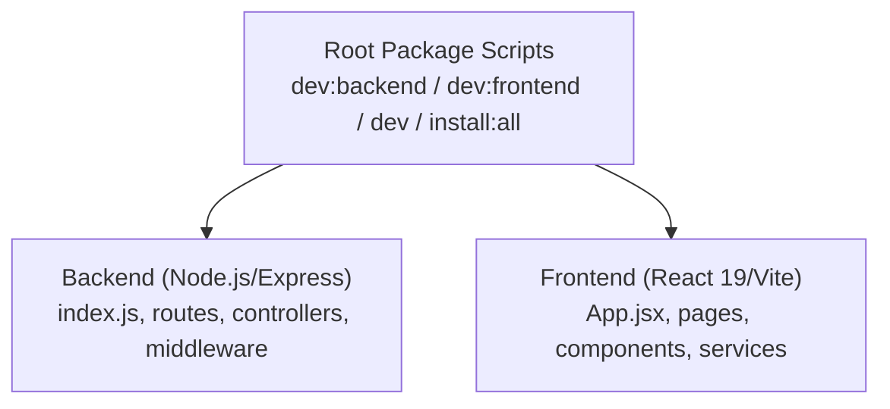
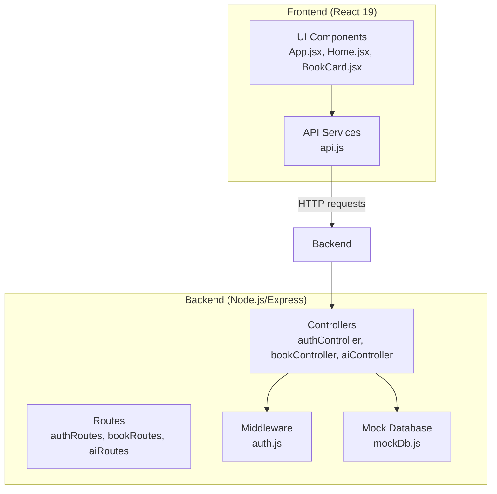
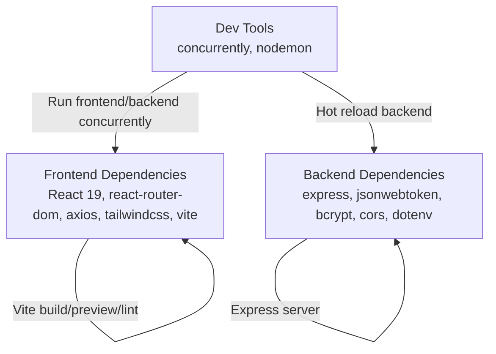
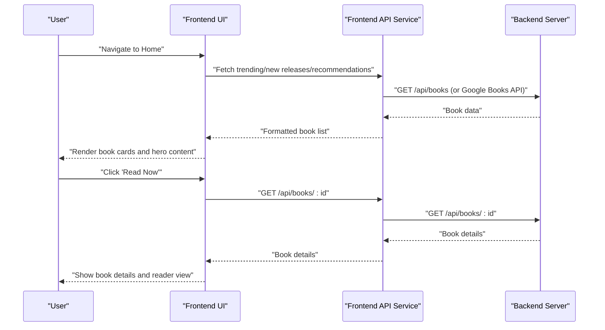
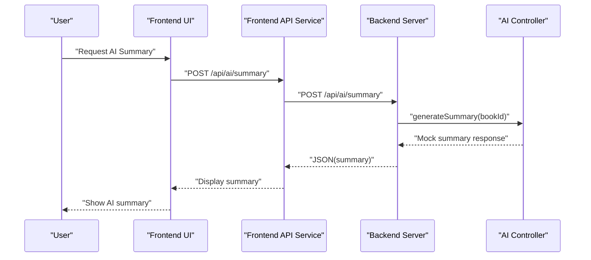
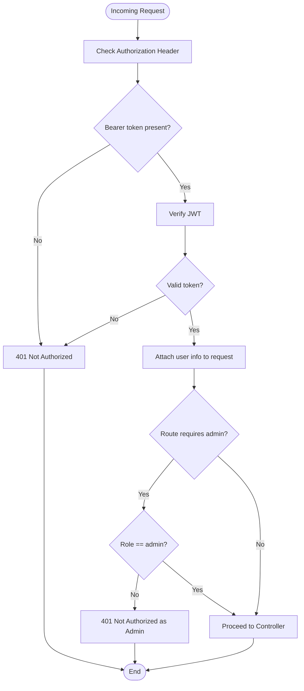
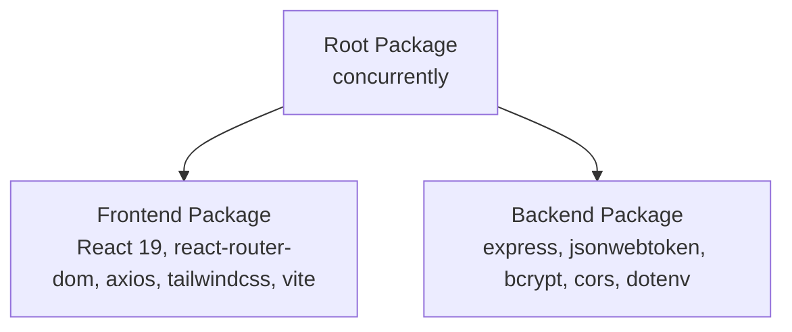

# Project Overview

<cite>
**Referenced Files in This Document**
- [package.json](file://package.json)
- [backend/package.json](file://backend/package.json)
- [frontend/package.json](file://frontend/package.json)
- [backend/index.js](file://backend/index.js)
- [frontend/src/App.jsx](file://frontend/src/App.jsx)
- [frontend/src/pages/Home.jsx](file://frontend/src/pages/Home.jsx)
- [frontend/src/components/BookCard.jsx](file://frontend/src/components/BookCard.jsx)
- [frontend/src/services/api.js](file://frontend/src/services/api.js)
- [backend/controllers/aiController.js](file://backend/controllers/aiController.js)
- [backend/routes/aiRoutes.js](file://backend/routes/aiRoutes.js)
- [backend/controllers/bookController.js](file://backend/controllers/bookController.js)
- [backend/controllers/authController.js](file://backend/controllers/authController.js)
- [backend/middleware/auth.js](file://backend/middleware/auth.js)
- [backend/data/mockDb.js](file://backend/data/mockDb.js)
</cite>

## Table of Contents
1. [Introduction](#introduction)
2. [Project Structure](#project-structure)
3. [Core Components](#core-components)
4. [Architecture Overview](#architecture-overview)
5. [Detailed Component Analysis](#detailed-component-analysis)
6. [Dependency Analysis](#dependency-analysis)
7. [Performance Considerations](#performance-considerations)
8. [Troubleshooting Guide](#troubleshooting-guide)
9. [Conclusion](#conclusion)

## Introduction
ReadSphere is an AI-powered reading platform designed to help users discover, explore, and engage with books more efficiently. Its core value proposition centers on combining a modern, responsive reading experience with intelligent features such as AI-generated summaries and personalized recommendations. The platform targets readers who want quick insights, curated suggestions, and seamless navigation across a vast library of books.

Key differentiators:
- AI-driven content enhancement: AI-powered summaries and recommendations improve reading preparation and discovery.
- Full-stack modularity: Clean separation between frontend and backend enables scalability and maintainability.
- Real-world problem solving: Addresses common reading challenges like information overload, time constraints, and difficulty choosing the next book.

## Project Structure
The project follows a monorepo layout with distinct frontend and backend directories, each containing their own package configuration and development scripts. The frontend is a React 19 application built with Vite, while the backend is a Node.js/Express server with modular route and controller organization.

**Diagram sources**
- [package.json:4-8](file://package.json#L4-L8)
- [backend/index.js:1-27](file://backend/index.js#L1-L27)
- [frontend/src/App.jsx:16-37](file://frontend/src/App.jsx#L16-L37)

**Section sources**
- [package.json:4-8](file://package.json#L4-L8)
- [backend/package.json:1-24](file://backend/package.json#L1-L24)
- [frontend/package.json:1-34](file://frontend/package.json#L1-L34)

## Core Components
- Frontend (React 19): Provides the user interface, routing, and client-side services for interacting with external APIs and internal features.
- Backend (Node.js/Express): Serves REST endpoints for authentication, book discovery, user management, and AI features.
- AI Integration: Simulated AI services for generating summaries and recommendations, designed to be extended with real AI providers.
- Authentication and Authorization: JWT-based authentication with role-based access control for admin features.
- Data Layer: In-memory mock database for users, books, and categories to demonstrate full functionality during development.

**Section sources**
- [frontend/src/App.jsx:16-37](file://frontend/src/App.jsx#L16-L37)
- [backend/index.js:11-15](file://backend/index.js#L11-L15)
- [backend/controllers/aiController.js:3-24](file://backend/controllers/aiController.js#L3-L24)
- [backend/controllers/authController.js:5-9](file://backend/controllers/authController.js#L5-L9)
- [backend/middleware/auth.js:3-31](file://backend/middleware/auth.js#L3-L31)
- [backend/data/mockDb.js:1-20](file://backend/data/mockDb.js#L1-L20)

## Architecture Overview
ReadSphere adopts a full-stack architecture with a clear separation of concerns:
- Frontend handles UI rendering, routing, and user interactions.
- Backend exposes REST endpoints and encapsulates business logic.
- AI features are integrated via dedicated controllers and routes.
- Authentication middleware enforces secure access to protected resources.
- Services abstract external API integrations and data transformations.

**Diagram sources**
- [frontend/src/App.jsx:16-37](file://frontend/src/App.jsx#L16-L37)
- [frontend/src/services/api.js:120-144](file://frontend/src/services/api.js#L120-L144)
- [backend/index.js:11-15](file://backend/index.js#L11-L15)
- [backend/controllers/authController.js:11-46](file://backend/controllers/authController.js#L11-L46)
- [backend/controllers/bookController.js:3-29](file://backend/controllers/bookController.js#L3-L29)
- [backend/controllers/aiController.js:3-24](file://backend/controllers/aiController.js#L3-L24)
- [backend/middleware/auth.js:3-31](file://backend/middleware/auth.js#L3-L31)
- [backend/data/mockDb.js:1-20](file://backend/data/mockDb.js#L1-L20)

## Detailed Component Analysis

### Technology Stack
- Frontend: React 19, React Router DOM, Axios, Tailwind CSS, Vite.
- Backend: Express, JSON Web Token (JWT), Bcrypt, CORS, Dotenv.
- AI Integration: Simulated AI endpoints for summaries and recommendations.
- Development: Concurrently for running both servers, Nodemon for backend hot reload.

**Diagram sources**
- [frontend/package.json:12-32](file://frontend/package.json#L12-L32)
- [backend/package.json:13-22](file://backend/package.json#L13-L22)
- [package.json:10-12](file://package.json#L10-L12)

**Section sources**
- [frontend/package.json:12-32](file://frontend/package.json#L12-L32)
- [backend/package.json:13-22](file://backend/package.json#L13-L22)
- [package.json:10-12](file://package.json#L10-L12)

### Main Features
- Book Discovery: Browse, search, and filter books by category and keywords; view trending, new releases, and featured picks.
- AI-Powered Summaries: Request AI-generated summaries for books (simulated).
- Personalized Recommendations: Retrieve tailored book suggestions (simulated).
- Admin Panel: Accessible via role-based protection for administrative tasks.
- Authentication: User registration, login, and profile retrieval with JWT tokens.

**Diagram sources**
- [frontend/src/pages/Home.jsx:29-127](file://frontend/src/pages/Home.jsx#L29-L127)
- [frontend/src/services/api.js:183-204](file://frontend/src/services/api.js#L183-L204)
- [backend/controllers/bookController.js:31-44](file://backend/controllers/bookController.js#L31-L44)

**Section sources**
- [frontend/src/pages/Home.jsx:29-127](file://frontend/src/pages/Home.jsx#L29-L127)
- [frontend/src/components/BookCard.jsx:5-58](file://frontend/src/components/BookCard.jsx#L5-L58)
- [frontend/src/services/api.js:183-204](file://frontend/src/services/api.js#L183-L204)
- [backend/controllers/bookController.js:3-29](file://backend/controllers/bookController.js#L3-L29)

### AI Integration Workflow
The AI module simulates intelligent features using mock data and logic. It demonstrates how AI summaries and recommendations would integrate into the platform.

**Diagram sources**
- [backend/routes/aiRoutes.js:6-7](file://backend/routes/aiRoutes.js#L6-L7)
- [backend/controllers/aiController.js:3-14](file://backend/controllers/aiController.js#L3-L14)

**Section sources**
- [backend/controllers/aiController.js:3-24](file://backend/controllers/aiController.js#L3-L24)
- [backend/routes/aiRoutes.js:1-10](file://backend/routes/aiRoutes.js#L1-L10)

### Authentication and Authorization
The backend enforces JWT-based authentication and role-based access control. Protected routes ensure only authenticated users can access recommendations, while admin-only endpoints restrict access to administrators.

**Diagram sources**
- [backend/middleware/auth.js:3-31](file://backend/middleware/auth.js#L3-L31)
- [backend/routes/aiRoutes.js:4](file://backend/routes/aiRoutes.js#L4)

**Section sources**
- [backend/middleware/auth.js:3-31](file://backend/middleware/auth.js#L3-L31)
- [backend/controllers/authController.js:5-9](file://backend/controllers/authController.js#L5-L9)

## Dependency Analysis
The project’s dependencies reflect a clean separation between frontend and backend concerns, with shared development tooling for streamlined local development.

**Diagram sources**
- [package.json:10-12](file://package.json#L10-L12)
- [frontend/package.json:12-32](file://frontend/package.json#L12-L32)
- [backend/package.json:13-22](file://backend/package.json#L13-L22)

**Section sources**
- [package.json:10-12](file://package.json#L10-L12)
- [frontend/package.json:12-32](file://frontend/package.json#L12-L32)
- [backend/package.json:13-22](file://backend/package.json#L13-L22)

## Performance Considerations
- Frontend: Lazy loading and skeleton loaders improve perceived performance during initial renders and transitions.
- API Abstraction: Centralized service layer reduces repeated network logic and improves caching opportunities.
- Mock Data: In-memory datasets simplify development but should be replaced with persistent storage for production.
- AI Simulation: Current AI endpoints are lightweight; scaling will depend on chosen provider and rate limits.

## Troubleshooting Guide
Common issues and resolutions:
- Missing environment variables: Ensure JWT secret and Google Books API key are configured for proper authentication and API access.
- CORS errors: Confirm CORS middleware is enabled and origins are properly configured.
- Authentication failures: Verify JWT token presence and validity; confirm role-based checks for admin endpoints.
- API fallbacks: When external APIs fail, the frontend falls back to mock data; verify fallback logic and error logs.

**Section sources**
- [backend/index.js:7-9](file://backend/index.js#L7-L9)
- [backend/middleware/auth.js:3-23](file://backend/middleware/auth.js#L3-L23)
- [frontend/src/services/api.js:10-12](file://frontend/src/services/api.js#L10-L12)
- [frontend/src/services/api.js:120-144](file://frontend/src/services/api.js#L120-L144)

## Conclusion
ReadSphere delivers a modern, full-stack reading platform that combines intuitive UI with intelligent features. Its modular architecture, clear separation of concerns, and AI-ready design enable rapid iteration and future enhancements. Stakeholders and contributors can rely on a scalable foundation that balances developer productivity with user experience.