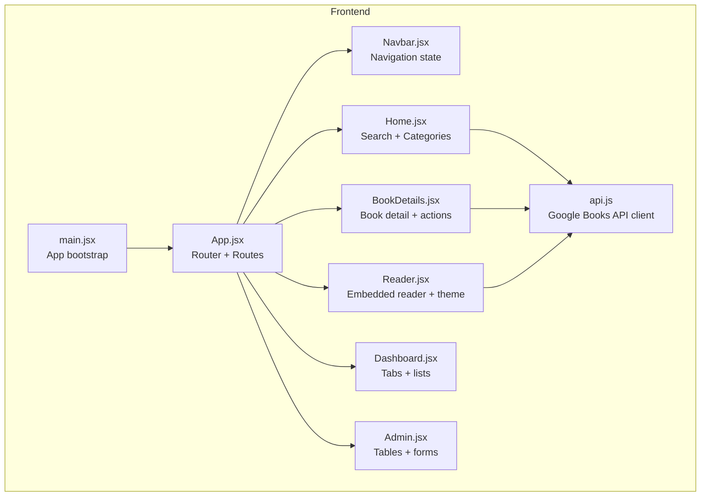
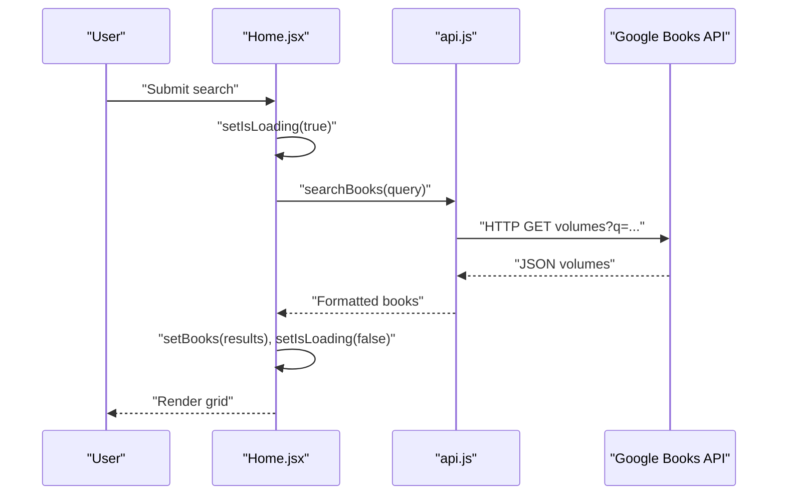
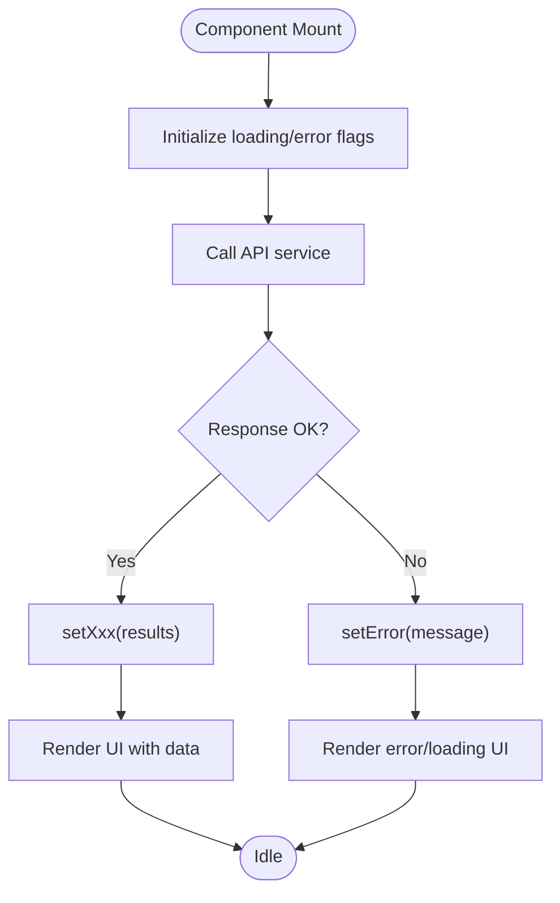
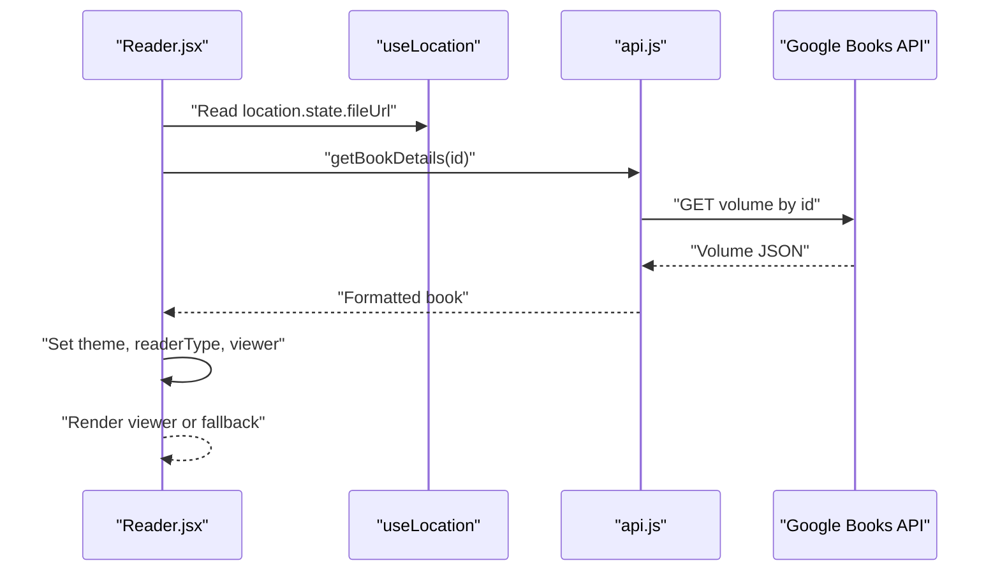
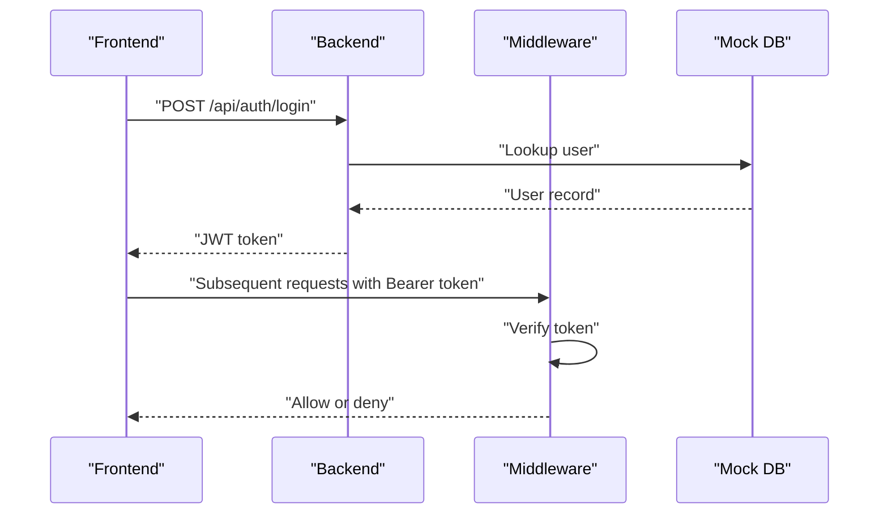
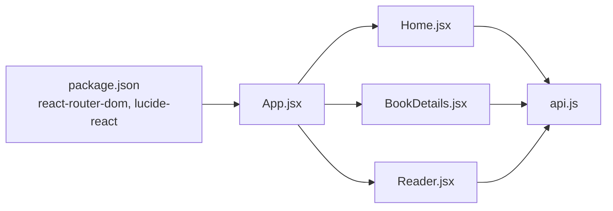

# State Management

<cite>
**Referenced Files in This Document**
- [App.jsx](file://frontend/src/App.jsx)
- [main.jsx](file://frontend/src/main.jsx)
- [Navbar.jsx](file://frontend/src/components/Navbar.jsx)
- [BookCard.jsx](file://frontend/src/components/BookCard.jsx)
- [Home.jsx](file://frontend/src/pages/Home.jsx)
- [BookDetails.jsx](file://frontend/src/pages/BookDetails.jsx)
- [Reader.jsx](file://frontend/src/pages/Reader.jsx)
- [Dashboard.jsx](file://frontend/src/pages/Dashboard.jsx)
- [Admin.jsx](file://frontend/src/pages/Admin.jsx)
- [api.js](file://frontend/src/services/api.js)
- [authController.js](file://backend/controllers/authController.js)
- [auth.js](file://backend/middleware/auth.js)
- [package.json](file://frontend/package.json)
</cite>

## Table of Contents
1. [Introduction](#introduction)
2. [Project Structure](#project-structure)
3. [Core Components](#core-components)
4. [Architecture Overview](#architecture-overview)
5. [Detailed Component Analysis](#detailed-component-analysis)
6. [Dependency Analysis](#dependency-analysis)
7. [Performance Considerations](#performance-considerations)
8. [Troubleshooting Guide](#troubleshooting-guide)
9. [Conclusion](#conclusion)

## Introduction
This document explains ReadSphere’s state management approach across the frontend React application. It covers component state, data flow between pages and shared components, integration with the Google Books API, and how navigation state is leveraged for form-like interactions. It also outlines best practices for authentication state, search results, user preferences, error handling, and performance optimization. Where applicable, it references the actual source files and provides diagrams mapped to the codebase.

## Project Structure
The frontend is a React application bootstrapped with Vite and uses React Router for navigation. State is primarily managed locally within components and pages, with data fetched from a Google Books API service module. Authentication is handled by a backend service (not shown in detail here) and would integrate with the frontend via tokens and protected routes.

**Diagram sources**
- [main.jsx:1-11](file://frontend/src/main.jsx#L1-L11)
- [App.jsx:16-37](file://frontend/src/App.jsx#L16-L37)
- [Navbar.jsx:1-56](file://frontend/src/components/Navbar.jsx#L1-L56)
- [Home.jsx:29-483](file://frontend/src/pages/Home.jsx#L29-L483)
- [BookDetails.jsx:6-225](file://frontend/src/pages/BookDetails.jsx#L6-L225)
- [Reader.jsx:6-216](file://frontend/src/pages/Reader.jsx#L6-L216)
- [Dashboard.jsx:14-159](file://frontend/src/pages/Dashboard.jsx#L14-L159)
- [Admin.jsx:15-174](file://frontend/src/pages/Admin.jsx#L15-L174)
- [api.js:120-284](file://frontend/src/services/api.js#L120-L284)

**Section sources**
- [main.jsx:1-11](file://frontend/src/main.jsx#L1-L11)
- [App.jsx:16-37](file://frontend/src/App.jsx#L16-L37)
- [package.json:12-18](file://frontend/package.json#L12-L18)

## Core Components
- App and Routing: The application root configures React Router and renders pages. Navigation state is derived from the current route and location.
- Services: A dedicated API module encapsulates Google Books integration, returning normalized book data and providing fallbacks.
- Shared UI: Components like Navbar and BookCard manage small slices of component state (e.g., scroll position, image loading, hover overlays).

Key state patterns observed:
- Component-local state with useState/useEffect for UI flags, user inputs, and data fetched from APIs.
- Minimal cross-component sharing; state is passed down via props or lifted when needed.
- No global state library is used; state is centralized around pages and shared components.

**Section sources**
- [App.jsx:16-37](file://frontend/src/App.jsx#L16-L37)
- [api.js:120-284](file://frontend/src/services/api.js#L120-L284)
- [Navbar.jsx:6-16](file://frontend/src/components/Navbar.jsx#L6-L16)
- [BookCard.jsx:6-18](file://frontend/src/components/BookCard.jsx#L6-L18)

## Architecture Overview
The frontend follows a unidirectional data flow:
- UI triggers actions (e.g., search, category change, reading start).
- Pages call the API service to fetch data.
- On success, pages update component state; on failure, they set error/loading flags.
- UI renders based on state and navigates using React Router.

**Diagram sources**
- [Home.jsx:114-127](file://frontend/src/pages/Home.jsx#L114-L127)
- [api.js:120-144](file://frontend/src/services/api.js#L120-L144)

**Section sources**
- [Home.jsx:29-127](file://frontend/src/pages/Home.jsx#L29-L127)
- [api.js:120-144](file://frontend/src/services/api.js#L120-L144)

## Detailed Component Analysis

### Component State Patterns
- Navbar: Tracks scroll state and mobile menu visibility. Uses a scroll event listener and cleanup in a lifecycle hook.
- BookCard: Manages image load state to show skeletons until images are ready.
- Home: Maintains multiple lists (trending, new releases, preview books), active category, search query, and numerous loading/error flags. Uses multiple effects to fetch data on mount and when filters change.
- BookDetails: Holds book data, loading/error states, and user actions (favorite/bookmark). Checks preview availability separately.
- Reader: Manages theme, loading/error states, and determines the appropriate reader type (embedded Google vs. external PDF/EPUB). Initializes the Google Books viewer dynamically.
- Dashboard/Admin: Local tabs and mock data for lists and tables.

**Diagram sources**
- [Home.jsx:44-92](file://frontend/src/pages/Home.jsx#L44-L92)
- [BookDetails.jsx:16-57](file://frontend/src/pages/BookDetails.jsx#L16-L57)
- [Reader.jsx:23-54](file://frontend/src/pages/Reader.jsx#L23-L54)

**Section sources**
- [Navbar.jsx:6-16](file://frontend/src/components/Navbar.jsx#L6-L16)
- [BookCard.jsx:6-18](file://frontend/src/components/BookCard.jsx#L6-L18)
- [Home.jsx:29-127](file://frontend/src/pages/Home.jsx#L29-L127)
- [BookDetails.jsx:6-81](file://frontend/src/pages/BookDetails.jsx#L6-L81)
- [Reader.jsx:6-54](file://frontend/src/pages/Reader.jsx#L6-L54)
- [Dashboard.jsx:14-159](file://frontend/src/pages/Dashboard.jsx#L14-L159)
- [Admin.jsx:15-174](file://frontend/src/pages/Admin.jsx#L15-L174)

### Data Flow Between Components
- Home orchestrates search and category filtering, passing normalized book objects to BookCard components.
- BookDetails receives a book id via params, fetches details, and exposes actions (favorite/bookmark) and preview checks.
- Reader uses navigation state to receive optional file URLs and decides between embedded Google viewer or external viewers.

**Diagram sources**
- [Reader.jsx:19-54](file://frontend/src/pages/Reader.jsx#L19-L54)
- [api.js:151-168](file://frontend/src/services/api.js#L151-L168)

**Section sources**
- [Reader.jsx:19-54](file://frontend/src/pages/Reader.jsx#L19-L54)
- [api.js:151-168](file://frontend/src/services/api.js#L151-L168)

### Global State Patterns and Context API
- No Context provider is defined in the frontend codebase. Authentication state, preferences, and cross-page state are not globally managed via React Context.
- Authentication is handled server-side in the backend; the frontend does not expose a global auth context.

Implications:
- Favor prop drilling for small shared state (e.g., theme in Reader).
- For larger apps, consider introducing a lightweight context or a minimal state library to centralize user preferences and navigation state.

**Section sources**
- [Reader.jsx:11-17](file://frontend/src/pages/Reader.jsx#L11-L17)
- [authController.js:1-90](file://backend/controllers/authController.js#L1-L90)
- [auth.js:1-34](file://backend/middleware/auth.js#L1-L34)

### Local Storage Integration
- No explicit localStorage usage is present in the frontend codebase.
- Recommendations:
  - Persist user preferences (e.g., theme) under a stable key.
  - Store last search query or recent categories for quick restoration.
  - Cache normalized book lists for short-lived sessions to reduce network calls.

[No sources needed since this section provides general guidance]

### State Synchronization with Backend API
- Authentication flow is handled by the backend controllers and middleware. The frontend does not implement auth state management internally.
- Protected routes rely on middleware verifying JWT tokens.

**Diagram sources**
- [authController.js:48-72](file://backend/controllers/authController.js#L48-L72)
- [auth.js:3-23](file://backend/middleware/auth.js#L3-L23)

**Section sources**
- [authController.js:1-90](file://backend/controllers/authController.js#L1-L90)
- [auth.js:1-34](file://backend/middleware/auth.js#L1-L34)

### Navigation State and Form State Management
- Navigation state is used to pass a file URL into the Reader page, enabling dynamic selection of viewer type.
- Forms in the frontend are minimal (login form placeholders) and do not persist state beyond component lifecycles.

Recommendations:
- For multi-step forms, consider storing intermediate state in memory or a temporary store until submission.
- Use URL search params for lightweight, shareable form states (e.g., search filters).

**Section sources**
- [Reader.jsx:19-20](file://frontend/src/pages/Reader.jsx#L19-L20)
- [Login.jsx:9-13](file://frontend/src/pages/Login.jsx#L9-L13)

### Best Practices for Managing State
- Authentication state: Centralize in a context/provider when scaling; otherwise, keep login state ephemeral and rely on backend tokens.
- Book search results: Normalize data early, cache within a page lifecycle, and surface granular loading/error flags per section.
- User preferences: Persist to localStorage with sensible defaults; hydrate on app start.
- Side effects: Encapsulate in service modules (as done with api.js) and ensure cleanup in effects.

**Section sources**
- [api.js:120-284](file://frontend/src/services/api.js#L120-L284)
- [Home.jsx:29-127](file://frontend/src/pages/Home.jsx#L29-L127)
- [BookDetails.jsx:6-81](file://frontend/src/pages/BookDetails.jsx#L6-L81)

### Examples of State Updates and Side Effects
- Search flow in Home updates loading flags and sets results upon completion.
- Preview availability check toggles a separate loading flag and sets a boolean outcome.
- Reader initializes the Google Books viewer asynchronously and handles initialization errors.

**Section sources**
- [Home.jsx:114-127](file://frontend/src/pages/Home.jsx#L114-L127)
- [BookDetails.jsx:40-57](file://frontend/src/pages/BookDetails.jsx#L40-L57)
- [Reader.jsx:57-137](file://frontend/src/pages/Reader.jsx#L57-L137)

### Performance Optimization Techniques
- Skeleton loaders: Use skeleton placeholders while images and data load.
- Debounce/throttle: Consider debouncing search input to reduce API calls.
- Lazy initialization: Initialize heavy viewers (e.g., Google Books) only when needed.
- Memoization: Use memoization for derived data if rendering performance becomes a concern.

**Section sources**
- [Home.jsx:16-27](file://frontend/src/pages/Home.jsx#L16-L27)
- [BookCard.jsx:10-18](file://frontend/src/components/BookCard.jsx#L10-L18)
- [Reader.jsx:105-132](file://frontend/src/pages/Reader.jsx#L105-L132)

### State Persistence Strategies
- Local storage: Store user preferences and transient UI state.
- Session storage: Keep ephemeral session data (e.g., current search query).
- In-memory caches: Within a page lifecycle for normalized data.

[No sources needed since this section provides general guidance]

### Error State Management
- Home: Per-section loading flags and fallbacks to mock data on API errors.
- BookDetails: Dedicated error state and user-friendly messages.
- Reader: Separate loading and error states for the viewer initialization.

**Section sources**
- [Home.jsx:44-92](file://frontend/src/pages/Home.jsx#L44-L92)
- [BookDetails.jsx:68-81](file://frontend/src/pages/BookDetails.jsx#L68-L81)
- [Reader.jsx:168-202](file://frontend/src/pages/Reader.jsx#L168-L202)

### Debugging Approaches for Complex State Scenarios
- Use granular flags (loading/error) to narrow down where failures occur.
- Log API responses and normalize data early to isolate transformation bugs.
- Break effects into smaller units and add console logs for key transitions.
- For navigation-driven state, log location state and params to ensure correct handoff.

**Section sources**
- [Home.jsx:44-92](file://frontend/src/pages/Home.jsx#L44-L92)
- [BookDetails.jsx:16-57](file://frontend/src/pages/BookDetails.jsx#L16-L57)
- [Reader.jsx:23-54](file://frontend/src/pages/Reader.jsx#L23-L54)

## Dependency Analysis
- Router dependencies: App.jsx depends on react-router-dom for routing; pages depend on Link and useLocation.
- API dependencies: Pages import api.js for data fetching; api.js depends on environment variables for API keys.
- UI dependencies: Shared components (Navbar, BookCard) are used by pages.

**Diagram sources**
- [package.json:12-18](file://frontend/package.json#L12-L18)
- [App.jsx:2-10](file://frontend/src/App.jsx#L2-L10)
- [Home.jsx:5](file://frontend/src/pages/Home.jsx#L5)
- [BookDetails.jsx:4](file://frontend/src/pages/BookDetails.jsx#L4)
- [Reader.jsx:4](file://frontend/src/pages/Reader.jsx#L4)
- [api.js:1-12](file://frontend/src/services/api.js#L1-L12)

**Section sources**
- [package.json:12-18](file://frontend/package.json#L12-L18)
- [App.jsx:2-10](file://frontend/src/App.jsx#L2-L10)
- [api.js:1-12](file://frontend/src/services/api.js#L1-L12)

## Performance Considerations
- Prefer skeleton loaders and lazy initialization to improve perceived performance.
- Avoid unnecessary re-renders by keeping state granular and scoped.
- Normalize and cache data locally to minimize repeated network requests.

[No sources needed since this section provides general guidance]

## Troubleshooting Guide
- If search results do not appear, verify API key presence and fallback behavior.
- If the embedded reader fails, confirm Google Books JSAPI is loaded and the book supports previews.
- If navigation state is lost, ensure the originating page passes state correctly when navigating.

**Section sources**
- [api.js:120-144](file://frontend/src/services/api.js#L120-L144)
- [Reader.jsx:105-132](file://frontend/src/pages/Reader.jsx#L105-L132)

## Conclusion
ReadSphere’s frontend relies on component-local state and a dedicated API service to manage data flows. Navigation state is leveraged for seamless transitions (e.g., Reader). While there is no global state library, the code demonstrates clean separation of concerns and robust error/loading handling. As the application evolves, consider introducing a lightweight context for shared preferences and authentication state, and adopt persistence strategies for user preferences and cached data.