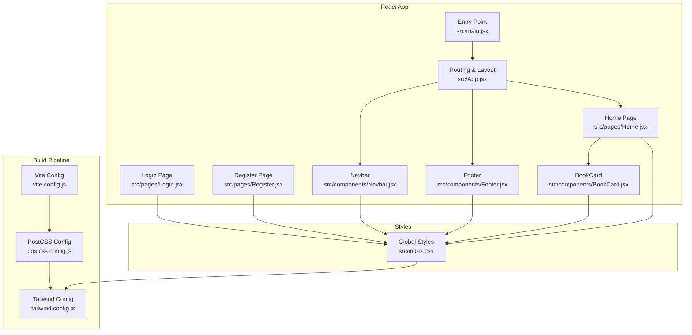
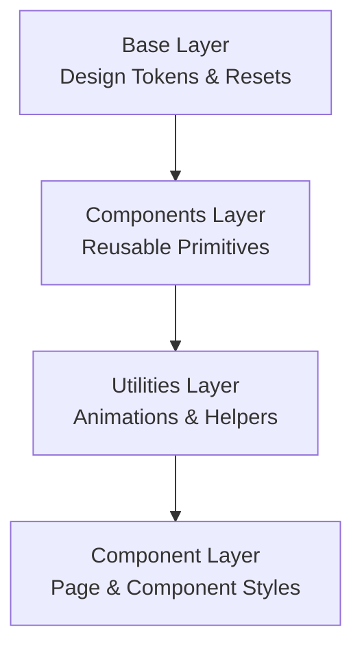
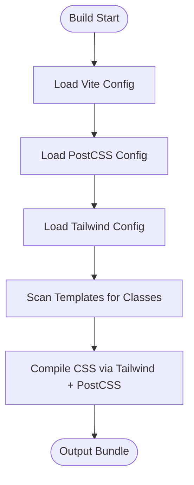
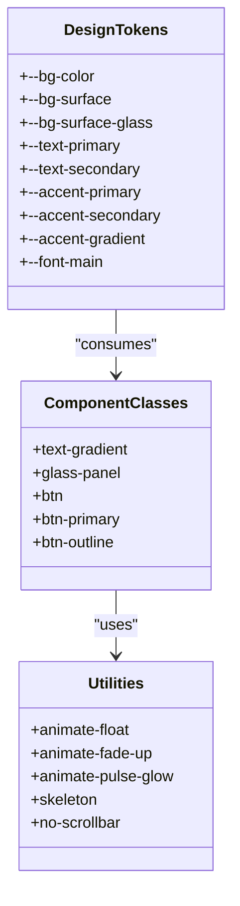
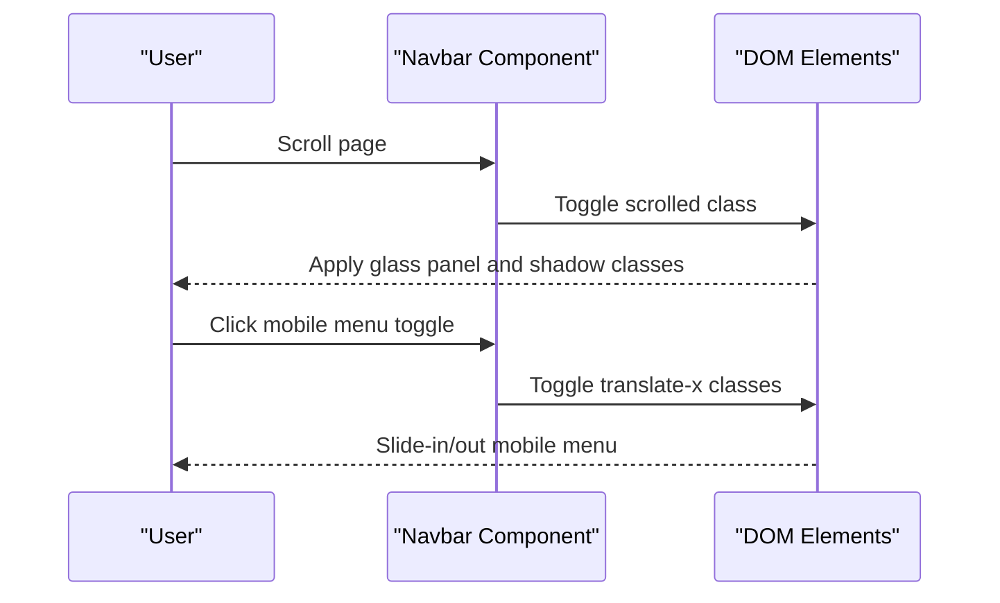
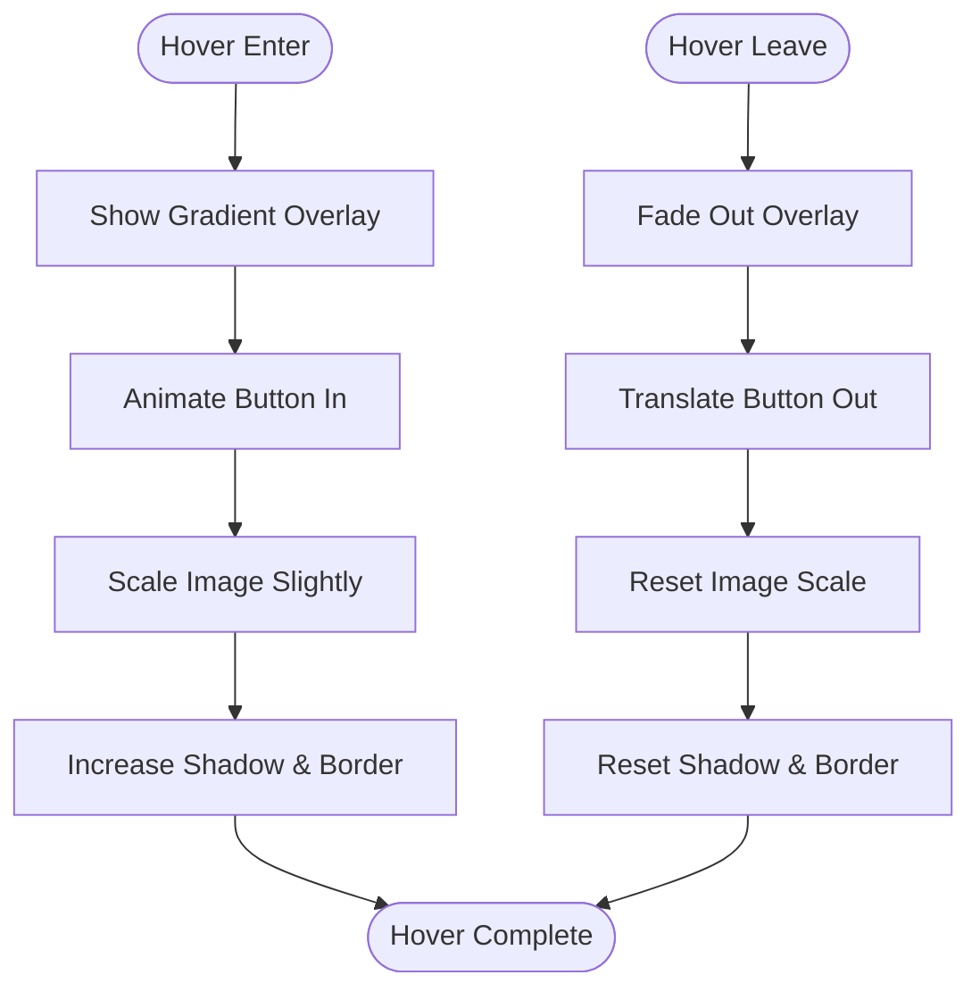
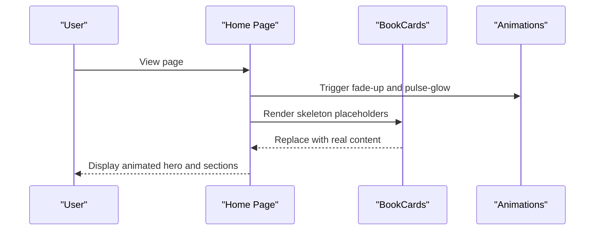
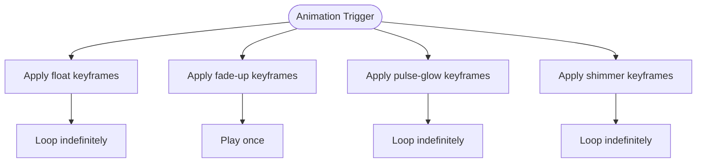
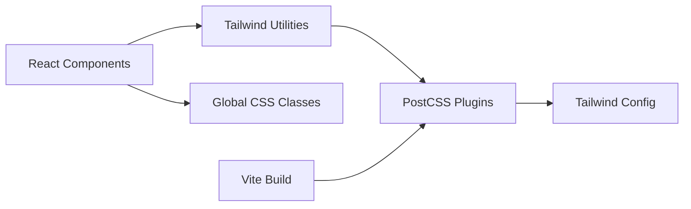

# Styling and UI Framework

<cite>
**Referenced Files in This Document**
- [tailwind.config.js](file://frontend/tailwind.config.js)
- [postcss.config.js](file://frontend/postcss.config.js)
- [index.css](file://frontend/src/index.css)
- [vite.config.js](file://frontend/vite.config.js)
- [package.json](file://frontend/package.json)
- [App.jsx](file://frontend/src/App.jsx)
- [main.jsx](file://frontend/src/main.jsx)
- [Navbar.jsx](file://frontend/src/components/Navbar.jsx)
- [Footer.jsx](file://frontend/src/components/Footer.jsx)
- [BookCard.jsx](file://frontend/src/components/BookCard.jsx)
- [Home.jsx](file://frontend/src/pages/Home.jsx)
- [Login.jsx](file://frontend/src/pages/Login.jsx)
- [Register.jsx](file://frontend/src/pages/Register.jsx)
</cite>

## Table of Contents
1. [Introduction](#introduction)
2. [Project Structure](#project-structure)
3. [Core Components](#core-components)
4. [Architecture Overview](#architecture-overview)
5. [Detailed Component Analysis](#detailed-component-analysis)
6. [Dependency Analysis](#dependency-analysis)
7. [Performance Considerations](#performance-considerations)
8. [Troubleshooting Guide](#troubleshooting-guide)
9. [Conclusion](#conclusion)
10. [Appendices](#appendices)

## Introduction
This document describes ReadSphere’s styling system and UI framework with a focus on Tailwind CSS configuration, design system principles, and component styling patterns. It explains how the utility-first approach is applied across components, how responsive design and dark theme are implemented, and how animations and interactive states are handled. It also provides guidelines for maintaining design consistency, extending the styling system, customizing themes, and integrating styles with React components.

## Project Structure
The styling pipeline is built around PostCSS, Tailwind CSS, and Vite. The application initializes global styles and defines reusable design tokens and utilities. Components apply Tailwind utilities directly, while shared patterns are encapsulated in reusable CSS layers.

**Diagram sources**
- [vite.config.js:1-8](file://frontend/vite.config.js#L1-L8)
- [postcss.config.js:1-7](file://frontend/postcss.config.js#L1-L7)
- [tailwind.config.js:1-13](file://frontend/tailwind.config.js#L1-L13)
- [index.css:1-111](file://frontend/src/index.css#L1-L111)
- [main.jsx:1-11](file://frontend/src/main.jsx#L1-L11)
- [App.jsx:1-40](file://frontend/src/App.jsx#L1-L40)
- [Navbar.jsx:1-56](file://frontend/src/components/Navbar.jsx#L1-L56)
- [Footer.jsx:1-74](file://frontend/src/components/Footer.jsx#L1-L74)
- [BookCard.jsx:1-58](file://frontend/src/components/BookCard.jsx#L1-L58)
- [Home.jsx:1-483](file://frontend/src/pages/Home.jsx#L1-L483)
- [Login.jsx:1-84](file://frontend/src/pages/Login.jsx#L1-L84)
- [Register.jsx:1-99](file://frontend/src/pages/Register.jsx#L1-L99)

**Section sources**
- [vite.config.js:1-8](file://frontend/vite.config.js#L1-L8)
- [postcss.config.js:1-7](file://frontend/postcss.config.js#L1-L7)
- [tailwind.config.js:1-13](file://frontend/tailwind.config.js#L1-L13)
- [index.css:1-111](file://frontend/src/index.css#L1-L111)
- [main.jsx:1-11](file://frontend/src/main.jsx#L1-L11)
- [App.jsx:1-40](file://frontend/src/App.jsx#L1-L40)

## Core Components
- Tailwind configuration: Scans HTML and JSX templates for class usage and leaves theme extension empty for now.
- PostCSS pipeline: Enables Tailwind and Autoprefixer for vendor prefixes.
- Global CSS: Defines design tokens, base styles, reusable component classes, and utility animations.
- Vite plugin stack: React Fast Refresh and Tailwind integration via PostCSS.

Key design tokens and patterns:
- Color palette: Dark theme with deep backgrounds, light text, and orange accent gradients.
- Typography: Outfit font family applied globally.
- Interactive states: Hover, focus, and transitions are consistently applied across buttons and cards.
- Glass morphism: Shared glass-panel class with backdrop blur and subtle borders.
- Animations: Floating, fade-up, pulse glow, and shimmer skeleton loaders.

**Section sources**
- [tailwind.config.js:1-13](file://frontend/tailwind.config.js#L1-L13)
- [postcss.config.js:1-7](file://frontend/postcss.config.js#L1-L7)
- [index.css:5-24](file://frontend/src/index.css#L5-L24)
- [index.css:26-54](file://frontend/src/index.css#L26-L54)
- [index.css:56-110](file://frontend/src/index.css#L56-L110)
- [vite.config.js:1-8](file://frontend/vite.config.js#L1-L8)

## Architecture Overview
The styling architecture follows a layered approach:
- Base layer: Design tokens and global resets.
- Components layer: Reusable UI primitives (buttons, panels).
- Utilities layer: Animation helpers and layout helpers.
- Component layer: Page-level and component-level styling using Tailwind utilities.

[No sources needed since this diagram shows conceptual workflow, not actual code structure]

## Detailed Component Analysis

### Tailwind Configuration and Build Pipeline
- Content scanning includes index.html and all JSX/TSX under src.
- Theme extension is empty; customizations are centralized in global CSS.
- PostCSS enables Tailwind and Autoprefixer.
- Vite integrates React and compiles CSS via PostCSS.

**Diagram sources**
- [vite.config.js:1-8](file://frontend/vite.config.js#L1-L8)
- [postcss.config.js:1-7](file://frontend/postcss.config.js#L1-L7)
- [tailwind.config.js:3-6](file://frontend/tailwind.config.js#L3-L6)

**Section sources**
- [tailwind.config.js:1-13](file://frontend/tailwind.config.js#L1-L13)
- [postcss.config.js:1-7](file://frontend/postcss.config.js#L1-L7)
- [vite.config.js:1-8](file://frontend/vite.config.js#L1-L8)

### Global Styles and Design Tokens
- Root design tokens define background, surface, text, and accent colors, plus a gradient definition.
- Body applies base background, text color, font family, and selection highlight.
- Component classes encapsulate common patterns:
  - Text gradient effect.
  - Glass panel with backdrop blur and border.
  - Buttons with hover states and pseudo-element highlights.
  - Outline button variant.
- Utility animations include floating, fade-up, pulse glow, shimmer skeleton, and a no-scrollbar helper.

**Diagram sources**
- [index.css:5-19](file://frontend/src/index.css#L5-L19)
- [index.css:26-54](file://frontend/src/index.css#L26-L54)
- [index.css:56-110](file://frontend/src/index.css#L56-L110)

**Section sources**
- [index.css:5-24](file://frontend/src/index.css#L5-L24)
- [index.css:26-54](file://frontend/src/index.css#L26-L54)
- [index.css:56-110](file://frontend/src/index.css#L56-L110)

### Navbar Component Styling
- Fixed positioning with smooth transitions on scroll.
- Glass morphism background with backdrop blur and border.
- Gradient branding icon with hover scaling.
- Mobile menu transforms with backdrop blur container.
- Active link highlighting and hover transitions.

**Diagram sources**
- [Navbar.jsx:10-16](file://frontend/src/components/Navbar.jsx#L10-L16)
- [Navbar.jsx:19-28](file://frontend/src/components/Navbar.jsx#L19-L28)

**Section sources**
- [Navbar.jsx:1-56](file://frontend/src/components/Navbar.jsx#L1-L56)

### Footer Component Styling
- Dark background with subtle border.
- Responsive grid layout for links and social icons.
- Hover effects with transitions and gradient overlays.
- Consistent typography and spacing.

**Section sources**
- [Footer.jsx:1-74](file://frontend/src/components/Footer.jsx#L1-L74)

### BookCard Component Styling
- Glass morphism card with backdrop blur and border.
- Skeleton loader during image load.
- Gradient overlay on hover with animated “Read Now” button.
- Hover scaling and elevation with transitions.
- Category tag and rating badge with backdrop blur.

**Diagram sources**
- [BookCard.jsx:8-38](file://frontend/src/components/BookCard.jsx#L8-L38)
- [BookCard.jsx:40-53](file://frontend/src/components/BookCard.jsx#L40-L53)

**Section sources**
- [BookCard.jsx:1-58](file://frontend/src/components/BookCard.jsx#L1-L58)

### Home Page Styling Patterns
- Hero section with layered radial gradients, subtle grid background, and animated glow orbs.
- Animated hero elements using fade-up and pulse-glow utilities.
- Glass panel CTA section with floating cards and gradient accents.
- Category pills with active/inactive states and transitions.
- Horizontal scrolling sections with custom scrollbar hiding.
- Skeleton placeholders for loading states.

**Diagram sources**
- [Home.jsx:150-218](file://frontend/src/pages/Home.jsx#L150-L218)
- [Home.jsx:423-477](file://frontend/src/pages/Home.jsx#L423-L477)
- [Home.jsx:317-334](file://frontend/src/pages/Home.jsx#L317-L334)

**Section sources**
- [Home.jsx:1-483](file://frontend/src/pages/Home.jsx#L1-L483)

### Login and Register Forms Styling
- Glass panel containers with backdrop blur and borders.
- Form inputs with left-aligned icons and focus states.
- Gradient brand icon and form header.
- Responsive padding and rounded corners.
- Backdrop glow orbs in the background.

**Section sources**
- [Login.jsx:1-84](file://frontend/src/pages/Login.jsx#L1-L84)
- [Register.jsx:1-99](file://frontend/src/pages/Register.jsx#L1-L99)

### Responsive Design Implementation
- Mobile-first approach with responsive breakpoints.
- Container and padding utilities for consistent gutters.
- Flex and grid layouts adapt to screen sizes.
- Scrollable horizontal sections with hidden scrollbars.
- Typography scales across breakpoints.

**Section sources**
- [Home.jsx:242-259](file://frontend/src/pages/Home.jsx#L242-L259)
- [Home.jsx:284-301](file://frontend/src/pages/Home.jsx#L284-L301)
- [index.css:102-109](file://frontend/src/index.css#L102-L109)

### Dark Theme Support
- Dark color scheme defined via CSS variables.
- Surface and background colors chosen for readability and depth.
- Text contrast maintained with secondary and primary text tokens.
- Accent gradients provide visual emphasis without increasing brightness.

**Section sources**
- [index.css:5-19](file://frontend/src/index.css#L5-L19)

### Utility-First CSS Approach
- Tailwind utilities compose styles directly in JSX.
- Reusable classes encapsulated in the components layer reduce duplication.
- Animations and transitions are defined once and reused across components.

**Section sources**
- [index.css:35-54](file://frontend/src/index.css#L35-L54)
- [index.css:56-110](file://frontend/src/index.css#L56-L110)

### Specific Styling Patterns
- Glass morphism: Shared class with backdrop blur, semi-transparent backgrounds, and thin borders.
- Gradient usage: Accent gradients for buttons and text, radial gradients for backgrounds.
- Interactive state styling: Hover scaling, elevation, and pseudo-element highlights on buttons.
- Skeleton loaders: Shimmer animation with gradient backgrounds for perceived performance.
- Animations: Floating, fade-up, and pulse-glow effects for engaging micro-interactions.

**Section sources**
- [index.css:31-33](file://frontend/src/index.css#L31-L33)
- [index.css:27-29](file://frontend/src/index.css#L27-L29)
- [index.css:39-49](file://frontend/src/index.css#L39-L49)
- [index.css:91-110](file://frontend/src/index.css#L91-L110)
- [Home.jsx:167-168](file://frontend/src/pages/Home.jsx#L167-L168)
- [Home.jsx:458-472](file://frontend/src/pages/Home.jsx#L458-L472)

### Component-Specific Styling Approaches
- Navbar: Fixed position with dynamic classes for scroll state and mobile menu.
- Footer: Grid layout with responsive columns and hover interactions.
- BookCard: Hover overlay with gradient, animated button, and image scaling.
- Home: Hero with layered gradients, floating elements, and skeleton placeholders.
- Login/Register: Glass panels with form inputs and focus states.

**Section sources**
- [Navbar.jsx:19-51](file://frontend/src/components/Navbar.jsx#L19-L51)
- [Footer.jsx:8-69](file://frontend/src/components/Footer.jsx#L8-L69)
- [BookCard.jsx:8-53](file://frontend/src/components/BookCard.jsx#L8-L53)
- [Home.jsx:150-218](file://frontend/src/pages/Home.jsx#L150-L218)
- [Login.jsx:16-79](file://frontend/src/pages/Login.jsx#L16-L79)
- [Register.jsx:17-94](file://frontend/src/pages/Register.jsx#L17-L94)

### Animation Implementations
- Floating: Continuous up/down movement with easing.
- Fade-up: Staggered entrance with opacity and translation.
- Pulse glow: Subtle opacity pulsing for ambient lighting.
- Shimmer: Horizontal gradient movement for skeleton loaders.

**Diagram sources**
- [index.css:57-65](file://frontend/src/index.css#L57-L65)
- [index.css:67-80](file://frontend/src/index.css#L67-L80)
- [index.css:82-89](file://frontend/src/index.css#L82-L89)
- [index.css:91-110](file://frontend/src/index.css#L91-L110)

**Section sources**
- [index.css:56-110](file://frontend/src/index.css#L56-L110)

### Accessibility Considerations
- Sufficient color contrast for text and interactive elements.
- Focus-visible states on inputs and buttons.
- Semantic markup with headings and lists.
- Accessible labels for icons and buttons.
- Reduced motion considerations for animations.

[No sources needed since this section provides general guidance]

## Dependency Analysis
The styling system depends on Tailwind and PostCSS configured via Vite. React components consume Tailwind utilities and global CSS classes.

**Diagram sources**
- [vite.config.js:1-8](file://frontend/vite.config.js#L1-L8)
- [postcss.config.js:1-7](file://frontend/postcss.config.js#L1-L7)
- [tailwind.config.js:1-13](file://frontend/tailwind.config.js#L1-L13)
- [index.css:1-3](file://frontend/src/index.css#L1-L3)

**Section sources**
- [package.json:12-32](file://frontend/package.json#L12-L32)
- [vite.config.js:1-8](file://frontend/vite.config.js#L1-L8)
- [postcss.config.js:1-7](file://frontend/postcss.config.js#L1-L7)
- [tailwind.config.js:1-13](file://frontend/tailwind.config.js#L1-L13)

## Performance Considerations
- Keep Tailwind content globs minimal to reduce CSS size.
- Prefer component-level classes to avoid unused utilities.
- Use skeleton loaders to improve perceived performance during data fetching.
- Limit heavy animations to essential elements; disable or reduce motion for users who prefer reduced motion.
- Optimize images and leverage lazy loading to minimize render-blocking resources.

[No sources needed since this section provides general guidance]

## Troubleshooting Guide
- If animations do not appear, verify that the utility classes are applied and the keyframes are defined.
- If glass morphism looks incorrect, ensure backdrop blur is supported and the container has sufficient transparency.
- If hover states do not trigger, confirm that the interactive utilities are present and not overridden by later styles.
- If fonts do not load, verify the font family is declared in the base layer and available via CDN or local assets.

**Section sources**
- [index.css:56-110](file://frontend/src/index.css#L56-L110)

## Conclusion
ReadSphere’s styling system embraces a utility-first approach with Tailwind CSS, PostCSS, and Vite. The design system centers on a cohesive dark theme, consistent glass morphism, and expressive animations. Components apply Tailwind utilities directly while reusing shared patterns from global CSS. The architecture supports scalability, maintainability, and accessibility, with clear guidelines for extending and customizing the system.

[No sources needed since this section summarizes without analyzing specific files]

## Appendices

### Guidelines for Maintaining Design Consistency
- Centralize design tokens in the base layer.
- Encapsulate reusable patterns in component classes.
- Use utility animations sparingly and consistently.
- Maintain consistent spacing and typography scales.

[No sources needed since this section provides general guidance]

### Extending the Styling System
- Add new utilities in the utilities layer.
- Introduce component variants in the components layer.
- Extend design tokens in the base layer.
- Keep content globs in Tailwind config scoped to relevant templates.

[No sources needed since this section provides general guidance]

### Customizing Themes
- Modify CSS variables in the base layer to change palettes.
- Adjust gradients and shadows for new variants.
- Update component classes to reflect theme changes.

[No sources needed since this section provides general guidance]

### Browser Compatibility
- Tailwind and Autoprefixer ensure vendor-prefixed properties.
- Verify CSS features like backdrop blur and gradients across target browsers.
- Test animations and transitions on lower-powered devices.

[No sources needed since this section provides general guidance]

### Integration with React Components
- Apply Tailwind classes directly in JSX for clarity.
- Use global CSS classes for shared patterns.
- Leverage component props to toggle states (e.g., active categories).

[No sources needed since this section provides general guidance]