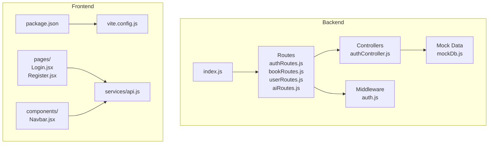
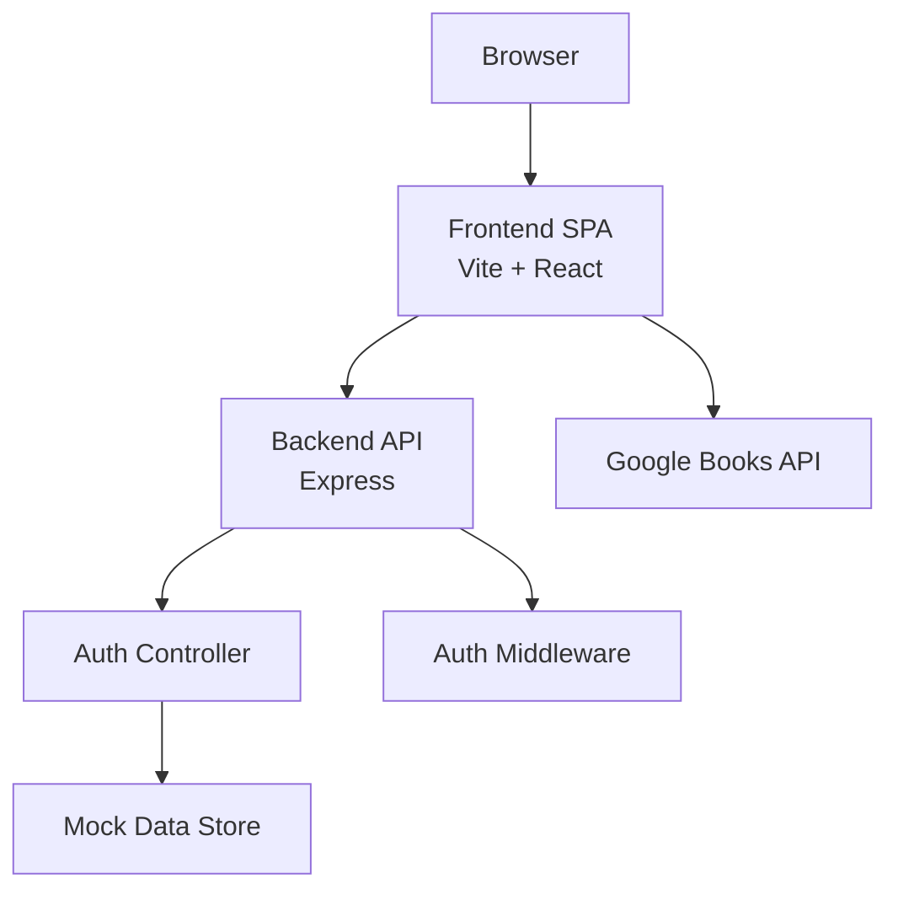
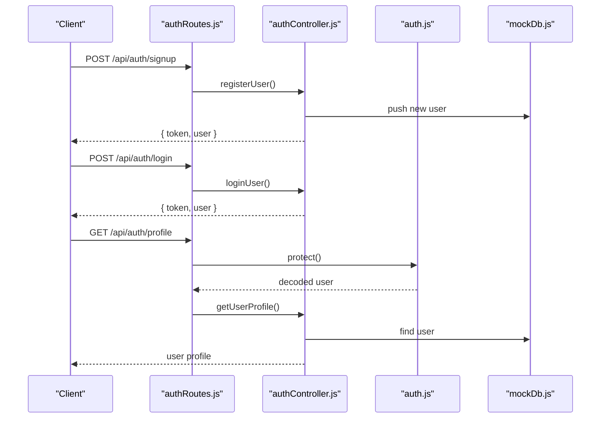
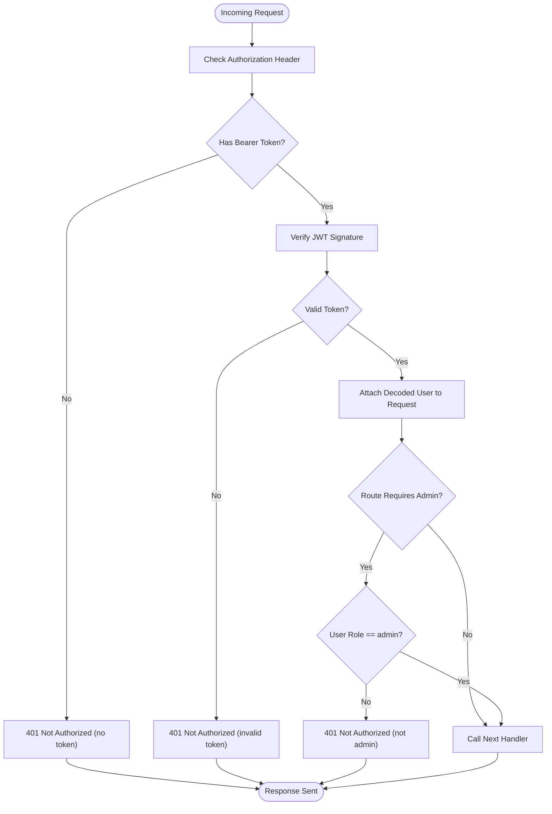
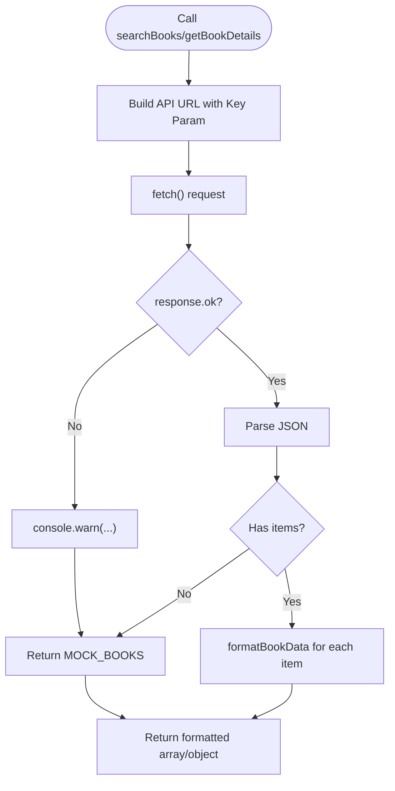
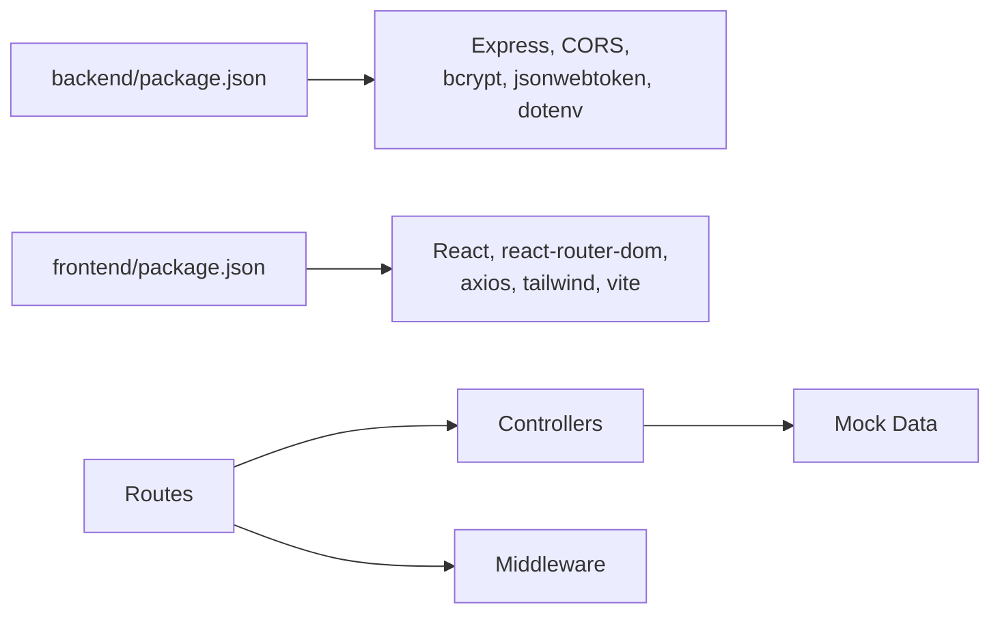
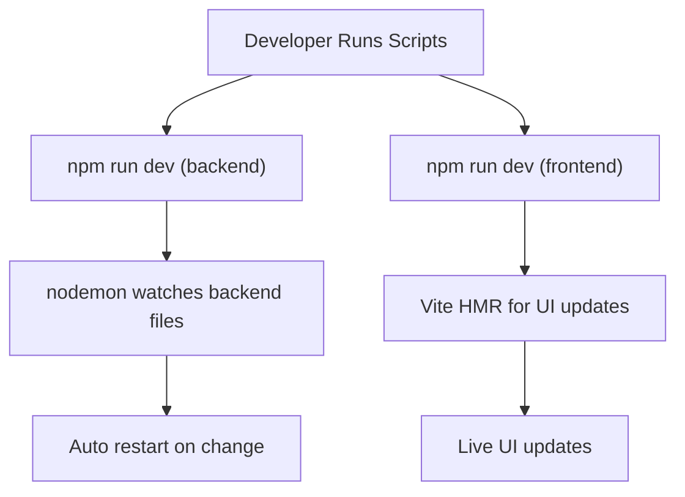

# Testing and Deployment

<cite>
**Referenced Files in This Document**
- [backend/package.json](file://backend/package.json)
- [backend/index.js](file://backend/index.js)
- [backend/controllers/authController.js](file://backend/controllers/authController.js)
- [backend/middleware/auth.js](file://backend/middleware/auth.js)
- [backend/data/mockDb.js](file://backend/data/mockDb.js)
- [backend/routes/authRoutes.js](file://backend/routes/authRoutes.js)
- [backend/routes/bookRoutes.js](file://backend/routes/bookRoutes.js)
- [backend/routes/userRoutes.js](file://backend/routes/userRoutes.js)
- [backend/routes/aiRoutes.js](file://backend/routes/aiRoutes.js)
- [frontend/package.json](file://frontend/package.json)
- [frontend/vite.config.js](file://frontend/vite.config.js)
- [frontend/src/services/api.js](file://frontend/src/services/api.js)
- [frontend/src/components/Navbar.jsx](file://frontend/src/components/Navbar.jsx)
- [frontend/src/pages/Login.jsx](file://frontend/src/pages/Login.jsx)
- [frontend/src/pages/Register.jsx](file://frontend/src/pages/Register.jsx)
</cite>

## Table of Contents
1. [Introduction](#introduction)
2. [Project Structure](#project-structure)
3. [Core Components](#core-components)
4. [Architecture Overview](#architecture-overview)
5. [Detailed Component Analysis](#detailed-component-analysis)
6. [Dependency Analysis](#dependency-analysis)
7. [Performance Considerations](#performance-considerations)
8. [Troubleshooting Guide](#troubleshooting-guide)
9. [Development Workflow](#development-workflow)
10. [Testing Strategies](#testing-strategies)
11. [Deployment Procedures](#deployment-procedures)
12. [CI/CD Pipeline Recommendations](#cicd-pipeline-recommendations)
13. [Containerization Options](#containerization-options)
14. [Cloud Deployment Strategies](#cloud-deployment-strategies)
15. [Monitoring, Logging, and Maintenance](#monitoring-logging-and-maintenance)
16. [Conclusion](#conclusion)

## Introduction
This document provides comprehensive guidance for testing strategies and deployment procedures for ReadSphere. It covers frontend testing approaches (component testing, integration testing, and mock API testing), backend testing patterns (controllers, middleware, and authentication), development workflow with hot reload and debugging, production deployment considerations (build processes, environment variables, performance optimization, and security hardening), and operational practices for monitoring, logging, and maintenance.

## Project Structure
The project is organized into two primary directories:
- backend: Express-based API server with controllers, middleware, routes, and mock data.
- frontend: React-based SPA built with Vite, including components, pages, and a service module for external API integration.

**Diagram sources**
- [backend/index.js:1-27](file://backend/index.js#L1-L27)
- [backend/routes/authRoutes.js:1-11](file://backend/routes/authRoutes.js#L1-L11)
- [backend/routes/bookRoutes.js:1-10](file://backend/routes/bookRoutes.js#L1-L10)
- [backend/routes/userRoutes.js:1-11](file://backend/routes/userRoutes.js#L1-L11)
- [backend/routes/aiRoutes.js:1-10](file://backend/routes/aiRoutes.js#L1-L10)
- [backend/middleware/auth.js:1-34](file://backend/middleware/auth.js#L1-L34)
- [backend/controllers/authController.js:1-90](file://backend/controllers/authController.js#L1-L90)
- [backend/data/mockDb.js:1-20](file://backend/data/mockDb.js#L1-L20)
- [frontend/package.json:1-34](file://frontend/package.json#L1-L34)
- [frontend/vite.config.js:1-8](file://frontend/vite.config.js#L1-L8)
- [frontend/src/services/api.js:1-284](file://frontend/src/services/api.js#L1-L284)
- [frontend/src/components/Navbar.jsx:1-56](file://frontend/src/components/Navbar.jsx#L1-L56)
- [frontend/src/pages/Login.jsx:1-84](file://frontend/src/pages/Login.jsx#L1-L84)
- [frontend/src/pages/Register.jsx:1-99](file://frontend/src/pages/Register.jsx#L1-L99)

**Section sources**
- [backend/package.json:1-24](file://backend/package.json#L1-L24)
- [frontend/package.json:1-34](file://frontend/package.json#L1-L34)

## Core Components
- Backend server initialization and routing are defined in the server entrypoint, which loads environment variables, configures middleware, mounts route handlers, and starts the HTTP listener.
- Controllers encapsulate business logic for authentication, user actions, and AI-related endpoints.
- Middleware enforces authentication and authorization checks.
- Mock data simulates persistent storage for users, books, and categories.
- Frontend services abstract external API interactions and provide fallback mechanisms for resilience.

Key responsibilities:
- Server bootstrap and port configuration.
- Route exposure for authentication, books, users, and AI endpoints.
- Token-based authentication and admin authorization enforcement.
- In-memory persistence for demo and testing scenarios.
- External API integration with graceful fallbacks.

**Section sources**
- [backend/index.js:1-27](file://backend/index.js#L1-L27)
- [backend/controllers/authController.js:1-90](file://backend/controllers/authController.js#L1-L90)
- [backend/middleware/auth.js:1-34](file://backend/middleware/auth.js#L1-L34)
- [backend/data/mockDb.js:1-20](file://backend/data/mockDb.js#L1-L20)
- [frontend/src/services/api.js:1-284](file://frontend/src/services/api.js#L1-L284)

## Architecture Overview
The system follows a client-server architecture:
- Frontend (React/Vite) consumes backend REST endpoints and renders UI components.
- Backend (Express) exposes REST APIs, applies middleware for auth, and delegates to controllers.
- External Google Books API is integrated via a service module with robust fallbacks.

**Diagram sources**
- [backend/index.js:1-27](file://backend/index.js#L1-L27)
- [backend/controllers/authController.js:1-90](file://backend/controllers/authController.js#L1-L90)
- [backend/middleware/auth.js:1-34](file://backend/middleware/auth.js#L1-L34)
- [backend/data/mockDb.js:1-20](file://backend/data/mockDb.js#L1-L20)
- [frontend/src/services/api.js:1-284](file://frontend/src/services/api.js#L1-L284)

## Detailed Component Analysis

### Authentication Flow
The authentication flow involves signup, login, and protected profile retrieval. Middleware validates JWT tokens and enforces admin privileges where applicable.

**Diagram sources**
- [backend/routes/authRoutes.js:1-11](file://backend/routes/authRoutes.js#L1-L11)
- [backend/controllers/authController.js:1-90](file://backend/controllers/authController.js#L1-L90)
- [backend/middleware/auth.js:1-34](file://backend/middleware/auth.js#L1-L34)
- [backend/data/mockDb.js:1-20](file://backend/data/mockDb.js#L1-L20)

**Section sources**
- [backend/controllers/authController.js:1-90](file://backend/controllers/authController.js#L1-L90)
- [backend/middleware/auth.js:1-34](file://backend/middleware/auth.js#L1-L34)
- [backend/routes/authRoutes.js:1-11](file://backend/routes/authRoutes.js#L1-L11)
- [backend/data/mockDb.js:1-20](file://backend/data/mockDb.js#L1-L20)

### Middleware Authorization Logic
Authorization logic verifies bearer tokens and restricts access to admin-only endpoints.

**Diagram sources**
- [backend/middleware/auth.js:1-34](file://backend/middleware/auth.js#L1-L34)

**Section sources**
- [backend/middleware/auth.js:1-34](file://backend/middleware/auth.js#L1-L34)

### Frontend API Service and Fallbacks
The frontend service integrates with the Google Books API and provides fallbacks when external requests fail or return empty results.

**Diagram sources**
- [frontend/src/services/api.js:1-284](file://frontend/src/services/api.js#L1-L284)

**Section sources**
- [frontend/src/services/api.js:1-284](file://frontend/src/services/api.js#L1-L284)

### Frontend Pages and Components
- Login and Register pages capture form inputs and log submission events for demonstration.
- Navbar manages scroll effects, mobile menu toggling, and navigation links.

**Section sources**
- [frontend/src/pages/Login.jsx:1-84](file://frontend/src/pages/Login.jsx#L1-L84)
- [frontend/src/pages/Register.jsx:1-99](file://frontend/src/pages/Register.jsx#L1-L99)
- [frontend/src/components/Navbar.jsx:1-56](file://frontend/src/components/Navbar.jsx#L1-L56)

## Dependency Analysis
- Backend dependencies include Express, CORS, bcrypt, jsonwebtoken, dotenv, and nodemon for development.
- Frontend dependencies include React, React Router, Axios, Tailwind, and Vite tooling.
- Routes depend on controllers and middleware; controllers depend on mock data for persistence.

**Diagram sources**
- [backend/package.json:1-24](file://backend/package.json#L1-L24)
- [frontend/package.json:1-34](file://frontend/package.json#L1-L34)

**Section sources**
- [backend/package.json:1-24](file://backend/package.json#L1-L24)
- [frontend/package.json:1-34](file://frontend/package.json#L1-L34)

## Performance Considerations
- Backend
  - Use environment-controlled ports and keep middleware minimal to reduce latency.
  - Consider rate limiting and input validation to prevent abuse.
  - Offload CPU-intensive tasks (e.g., hashing) to background workers if scaling.
- Frontend
  - Enable production builds to minimize bundle sizes.
  - Lazy-load non-critical routes and components.
  - Optimize images and leverage browser caching.
  - Minimize re-renders by using memoization and efficient state updates.

[No sources needed since this section provides general guidance]

## Troubleshooting Guide
- Backend
  - Missing JWT secret or invalid tokens will trigger unauthorized responses from middleware.
  - Missing CORS headers can block frontend requests; ensure CORS is enabled.
  - Environment variables must be loaded before requiring modules that depend on them.
- Frontend
  - API failures fall back to mock data; inspect console warnings for error details.
  - Ensure environment variables are prefixed correctly for the bundler.

**Section sources**
- [backend/middleware/auth.js:1-34](file://backend/middleware/auth.js#L1-L34)
- [backend/index.js:1-27](file://backend/index.js#L1-L27)
- [frontend/src/services/api.js:1-284](file://frontend/src/services/api.js#L1-L284)

## Development Workflow
- Backend
  - Use the development script to enable hot reloading during development.
  - Configure environment variables via a local environment file.
- Frontend
  - Use the Vite dev server for fast refresh and hot module replacement.
  - Linting and formatting are configured via ESLint and related plugins.

**Diagram sources**
- [backend/package.json:5-8](file://backend/package.json#L5-L8)
- [frontend/package.json:6-11](file://frontend/package.json#L6-L11)
- [frontend/vite.config.js:1-8](file://frontend/vite.config.js#L1-L8)

**Section sources**
- [backend/package.json:5-8](file://backend/package.json#L5-L8)
- [frontend/package.json:6-11](file://frontend/package.json#L6-L11)
- [frontend/vite.config.js:1-8](file://frontend/vite.config.js#L1-L8)

## Testing Strategies

### Frontend Testing Approaches
- Component Testing
  - Test isolated UI components (e.g., Navbar) for rendering, event handling, and state transitions.
  - Use a testing framework to assert DOM changes and accessibility attributes.
- Integration Testing
  - Validate page flows (e.g., Login, Register) by simulating form submissions and route navigation.
  - Mock external service calls to test UI behavior under various API outcomes.
- Mock API Testing Strategies
  - Stub network requests to simulate success, failure, and empty responses.
  - Verify fallback behavior and error messaging when external APIs are unavailable.

[No sources needed since this section provides general guidance]

### Backend Testing Patterns
- Controllers
  - Unit-test controller logic by mocking dependencies (e.g., bcrypt, JWT, mockDb).
  - Validate response status codes and payload shapes for happy and error paths.
- Middleware
  - Test authentication middleware with valid/invalid tokens and missing headers.
  - Validate admin middleware for role-based access control.
- Authentication Testing
  - Generate and verify JWT tokens with appropriate claims.
  - Simulate token expiration and tampering scenarios.

[No sources needed since this section provides general guidance]

### Mock Data and In-Memory Persistence
- Use mock data for deterministic tests and to avoid external dependencies.
- Keep test fixtures synchronized with controller expectations.

**Section sources**
- [backend/data/mockDb.js:1-20](file://backend/data/mockDb.js#L1-L20)
- [backend/controllers/authController.js:1-90](file://backend/controllers/authController.js#L1-L90)
- [backend/middleware/auth.js:1-34](file://backend/middleware/auth.js#L1-L34)

## Deployment Procedures
- Build Processes
  - Frontend: Produce optimized static assets using the build script.
  - Backend: Package dependencies and ensure environment variables are present in production.
- Environment Variables
  - Define required variables (e.g., JWT secret, port) for both frontend and backend.
  - Use secure secret management in production environments.
- Performance Optimization
  - Enable compression and caching headers.
  - Minimize bundle sizes and preload critical resources.
- Security Hardening
  - Enforce HTTPS, secure cookies, and CSRF protections.
  - Sanitize inputs and apply rate limiting.

[No sources needed since this section provides general guidance]

## CI/CD Pipeline Recommendations
- Build and Test
  - Automate linting, unit tests, and integration tests for both frontend and backend.
- Packaging
  - Build Docker images for backend and frontend artifacts.
- Release
  - Deploy backend to a Node-compatible runtime and serve frontend statically.
- Monitoring
  - Collect logs and metrics; configure alerts for errors and latency spikes.

[No sources needed since this section provides general guidance]

## Containerization Options
- Backend
  - Use a minimal Node.js base image, copy dependencies, and run the production server.
- Frontend
  - Serve static assets via a lightweight web server (e.g., Nginx) or CDN.
- Orchestration
  - Compose services with environment-specific overrides and secrets management.

[No sources needed since this section provides general guidance]

## Cloud Deployment Strategies
- Platform Options
  - Backend: Platform-as-a-Service with Node.js support or containerized deployments.
  - Frontend: Static hosting or CDN distribution.
- Scalability
  - Horizontal scaling for stateless backend services; persist state externally if needed.
- Observability
  - Centralize logs and traces; monitor health checks and error rates.

[No sources needed since this section provides general guidance]

## Monitoring, Logging, and Maintenance
- Monitoring
  - Track uptime, response times, and error rates for both frontend and backend.
- Logging
  - Log structured events with correlation IDs; avoid sensitive data in logs.
- Maintenance
  - Regularly update dependencies, rotate secrets, and review access controls.

[No sources needed since this section provides general guidance]

## Conclusion
This guide outlines practical testing and deployment strategies for ReadSphere, covering frontend and backend concerns, development workflows, production considerations, and operational practices. By leveraging mock data, stubbing external services, and adopting CI/CD and containerization, teams can deliver reliable, maintainable, and scalable applications.